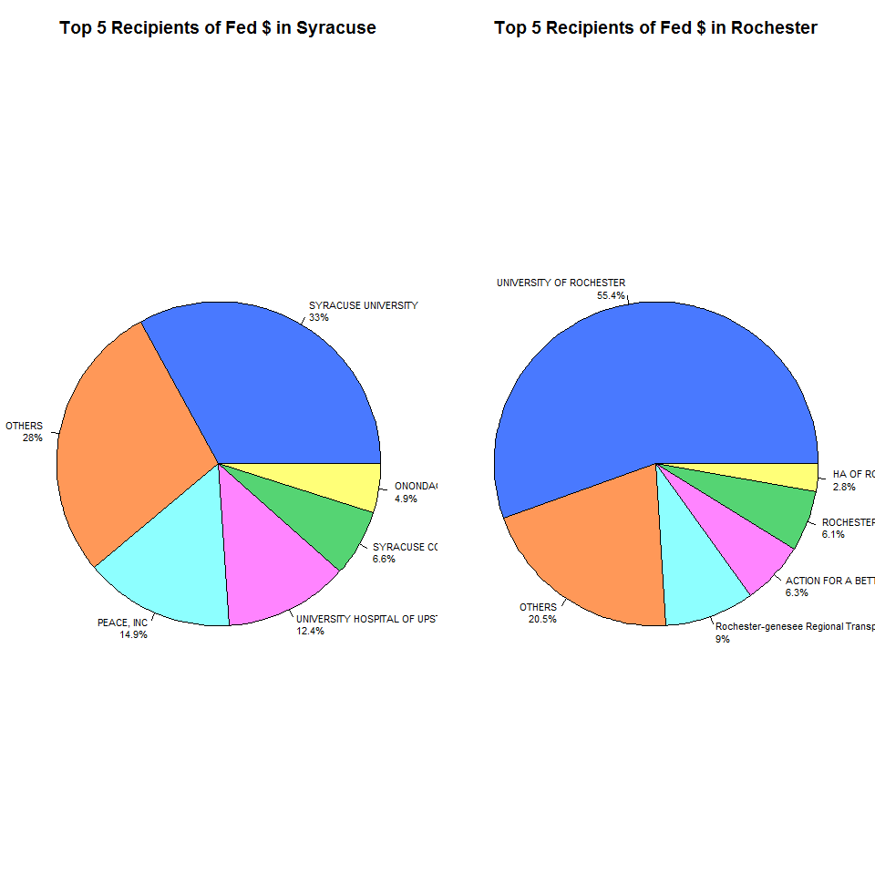
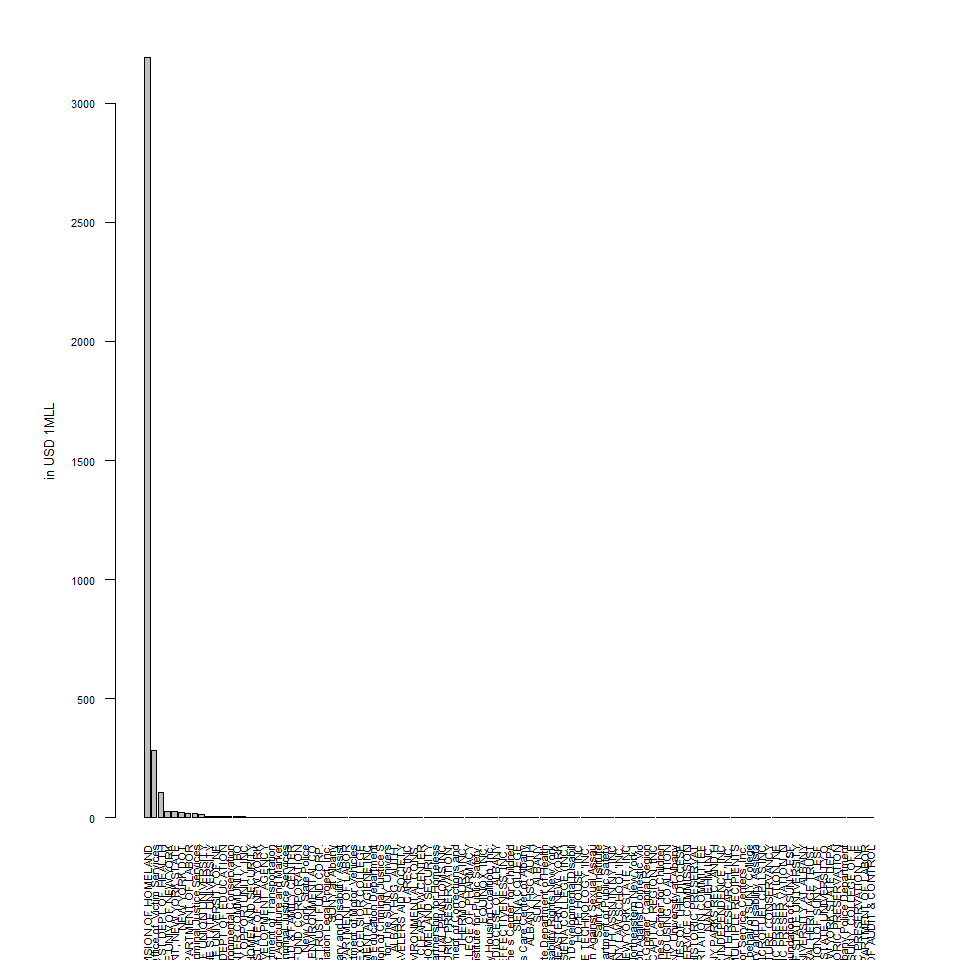

IDA Use Case
================

Use case
========

-   **Position**: Howard Zemsky president and CEO of Empire State Development
-   **Organization**: Empire State Development
-   **Location**: NY
-   **Sector**: Local Government (State)
-   **Interest/question**: Wants to know which cities in their state are missing out on potential funds that they could apply for and needs a breakdown of per capita federal spending in each city to assess areas of need.

In what follows I will elaborate comparisons between Rochester and Syracuse

Main Recipients of Fed $
========================

Syracuse
--------

``` r
#Subsetting sry16
x <- gra16$recipient_city_name %in% c("Syracuse", "SYRACUSE")

syr16 <- gra16[x,c("maj_agency_cat", "agency_name", "action_type",
               "cfda_program_num", "cfda_program_title", "fed_funding_amount", "non_fed_funding_amount",
               "total_funding_amount",  "asst_cat_type", "assistance_type", "record_type",
               "fiscal_year", "principal_place_cc", "project_description", "recipient_name", 
               "recipient_type", "recip_cat_type", "recipient_city_name", "recipient_county_name",
               "recipient_state_code", "exec1_fullname", "exec1_amount")]

#exploring

#what type of assistances are they getting?
#unique(syr16$asst_cat_type)
#[1] "G"

#unique(syr16$assistance_type)
#[1] "04: Project grant"         "03: Formula grant"         "05: Cooperative agreement"

#ass <- group_by(syr16, assistance_type)
#ass <- arrange(as.data.frame(summarize(ass, Freq = n())), desc(Freq))
#            assistance_type Freq
#1         04: Project grant  208
#2 05: Cooperative agreement   34
#3         03: Formula grant    4

#action_type: The type of action for the record: whether it is a new assistance action, a continuation, a revision, or a funding adjustment.

unique(syr16$action_type) #character type
```

    ## [1] "B: Continuation (funding in succeeding budget period which stemmed from prior agreement to fund amount of the current action)"                                                                                                                        
    ## [2] "D: Funding adjustment to completed project"                                                                                                                                                                                                           
    ## [3] "A: New assistance action"                                                                                                                                                                                                                             
    ## [4] "C: Revision (any change in Federal Government's financial obligation or contingent liability in existing assistance transaction amount of the change in funding; or any change in Recipient Name, Recipient Address, Project Period or Project Scope)"

``` r
#Only interested in pure Federal grants
x <- syr16$non_fed_funding_amount == 0
syr16 <- syr16[x,]

#only interested in project grants
x <- syr16$assistance_type == "04: Project grant"
syr16 <- syr16[x,]

#should we also be interested in only one particular action? 
#I will agregate all types because if something adds or reduces its better to have it all summed up.
```

### Main Recipients

``` r
#Main recipients at syr
options(scipen = 999)
rec <- group_by(syr16, recipient_name)
rec <- arrange(as.data.frame(summarize(rec, Fed = sum(fed_funding_amount), Freq = n())), desc(Fed))

#removing negatives
x <- rec$Fed < 0 
rec$Fed[x] <- 0
rec <- arrange(rec, desc(Fed))

#printing head
head(rec) %>% pander
```

<table style="width:64%;">
<colgroup>
<col width="43%" />
<col width="12%" />
<col width="8%" />
</colgroup>
<thead>
<tr class="header">
<th align="center">recipient_name</th>
<th align="center">Fed</th>
<th align="center">Freq</th>
</tr>
</thead>
<tbody>
<tr class="odd">
<td align="center">SYRACUSE UNIVERSITY</td>
<td align="center">25577469</td>
<td align="center">127</td>
</tr>
<tr class="even">
<td align="center">PEACE, INC</td>
<td align="center">11586645</td>
<td align="center">2</td>
</tr>
<tr class="odd">
<td align="center">UNIVERSITY HOSPITAL OF UPSTATE MEDICAL CENTER</td>
<td align="center">9647591</td>
<td align="center">34</td>
</tr>
<tr class="even">
<td align="center">SYRACUSE COMMUNITY HEALTH CENTER, INC</td>
<td align="center">5146228</td>
<td align="center">5</td>
</tr>
<tr class="odd">
<td align="center">Vera House Inc.</td>
<td align="center">2100000</td>
<td align="center">4</td>
</tr>
<tr class="even">
<td align="center">CITY OF SYRACUSE</td>
<td align="center">1991532</td>
<td align="center">1</td>
</tr>
</tbody>
</table>

``` r
#barplot
par(mar = c(7,6,3,3), mfrow=c(1,1))
barplot(rec$Fed/1000000, names.arg = rec$recipient_name, las = 2, cex.names = .7, cex.axis = .7 , ylab = "in USD 1MLL", cex.lab = .8)
```


``` r
#creating an object for a pie charts for the 5 mayor recipients
pie <- rec[1:5,]
pie[6,] <- c("OTHERS", sum(rec$Fed[6:length(rec$Fed)]), sum(rec$Freq[6:length(rec$Fed)])) 
pie$Fed <- as.numeric(pie$Fed)
pie <- arrange(pie, desc(Fed))
pie.syr.rec <- pie
```

Rochester
---------

``` r
#Subsetting Rochester
x <- gra16$recipient_city_name %in% c("Rochester", "ROCHESTER")

roc16 <- gra16[x,c("maj_agency_cat", "agency_name", "action_type",
               "cfda_program_num", "cfda_program_title", "fed_funding_amount", "non_fed_funding_amount",
               "total_funding_amount",  "asst_cat_type", "assistance_type", "record_type",
               "fiscal_year", "principal_place_cc", "project_description", "recipient_name", 
               "recipient_type", "recip_cat_type", "recipient_city_name", "recipient_county_name",
               "recipient_state_code", "exec1_fullname", "exec1_amount")]

#Only interested in pure Federal grants
x <- roc16$non_fed_funding_amount == 0
roc16 <- roc16[x,]

#only interested in project grants
x <- roc16$assistance_type == "04: Project grant"
roc16 <- roc16[x,]
```

### Main Recipients

``` r
#Main recipients in ROCHESTER
rec <- group_by(roc16, recipient_name)
rec <- arrange(as.data.frame(summarize(rec, Fed = sum(fed_funding_amount), Freq = n())), desc(Fed))

#removing negatives
x <- rec$Fed < 0 
rec$Fed[x] <- 0
rec <- arrange(rec, desc(Fed))

#printing head
head(rec) %>% pander
```

<table style="width:65%;">
<colgroup>
<col width="43%" />
<col width="13%" />
<col width="8%" />
</colgroup>
<thead>
<tr class="header">
<th align="center">recipient_name</th>
<th align="center">Fed</th>
<th align="center">Freq</th>
</tr>
</thead>
<tbody>
<tr class="odd">
<td align="center">UNIVERSITY OF ROCHESTER</td>
<td align="center">136551629</td>
<td align="center">513</td>
</tr>
<tr class="even">
<td align="center">Rochester-genesee Regional Transportation Authority</td>
<td align="center">22589449</td>
<td align="center">2</td>
</tr>
<tr class="odd">
<td align="center">ACTION FOR A BETTER COMMUNITY, INC</td>
<td align="center">15774342</td>
<td align="center">4</td>
</tr>
<tr class="even">
<td align="center">ROCHESTER INSTITUTE OF TECHNOLOGY (INC)</td>
<td align="center">13430084</td>
<td align="center">91</td>
</tr>
<tr class="odd">
<td align="center">ROCHESTER PRIMARY CARE NETWORK</td>
<td align="center">5905778</td>
<td align="center">5</td>
</tr>
<tr class="even">
<td align="center">PathStone Corporation</td>
<td align="center">5709601</td>
<td align="center">4</td>
</tr>
</tbody>
</table>

``` r
#barplot
par(mar = c(7,6,3,3), mfrow=c(1,1))
barplot(rec$Fed/1000000, names.arg = rec$recipient_name, las = 2, cex.names = .7, cex.axis = .7 , ylab = "in USD 1MLL", cex.lab = .8)
```


``` r
#creating an object for the pie chart of only 5 mayor recipients
pie <- rec[1:5,]
pie[6,] <- c("OTHERS", sum(rec$Fed[6:length(rec$Fed)]), sum(rec$Freq[6:length(rec$Fed)])) 
pie$Fed <- as.numeric(pie$Fed)
pie <- arrange(pie, desc(Fed))
pie.roc.rec <- pie
```

Comparing Top 5 Recipients in Syr and Roc
-----------------------------------------

``` r
#pie charts!
col <- c("#4979FF", "#FF9858",  "#8DFFFF", "#FF84FF", "#55D473", "#FFFF78")

plot.new()
par(mfrow = c(1,2), mar=c(0,0,3,0))

pie<- pie.syr.rec
pie(as.numeric(pie$Fed), labels = paste0(pie$recipient_name, "\n" , round(pie$Fed/sum(pie$Fed)*100, digits=1), "%"), main = "Top 5 Recipients of Fed $ in Syracuse", cex= .7, col=col)

pie<- pie.roc.rec
pie(as.numeric(pie$Fed), labels = paste0(pie$recipient_name, "\n" , round(pie$Fed/sum(pie$Fed)*100, digits=1), "%"), main = "Top 5 Recipients of Fed $ in Rochester", cex= .7, col=col)
```


Main Fed Agencies and Programs that give funding
================================================

Syracuse
--------

### Agencies

``` r
#Syracuse

#First by Agencies
dat <- group_by(syr16, agency_name)
dat <- arrange(as.data.frame(summarize(dat, Fed = sum(fed_funding_amount), Freq = n())), desc(Fed))

#pie chart only 5 mayor recipients
pie <- dat[1:5,]
pie[6,] <- c("OTHERS", sum(dat$Fed[6:length(dat$Fed)]), sum(dat$Freq[6:length(dat$Fed)])) 
pie$Fed <- as.numeric(pie$Fed)
pie <- arrange(pie, desc(Fed))
pie.syr.age <- pie

#removing negatives
x <- dat$Fed < 0 
dat$Fed[x] <- 0
dat <- arrange(rec, desc(Fed))

#printing head
head(dat) %>% pander
```

<table style="width:65%;">
<colgroup>
<col width="43%" />
<col width="13%" />
<col width="8%" />
</colgroup>
<thead>
<tr class="header">
<th align="center">recipient_name</th>
<th align="center">Fed</th>
<th align="center">Freq</th>
</tr>
</thead>
<tbody>
<tr class="odd">
<td align="center">UNIVERSITY OF ROCHESTER</td>
<td align="center">136551629</td>
<td align="center">513</td>
</tr>
<tr class="even">
<td align="center">Rochester-genesee Regional Transportation Authority</td>
<td align="center">22589449</td>
<td align="center">2</td>
</tr>
<tr class="odd">
<td align="center">ACTION FOR A BETTER COMMUNITY, INC</td>
<td align="center">15774342</td>
<td align="center">4</td>
</tr>
<tr class="even">
<td align="center">ROCHESTER INSTITUTE OF TECHNOLOGY (INC)</td>
<td align="center">13430084</td>
<td align="center">91</td>
</tr>
<tr class="odd">
<td align="center">ROCHESTER PRIMARY CARE NETWORK</td>
<td align="center">5905778</td>
<td align="center">5</td>
</tr>
<tr class="even">
<td align="center">PathStone Corporation</td>
<td align="center">5709601</td>
<td align="center">4</td>
</tr>
</tbody>
</table>

``` r
#barplot
par(mar = c(7,6,3,3), mfrow=c(1,1))
barplot(dat$Fed/1000000, names.arg = dat$recipient_name, las = 2, cex.names = .7, cex.axis = .7 , ylab = "in USD 1MLL", cex.lab = .8)
```


### Programs

``` r
#Main programs
dat <- group_by(roc16, cfda_program_title)
dat <- arrange(as.data.frame(summarize(dat, Fed = sum(fed_funding_amount), Freq = n())), desc(Fed))

pie <- dat[1:10,]
pie[11,] <- c("OTHERS", sum(dat$Fed[11:length(dat$Fed)]), sum(dat$Freq[11:length(dat$Fed)])) 
pie$Fed <- as.numeric(pie$Fed)
pie <- arrange(pie, desc(Fed))
pie.syr.pro <- pie

#removing negatives
x <- dat$Fed < 0 
dat$Fed[x] <- 0
dat <- arrange(rec, desc(Fed))

#printing head
head(dat) %>% pander
```

<table style="width:65%;">
<colgroup>
<col width="43%" />
<col width="13%" />
<col width="8%" />
</colgroup>
<thead>
<tr class="header">
<th align="center">recipient_name</th>
<th align="center">Fed</th>
<th align="center">Freq</th>
</tr>
</thead>
<tbody>
<tr class="odd">
<td align="center">UNIVERSITY OF ROCHESTER</td>
<td align="center">136551629</td>
<td align="center">513</td>
</tr>
<tr class="even">
<td align="center">Rochester-genesee Regional Transportation Authority</td>
<td align="center">22589449</td>
<td align="center">2</td>
</tr>
<tr class="odd">
<td align="center">ACTION FOR A BETTER COMMUNITY, INC</td>
<td align="center">15774342</td>
<td align="center">4</td>
</tr>
<tr class="even">
<td align="center">ROCHESTER INSTITUTE OF TECHNOLOGY (INC)</td>
<td align="center">13430084</td>
<td align="center">91</td>
</tr>
<tr class="odd">
<td align="center">ROCHESTER PRIMARY CARE NETWORK</td>
<td align="center">5905778</td>
<td align="center">5</td>
</tr>
<tr class="even">
<td align="center">PathStone Corporation</td>
<td align="center">5709601</td>
<td align="center">4</td>
</tr>
</tbody>
</table>

``` r
#barplot
par(mar = c(7,6,3,3), mfrow=c(1,1))
barplot(dat$Fed/1000000, names.arg = dat$recipient_name, las = 2, cex.names = .7, cex.axis = .7 , ylab = "in USD 1MLL", cex.lab = .8)
```


Comparing Top Funding Agencies and Programs in Syr and Roc
----------------------------------------------------------

``` r
#plotting both pies

par(mfrow=c(2,1), mar=c(0,0,3,0))
pie <- pie.syr.age
pie(as.numeric(pie$Fed), labels = paste0(pie$agency_name, "\n" , round(pie$Fed/sum(pie$Fed)*100, digits=1), "%"), main = "Top 5 Agencies of Fed $ in Syracuse", cex= .7, col=col)

pie <- pie.syr.pro
pie(as.numeric(pie$Fed), labels = paste0(pie$cfda_program_title, "\n" , round(pie$Fed/sum(pie$Fed)*100, digits=1), "%"), main = "Top 10 Programs of Fed $ in Syracuse", cex= .7, col=col)
```


Rochester
---------

### Agencies

``` r
#ROCHESTER

#First by Agencies
dat <- group_by(roc16, agency_name)
dat <- arrange(as.data.frame(summarize(dat, Fed = sum(fed_funding_amount), Freq = n())), desc(Fed))

#pie chart only 5 mayor recipients
pie <- dat[1:5,]
pie[6,] <- c("OTHERS", sum(dat$Fed[6:length(dat$Fed)]), sum(dat$Freq[6:length(dat$Fed)])) 
pie$Fed <- as.numeric(pie$Fed)
pie <- arrange(pie, desc(Fed))
pie.roc.age <- pie

#removing negatives
x <- dat$Fed < 0 
dat$Fed[x] <- 0
dat <- arrange(rec, desc(Fed))

#printing head
head(dat) %>% pander
```

<table style="width:65%;">
<colgroup>
<col width="43%" />
<col width="13%" />
<col width="8%" />
</colgroup>
<thead>
<tr class="header">
<th align="center">recipient_name</th>
<th align="center">Fed</th>
<th align="center">Freq</th>
</tr>
</thead>
<tbody>
<tr class="odd">
<td align="center">UNIVERSITY OF ROCHESTER</td>
<td align="center">136551629</td>
<td align="center">513</td>
</tr>
<tr class="even">
<td align="center">Rochester-genesee Regional Transportation Authority</td>
<td align="center">22589449</td>
<td align="center">2</td>
</tr>
<tr class="odd">
<td align="center">ACTION FOR A BETTER COMMUNITY, INC</td>
<td align="center">15774342</td>
<td align="center">4</td>
</tr>
<tr class="even">
<td align="center">ROCHESTER INSTITUTE OF TECHNOLOGY (INC)</td>
<td align="center">13430084</td>
<td align="center">91</td>
</tr>
<tr class="odd">
<td align="center">ROCHESTER PRIMARY CARE NETWORK</td>
<td align="center">5905778</td>
<td align="center">5</td>
</tr>
<tr class="even">
<td align="center">PathStone Corporation</td>
<td align="center">5709601</td>
<td align="center">4</td>
</tr>
</tbody>
</table>

``` r
#barplot
par(mar = c(7,6,3,3), mfrow=c(1,1))
barplot(dat$Fed/1000000, names.arg = dat$recipient_name, las = 2, cex.names = .7, cex.axis = .7 , ylab = "in USD 1MLL", cex.lab = .8)
```



``` r
############################
```

### Programs

``` r
#Main programs
dat <- group_by(roc16, cfda_program_title)
dat <- arrange(as.data.frame(summarize(dat, Fed = sum(fed_funding_amount), Freq = n())), desc(Fed))

pie <- dat[1:10,]
pie[11,] <- c("OTHERS", sum(dat$Fed[11:length(dat$Fed)]), sum(dat$Freq[11:length(dat$Fed)])) 
pie$Fed <- as.numeric(pie$Fed)
pie <- arrange(pie, desc(Fed))
pie.roc.pro <- pie

#removing negatives
x <- dat$Fed < 0 
dat$Fed[x] <- 0
dat <- arrange(rec, desc(Fed))

#printing head
head(dat) %>% pander
```

<table style="width:65%;">
<colgroup>
<col width="43%" />
<col width="13%" />
<col width="8%" />
</colgroup>
<thead>
<tr class="header">
<th align="center">recipient_name</th>
<th align="center">Fed</th>
<th align="center">Freq</th>
</tr>
</thead>
<tbody>
<tr class="odd">
<td align="center">UNIVERSITY OF ROCHESTER</td>
<td align="center">136551629</td>
<td align="center">513</td>
</tr>
<tr class="even">
<td align="center">Rochester-genesee Regional Transportation Authority</td>
<td align="center">22589449</td>
<td align="center">2</td>
</tr>
<tr class="odd">
<td align="center">ACTION FOR A BETTER COMMUNITY, INC</td>
<td align="center">15774342</td>
<td align="center">4</td>
</tr>
<tr class="even">
<td align="center">ROCHESTER INSTITUTE OF TECHNOLOGY (INC)</td>
<td align="center">13430084</td>
<td align="center">91</td>
</tr>
<tr class="odd">
<td align="center">ROCHESTER PRIMARY CARE NETWORK</td>
<td align="center">5905778</td>
<td align="center">5</td>
</tr>
<tr class="even">
<td align="center">PathStone Corporation</td>
<td align="center">5709601</td>
<td align="center">4</td>
</tr>
</tbody>
</table>

``` r
#barplot
par(mar = c(7,6,3,3), mfrow=c(1,1))
barplot(dat$Fed/1000000, names.arg = dat$recipient_name, las = 2, cex.names = .7, cex.axis = .7 , ylab = "in USD 1MLL", cex.lab = .8)
```



``` r
############################

#plotting both pies

par(mfrow=c(2,1), mar=c(0,0,3,0))
pie <- pie.roc.age
pie(as.numeric(pie$Fed), labels = paste0(pie$agency_name, "\n" , round(pie$Fed/sum(pie$Fed)*100, digits=1), "%"), main = "Top 5 Agencies of Fed $ in Rochester", cex= .7, col=col)

pie <- pie.roc.pro
pie(as.numeric(pie$Fed), labels = paste0(pie$cfda_program_title, "\n" , round(pie$Fed/sum(pie$Fed)*100, digits=1), "%"), main = "Top 10 Programs of Fed $ in Rochester", cex= .7, col=col)
```


### Comparable Pie charts for Agencies and Programs in both Syr and Roc

``` r
#all four 
par(mfrow=c(2,2), mar=c(0,0,3,0))
pie <- pie.syr.age
pie(as.numeric(pie$Fed), labels = paste0(pie$agency_name, "\n" , round(pie$Fed/sum(pie$Fed)*100, digits=1), "%"), main = "Top 5 Agencies of Fed $ in Syracuse", cex= .7, col=col)

pie <- pie.syr.pro
pie(as.numeric(pie$Fed), labels = paste0(pie$cfda_program_title, "\n" , round(pie$Fed/sum(pie$Fed)*100, digits=1), "%"), main = "Top 10 Programs of Fed $ in Syracuse", cex= .7, col=col)

pie <- pie.roc.age
pie(as.numeric(pie$Fed), labels = paste0(pie$agency_name, "\n" , round(pie$Fed/sum(pie$Fed)*100, digits=1), "%"), main = "Top 5 Agencies of Fed $ in Rochester", cex= .7, col=col)

pie <- pie.roc.pro
pie(as.numeric(pie$Fed), labels = paste0(pie$cfda_program_title, "\n" , round(pie$Fed/sum(pie$Fed)*100, digits=1), "%"), main = "Top 10 Programs of Fed $ in Rochester", cex= .7, col=col)
```


**Dataset**:

**Relevant Variables**:

**Description of Analysis**:

**Coded Tools needed**:

**Visualizations**:

**Journey map**:

**Final insights/answers to the interest/question/other added value**:

**Limitations/further work**:
