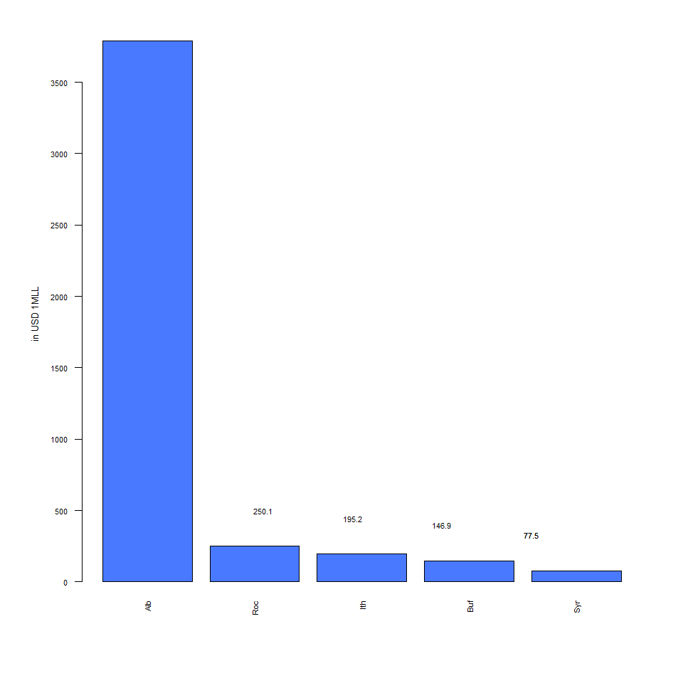
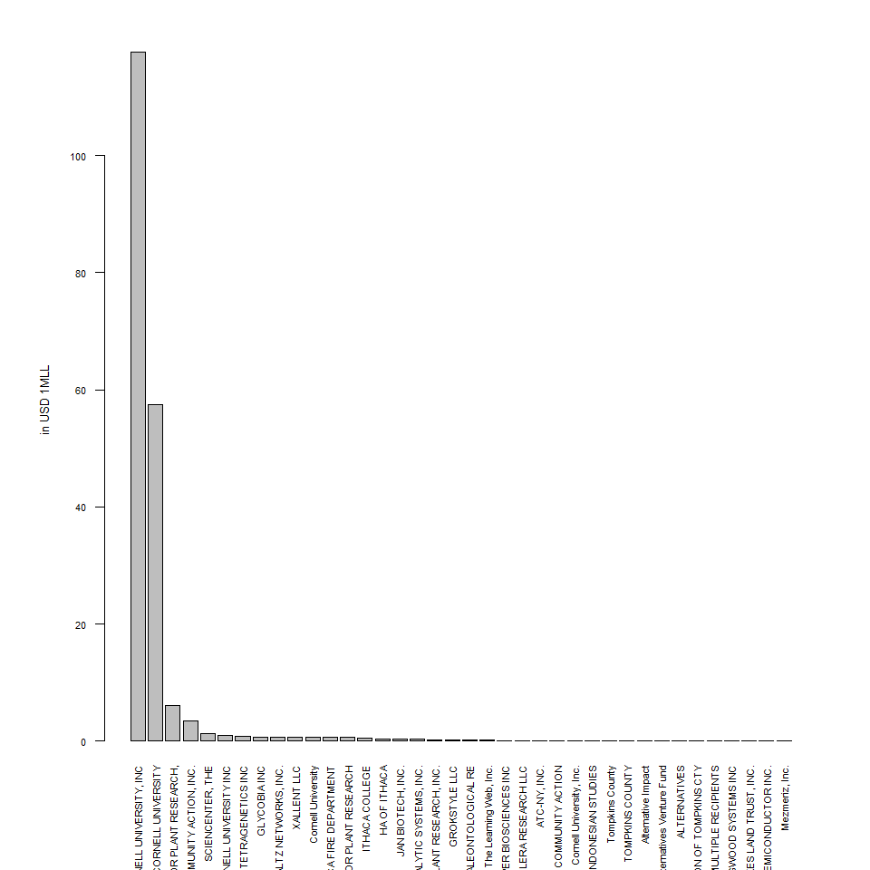

IDA Use Case
================

Use case
========

-   **Position**: Howard Zemsky president and CEO of Empire State Development
-   **Organization**: Empire State Development
-   **Location**: NY
-   **Sector**: Local Government (State)
-   **Interest/question**: Wants to know which cities in their state are missing out on potential funds that they could apply for and needs a breakdown of per capita federal spending in each city to assess areas of need.

In what follows I will elaborate comparisons between Rochester, Syracuse, Ithaca, Buffalo and Albany.

Total Amount of FED money going to the chosen cities
====================================================

    ## [1] 720

Main Recipient Types (recip\_cat\_type) of Fed $ in the cities
==============================================================

Syracuse
--------

<table style="width:51%;">
<colgroup>
<col width="30%" />
<col width="12%" />
<col width="8%" />
</colgroup>
<thead>
<tr class="header">
<th align="center">recip_cat_type</th>
<th align="center">Fed</th>
<th align="center">Freq</th>
</tr>
</thead>
<tbody>
<tr class="odd">
<td align="center">h: Private agencies</td>
<td align="center">25565535</td>
<td align="center">126</td>
</tr>
<tr class="even">
<td align="center">n: Nonprofit agencies</td>
<td align="center">21858707</td>
<td align="center">21</td>
</tr>
<tr class="odd">
<td align="center">g: Government</td>
<td align="center">11883129</td>
<td align="center">44</td>
</tr>
<tr class="even">
<td align="center">h: Government</td>
<td align="center">1571275</td>
<td align="center">13</td>
</tr>
<tr class="odd">
<td align="center">o: Private agencies</td>
<td align="center">235776</td>
<td align="center">2</td>
</tr>
<tr class="even">
<td align="center">f: Private agencies</td>
<td align="center">176785</td>
<td align="center">1</td>
</tr>
<tr class="odd">
<td align="center">i: Private agencies</td>
<td align="center">50400</td>
<td align="center">1</td>
</tr>
</tbody>
</table>

Main Recipients of Fed $ in the cities
======================================

Syracuse
--------

<table style="width:64%;">
<colgroup>
<col width="43%" />
<col width="12%" />
<col width="8%" />
</colgroup>
<thead>
<tr class="header">
<th align="center">recipient_name</th>
<th align="center">Fed</th>
<th align="center">Freq</th>
</tr>
</thead>
<tbody>
<tr class="odd">
<td align="center">SYRACUSE UNIVERSITY</td>
<td align="center">25577469</td>
<td align="center">127</td>
</tr>
<tr class="even">
<td align="center">PEACE, INC</td>
<td align="center">11586645</td>
<td align="center">2</td>
</tr>
<tr class="odd">
<td align="center">UNIVERSITY HOSPITAL OF UPSTATE MEDICAL CENTER</td>
<td align="center">9647591</td>
<td align="center">34</td>
</tr>
<tr class="even">
<td align="center">SYRACUSE COMMUNITY HEALTH CENTER, INC</td>
<td align="center">5146228</td>
<td align="center">5</td>
</tr>
<tr class="odd">
<td align="center">Vera House Inc.</td>
<td align="center">2100000</td>
<td align="center">4</td>
</tr>
<tr class="even">
<td align="center">CITY OF SYRACUSE</td>
<td align="center">1991532</td>
<td align="center">1</td>
</tr>
</tbody>
</table>

Rochester
---------

<table style="width:65%;">
<colgroup>
<col width="43%" />
<col width="13%" />
<col width="8%" />
</colgroup>
<thead>
<tr class="header">
<th align="center">recipient_name</th>
<th align="center">Fed</th>
<th align="center">Freq</th>
</tr>
</thead>
<tbody>
<tr class="odd">
<td align="center">UNIVERSITY OF ROCHESTER</td>
<td align="center">136551629</td>
<td align="center">513</td>
</tr>
<tr class="even">
<td align="center">Rochester-genesee Regional Transportation Authority</td>
<td align="center">22589449</td>
<td align="center">2</td>
</tr>
<tr class="odd">
<td align="center">ACTION FOR A BETTER COMMUNITY, INC</td>
<td align="center">15774342</td>
<td align="center">4</td>
</tr>
<tr class="even">
<td align="center">ROCHESTER INSTITUTE OF TECHNOLOGY (INC)</td>
<td align="center">13430084</td>
<td align="center">91</td>
</tr>
<tr class="odd">
<td align="center">ROCHESTER PRIMARY CARE NETWORK</td>
<td align="center">5905778</td>
<td align="center">5</td>
</tr>
<tr class="even">
<td align="center">PathStone Corporation</td>
<td align="center">5709601</td>
<td align="center">4</td>
</tr>
</tbody>
</table>

Ithaca
------

<table style="width:63%;">
<colgroup>
<col width="40%" />
<col width="13%" />
<col width="8%" />
</colgroup>
<thead>
<tr class="header">
<th align="center">recipient_name</th>
<th align="center">Fed</th>
<th align="center">Freq</th>
</tr>
</thead>
<tbody>
<tr class="odd">
<td align="center">CORNELL UNIVERSITY, INC</td>
<td align="center">109710475</td>
<td align="center">436</td>
</tr>
<tr class="even">
<td align="center">CORNELL UNIVERSITY</td>
<td align="center">58023303</td>
<td align="center">205</td>
</tr>
<tr class="odd">
<td align="center">BOYCE THOMPSON INSTITUTE FOR PLANT RESEARCH,</td>
<td align="center">6059880</td>
<td align="center">15</td>
</tr>
<tr class="even">
<td align="center">TOMPKINS COMMUNITY ACTION, INC.</td>
<td align="center">3494501</td>
<td align="center">2</td>
</tr>
<tr class="odd">
<td align="center">CORNELL UNIVERSITY INC</td>
<td align="center">1015670</td>
<td align="center">6</td>
</tr>
<tr class="even">
<td align="center">GLYCOBIA INC</td>
<td align="center">766474</td>
<td align="center">1</td>
</tr>
</tbody>
</table>

Buffalo
-------

<table style="width:64%;">
<colgroup>
<col width="43%" />
<col width="12%" />
<col width="8%" />
</colgroup>
<thead>
<tr class="header">
<th align="center">recipient_name</th>
<th align="center">Fed</th>
<th align="center">Freq</th>
</tr>
</thead>
<tbody>
<tr class="odd">
<td align="center">SUNY, BUFFALO</td>
<td align="center">37695391</td>
<td align="center">149</td>
</tr>
<tr class="even">
<td align="center">COMMUNITY ACTION ORGANIZATION OF ERIE COUNTY,</td>
<td align="center">31354547</td>
<td align="center">10</td>
</tr>
<tr class="odd">
<td align="center">RESEARCH FOUNDATION OF STATE UNIVERSITY OF NE</td>
<td align="center">20206358</td>
<td align="center">66</td>
</tr>
<tr class="even">
<td align="center">RESEARCH FOUNDATION FOR THE STATE UNIVERSITY</td>
<td align="center">9688376</td>
<td align="center">55</td>
</tr>
<tr class="odd">
<td align="center">COMMUNITY HEALTH CENTER OF BUFFALO, INC.</td>
<td align="center">3770190</td>
<td align="center">7</td>
</tr>
<tr class="even">
<td align="center">HEALTH RESEARCH, INC - ROSWELL PARK DIVISION</td>
<td align="center">3042143</td>
<td align="center">19</td>
</tr>
</tbody>
</table>

Albany
------

<table style="width:67%;">
<colgroup>
<col width="43%" />
<col width="15%" />
<col width="8%" />
</colgroup>
<thead>
<tr class="header">
<th align="center">recipient_name</th>
<th align="center">Fed</th>
<th align="center">Freq</th>
</tr>
</thead>
<tbody>
<tr class="odd">
<td align="center">NEW YORK STATE DIVISION OF HOMELAND</td>
<td align="center">3190799792</td>
<td align="center">274</td>
</tr>
<tr class="even">
<td align="center">New York Office of Victim Services</td>
<td align="center">282600032</td>
<td align="center">4</td>
</tr>
<tr class="odd">
<td align="center">NY ST DEPT OF HEALTH</td>
<td align="center">98747352</td>
<td align="center">19</td>
</tr>
<tr class="even">
<td align="center">RESEARCH FOUNDATION OF STATE UNIV OF NEW YORK</td>
<td align="center">27251051</td>
<td align="center">99</td>
</tr>
<tr class="odd">
<td align="center">EDUCATION DEPARTMENT, NEW YORK STATE</td>
<td align="center">25829116</td>
<td align="center">4</td>
</tr>
<tr class="even">
<td align="center">NEW YORK DOT</td>
<td align="center">21611690</td>
<td align="center">184</td>
</tr>
</tbody>
</table>

Some insights:

-   Main recipients are universities
-   Albany is an outlier because it prob receives funds for the whole state.

Comparing Top 5 Recipients in Syr and Roc
-----------------------------------------

Main Fed Agencies and Programs that give funding
================================================

Syracuse
--------

### Agencies

<table style="width:67%;">
<colgroup>
<col width="43%" />
<col width="15%" />
<col width="8%" />
</colgroup>
<thead>
<tr class="header">
<th align="center">recipient_name</th>
<th align="center">Fed</th>
<th align="center">Freq</th>
</tr>
</thead>
<tbody>
<tr class="odd">
<td align="center">NEW YORK STATE DIVISION OF HOMELAND</td>
<td align="center">3190799792</td>
<td align="center">274</td>
</tr>
<tr class="even">
<td align="center">New York Office of Victim Services</td>
<td align="center">282600032</td>
<td align="center">4</td>
</tr>
<tr class="odd">
<td align="center">NY ST DEPT OF HEALTH</td>
<td align="center">98747352</td>
<td align="center">19</td>
</tr>
<tr class="even">
<td align="center">RESEARCH FOUNDATION OF STATE UNIV OF NEW YORK</td>
<td align="center">27251051</td>
<td align="center">99</td>
</tr>
<tr class="odd">
<td align="center">EDUCATION DEPARTMENT, NEW YORK STATE</td>
<td align="center">25829116</td>
<td align="center">4</td>
</tr>
<tr class="even">
<td align="center">NEW YORK DOT</td>
<td align="center">21611690</td>
<td align="center">184</td>
</tr>
</tbody>
</table>

### Programs

<table style="width:67%;">
<colgroup>
<col width="43%" />
<col width="15%" />
<col width="8%" />
</colgroup>
<thead>
<tr class="header">
<th align="center">recipient_name</th>
<th align="center">Fed</th>
<th align="center">Freq</th>
</tr>
</thead>
<tbody>
<tr class="odd">
<td align="center">NEW YORK STATE DIVISION OF HOMELAND</td>
<td align="center">3190799792</td>
<td align="center">274</td>
</tr>
<tr class="even">
<td align="center">New York Office of Victim Services</td>
<td align="center">282600032</td>
<td align="center">4</td>
</tr>
<tr class="odd">
<td align="center">NY ST DEPT OF HEALTH</td>
<td align="center">98747352</td>
<td align="center">19</td>
</tr>
<tr class="even">
<td align="center">RESEARCH FOUNDATION OF STATE UNIV OF NEW YORK</td>
<td align="center">27251051</td>
<td align="center">99</td>
</tr>
<tr class="odd">
<td align="center">EDUCATION DEPARTMENT, NEW YORK STATE</td>
<td align="center">25829116</td>
<td align="center">4</td>
</tr>
<tr class="even">
<td align="center">NEW YORK DOT</td>
<td align="center">21611690</td>
<td align="center">184</td>
</tr>
</tbody>
</table>

Comparing Top Funding Agencies and Programs in Syr and Roc
----------------------------------------------------------

Rochester
---------

### Agencies

<table style="width:67%;">
<colgroup>
<col width="43%" />
<col width="15%" />
<col width="8%" />
</colgroup>
<thead>
<tr class="header">
<th align="center">recipient_name</th>
<th align="center">Fed</th>
<th align="center">Freq</th>
</tr>
</thead>
<tbody>
<tr class="odd">
<td align="center">NEW YORK STATE DIVISION OF HOMELAND</td>
<td align="center">3190799792</td>
<td align="center">274</td>
</tr>
<tr class="even">
<td align="center">New York Office of Victim Services</td>
<td align="center">282600032</td>
<td align="center">4</td>
</tr>
<tr class="odd">
<td align="center">NY ST DEPT OF HEALTH</td>
<td align="center">98747352</td>
<td align="center">19</td>
</tr>
<tr class="even">
<td align="center">RESEARCH FOUNDATION OF STATE UNIV OF NEW YORK</td>
<td align="center">27251051</td>
<td align="center">99</td>
</tr>
<tr class="odd">
<td align="center">EDUCATION DEPARTMENT, NEW YORK STATE</td>
<td align="center">25829116</td>
<td align="center">4</td>
</tr>
<tr class="even">
<td align="center">NEW YORK DOT</td>
<td align="center">21611690</td>
<td align="center">184</td>
</tr>
</tbody>
</table>

### Programs

<table style="width:67%;">
<colgroup>
<col width="43%" />
<col width="15%" />
<col width="8%" />
</colgroup>
<thead>
<tr class="header">
<th align="center">recipient_name</th>
<th align="center">Fed</th>
<th align="center">Freq</th>
</tr>
</thead>
<tbody>
<tr class="odd">
<td align="center">NEW YORK STATE DIVISION OF HOMELAND</td>
<td align="center">3190799792</td>
<td align="center">274</td>
</tr>
<tr class="even">
<td align="center">New York Office of Victim Services</td>
<td align="center">282600032</td>
<td align="center">4</td>
</tr>
<tr class="odd">
<td align="center">NY ST DEPT OF HEALTH</td>
<td align="center">98747352</td>
<td align="center">19</td>
</tr>
<tr class="even">
<td align="center">RESEARCH FOUNDATION OF STATE UNIV OF NEW YORK</td>
<td align="center">27251051</td>
<td align="center">99</td>
</tr>
<tr class="odd">
<td align="center">EDUCATION DEPARTMENT, NEW YORK STATE</td>
<td align="center">25829116</td>
<td align="center">4</td>
</tr>
<tr class="even">
<td align="center">NEW YORK DOT</td>
<td align="center">21611690</td>
<td align="center">184</td>
</tr>
</tbody>
</table>

### Comparable Pie charts for Agencies and Programs in both Syr and Roc

Total Amount Received as compared to other cities
=================================================

    ##  [1] "ED"                                             
    ##  [2] "National Science Foundation"                    
    ##  [3] "Environmental Protection Agency"                
    ##  [4] "DEPARTMENT OF HEALTH AND HUMAN SERVICES"        
    ##  [5] "National Endowment for the Humanities"          
    ##  [6] "National Institute of Food and Agriculture (22)"
    ##  [7] "Forest Service (11)"                            
    ##  [8] "ENERGY, DEPARTMENT OF"                          
    ##  [9] "SMALL BUSINESS ADMINISTRATION"                  
    ## [10] "Employment and Training Administration"         
    ## [11] "Department of Defense"                          
    ## [12] "U.S. Department of Commerce"                    
    ## [13] "NUCLEAR REGULATORY COMMISSION"                  
    ## [14] "Rural Utilities Service (15)"                   
    ## [15] "FEDERAL EMERGENCY MANAGEMENT AGENCY"            
    ## [16] "Corporation for National and Community Service" 
    ## [17] "Department of Justice"                          
    ## [18] "DEPARTMENT OF DEFENSE"                          
    ## [19] "Office of Justice Programs"

    ##  [1] "ED"                                            
    ##  [2] "Internal Revenue Service"                      
    ##  [3] "Occupational Safety and Health Administration" 
    ##  [4] "ENERGY, DEPARTMENT OF"                         
    ##  [5] "Department of Defense"                         
    ##  [6] "DEPARTMENT OF HEALTH AND HUMAN SERVICES"       
    ##  [7] "National Science Foundation"                   
    ##  [8] "Environmental Protection Agency"               
    ##  [9] "National Endowment for the Humanities"         
    ## [10] "Food and Nutrition Service (30)"               
    ## [11] "Veterans Health Administration"                
    ## [12] "Employment and Training Administration"        
    ## [13] "Veterans Employment and Training Service"      
    ## [14] "NATIONAL PARK SERVICE"                         
    ## [15] "Rural Utilities Service (15)"                  
    ## [16] "U.S. Department of Commerce"                   
    ## [17] "Corporation for National and Community Service"
    ## [18] "Rural Housing Service (07)"                    
    ## [19] "FEDERAL EMERGENCY MANAGEMENT AGENCY"           
    ## [20] "Federal Highway Administration"                
    ## [21] "Department of Justice"                         
    ## [22] "DEPARTMENT OF DEFENSE"                         
    ## [23] "Office of Justice Programs"                    
    ## [24] "National Credit Union Administration"          
    ## [25] "Federal Transit Administration"                
    ## [26] "National Aeronautics and Space Administration"

**Dataset**:

**Relevant Variables**:

**Description of Analysis**:

**Coded Tools needed**:

**Visualizations**:

**Journey map**:

**Final insights/answers to the interest/question/other added value**:

**Limitations/further work**:
