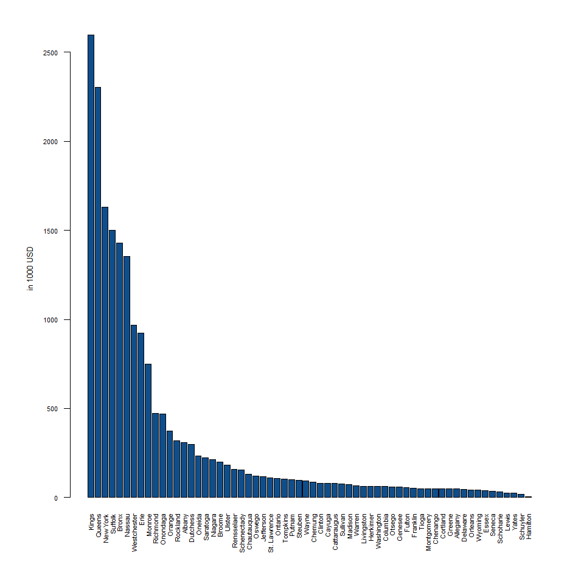
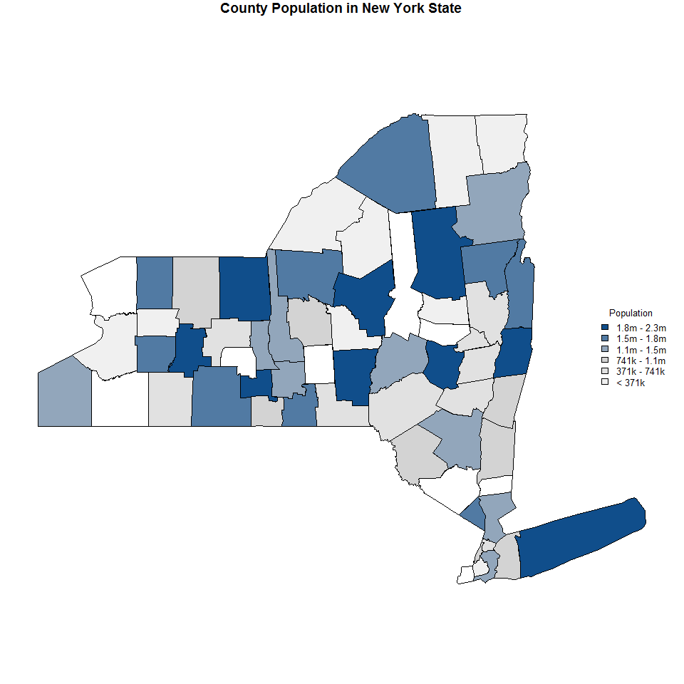

Matching Cities
================

``` r
#coloring the state of NY by population
par(mar = c(7,6,3,3), mfrow=c(1,1))

dat <- arrange(dat, desc(Pop))
barplot(dat$Pop/1000, names.arg = dat$county.name, las = 2, cex.names = .7, cex.axis = .7 , ylab = "in 1000 USD", cex.lab = .8, col="#4979FF")
```



``` r
#Generating a color pallette
colors <- colorRampPalette( c("white", "light grey","dodgerblue4")) #this makes a function called "col"
colors <- colors( 7 ) # using the function we input the arg for the number of colors in that continium. And then saving the output as col too.

#dividing the ranked data into groups and adding color
col <- cut(rank(dat$Pop), breaks=7, labels=colors)
col <- as.character(col)

#brakets <- seq(from=1, to = max(dat$Pop), by = max(dat$Pop)/7)
#1.0  370752.3  741503.6 1112254.9 1483006.1 1853757.4 2224508.7
brakets <- c("< 371k", "371k - 741k", "741k - 1.1m", "1.1m - 1.5m", "1.5m - 1.8m", "1.8m - 2.3m")

#plotting the graph
par(mar= c(0,1,1,1))
plot(shapes, main="County Population in New York State",
    axes = F,
    cex.axis=.8,
    col=col 
    )

#plotting the legend
legend("right", bg="white"
        , cex=0.8
        , legend= rev(brakets)
        , fill=rev(colors)
        , box.col="white"
        , title="Population" 
        )
```


