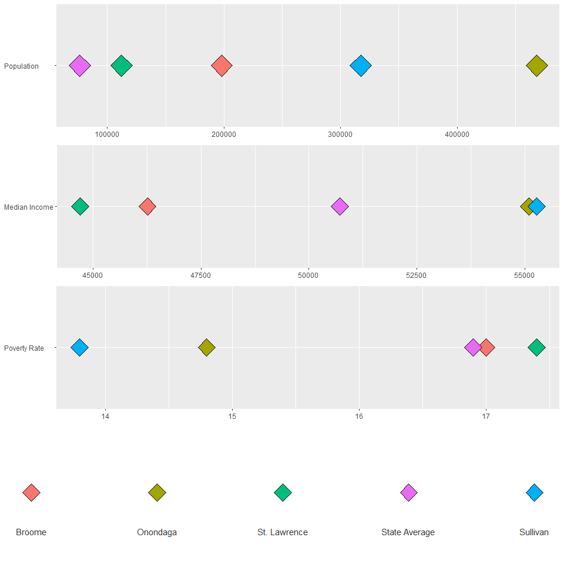

Census comp
================

``` r
########CREATING A NORMALIZED CENSUS DF#######################
#dat <- readRDS( gzcon(url("https://github.com/DataCapstone/Data-Capstone/blob/master/Raw-Data/NYcensus.rds?raw=true")))

dat <- arrange(dat, county.name)
dat$county.name <- as.character(dat$county.name)

#stripping useless columns
dat <- dat[,c(3,4,5,13)]

#normalizing the data
x <- dat$Pop
dat$Pop.n <- (x - mean(x)) / sd(x)

x <- dat$MHincome
dat$MHincome.n <- (x - mean(x)) / sd(x)

x <- dat$pov.rate
dat$pov.rate.n <- (x - mean(x)) / sd(x)

#creating a NY average
y <- data.frame("State Average", sum(dat$Pop)/62, sum(dat$MHincome)/62, sum(dat$pov.rate)/62, 0, 0, 0)
colnames(y) <- colnames(dat)
dat <- rbind(dat,y)

dat[,2:3]<- round(dat[,2:3], digits = 0)
dat[,4]<- round(dat[,4]*100, digits = 1)

#saveRDS(dat, "NYcen_norm.RDS")
```

``` r
###########################################

#now that the rds is on git hub we can call it.
dem <- readRDS( gzcon(url("https://github.com/DataCapstone/Data-Capstone/blob/master/Raw-Data/NYcen_norm.RDS?raw=true")))

#only working with four comparatos and NY state
#"Matches for Onondaga: 1.Broome, 2.St. Lawrence, 3.Orange, 4.Sullivan, 5.Monroe"
dat <- dem
x <- dat$county.name %in% c("Onondaga", "Broome", "St. Lawrence", "Sullivan", "State Average")
dat <- dat[x,]
dat$county.name <- factor(dat$county.name, ordered= TRUE)
rownames(dat) <- 1:nrow(dat)
```

``` r
#################### MAKING THE BARPLOT #######################

x<- dat
krzycensuz <- function (x)
{
  # Load Required Packages
  require(ggplot2)
  require(gridExtra)
  options(scipen = 999)

  #making pot
  bar.pop <- ggplot(x, aes(fill=county.name)) +
    #geom_vline(xintercept=0, color = "grey70", size=2, linetype = "solid") +
    geom_point(aes(x=x$Pop, y="Population        "), stat="identity", shape = 23, size = 10) +
    theme(legend.position = "none",
          axis.title = element_blank(),
          panel.border = element_blank(),
          legend.title = element_blank())
  
  bar.inc <- ggplot(x, aes(fill=county.name)) +
    geom_point(aes(x=x$MHincome, y="Median Income"), stat="identity", shape = 23, size = 8) +
    theme(legend.position = "none",
          axis.title = element_blank(),
          panel.border = element_blank(),
          legend.title = element_blank())
  
  bar.pov <- ggplot(x, aes(fill=county.name)) +
    geom_point(aes(x=x$pov.rate, y="Poverty Rate     "), stat="identity", shape = 23, size = 8) +
      theme(legend.position = "none",
          axis.title = element_blank(),
          panel.border = element_blank(),
          legend.title = element_blank())
  
  leg <- ggplot(x, aes(fill=county.name)) +
    geom_point(aes(x=1:length(levels(x$county.name)), y=""), stat="identity", shape = 23, size = 8) +
    theme_bw() +
    geom_text(aes(x=1:5, y=.7, label = paste0(levels(x$county.name))),
          size= 4,
          hjust = .5,
          vjust = .5,
          colour = "grey20") +
    theme(legend.position = "none",
          axis.title = element_blank(),
          axis.text=element_blank(), 
          axis.ticks=element_blank(),
          panel.grid=element_blank(),
          panel.border = element_blank(),
          legend.title = element_blank()
          )
     
  bars <- grid.arrange(bar.pop, bar.inc, bar.pov, leg, nrow= 4, ncol=1, heights=c(1,1,1,1), widths=c(1))
  
  return(bars)
  
}

krzycensuz(x)
```



    ## TableGrob (4 x 1) "arrange": 4 grobs
    ##   z     cells    name           grob
    ## 1 1 (1-1,1-1) arrange gtable[layout]
    ## 2 2 (2-2,1-1) arrange gtable[layout]
    ## 3 3 (3-3,1-1) arrange gtable[layout]
    ## 4 4 (4-4,1-1) arrange gtable[layout]

``` r
############################################
```
