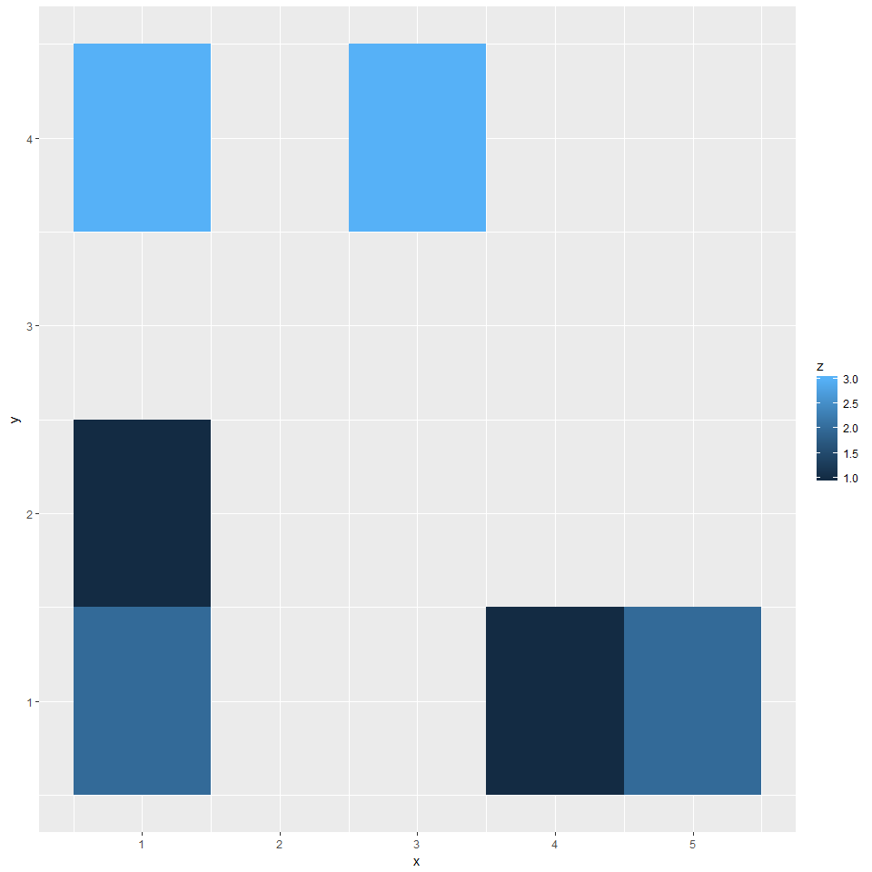
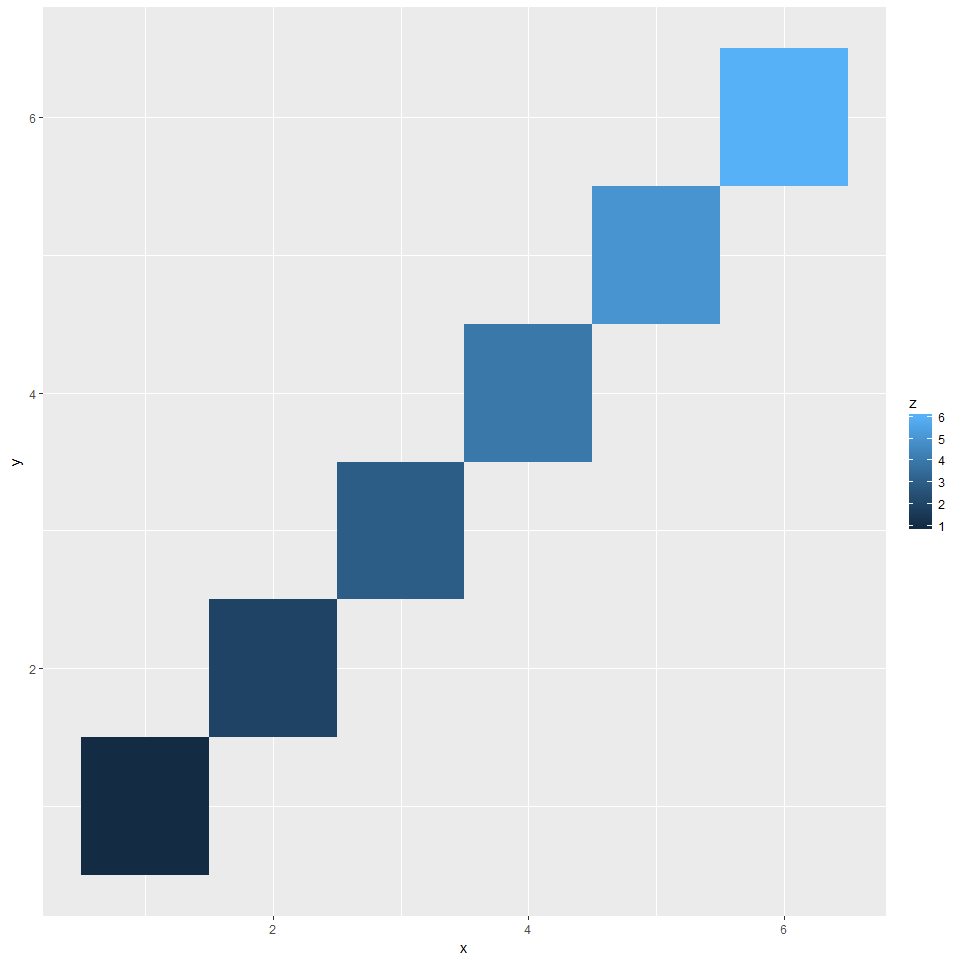
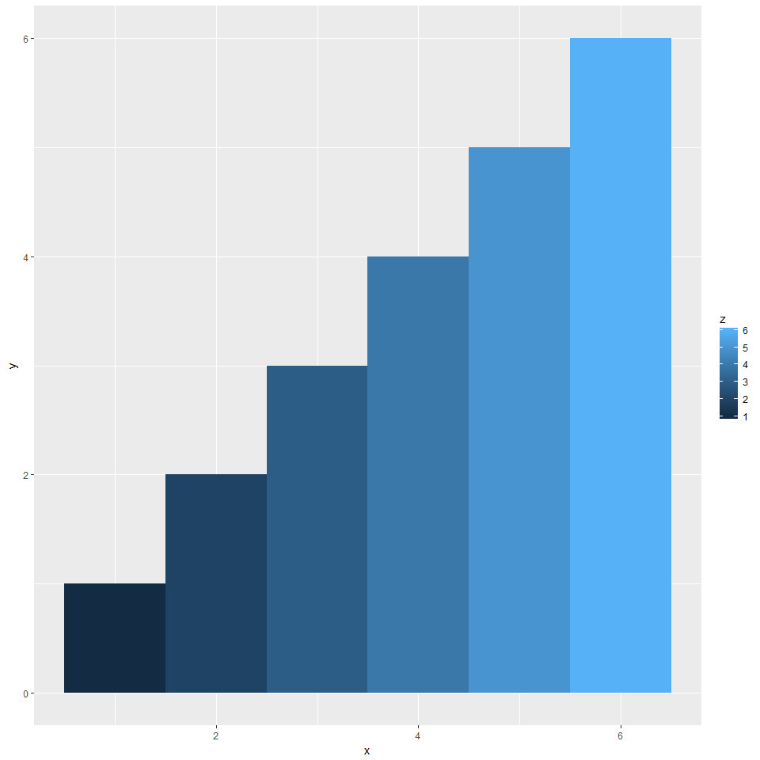
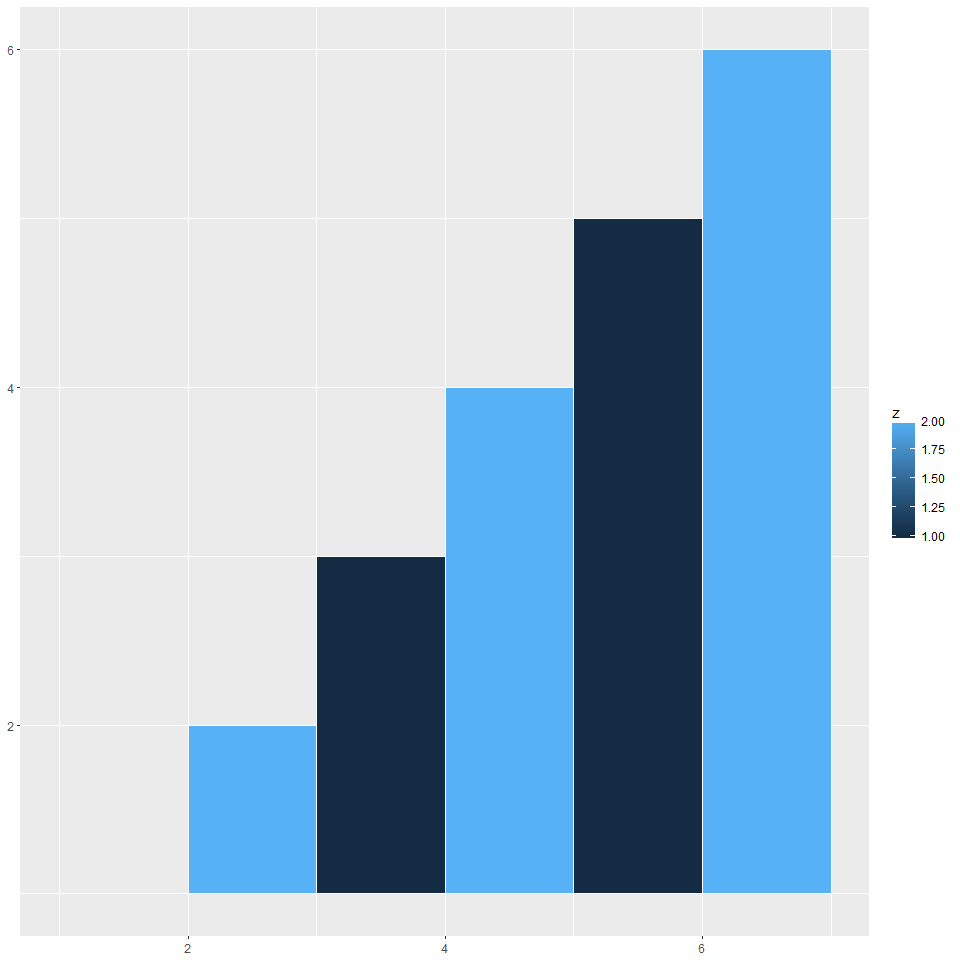
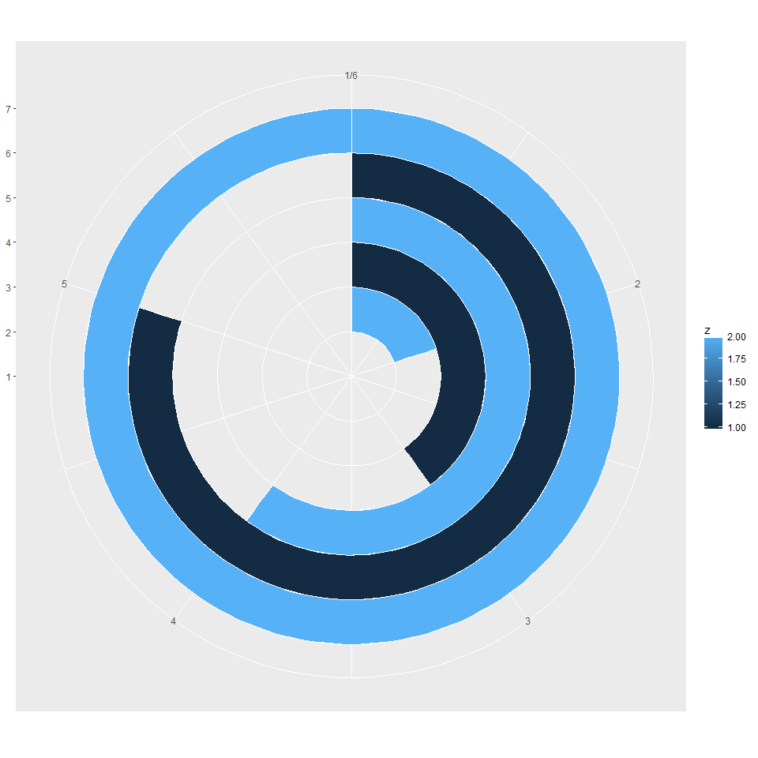

Cracking ggplot2
================

Understanding GG PLOT
---------------------

``` r
######################################

#understanding how ggplot plots as a matrix
#ggplot has a automatic grid. x and y are positions, z is a vector for color. 


df <- data.frame(
  x = c(1,1,3,4,5,1), #three 1 values in X, therefore 4 grid squares drawn, look at their z value to know.
  y = c(2,1,4,1,1,4),
  z = c(1,2,3,1,2,3)
)

ggplot(df, aes(x, y)) +
  geom_tile(aes(fill = z))
```



``` r
df <- data.frame(
  x = c(1:6), #three 1 values in X, therefore 4 grid squares drawn, look at their z value to know.
  y = c(1:6),
  z = c(1:6)
)

#GEOM TILE
ggplot(df, aes(x, y)) +
  geom_tile(aes(fill = z)) #tile puts a "tile" on the y number. Here it is writting at 25 a tile, then another ontop on 25 value, and then one at 50.
```



``` r
#this behaves like points.

#GEOM BAR
ggplot(df, aes(x=x, y=y, fill=z)) +
  geom_bar(width = 1, stat = "identity")
```



``` r
#this behaves more like a bar chart

#GEOM RECT
#this one need y and x max and min. and it draws rectangles!
df <- data.frame(
  xmax = c(1:6), #three 1 values in X, therefore 4 grid squares drawn, look at their z value to know.
  xmin = c(2:7),
  ymax = c(1:6),
  ymin = c(1,1),
  z = c(1:2)
)

ggplot(df) +
  geom_rect(aes(fill = z, ymax=ymax, ymin=ymin, 
                  xmax=xmax, xmin=xmin), colour=c("white"))
```



``` r
#now if we include the function coord_polar, we can see that the x axis starts at 12 o clock vertically and then bars grow cirularly, like a race track. y being the size of the degree of that circular growth.

ggplot(df) +
  geom_rect(aes(fill = z, ymax=ymax, ymin=ymin, 
                  xmax=xmax, xmin=xmin), colour=c("white")) +
   coord_polar(theta="y")
```



Adding captions to the tiles
============================

``` r
df <- data.frame(
  x = c(1:6), #three 1 values in X, therefore 4 grid squares drawn, look at their z value to know.
  y = c(1:6),
  z = c(1:6)
)

#GEOM TILE
ggplot(df, aes(x, y)) +
  geom_tile(aes(fill = z))
```


