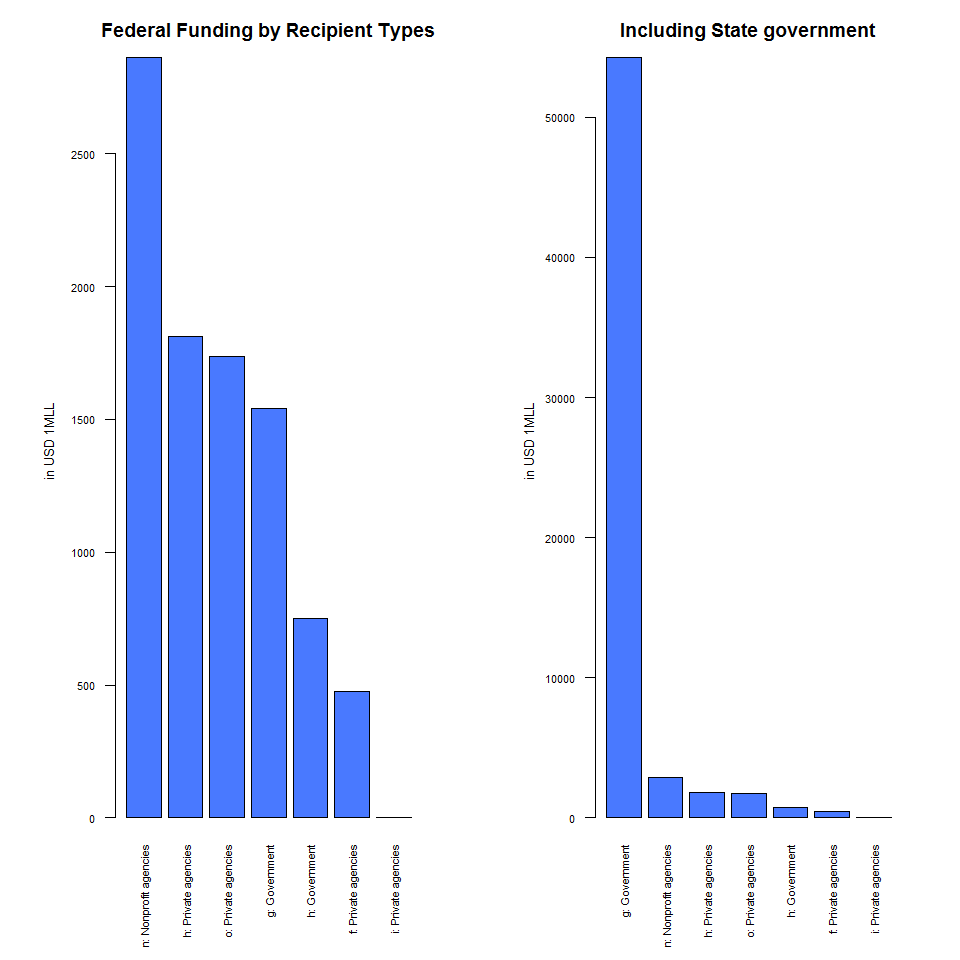

donuts yummy
================

Should this be per capita too? Should we collapse recip\_cat\_types?

USING PIE FUNCTION
==================

Main Federal Funding Agencies in NY
-----------------------------------

Federal Funding by Recipient Types (recip\_cat\_type)
-----------------------------------------------------

USING GGPLOT
============

Main Federal Funding Agencies in NY (maj\_agency\_cat)
------------------------------------------------------

Federal Funding by Recipient Type in NY (recip\_cat\_type)
----------------------------------------------------------

Other stuff
===========
