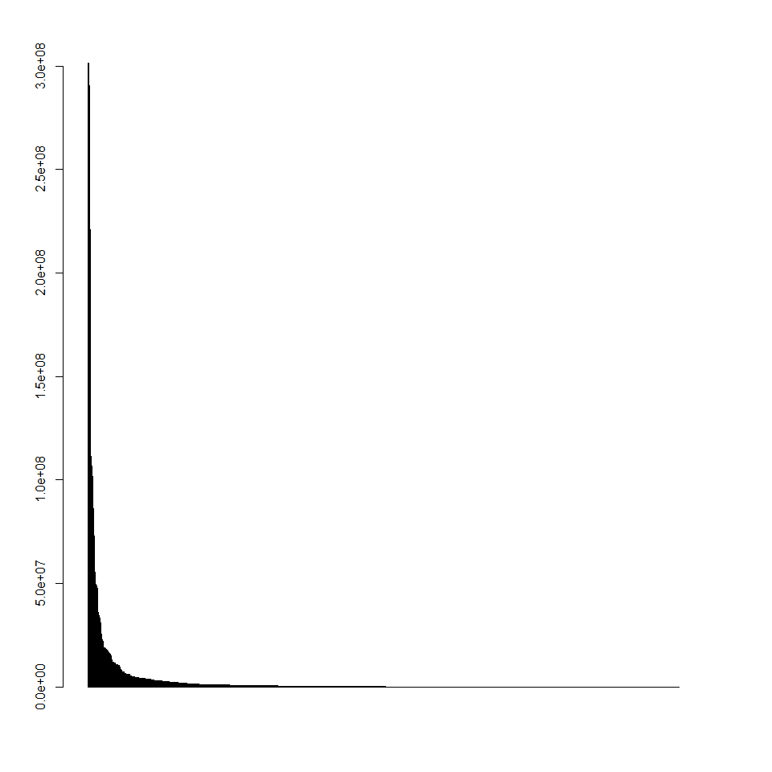
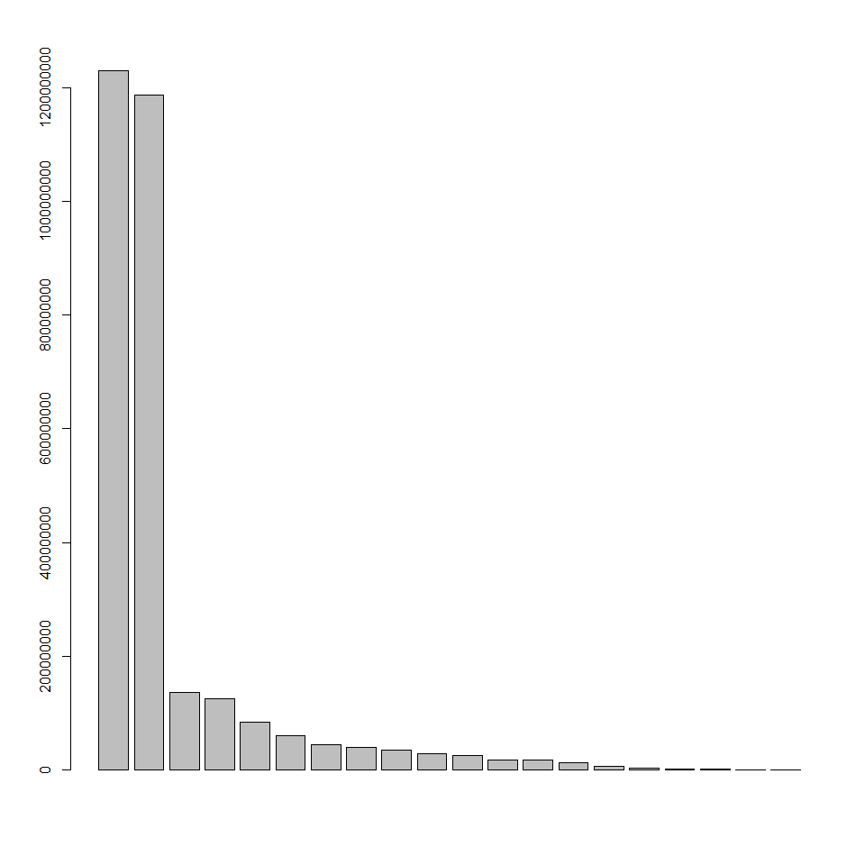

# Data exploration


#Relevant Variables
Those in **bold** seem the most useful... 

 * **dollarsobligated**                                : num  336828 645347 72898 648209 34164 ...
 * baseandexercisedoptionsvalue                    : num  336828 645347 72898 648209 34164 ...
 * baseandalloptionsvalue
 * **maj_agency_cat**                                  : chr  "3600: Department of Veterans Affairs"
 * maj_fund_agency_cat                             : chr  "3600: Department of Veterans Affairs"
 * contractingofficeagencyid                       : chr  "3600: VETERANS AFFAIRS, DEPARTMENT OF"
 * contractingofficeid                             : chr  "36C242: 242-NETWORK CONTRACT OFC 02(00242)"
 * fundingrequestingagencyid                       : chr  "3600: VETERANS AFFAIRS, DEPARTMENT OF"
 * fundingrequestingofficeid                       : chr  "36C242: 242-NETWORK CONTRACT OFC 02(00242)"
 * signeddate                                      : chr  "10/1/2016" "10/1/2016" "10/1/2016" "10/1/2016" ...
 * effectivedate                                   : chr  "10/1/2016" "10/1/2016" "10/1/2016" "10/1/2016" ...
 * currentcompletiondate                           : chr  "9/30/2017" "9/30/2017" "9/30/2017" "9/30/2017" ...
 * ultimatecompletiondate                          : chr  "9/30/2020" "9/30/2020" "9/30/2018" "9/30/2018" ...
 * **contractactiontype**                              : chr  "C: DELIVERY ORDER"
 * **descriptionofcontractrequirement**                : chr  "IGF::CT::IGF--THIS CONTRACT PROVIDES HVAC SERVICE FOR HUDSON VALLEY HEALTHCARE SYSTEM (MONTROSE CAMPUS)."
 * progsourceagency                                : int  36 36 36 36 36 36 36 28 36 36 ...
 * progsourceaccount                               : int  162 152 160 162 162 160
 * **vendorname**                                     : chr  "EASTCO BUILDING SERVICES, INC."
 * streetaddress                                   : chr  "130 BROOK AVE STE A"
 * **city**                                            : chr  "DEER PARK" "NEW YORK"
 * **state**                                           : chr  "NY" "NY" "NY" "NY" ...
 * **zipcode**                                         : int  117297241 100012320
 * vendorcountrycode                               : chr  "USA: UNITED STATES OF AMERICA"
 * vendor_state_code                               : chr  "NY" "NY" "NY" "NY" ...
 * vendor_cd                                       : int  2 10 25 14 12 10 16 12 12 15 ...
 * congressionaldistrict                           : int  2 10 25 14 12 10 16 12 12 15
 * **dunsnumber**                                      : int  605119932 18836440 793169512 830335969 79084053 
 * parentdunsnumber                                : int  605119932 18836440
 * **placeofperformancecity**                         : chr  "MONTROSE" "NEW YORK" "NORTHPORT" "JAMAICA" ...
 * pop_state_code                                  : chr  "NY: New York"
 * placeofperformancecountrycode                   : chr  "USA: UNITED STATES OF AMERICA"
 * **placeofperformancezipcode**                       : int  105480001
 * pop_cd                                          : chr  "NY17" "NY12" "NY03" "NY05" ...
 * placeofperformancecongressionaldistrict         : chr  "NY17"
 * **psc_cat**                                         : chr  "J" "R" "J" "V" ...
 * **productorservicecode**                            : chr  "J041: MAINT/REPAIR/REBUILD OF EQUIPMENT- REFRIGERATION, AIR CONDITIONING, AND AIR CIRCULATING EQUIPMENT"
 * **principalnaicscode**                              : int  541611 561421
 * fiscal_year                                     : int  2017 2017


#Useful links

* **List of other databases**
https://www.fpds.gov/wiki/index.php/PSC,_NAICS_and_more

* **Sam** System for Award Management
Allows to look at contractors by name, DUNS or CAGE (look at search records)
https://www.sam.gov/portal/SAM

#Glosary of some useful codes

* **NAICS** The North American Industry Classification System
https://www.naics.com/search/
https://www.naics.com/naics-drilldown-table/

NAICS is one of the tools used by government agencies to classify the acquisitions and procurements conducted for goods, services and solutions.

How NAICS are used.
-agencies use NAICS Codes to classify how they will use goods and services they purchase.
-companies use NAICS Codes to classify their offerings or the segment of an industry sector in which they do business.
-agencies reference NAICS Codes in documents related to requirements such as forecasts, pre-solicitations and solicitations, and subsequent contracts and agreements.
-companies reference NAICS Codes in their SAM profiles, Dynamic Small Business Search profiles (for small business concerns) and often on their marketing materials such as websites, business cards and capability statements.

* **PSC** Product or Service Code
https://www.fpds.gov/downloads/psc_data_Oct012015.xls

Product service codes (PSC) are used by the United States government to describe the products, services, and research and development purchased by the government. 
They differ from NAICS Codes in that PSC Codes describe “WHAT” was bought for each contract action reported in the Federal Procurement Data System (FPDS),” whereas NAICS Codes describe “HOW” purchased products and services will be used. NAICS and PSC Codes look different, too. NAICS Codes are six position numeric values and PSC Codes are four position numeric or alphanumeric values.

When compared to NAICS Codes, PSC Codes are much more granular. NAICS Codes are segregated into industry sectors represented by the first two digits of a NAICS Code such as ‘54 – Professional Scientific and Technical Services.’ The current NAICS Code system consists of twenty industry sectors. Product and Service Codes start with three categories, R&D, Services and Products, that are then broken down into 102 classes indicated by the first one or two digits of a PSC Code.

* **DUNS** Data Universal Numbering System
http://fedgov.dnb.com/webform/displayHomePage.do;jsessionid=E1E507FBF0B6F36823D2519B2F4E5981

D-U-N-S is a code used for identifying business entities on a location-specific basis. Assigned and maintained solely by D&B, this unique nine-digit identification number has been assigned to over 100 million businesses worldwide. 
A D-U-N-S Number remains with the company location to which it has been assigned even if it closes or goes out-of-business.
The D-U-N-S Number also "unlocks" a wealth of value-added data associated with that entity, including the business name, physical and mailing addresses, tradestyles ("doing business as"), principal names, financial, payment experiences,industry classifications (SICs and NAICS), socio-economic status,government data and more. The D-U-N-S® Number also links members of corporate family trees worldwide.

The D-U-N-S® Number is widely used by both commercial and federal entities and was adopted as the standard business identifier for federal electronic commerce in October 1994.

* **CAGE** The Commercial and Government Entity Code
It is a unique identifier assigned to suppliers to various government or defense agencies, as well as to government agencies themselves and also various organizations. CAGE codes provide a standardized method of identifying a given facility at a specific location.

#Peeking into some variables

###maj_agency_cat


```r
cat(head(unique(cnt$maj_agency_cat)), sep="\n") #to print a list.
```

```
## 3600: Department of Veterans Affairs
## 2800: Social Security Administration
## 7500: Department of Health and Human Services
## 1200: Department of Agriculture
## 1500: Department of Justice
## 4700: General Services Administration
```

###productorservicecode PSC

```r
cat(head(unique(cnt$productorservicecode)), sep="\n") #to print a list.
```

```
## J041: MAINT/REPAIR/REBUILD OF EQUIPMENT- REFRIGERATION, AIR CONDITIONING, AND AIR CIRCULATING EQUIPMENT
## R426: SUPPORT- PROFESSIONAL: COMMUNICATIONS
## J065: MAINT/REPAIR/REBUILD OF EQUIPMENT- MEDICAL, DENTAL, AND VETERINARY EQUIPMENT AND SUPPLIES
## V999: TRANSPORTATION/TRAVEL/RELOCATION- OTHER: OTHER
## J045: MAINT/REPAIR/REBUILD OF EQUIPMENT- PLUMBING, HEATING, AND WASTE DISPOSAL EQUIPMENT
## G099: SOCIAL- OTHER
```

###principalnaicscode NAICS

```r
cat(head(unique(cnt$principalnaicscode)), sep="\n") #to print a list.
```

```
## 541611
## 561421
## 811310
## 484110
## 238220
## 624229
```
*This code will bereplaced by the name of the category of the NAICS

###dunsnumber DUNS

```r
cat(head(unique(cnt$dunsnumber)), sep="\n") #to print a list.
```

```
## 605119932
## 18836440
## 793169512
## 830335969
## 79084053
## 361157287
```

###vendorname

```r
cat(head(unique(cnt$vendorname)), sep="\n") #to print a list.
```

```
## EASTCO BUILDING SERVICES, INC.
## CORPORATE SOURCE, INC., THE
## CARESTREAM HEALTH, INC.
## MAINTENANCE MANAGEMENT SERVICES, LLC
## DIVISION CONSTRUCTION INC
## VOLUNTEERS OF AMERICA - GREATER NEW YORK, INC.
```

###contractactiontype

```r
cat(unique(cnt$contractactiontype), sep="\n") #to print a list.
```

```
## C: DELIVERY ORDER
## D: DEFINITIVE CONTRACT
## B: PURCHASE ORDER
## A: BPA CALL
## G: GRANT FOR RESEARCH
## F: COOPERATIVE AGREEMENT
## T: TRAINING GRANT
```


#Exploring some Descriptives of the data


```r
dat <- cnt[,c("dollarsobligated", "maj_agency_cat", "contractactiontype", "vendorname", "productorservicecode", "principalnaicscode")]
```

##Main Vendors

```r
#aggregating by main Vendors
ven <- group_by(dat, vendorname)
ven <- summarize(ven, Monies = sum(dollarsobligated))

x <- ven$Monies < 0 
ven$Monies[x] <- NA
ven <- arrange(ven, desc(Monies))

ven
```

<div data-pagedtable="false">
  <script data-pagedtable-source type="application/json">
{"columns":[{"label":["vendorname"],"name":[1],"type":["chr"],"align":["left"]},{"label":["Monies"],"name":[2],"type":["dbl"],"align":["right"]}],"data":[{"1":"PFIZER INC.","2":"295600778.62"},{"1":"BROOKHAVEN SCIENCE ASSOCIATES, LLC","2":"290494085.85"},{"1":"LOCKHEED MARTIN CORPORATION","2":"223505026.33"},{"1":"SYSTEMS MADE SIMPLE, INC.","2":"139968271.07"},{"1":"MCCANN WORLD GROUP INC","2":"138791456.46"},{"1":"TRUE NORTH COMMUNICATIONS INC.","2":"124969987.00"},{"1":"HARRIS CORPORATION","2":"110480721.11"},{"1":"TRUE NORTH COMMUNICATIONS INC","2":"93474349.61"},{"1":"CONTINENTAL SERVICE GROUP INCORPORATED","2":"64600000.00"},{"1":"SAINT VINCENTS CATHOLIC MEDICAL CENTERS OF NEW YORK","2":"58948432.80"},{"1":"BANK OF NEW YORK MELLON CORPORATION, THE","2":"49397406.49"},{"1":"AMHERST SYSTEMS, INC.","2":"47584573.00"},{"1":"BANK OF NOVA SCOTIA, THE","2":"45989888.57"},{"1":"SRC, INC.","2":"45473444.15"},{"1":"IMMEDIATE CREDIT RECOVERY, INC","2":"37200000.00"},{"1":"L-3 GLOBAL COMMUNICATIONS SOLUTIONS, INC.","2":"31706128.15"},{"1":"VERA INSTITUTE OF JUSTICE, INC.","2":"24737855.68"},{"1":"BAE SYSTEMS INFORMATION AND ELECTRONIC SYSTEMS INTEGRATION INC.","2":"24514687.08"},{"1":"AVOX SYSTEMS INC.","2":"24415430.03"},{"1":"FJC SECURITY SERVICES, INC.","2":"23747637.59"},{"1":"COMPLETE PACKAGING & SHIPPING SUPPLIES INC.","2":"23731694.83"},{"1":"ICAHN SCHOOL OF MEDICINE AT MOUNT SINAI","2":"21875303.09"},{"1":"MSC INDUSTRIAL DIRECT CO INC","2":"21220771.13"},{"1":"TRANSAERO, INC.","2":"20820012.50"},{"1":"SAAB SENSIS CORPORATION","2":"20307021.90"},{"1":"FEDCAP REHABILITATION SERVICES, INC.","2":"18992317.28"},{"1":"ADM RICE INC","2":"17727092.20"},{"1":"JAMAICA BEARINGS CO INC","2":"16288207.25"},{"1":"ENNEAD ARCHITECTS LLP","2":"16264934.00"},{"1":"MOOG, INC.","2":"15161583.85"},{"1":"NORTHROP GRUMMAN SYSTEMS CORPORATION","2":"15075652.54"},{"1":"NEW YORK CITY HEALTH AND HOSPITALS CORPORATION","2":"14483853.07"},{"1":"ASSURED INFORMATION SECURITY, INC.","2":"14436806.00"},{"1":"NEW YORK, CITY OF","2":"14309207.39"},{"1":"WEISS MANFREDI ARCHITECTS","2":"13481348.00"},{"1":"J.G.B. ENTERPRISES, INC.","2":"13217181.35"},{"1":"UNIVERSITY OF ROCHESTER","2":"11674263.96"},{"1":"CAREER SYSTEMS DEVELOPMENT CORPORATION","2":"11309344.00"},{"1":"MOOG INC.","2":"11278534.25"},{"1":"GROUP HEALTH INCORPORATED","2":"10808999.00"},{"1":"REENERGY BLACK RIVER LLC","2":"10612511.72"},{"1":"TRIO ASBESTOS REMOVAL CORP.","2":"10517160.92"},{"1":"SRCTEC, LLC","2":"9927888.72"},{"1":"HENRY SCHEIN, INC.","2":"9117604.27"},{"1":"L-3 COMMUNICATIONS CORPORATION","2":"8874667.29"},{"1":"SAAB DEFENSE AND SECURITY USA LLC","2":"8817910.76"},{"1":"FLIGHTSAFETY INTERNATIONAL INC.","2":"8650368.00"},{"1":"MOUNT SINAI SCHOOL OF MEDICINE","2":"8500298.72"},{"1":"GLOBALFOUNDRIES U.S. 2 LLC","2":"8222155.58"},{"1":"DRESSER-RAND COMPANY","2":"7793956.00"},{"1":"CONSOLIDATED EDISON COMPANY OF NEW YORK, INC.","2":"7774810.61"},{"1":"G. S. E. DYNAMICS, INC.","2":"7758524.83"},{"1":"JEFFERSON REHABILITATION CENTER, INC.","2":"7736109.62"},{"1":"MARTIN MILITARY INC.","2":"7682700.95"},{"1":"PIONEER INDUSTRIES, INC.","2":"7630406.01"},{"1":"NEW YORK UNIVERSITY","2":"7517933.24"},{"1":"RESEARCH FOUNDATION FOR THE STATE UNIVERSITY OF NEW YORK, THE","2":"6909965.91"},{"1":"ISLAND PEER REVIEW ORGANIZATION, INC.","2":"6708830.00"},{"1":"EDO CORPORATION","2":"6673502.43"},{"1":"RIVERSIDE RESEARCH INSTITUTE","2":"6214087.03"},{"1":"AGERA ENERGY LLC","2":"6204792.52"},{"1":"CDM FEDERAL PROGRAMS CORPORATION","2":"6182717.00"},{"1":"APPLIED VISIONS, INC.","2":"6180383.92"},{"1":"CENTRAL ASSOCIATION FOR THE BLIND, INC.","2":"5942644.88"},{"1":"SEALIFT INC OF DELAWARE","2":"5725296.00"},{"1":"SYNTHESIS, INC.","2":"5558579.86"},{"1":"TECMOTIV (USA), INC.","2":"5548364.82"},{"1":"TRUSTEES OF COLUMBIA UNIVERSITY IN THE CITY OF NEW YORK, THE","2":"5530935.29"},{"1":"AVARINT, LLC","2":"5341593.05"},{"1":"ALANTE SECURITY GROUP INC.","2":"5177118.17"},{"1":"PIONEER CREDIT RECOVERY INCORPORATED","2":"5100127.49"},{"1":"METROPOLITAN INTERPRETERS & TRANSLATORS, INC.","2":"5051213.96"},{"1":"FIGLIOZZI AND COMPANY CPAS PC","2":"4977910.00"},{"1":"CARLETON TECHNOLOGIES INC","2":"4816172.69"},{"1":"ACORDA THERAPEUTICS, INC.","2":"4802947.08"},{"1":"DEBORAH BRADLEY CONSTRUCTION & MANAGEMENT SERVICES INC.","2":"4580098.50"},{"1":"NASSAU TOOL WORKS, INC.","2":"4482261.87"},{"1":"BRETON INDUSTRIES, INC.","2":"4399732.67"},{"1":"PROGRESSIVE EXPERT CONSULTING, INC.","2":"4309865.55"},{"1":"O.C. LUGO CO., INC., THE","2":"4299727.80"},{"1":"UNITED SECURITY, INC","2":"4253855.73"},{"1":"TRUSTEES OF COLUMBIA UNIVERSITY IN THE CITY OF NEW YORK","2":"4225220.83"},{"1":"HENNINGSON, DURHAM & RICHARDSON P.C.","2":"4209190.00"},{"1":"CALSPAN CORPORATION","2":"4132136.47"},{"1":"ADIRONDACK ELECTRONICS, INC.","2":"4107426.83"},{"1":"INTERNATIONAL BUSINESS MACHINES CORPORATION","2":"4062492.34"},{"1":"ARKWIN INDUSTRIES, INC.","2":"3966734.44"},{"1":"THE RESEARCH FOUNDATION OF STATE UNIVERSITY OF NEW YORK","2":"3935462.73"},{"1":"RESEARCH FOUNDATION OF STATE UNIVERSITY OF NEW YORK, THE","2":"3934013.98"},{"1":"H & L CONTRACTING, LLC","2":"3927441.64"},{"1":"GILBANE BUILDING COMPANY (5530)","2":"3905960.00"},{"1":"DYNALEC CORPORATION","2":"3872871.33"},{"1":"VOLUNTEERS OF AMERICA - GREATER NEW YORK, INC.","2":"3855714.00"},{"1":"PRO CON GROUP, INC.","2":"3836808.94"},{"1":"BLACK RIVER SYSTEMS COMPANY INC","2":"3775319.54"},{"1":"EMPIRE AVIONICS CORP.","2":"3772475.55"},{"1":"LIFE TECHNOLOGIES CORPORATION","2":"3739058.20"},{"1":"PAR GOVERNMENT SYSTEMS CORPORATION","2":"3702743.00"},{"1":"SKF USA INC","2":"3686788.07"},{"1":"CORNELL UNIVERSITY, INC","2":"3649749.66"},{"1":"OTIS PRODUCTS, INC","2":"3637507.38"},{"1":"HUMAN TECHNOLOGIES CORPORATION","2":"3460559.14"},{"1":"UNIVERSITY EMERGENCY MEDICAL SERVICES, INC.","2":"3435667.45"},{"1":"THREE CITIES MANAGEMENT LLC","2":"3334003.39"},{"1":"KITWARE, INC.","2":"3300716.00"},{"1":"ERIE ENGINEERED PRODUCTS, INC.","2":"3292275.00"},{"1":"CORE SERVICES GROUP, INC.","2":"3263792.00"},{"1":"CORPORATE SOURCE, INC., THE","2":"3263673.22"},{"1":"GDS TRADE INC","2":"3231126.87"},{"1":"CARESTREAM HEALTH INC","2":"3182677.71"},{"1":"BLOOMBERG FINANCE L.P.","2":"3170498.65"},{"1":"HANDY TOOL & MFG. CO., INC., THE","2":"3097953.37"},{"1":"WASHINGTON FOUNDRIES INC.","2":"3096869.01"},{"1":"MDRC","2":"3057377.54"},{"1":"SIMON DEFENSE INC","2":"3045256.80"},{"1":"HOWE MACHINE & TOOL CORP.","2":"3027092.71"},{"1":"TEK PRECISION CO., LTD.","2":"3008690.77"},{"1":"WELCH CONSTRUCTION INC.","2":"3000319.50"},{"1":"SZY HOLDINGS, LLC","2":"2993264.85"},{"1":"INNOVATION ASSOCIATES, INC.","2":"2957513.92"},{"1":"U.S. INNOVATIVE CONSTRUCTION, LLC","2":"2913530.78"},{"1":"AVIARMS SUPPORT CORP","2":"2860742.90"},{"1":"VETERANS CONTRACTING GROUP, INC.","2":"2832074.23"},{"1":"GRAMMATECH, INC.","2":"2825548.27"},{"1":"GENERAL ELECTRIC COMPANY","2":"2807931.37"},{"1":"GENESIS VISION, INC.","2":"2689183.78"},{"1":"CARTER ENTERPRISES LLC","2":"2661809.22"},{"1":"MSC INDUSTRIAL DIRECT CO., INC.","2":"2634348.54"},{"1":"UNITED VETERANS BEACON HOUSE, INC.","2":"2634194.51"},{"1":"PEERLESS ELECTRONICS INC.","2":"2558549.54"},{"1":"SEAL DYNAMICS LLC","2":"2469178.26"},{"1":"BESTEC CONCEPT, INC.","2":"2384947.64"},{"1":"HUMANSCALE CORPORATION","2":"2373502.71"},{"1":"PECK & HALE, L.L.C.","2":"2357644.27"},{"1":"YOUNG & RUBICAM INC.","2":"2332977.33"},{"1":"GOODRICH CORPORATION","2":"2297962.54"},{"1":"CARL ZEISS MICROSCOPY, LLC","2":"2282694.91"},{"1":"DALBERG CONSULTING US LLC","2":"2265000.00"},{"1":"SHEARMAN & STERLING LLP","2":"2232950.00"},{"1":"PEOPLE'S ACCIDENT INFORMATION SERVICE, INC.","2":"2214634.50"},{"1":"EASTCO BUILDING SERVICES, INC.","2":"2208054.26"},{"1":"DAVIS BRODY BOND, LLP","2":"2205235.38"},{"1":"GRIFFISS UTILITY SERVICES CORPORATION","2":"2154759.04"},{"1":"THOMSON REUTERS (MARKETS) LLC","2":"2137615.66"},{"1":"MEDBLOC, INC","2":"2115498.27"},{"1":"UNIVERSITY PHYSICIANS OF BROOKLYN, INC.","2":"2108369.67"},{"1":"SENECA TELECOMMUNICATIONS, LLC","2":"1978747.83"},{"1":"IDSS HOLDINGS, INC.","2":"1920147.00"},{"1":"AMPHENOL CORPORATION","2":"1912158.11"},{"1":"CENTER SPAN LLC","2":"1871514.49"},{"1":"PEERLESS AEROSPACE FASTENER CORPORATION","2":"1860574.98"},{"1":"SKADDEN, ARPS, SLATE, MEAGHER & FLOM LLP","2":"1858420.00"},{"1":"HEALTH RESEARCH, INC.","2":"1850687.57"},{"1":"METALCRAFT MARINE US, INC.","2":"1839950.76"},{"1":"MEGABITE ELECTRONICS, INC.","2":"1817366.72"},{"1":"H&R PARTS COMPANY LLC","2":"1784213.20"},{"1":"KONDRA & JAQUIN ENTERPRISES INC - SAI JOINT VENTURE","2":"1750594.00"},{"1":"HONEYBEE ROBOTICS, LTD","2":"1746272.00"},{"1":"ADVANCED ACOUSTIC CONCEPTS LLC","2":"1731874.00"},{"1":"NIKON INSTRUMENTS INC.","2":"1723314.53"},{"1":"PERFORMANCE LOGIC INC","2":"1681838.00"},{"1":"BREN-TRONICS, INC.","2":"1678375.21"},{"1":"PATRIOT MOBILITY INC.","2":"1673813.46"},{"1":"NINETY FIVE SOUTH, INC.","2":"1660557.28"},{"1":"ERA INDUSTRIAL SALES CORP INC","2":"1660403.45"},{"1":"WIDEX USA, INC.","2":"1656616.11"},{"1":"DATAMINR, INC.","2":"1649327.00"},{"1":"CLINTON COUNTY CHAPTER NYSARC INC.","2":"1644798.10"},{"1":"ACCESS: SUPPORTS FOR LIVING INC.","2":"1627765.67"},{"1":"HARTCHROM, INC.","2":"1619381.14"},{"1":"ASSOCIATION FOR THE BLIND AND VISUALLY IMPAIRED OF GREATER ROCHESTER, INC.","2":"1600258.57"},{"1":"EBENEZER RAILCAR SERVICES INC.","2":"1588000.00"},{"1":"METROPOLITAN LIFE INSURANCE COMPANY (INC)","2":"1560792.00"},{"1":"ECOLOGY AND ENVIRONMENT, INC.","2":"1548697.20"},{"1":"ORBIT INTERNATIONAL CORP.","2":"1535134.93"},{"1":"MOODY'S ANALYTICS, INC.","2":"1528881.38"},{"1":"YOUV LABS","2":"1494124.00"},{"1":"LONG ISLAND POWER AUTHORITY","2":"1466728.31"},{"1":"CAPRICE ELECTRONICS, INC.","2":"1447873.79"},{"1":"WORKFIT MEDICAL, LLC","2":"1444439.00"},{"1":"CENTROID, INC.","2":"1412615.41"},{"1":"GENERAL MARINE PRODUCTS INC","2":"1399318.48"},{"1":"ACME INDUSTRIAL, INC.","2":"1358372.00"},{"1":"AMETEK THERMAL SYSTEMS INC","2":"1327937.00"},{"1":"DENTAL LABORATORY GROUP INC.","2":"1311955.00"},{"1":"PRIDE ELECTRONICS, INC.","2":"1294120.48"},{"1":"SKIDMORE, OWINGS & MERRILL LLP","2":"1286065.36"},{"1":"NEW YORK BLOOD CENTER, INC., THE","2":"1283507.07"},{"1":"EDO LLC","2":"1281305.73"},{"1":"AMERICAN MUSEUM OF NATURAL HISTORY, THE","2":"1277821.94"},{"1":"GMD SHIPYARD CORP.","2":"1273855.46"},{"1":"JUNIPER ELBOW CO. INC.","2":"1248427.82"},{"1":"ROBERT F. HYLAND & SONS, LLC","2":"1225249.65"},{"1":"CALCEDO CONSTRUCTION CORP.","2":"1204627.50"},{"1":"S. J. THOMAS CO., INC.","2":"1188681.15"},{"1":"EYP, INC.","2":"1181894.01"},{"1":"IET LABS., INC.","2":"1181363.47"},{"1":"LINTECH COMPONENTS CO INC","2":"1178933.61"},{"1":"COMPLETE PACKAGING & SHIPPING","2":"1173658.60"},{"1":"CADWALADER, WICKERSHAM & TAFT LLP","2":"1172063.00"},{"1":"CAPY MACHINE SHOP INC.","2":"1164523.78"},{"1":"B. H. AIRCRAFT COMPANY, INC.","2":"1158455.00"},{"1":"STARKS ASSOCIATES, INC.","2":"1157679.00"},{"1":"CONSTRUCTION AND SERVICE SOLUTIONS CORP.","2":"1157144.10"},{"1":"RAND & JONES ENTERPRISES COMPANY, INC.","2":"1137551.14"},{"1":"RENZI BROS., INC.","2":"1132095.14"},{"1":"AX ENTERPRIZE, LLC","2":"1126672.00"},{"1":"PREMIER AND COMPANIES INCORPORATED","2":"1122294.21"},{"1":"BUFFALO PUMPS, INC.","2":"1116305.01"},{"1":"MARCH ELECTRONICS, INC.","2":"1114865.86"},{"1":"VETERAN LAWN CARE SERVICES, LLC","2":"1112402.79"},{"1":"RODELCO ELECTRONICS CORP.","2":"1100335.84"},{"1":"FEINSTEIN INSTITUTE FOR MEDICAL RESEARCH, THE","2":"1097905.00"},{"1":"APNEA CARE, INC.","2":"1088503.87"},{"1":"DCS INFRASTRUCTURE, LLC","2":"1088048.54"},{"1":"ASSOCIATION FOR VISION REHABILITATION AND EMPLOYMENT, INC.","2":"1085652.00"},{"1":"PRECISION ELECTRONICS, INC.","2":"1070481.99"},{"1":"UPSTATE NIAGARA COOPERATIVE, INC.","2":"1055838.82"},{"1":"BUFFALO HALFWAY HOUSE INC","2":"1048500.80"},{"1":"INDEPENDENT METAL STRAP CO INC","2":"1033068.98"},{"1":"CCS ONCOLOGY, P.C.","2":"1026208.52"},{"1":"O.R. ELDER INC.","2":"1018118.18"},{"1":"CARESTREAM HEALTH, INC.","2":"1017943.30"},{"1":"BUCK CONSULTANTS, LLC","2":"1000000.00"},{"1":"OMNITEK PARTNERS LLC","2":"999928.40"},{"1":"BAE SYSTEMS INFORMATION AND ELECTRONIC SYSTEMS INTEGRATION I","2":"999343.18"},{"1":"TELEPHONICS CORPORATION","2":"991656.11"},{"1":"CUTLASS ASSOCIATES","2":"983119.25"},{"1":"UPSTATE EMERGENCY MEDICINE, INC","2":"982155.86"},{"1":"SABIN METAL CORPORATION","2":"968300.88"},{"1":"CROUSE RADIOLOGY ASSOCS","2":"965973.25"},{"1":"CONSOLIDATED EDISON SOLUTIONS, INC.","2":"962486.00"},{"1":"VALOR NETWORK INC.","2":"959903.00"},{"1":"NORTH SHORE UNIVERSITY HOSPITAL","2":"953437.00"},{"1":"DAVIS AIRCRAFT PRODUCTS CO., INC.","2":"950290.46"},{"1":"DF GIBSON ARCHITECTS PC","2":"946157.52"},{"1":"MILLER ENVIRONMENTAL GROUP INC.","2":"942913.03"},{"1":"POLYMEDCO CANCER DIAGNOSTIC PRODUCTS LLC","2":"938128.38"},{"1":"ARTEMIS, INC.","2":"932218.19"},{"1":"NEW YORK UNIVERSITY (INC)","2":"921373.65"},{"1":"ASTROCOM ELECTRONICS, INC.","2":"915534.20"},{"1":"CUBRC, INC.","2":"912096.48"},{"1":"HYPRES, INC.","2":"909228.00"},{"1":"MANHATTAN STRATEGY GROUP LLC, THE","2":"905147.99"},{"1":"WARRIOR SERVICE COMPANY LLC","2":"897069.09"},{"1":"DIVISION CONSTRUCTION INC","2":"891691.13"},{"1":"STAR POLY BAG, INC.","2":"889635.90"},{"1":"PATRICIA ELECTRIC INCORPORATED","2":"886500.00"},{"1":"VOLUNTEERS OF AMERICA OF WESTERN NEW YORK, INC.","2":"881952.00"},{"1":"FLAGPOLES, INCORPORATED","2":"875166.07"},{"1":"MCI SOLUTIONS INC.","2":"873302.40"},{"1":"MAXXUM CONSTRUCTION CORP.","2":"871000.00"},{"1":"SYRACUSE UNIVERSITY","2":"865283.00"},{"1":"THORNTON TOMASETTI, INC.","2":"864678.00"},{"1":"ROANWELL CORPORATION","2":"858556.74"},{"1":"N. K. BHANDARI, ARCHITECTURE & ENGINEERING, P. C.","2":"854183.05"},{"1":"R L C ELECTRONICS, INC.","2":"847584.00"},{"1":"SAMCO LLC","2":"834129.11"},{"1":"LONG ISLAND JEWISH MEDICAL CENTER","2":"829068.00"},{"1":"ULTRALIFE CORPORATION","2":"824874.34"},{"1":"LINK2HEALTH SOLUTIONS, INC.","2":"822450.69"},{"1":"APRISA TECHNOLOGY LIMITED LIABILITY COMPANY","2":"818992.95"},{"1":"NAGAN CONSTRUCTION INC.","2":"812047.00"},{"1":"ATC-NY, INC.","2":"809828.81"},{"1":"Y & S TECHNOLOGIES INC.","2":"809485.23"},{"1":"GETINGE USA, INC.","2":"807877.57"},{"1":"WOODSTOCK CONSTRUCTION GROUP LTD","2":"800000.00"},{"1":"B & H FOTO & ELECTRONICS CORP.","2":"797608.23"},{"1":"T F HERCEG, INC","2":"788953.07"},{"1":"BONK, SAM UNIFORMS AND CIVILIAN CAP CO INC","2":"788396.72"},{"1":"ZIBIZ CORPORATION","2":"783671.82"},{"1":"ESPEY MFG. & ELECTRONICS CORP.","2":"782770.27"},{"1":"INNOVEERING, LLC","2":"780340.47"},{"1":"U.S. MATERIALS HANDLING CORPORATION","2":"779281.45"},{"1":"TACTAIR FLUID CONTROLS, INC.","2":"778739.00"},{"1":"EAST COAST POWER & GAS, LLC","2":"777895.96"},{"1":"B.J.G. ELECTRONICS, INC.","2":"776376.26"},{"1":"NORTH POINT DEFENSE, INC.","2":"773000.00"},{"1":"GFK US, LLC","2":"764000.00"},{"1":"RED BALLOON SECURITY, INC.","2":"762926.88"},{"1":"CLEAR SCIENCE CORP","2":"750000.00"},{"1":"EMS DEVELOPMENT CORPORATION","2":"749839.24"},{"1":"DALET DIGITAL MEDIA SYSTEMS USA, INC.","2":"749670.00"},{"1":"LEGAL INTERPRETING SERVICES, INC.","2":"748168.66"},{"1":"DECILOG INC","2":"747355.57"},{"1":"ROME RESEARCH CORPORATION","2":"739837.00"},{"1":"MANHATTAN STRATEGY GROUP THE LIMITED LIABILITY COMPANY","2":"739201.21"},{"1":"INFLATION SYSTEMS, INC","2":"736904.35"},{"1":"TRI-TECHNOLOGIES INC.","2":"736699.61"},{"1":"FALCON ELECTRONICS, INC","2":"735909.79"},{"1":"MONO MACHINES LLC","2":"734402.50"},{"1":"ORTHO-CLINICAL DIAGNOSTICS, INC.","2":"731378.23"},{"1":"PUBLIC HEALTH SOLUTIONS","2":"727073.00"},{"1":"APEX PINNACLE CORP.","2":"720618.27"},{"1":"ASR INTERNATIONAL CORP.","2":"719590.42"},{"1":"QUALITECH-AEROSPACE CORP.","2":"717744.52"},{"1":"NORTHEAST INFORMATION DISCOVERY INC.","2":"705932.00"},{"1":"FLIGHTLINE ELECTRONICS, INC.","2":"705055.55"},{"1":"PRECISION METALS CORP.","2":"704990.94"},{"1":"BAE SYSTEMS CONTROLS INC.","2":"700986.00"},{"1":"SWBR AND TRO JUNG/BRANNEN ARCHITECTS AND ENGINEERS IN JOINT VENTURE","2":"696264.00"},{"1":"KERNS MANUFACTURING CORP.","2":"688790.48"},{"1":"JOHN CIVETTA & SONS, INC.","2":"688741.07"},{"1":"GENERAL MICROWAVE CORPORATION","2":"684771.00"},{"1":"GREATER METROPOLITAN COMMUNITY BLOOD SERVICE INC","2":"683506.00"},{"1":"EAGLE STAR HOUSING, INC.","2":"682420.79"},{"1":"HARDEN FURNITURE, INC.","2":"678971.79"},{"1":"DRESSER-ARGUS, INC","2":"676569.59"},{"1":"EXCEPTION TECHNOLOGIES, LLC","2":"672903.00"},{"1":"POLICY RESEARCH ASSOCIATES INC","2":"669529.00"},{"1":"NORTHERN DREAMS CONSTRUCTION, INC.","2":"669228.00"},{"1":"EMS SUPPLIERS INC.","2":"666880.66"},{"1":"CURTISS-WRIGHT FLOW CONTROL CORPORATION","2":"665117.00"},{"1":"FDR SERVICES CORP.","2":"662545.32"},{"1":"ISLAND PYROCHEMICAL INDUSTRIES CORP.","2":"659545.00"},{"1":"PEERLESS INSTRUMENT CO., INC.","2":"656567.00"},{"1":"ALBANY MEDICAL COLLEGE","2":"652132.54"},{"1":"DATTNER ARCHITECTS D.P.C.","2":"650553.71"},{"1":"MAINTENANCE MANAGEMENT SERVICES, LLC","2":"648209.09"},{"1":"JJ CONTRACTING CORP.","2":"647405.00"},{"1":"STATEWIDE ROOFING INC.","2":"637769.00"},{"1":"DAWNBREAKER INC","2":"635319.80"},{"1":"FEHER RUBBISH REMOVAL, INC.","2":"633407.25"},{"1":"JAY MOULDING CORPORATION","2":"630534.74"},{"1":"GREENMAN-PEDERSEN, INC.","2":"622037.46"},{"1":"G E INSPECTION TECHNOLOGIES, LP","2":"621385.07"},{"1":"DETEKION SECURITY SYSTEMS, INC.","2":"619930.00"},{"1":"NORTH ATLANTIC INDUSTRIES, INC.","2":"619475.01"},{"1":"ROTRON INCORPORATED","2":"613343.00"},{"1":"SIRONA DENTAL, INC.","2":"613032.29"},{"1":"WIDETRONIX INC.","2":"608224.68"},{"1":"MAETEC POWER, INC.","2":"604235.96"},{"1":"JOHNSON OUTDOORS INC","2":"600823.59"},{"1":"BUILDING MAINTENANCE SERVICE LLC","2":"600000.00"},{"1":"OPTIMAX SYSTEMS, INC.","2":"600000.00"},{"1":"OPTIPRO SYSTEMS, LLC","2":"600000.00"},{"1":"COIN CORP INTERNATIONAL","2":"593400.00"},{"1":"RESEARCH FOUNDATION OF THE CITY UNIVERSITY OF NEW YORK","2":"590046.58"},{"1":"STAR POLY BAG INCORPORATED","2":"588756.84"},{"1":"SIERRA DELTA CONTRACTING, LLC","2":"585499.00"},{"1":"RENSSELAER POLYTECHNIC INSTITUTE","2":"585082.86"},{"1":"LOCKHEED MARTIN GLOBAL, INC.","2":"584126.00"},{"1":"FINGER LAKES ADDICTION COUNSELING AND REFERRAL AGENCY INC","2":"580032.01"},{"1":"SUNY MARITIME COLLEGE","2":"578804.00"},{"1":"ADORAMA INC.","2":"577810.70"},{"1":"OG TECHNOLOGIES INC.","2":"577462.50"},{"1":"ORKAL AEROSPACE CORP.","2":"572733.83"},{"1":"ECOHEALTH ALLIANCE INC.","2":"565660.25"},{"1":"NOW ELECTRONICS, INC.","2":"565074.30"},{"1":"ROCHESTER PRECISION OPTICS, LLC","2":"562500.00"},{"1":"QUALIFIED FASTENERS INC.","2":"559382.74"},{"1":"MC ALLISTER TOWING & TRANSPORTATION CO INC","2":"556452.50"},{"1":"NEW YORK AMERICAN WATER COMPANY, INC.","2":"550000.00"},{"1":"THE ASSOCIATED PRESS","2":"547640.28"},{"1":"EIS, INC.","2":"545562.00"},{"1":"KENT OPTRONICS INC","2":"544937.66"},{"1":"LIONANO INC","2":"543199.33"},{"1":"PHOEBUS OPTOELECTRONICS, LLC","2":"538334.54"},{"1":"RAPID RIVET AND FASTENER CORPORATION","2":"536001.14"},{"1":"FITCH SOLUTIONS, INC.","2":"535912.90"},{"1":"ELWOOD INTERNATIONAL, INC.","2":"535172.52"},{"1":"THOMAS ELECTRONICS, INC","2":"535061.00"},{"1":"CAPLES, JEFFERSON ARCHITECTS","2":"532525.00"},{"1":"BIG APPLE SIGN CORP.","2":"532109.26"},{"1":"LOYOLA MEDICAL ASSOCIATES PLLC","2":"531710.00"},{"1":"SPRINGER CUSTOMER SERVICE CENTER LLC","2":"531063.46"},{"1":"TRUSTEES OF COLUMBIA UNIVERSIT","2":"529634.00"},{"1":"PREMIER & COMPANIES, INC.","2":"529563.54"},{"1":"KNUDSEN SYSTEMS INC","2":"528782.21"},{"1":"SEWING TECHNOLOGY, INC.","2":"521516.00"},{"1":"PENTAGON 2000 SOFTWARE, INC","2":"520929.47"},{"1":"FLIGHTSAFETY INTERNATIONAL INC","2":"518931.00"},{"1":"SENECA FOODS CORPORATION","2":"515214.96"},{"1":"M. ARTHUR GENSLER JR. & ASSOCIATES, INC.","2":"514685.61"},{"1":"GAFFEL EQUIPMENT","2":"509268.00"},{"1":"EXELIS INC.","2":"508967.00"},{"1":"ELIZABETH PIERCE OLMSTED, M.D. CENTER FOR THE VISUALLY IMPAIRED","2":"508050.00"},{"1":"VETMED GROUP LLC","2":"507880.49"},{"1":"PALA WOOD SERVICES COMPANY, INC","2":"505891.34"},{"1":"GLOBAL DEFENSE, INC.","2":"505224.00"},{"1":"AMERICAN PACKAGING I INC","2":"503503.02"},{"1":"DAWNBREAKER, INC.","2":"500000.00"},{"1":"FERRIC, INC.","2":"500000.00"},{"1":"DAVIES OFFICE REFURBISHING","2":"496100.91"},{"1":"DATA DEVICE CORPORATION","2":"495948.00"},{"1":"TECHNERGETICS, LLC","2":"495100.00"},{"1":"H2H ASSOCIATES, LLC","2":"494187.09"},{"1":"R.A. WOOD ASSOCIATES, LLC","2":"492774.00"},{"1":"DESIGN/OL, INC.","2":"491419.88"},{"1":"INTERNATIONAL ELECTRONIC MACHINES CORPORATION","2":"486217.00"},{"1":"AERO HARDWARE & PARTS CO., INC.","2":"486045.49"},{"1":"TANGRAM COMPANY, L.L.C.","2":"485152.00"},{"1":"OFFICE LEADER CORP.","2":"481404.70"},{"1":"SYNTHESIS INCORPORATED","2":"476664.69"},{"1":"SEVENSON ENVIRONMENTAL SERVICES, INC.","2":"476142.00"},{"1":"TIME BASE CORPORATION","2":"470616.05"},{"1":"NEWTRONIX SYSTEMS, INC.","2":"467094.00"},{"1":"AURORA OF CENTRAL NEW YORK INC","2":"465525.84"},{"1":"TELEVISION EQUIPMENT ASSOCIATES, INC.","2":"465275.12"},{"1":"AIR INDUSTRIES MACHINING, CORP.","2":"465151.00"},{"1":"AMERICAN SOCIETY FOR THE PREVENTION OF CRUELTY TO ANIMALS (INC)","2":"460875.00"},{"1":"U. S. DYNAMICS CORPORATION","2":"460675.00"},{"1":"SARANAC LAKE, VILLAGE OF","2":"460000.00"},{"1":"CRESTWOOD TECHNOLOGY GROUP CORP.","2":"455767.32"},{"1":"ALBERT EINSTEIN COLLEGE OF MEDICINE","2":"453713.00"},{"1":"HART SPECIALTIES, INC.","2":"451283.91"},{"1":"HONEYBEE ROBOTICS LTD","2":"451000.00"},{"1":"EASTMAN KODAK COMPANY","2":"449672.56"},{"1":"QUANTERION SOLUTIONS INC","2":"449327.00"},{"1":"ALL PRESTIGE MANAGEMENT CORP.","2":"447400.00"},{"1":"FLUID HANDLING, LLC","2":"443990.44"},{"1":"NEWTEX INDUSTRIES, INC.","2":"441723.52"},{"1":"HARRY KRANTZ CO., LLC","2":"441537.18"},{"1":"MIOTTO MOSAIC ART STUDIOS INC","2":"440000.00"},{"1":"U B FOUNDATION ACTIVITIES, INC.","2":"438658.80"},{"1":"MONROE CABLE COMPANY, INC., THE","2":"438282.83"},{"1":"PREMIER & COMPANIES INC.","2":"434750.67"},{"1":"CONMED CORPORATION","2":"434014.24"},{"1":"SCHOLASTIC INC.","2":"429383.00"},{"1":"WELCH ALLYN HOLDINGS, INC.","2":"429054.50"},{"1":"LASALLE AMBULANCE INC","2":"422500.00"},{"1":"ELECTRO-METRICS CORPORATION","2":"421348.50"},{"1":"PERKINS EASTMAN ARCHITECTS, P.C.","2":"420000.00"},{"1":"ELTEE TOOL & DIE CO","2":"417813.00"},{"1":"LODGING KIT COMPANY, INC.","2":"417774.00"},{"1":"ALBANY MOLECULAR RESEARCH, INC.","2":"416606.00"},{"1":"R. A. RODRIGUEZ, INCORPORATED","2":"416509.19"},{"1":"H L DALIS INCORPORATED (6063)","2":"415830.33"},{"1":"GIBBS & COX, INC.","2":"414467.26"},{"1":"SOUTHERN TIER HIDE & TALLOW INC","2":"414000.00"},{"1":"J&K ELECTRONICS INC.","2":"413480.06"},{"1":"EPPENDORF NORTH AMERICA, INC.","2":"410169.52"},{"1":"ISS ACTION, INC.","2":"408689.15"},{"1":"HUGE LLC","2":"408505.98"},{"1":"S&P GLOBAL MARKET INTELLIGENCE LLC","2":"407158.89"},{"1":"TRAC REGULATORS INC","2":"403611.64"},{"1":"SKF USA INC.","2":"402860.36"},{"1":"CENTURY METAL PARTS, CORP.","2":"401487.82"},{"1":"PETERSON'S NELNET, LLC","2":"401456.00"},{"1":"PCB PIEZOTRONICS, INC.","2":"400976.51"},{"1":"H. SCHRIER & CO., INC.","2":"400810.32"},{"1":"ARTCRAFT OPTICAL CO INC","2":"398120.10"},{"1":"MANHATTAN TELECOMMUNICATIONS CORPORATION","2":"397371.48"},{"1":"CALL ASSOCIATES, INC.","2":"396462.56"},{"1":"SMARTSTREAM TECHNOLOGIES, INC.","2":"396164.00"},{"1":"O-AT-KA MILK PRODUCTS COOPERATIVE, INCORPORATED","2":"392074.86"},{"1":"NATIONAL ECONOMIC RESEARCH ASSOCIATES, INC","2":"390540.00"},{"1":"EMPIRE NATURAL GAS CORPORATION","2":"390000.00"},{"1":"PORT SAILING CENTER","2":"390000.00"},{"1":"AWICS SECURITY & INVESTIGATIONS, INC","2":"388644.60"},{"1":"PHARMALOGIC SYRACUSE LLC","2":"385756.17"},{"1":"WORKFIT MEDICAL LLC","2":"383395.00"},{"1":"D.C.B. ELEVATOR CO., INC","2":"382994.00"},{"1":"MIDWAY INDUSTRIAL SUPPLY INC.","2":"379995.22"},{"1":"ECOVATIVE DESIGN LLC","2":"379864.04"},{"1":"GATEWAY COMMUNITY INDUSTRIES","2":"377688.68"},{"1":"MOHAWK VALLEY MATERIALS, INC.","2":"376124.96"},{"1":"INNOVATIVE DYNAMICS INC","2":"374439.00"},{"1":"BYRNE DAIRY INC.","2":"373906.56"},{"1":"ACME PRODUCTS & ENGINEERING INC","2":"372979.00"},{"1":"DODGE DATA & ANALYTICS LLC","2":"371890.56"},{"1":"INSTRUMENT SUPPORT INC","2":"370700.50"},{"1":"KYNTEC CORPORATION","2":"370520.00"},{"1":"T & T MATERIALS, INC.","2":"366976.52"},{"1":"NIXON PEABODY LLP","2":"366491.00"},{"1":"NEW COMPUTECH, INC.","2":"365725.77"},{"1":"D K MACHINE INC","2":"362560.00"},{"1":"GEMCAP COMPONENTS INC.","2":"361115.21"},{"1":"PERSISTENT SYSTEMS, LLC","2":"357791.79"},{"1":"ARGUS INFORMATION AND ADVISORY SERVICES LLC","2":"357500.00"},{"1":"JCL ELECTRONICS INC.","2":"355596.63"},{"1":"ASTARITA ASSOCIATES INC","2":"354598.83"},{"1":"FOUNDATION FOR INNOVATION, TRANSLATION, AND SAFETY SCIENCE","2":"354590.00"},{"1":"ANDRO COMPUTATIONAL SOLUTIONS LLC","2":"354493.00"},{"1":"DEPARTMENT OF MEDICINE MEDICAL SERVICE GROUP AT THE SUNY HEALTH SCIENCE CENTER AT SYRACUSE","2":"353986.29"},{"1":"LAPAROSCOPIC TECHNOLOGIES INC","2":"351823.12"},{"1":"STARBOARD MARINE INC","2":"351591.26"},{"1":"TSIG CONSULTING, INC.","2":"349546.91"},{"1":"US MILPACK & MANUFACTURING CORP","2":"349334.29"},{"1":"OERLIKON METCO (US) INC.","2":"347754.23"},{"1":"AUTODYNE MANUFACTURING CO., INC.","2":"346341.05"},{"1":"NEIL HOOSIER & ASSOCIATES, INC.","2":"346055.45"},{"1":"GALLERY SYSTEMS, INC.","2":"343569.48"},{"1":"RALOID TOOL CO INC","2":"339562.00"},{"1":"CARING FOR THE HOMELESS OF PEEKSKILL INC.","2":"337260.00"},{"1":"NORCATEC LLC","2":"337104.34"},{"1":"HUTHERDOYLE MEMORIAL INSTITUTE INC","2":"337050.00"},{"1":"MKC ELECTRONICS, INC","2":"335501.60"},{"1":"SYRACUSE BRICK HOUSE, INC.","2":"334448.00"},{"1":"C & D EQUIPMENT COMPANY INC","2":"333373.00"},{"1":"TONY BAIRD ELECTRONICS, INC.","2":"333178.89"},{"1":"UTECH PRODUCTS INC.","2":"331088.09"},{"1":"A-Z SOLUTIONS INC","2":"330398.38"},{"1":"NORTH HEMPSTEAD, TOWN OF","2":"330169.10"},{"1":"DRI RELAYS INC.","2":"327644.94"},{"1":"COMPUTECH INTERNATIONAL, INC.","2":"327064.40"},{"1":"FRIEDMAN LLP","2":"326320.00"},{"1":"MIL-AERO SOLUTIONS, INC.","2":"326118.96"},{"1":"ATLANTIC AVIATION STEWART, LLC","2":"325883.25"},{"1":"NIELSEN COMPANY US LLC, THE","2":"325469.00"},{"1":"ACE OF TRADES GENERAL CONTRACTING, LLC","2":"322970.85"},{"1":"ATLAS HEALTHCARE","2":"322000.00"},{"1":"BELZ MONUMENT SERVICE, INC.","2":"318956.00"},{"1":"ABLE MEDICAL TRANSPORTATION INC","2":"317094.80"},{"1":"AIP PUBLISHING LLC","2":"314859.00"},{"1":"VITERION CORPORATION","2":"311354.32"},{"1":"ROCHESTER INSTITUTE OF TECHNOLOGY (INC)","2":"310563.83"},{"1":"PARAMOUNT CHOICE CLEANING SERVICES","2":"309026.34"},{"1":"CENTRAL HUDSON GAS & ELECTRIC CORPORATION","2":"306731.66"},{"1":"UTECH PRODUCTS INCORPORATED","2":"305700.00"},{"1":"GLOBECOMM SYSTEMS INC.","2":"304172.19"},{"1":"SAINT CAMILLUS RESIDENTIAL HEALTH CARE FACILITY","2":"302707.30"},{"1":"ANGIODYNAMICS, INC.","2":"300256.35"},{"1":"WSP USA CORP.","2":"300183.00"},{"1":"ADVANCED RECOVERY AND RECYCLING, LLC","2":"299872.00"},{"1":"INSTITUTE OF INTERNATIONAL EDUCATION, INC.","2":"299130.44"},{"1":"TENS MACHINE COMPANY, INC.","2":"297288.00"},{"1":"EXTREME TREE PROS, INC.","2":"295860.00"},{"1":"RESOURCE CENTER, THE","2":"295685.94"},{"1":"FAST FEET, INC.","2":"294179.20"},{"1":"HEALTH MANAGEMENT GROUP, LTD.","2":"291756.00"},{"1":"L. N. D., INCORPORATED","2":"289902.05"},{"1":"DEALOGIC, L.L.C.","2":"289782.01"},{"1":"NEW YORKER HOTEL MANAGEMENT COMPANY, INC.","2":"288521.00"},{"1":"VALOR CONSTRUCTION CORP","2":"286746.85"},{"1":"PACIFIC LINK INTERNATIONAL, CORP.","2":"286370.37"},{"1":"WELDING METALLURGY, INC.","2":"281179.45"},{"1":"GLADDING BRAIDED PRODUCTS, LLC","2":"281134.19"},{"1":"GRACE ELECTRONICS LLC","2":"280385.58"},{"1":"POWER CONNECTOR INC.","2":"279452.76"},{"1":"ROBBINS SALES COMPANY, INC.","2":"277485.08"},{"1":"AVIATION GROUND EQUIPMENT CORP.","2":"277436.20"},{"1":"XTO, INCORPORATED","2":"276716.43"},{"1":"DEPLOYED RESOURCES, LLC","2":"272610.00"},{"1":"BC SCIENTIFIC CONSULTING LLC","2":"270221.00"},{"1":"GLOBAL URBAN ENTERPRISES, L.L.C.","2":"268762.00"},{"1":"RUTTER ASSOCIATES","2":"266821.15"},{"1":"TRANSPO INDUSTRIES, INC.","2":"266694.30"},{"1":"NEW YORK MEDICAL COLLEGE","2":"266389.89"},{"1":"LUMINESCENT SYSTEMS INC","2":"264045.00"},{"1":"NEW YORK INSTITUTE OF TECHNOLOGY INC","2":"262950.00"},{"1":"HEALTHWAY GROUP, LLC, THE","2":"262680.00"},{"1":"MOBILE LIFE SUPPORT SERVICES, INC.","2":"259556.70"},{"1":"RESEARCH FOUNDATION FOR MENTAL HYGIENE INC","2":"258713.00"},{"1":"VALAD ELECTRIC HEATING CORP.","2":"256599.83"},{"1":"ALDEN EQUIPMENT, INC.","2":"256144.62"},{"1":"KATHERINE LUTHER RESIDENTIAL HEALTH CARE & REHABILITATION CENTER, INC.","2":"252832.50"},{"1":"TECSYS U. S., INC","2":"252777.33"},{"1":"AMERICAN AEROSPACE CONTROLS INC.","2":"252033.00"},{"1":"R J MURRAY CO INC","2":"251143.39"},{"1":"ENGINEERED SIGNALS INC.","2":"251000.00"},{"1":"BEATTY HARVEY COCO ARCHITECTS, LLP","2":"250387.26"},{"1":"LYNX PRODUCT GROUP, LLC","2":"250015.00"},{"1":"RPA ELECTRONIC SOLUTIONS INC.","2":"249948.00"},{"1":"KLINE, CAITLIN","2":"249900.00"},{"1":"POSEIDON SYSTEMS, LLC","2":"249673.00"},{"1":"ROBERT MILLER ASSOCIATES LLC","2":"247380.50"},{"1":"EAST/WEST INDUSTRIES, INC.","2":"244505.55"},{"1":"SAMPSON'S PROSTHETIC & ORTHOTIC LABORATORY INC","2":"242674.34"},{"1":"CJ COMPONENT PRODUCTS, LLC","2":"242461.60"},{"1":"JOHNSON SECURITY BUREAU, INC.","2":"240827.52"},{"1":"LUXFER MAGTECH, INC.","2":"240195.73"},{"1":"HELI-SYSCO INC","2":"239103.50"},{"1":"AEROFLEX PLAINVIEW, INC.","2":"237980.98"},{"1":"AEON NEXUS CORPORATION","2":"237500.00"},{"1":"JOHN CONDON REALTY INC.","2":"237000.00"},{"1":"YOLAND CORPORATION","2":"236980.54"},{"1":"BOTTLING GROUP, LLC","2":"236515.31"},{"1":"B.C. SYSTEMS INC.","2":"235736.00"},{"1":"FOS DEVELOPMENT CORP.","2":"235365.83"},{"1":"ALKEN INDUSTRIES INC.","2":"233900.00"},{"1":"ADVANCED EDUCATIONAL PRODUCTS, INC.","2":"231802.02"},{"1":"PEERLESS-WINSMITH, INC.","2":"230409.50"},{"1":"M-TRON COMPONENTS, INC.","2":"229853.88"},{"1":"TOPTICA PHOTONICS, INC","2":"226587.00"},{"1":"LANDMARK GROUP INC, THE","2":"226305.39"},{"1":"J T SYSTEMS, INC.","2":"224082.00"},{"1":"L A M WHOLESALE, LLC","2":"223833.08"},{"1":"REMINGTON ARMS COMPANY, LLC","2":"223479.16"},{"1":"CULINARY DEPOT INC.","2":"221996.90"},{"1":"AAR ALLEN SERVICES, INC.","2":"221103.00"},{"1":"NORTH OPERATIONS & MAINTENANCE INC","2":"218237.76"},{"1":"GERSON LEHRMAN GROUP, INC.","2":"217060.00"},{"1":"WELCH ALLYN, INC.","2":"217005.09"},{"1":"BLACK HORSE GROUP L.L.C.","2":"216944.81"},{"1":"WILLIAM S. HEIN & CO., INC.","2":"216525.89"},{"1":"ONEIDA, COUNTY OF","2":"215005.00"},{"1":"MORNINGSIDE ACQUISITION II, LL","2":"214770.00"},{"1":"RELIABLE BUILDING SERVICES, INC.","2":"214708.04"},{"1":"NEUROSURGICAL ASSOCIATES OF CENTRAL NEW YORK LLP","2":"214137.49"},{"1":"GE AVIATION SYSTEMS LLC","2":"213409.79"},{"1":"UMT CONSULTING GROUP, LLC","2":"212693.13"},{"1":"QUALITY CIRCLE PRODUCTS, INC.","2":"210988.00"},{"1":"THERAPATH LLC","2":"210240.00"},{"1":"MARKIT NORTH AMERICA, INC.","2":"209545.00"},{"1":"FINAL FRONTIER DESIGN, LLC","2":"209220.00"},{"1":"CHOBANI, LLC","2":"208934.40"},{"1":"BEHLMAN ELECTRONICS, INC.","2":"208829.25"},{"1":"TRUCK-LITE CO., INC.","2":"208425.71"},{"1":"VISION ASSOCIATES OF ROCHESTER INC","2":"207797.25"},{"1":"AMERICAN ELECTRICAL ENTERPRISES INC.","2":"207497.00"},{"1":"SAELIG COMPANY, INC.","2":"207271.41"},{"1":"IRON DOME INC.","2":"206059.20"},{"1":"FINGER LAKES AMBULANCE EMERGENCY INC","2":"206018.95"},{"1":"ARROWHEAD EQUIPMENT, INC.","2":"203102.74"},{"1":"PRADEEP K. GUPTA, INC.","2":"202065.00"},{"1":"ELSEVIER INC.","2":"200503.99"},{"1":"BUFFALO TRANSPORTATION INC","2":"200278.58"},{"1":"NEW YORK STATE ELECTRIC & GAS CORPORATION","2":"200234.92"},{"1":"KROLL ASSOCIATES, INC.","2":"200000.00"},{"1":"REFLECTIVE X-RAY OPTICS LLC","2":"200000.00"},{"1":"BUFFALO NIAGARA GUN RANGE, INC.","2":"199799.25"},{"1":"WEST CENTRAL ENVIRONMENTAL CORP","2":"199585.20"},{"1":"CALCBENCH, INC","2":"199000.00"},{"1":"SWANN GALLERIES INC","2":"199000.00"},{"1":"PERKINS EASTMAN ARCHITECTS, D.P.C.","2":"198680.57"},{"1":"ACCUSPEC PACKAGING CORPORATION","2":"197554.53"},{"1":"CENTINEL SPINE, INC.","2":"197111.25"},{"1":"GREAT LAKES LEVEL SUPPORT","2":"196830.13"},{"1":"STAR CREATIONS, INC.","2":"195930.16"},{"1":"BERDON LLP","2":"195720.42"},{"1":"JC CLEANING FASTER INC","2":"194533.00"},{"1":"NELL-JOY INDUSTRIES, INC.","2":"194513.73"},{"1":"TEACHERS COLLEGE, COLUMBIA UNIVERSITY","2":"194480.00"},{"1":"SYRACUSE RESEARCH CORP","2":"193907.25"},{"1":"CRITICAL IMAGING, LLC","2":"193627.02"},{"1":"AUTUMN VIEW HEALTH CARE FACILITY, LLC","2":"192648.84"},{"1":"PRESBYTERIAN HOME FOR CENTRAL NEW YORK, INC.","2":"192471.80"},{"1":"CHARL INDUSTRIES INC.","2":"190373.89"},{"1":"CRAWFORD TECHNOLOGIES USA INC.","2":"189393.19"},{"1":"AGRI SALES USA INCORPORATED","2":"188348.04"},{"1":"UNIVERSITY OF OXFORD, THE","2":"188129.00"},{"1":"PILLSBURY WINTHROP SHAW PITTMAN LLP","2":"188000.00"},{"1":"MOHAWK VALLEY MEDICAL PHYSICS PLLC","2":"187372.00"},{"1":"NORTH GATE HEALTH CARE FACILITY LLC","2":"187278.97"},{"1":"SCHOOLOGY INC","2":"186900.00"},{"1":"HUMANSCALE","2":"185759.01"},{"1":"ONONDAGA COUNTY CHAPTER NYSARC","2":"185158.14"},{"1":"LATORRE ORTHOPEDIC LABORATORY INC","2":"184356.64"},{"1":"RAITH AMERICA, INC.","2":"184272.00"},{"1":"LK INDUSTRIES INC","2":"184069.00"},{"1":"ATLANTICARE MANAGEMENT LLC","2":"184001.83"},{"1":"S&L AEROSPACE METALS, LLC","2":"183467.00"},{"1":"KABACK, MARTIN MD","2":"183165.96"},{"1":"MICHAEL STAPLETON ASSOCIATES, LTD.","2":"182875.04"},{"1":"CLARKSON UNIVERSITY","2":"182014.00"},{"1":"RIGHT PRICE COMPANIES INCORPORATED","2":"181854.55"},{"1":"LSC PERIPHERALS, INCORPORATED","2":"181813.00"},{"1":"LIVEONNY, INC.","2":"180000.00"},{"1":"STATE UNIVERSITY OF NEW YORK","2":"179240.17"},{"1":"GUNLOCKE COMPANY L.L.C., THE","2":"178020.32"},{"1":"TAYLOR DEVICES, INC.","2":"177791.00"},{"1":"WEBMD HEALTH CORP.","2":"176649.87"},{"1":"BUSSANI, J. INC","2":"176295.00"},{"1":"US BUS CHARTER & LIMO INC.","2":"176263.48"},{"1":"MONTGOMERY COUNTY CHAPTER NYSARC, INC.","2":"175690.92"},{"1":"INTERNATIONAL LANGUAGE SERVICES, INC.","2":"175405.00"},{"1":"CLARKE HESS COMMUNICATION RESEARCH CORP","2":"175070.00"},{"1":"AIR CHARTER SERVICE INC.","2":"174999.00"},{"1":"SUMMIT BAY, LLC","2":"174950.00"},{"1":"MID-ERIE MENTAL HEALTH SERVICES, INC.","2":"173825.00"},{"1":"FRIEDWALD CENTER FOR REHABILITATION & NURSING, LLC","2":"173273.08"},{"1":"MAGELLAN AEROSPACE, NEW YORK, INC.","2":"173095.54"},{"1":"VETERANS HEALTH EQUIPMENT LLC","2":"172965.51"},{"1":"ALBEST METAL STAMPING CORP.","2":"172946.88"},{"1":"PR NEWSWIRE ASSOCIATION LLC","2":"172700.00"},{"1":"V J TECHNOLOGIES INC","2":"171785.00"},{"1":"H. O. PENN MACHINERY COMPANY, INC.","2":"171042.94"},{"1":"RETINA-VITREOUS SPECIALISTS PC","2":"170661.85"},{"1":"WEIDLINGER ASSOCIATES INC","2":"168207.82"},{"1":"AMHERST INNS INC","2":"166132.52"},{"1":"ALPHA FASTENERS CORP.","2":"165403.63"},{"1":"DONATO MARANGI, INC.","2":"164701.50"},{"1":"BUSH, TANYA L","2":"164394.75"},{"1":"GLOBAL MARKET DEVELOPMENT, INC.","2":"163548.00"},{"1":"UPSTATE CONSTRUCTION SERVICES, INC","2":"162587.00"},{"1":"WEILL MEDICAL COLLEGE OF CORNELL UNIVERSITY","2":"162586.81"},{"1":"PELLETS LLC","2":"161928.00"},{"1":"ADVANCED TESTING TECHNOLOGIES INCORPORATED","2":"161608.00"},{"1":"KAM THERMAL EQUIPMENT, LTD.","2":"161335.00"},{"1":"SHAD INDUSTRIES, INC.","2":"161240.00"},{"1":"ARC SYSTEMS, INC.","2":"160295.00"},{"1":"FRANCIS GARRETT CORP.","2":"159963.21"},{"1":"CARLO MASI & SONS, INC.","2":"159937.89"},{"1":"STANDARD & POOR'S FINANCIAL SERVICES LLC","2":"159887.77"},{"1":"BEC ACQUISITION CO LLC","2":"159000.00"},{"1":"NEWOAK ADVISORS LLC","2":"158000.00"},{"1":"OSM CORPORATION","2":"157752.08"},{"1":"ALBANY HOUSING COALITION, INC.","2":"157711.59"},{"1":"NAMSI, LLC","2":"156653.24"},{"1":"ROLLER TRADERS LLC","2":"156156.86"},{"1":"DYNO GROUP, INC.","2":"154478.53"},{"1":"CRYOMECH, INC.","2":"154460.00"},{"1":"EXTREME BUILDERS, INC.","2":"154400.00"},{"1":"HITACHI KOKUSAI ELECTRIC AMERICA, LTD.","2":"154192.35"},{"1":"M. L. BENJAMIN ENTERPRISES INC.","2":"154018.91"},{"1":"J. T. D. STAMPING CO., INC.","2":"153629.18"},{"1":"J. W. MANNY INC.","2":"152739.00"},{"1":"MOD-A-CAN INC.","2":"151602.05"},{"1":"CHOPRA, MD, ARVIND","2":"151362.00"},{"1":"ALPHAPOINTE","2":"151287.50"},{"1":"MONO MACHINES","2":"151141.22"},{"1":"AMERICAN ARBITRATION ASSOCIATION INC","2":"150000.00"},{"1":"QUALITY EQUIPMENT DISTRIBUTORS INC","2":"149423.00"},{"1":"HARRIS HILL NURSING FACILITY","2":"149286.28"},{"1":"ST LAWRENCE NYSARC INC","2":"149034.28"},{"1":"D & W DIESEL, INC.","2":"148824.38"},{"1":"BLUELINE SALES INC","2":"148411.93"},{"1":"AERCO INTERNATIONAL, INC.","2":"148231.48"},{"1":"PRECISION GRINDING & MANUFACTURING CORP","2":"147944.40"},{"1":"DUNCAN & CAHILL INC","2":"147757.00"},{"1":"NEW DYNAMICS CORPORATION","2":"145484.84"},{"1":"SOURCE MEDIA, INC.","2":"145357.65"},{"1":"ROSCO, INC.","2":"144621.32"},{"1":"BROOKLYN NAVY YARD DEVELOPMENT CORPORATION","2":"144600.00"},{"1":"BANCLAB","2":"143640.00"},{"1":"RU SYSTEM, INC.","2":"142851.22"},{"1":"CHARM-TEX, INC.","2":"142802.52"},{"1":"FOCUS CAMERA LLC","2":"142643.05"},{"1":"NORTH HILLS SIGNAL PROCESSING CORP.","2":"142489.50"},{"1":"AAVID NIAGARA, LLC","2":"141172.00"},{"1":"GTX CONSTRUCTION ASSOCIATES, CORP.","2":"141062.00"},{"1":"DAYTON T BROWN INC","2":"140487.00"},{"1":"MICHAEL STAPLETON ASSOCIATES L","2":"140415.53"},{"1":"EDA CONTRACTING CORP.","2":"139000.00"},{"1":"SEANAIR MACHINE CO. INC.","2":"138650.00"},{"1":"BELMONT METALS, INC.","2":"138453.15"},{"1":"CRS NUCLEAR SERVICES, LLC","2":"138399.00"},{"1":"DYNAMIC AIR CONDITIONING COMPANY, INC.","2":"138245.50"},{"1":"EASTERN COMMUNICATIONS, LTD.","2":"137573.92"},{"1":"STATE OF NEW YORK","2":"137554.54"},{"1":"MODERN DISPOSAL SERVICES, INC.","2":"137545.57"},{"1":"RUHLE COMPANIES, INC.","2":"137232.00"},{"1":"GARDEN GATE HEALTH CARE FACILITY, LLC","2":"136689.85"},{"1":"ROGOSIN INSTITUTE, INC., THE","2":"136360.00"},{"1":"BADEY & WATSON, SURVEYING & ENGINEERING, P.C.","2":"136062.53"},{"1":"MELOS INDUSTRIES INC.","2":"136020.23"},{"1":"METROPOLITAN INTERPRETERS &amp; TRANSLATORS, INC.","2":"134634.88"},{"1":"MGA RESEARCH CORPORATION","2":"134610.00"},{"1":"SAMARITAN-KEEP NURSING HOME, INC.","2":"134264.59"},{"1":"BLUE CHIP MEDICAL PRODUCTS, INC.","2":"133849.80"},{"1":"NATIONAL FUEL GAS DISTRIBUTION CORPORATION","2":"133745.72"},{"1":"H & C TOOL SUPPLY CORP.","2":"132769.84"},{"1":"A STEP AHEAD PROSTHETICS & ORTHOTICS","2":"132697.84"},{"1":"UNITED FACILITY SERVICES CORP.","2":"131676.31"},{"1":"PERFORMANCE ORTHOPEDIC DESIGN, LLC","2":"131540.71"},{"1":"CENTER FOR ORTHOTIC & PROSTHETIC CARE OF NORTH CAROLINA, INC.","2":"131476.91"},{"1":"ARKDATA AB INC","2":"131229.34"},{"1":"TIME WARNER CABLE ENTERPRISES LLC","2":"131128.50"},{"1":"NASSAU, COUNTY OF","2":"130416.00"},{"1":"TREK, INC.","2":"129670.00"},{"1":"AMC HOME IMPROVEMENT, INC.","2":"129187.00"},{"1":"MARC STRAUS, LLC","2":"128000.00"},{"1":"KEYSPAN GAS EAST CORPORATION","2":"127744.12"},{"1":"G.TEC NEUROTECHNOLOGY USA, INC.","2":"127386.44"},{"1":"LETOVA LLC","2":"126091.23"},{"1":"NON FERROUS TRADERS INC","2":"125500.00"},{"1":"ADVANCED STRUCTURES CORPORATION","2":"125349.40"},{"1":"MENORAH CAMPUS, INC.","2":"125294.96"},{"1":"BENJAMIN CORTIJO JR MD","2":"125260.00"},{"1":"ABSOLUT CENTER FOR NURSING AND REHABILITATION AT SALAMANCA,","2":"125167.00"},{"1":"ORCAM INC","2":"124650.00"},{"1":"OSWEGO INDUSTRIES, INC.","2":"124354.32"},{"1":"APRISA TECHNOLOGY, LLC","2":"124122.27"},{"1":"WESSON GROUP, LLC, THE","2":"123875.70"},{"1":"MCGRAW-HILL GLOBAL EDUCATION HOLDINGS, LLC","2":"123692.61"},{"1":"TASS STEEL LTD.","2":"123220.73"},{"1":"ABSOLUT CENTER FOR NURSING AND REHABILITATION AT AURORA PARK","2":"123126.14"},{"1":"SARATOGA COUNTY RURAL PRESERVATION COMPANY","2":"122991.15"},{"1":"FELLENZER ENGINEERING LLP","2":"122917.00"},{"1":"WARD, GLENN","2":"122250.00"},{"1":"ISLAND COMPONENTS GROUP, INC.","2":"122068.00"},{"1":"ELECTRONIC HARDWARE CORP.","2":"121682.75"},{"1":"DAJEN CONSULTING CORPORATION","2":"121310.40"},{"1":"ALLTECH INTEGRATIONS, INC.","2":"121305.16"},{"1":"2850 GRAND ISLAND BOULEVARD OPERATING COMPANY, LLC","2":"120354.55"},{"1":"VPS CONTROL SYSTEMS, INC.","2":"120054.50"},{"1":"NATIONAL ECONOMIC RESEARCH ASSOCIATES, INC.","2":"119840.00"},{"1":"ABEJ INTERNATIONAL INC","2":"119617.26"},{"1":"MALTA ENTERPRISES INC","2":"119523.80"},{"1":"UBM LLC","2":"119245.00"},{"1":"G. A. BRAUN, INC.","2":"119135.00"},{"1":"ARGON CORP.","2":"118871.05"},{"1":"JOHN G. WAITE ASSOCIATES, ARCHITECTS, PLLC","2":"118244.50"},{"1":"SUNNYSIDE CARE CENTER LLC","2":"118168.03"},{"1":"PORT AUTHORITY OF NEW YORK & NEW JERSEY, THE","2":"118010.00"},{"1":"RESEARCH ASSOCIATES OF SYRACUSE INC.","2":"118000.00"},{"1":"ALL BH ENTERPRISES INC.","2":"117812.66"},{"1":"JOSE J RABELO MD","2":"117726.00"},{"1":"KHURANA MD, HARPREET","2":"117726.00"},{"1":"TIME WARNER ENTERTAINMENT COMPANY, L.P.","2":"117576.12"},{"1":"OPTIONMETRICS, LLC","2":"117342.00"},{"1":"DEFENSE INDUSTRY INC","2":"116658.54"},{"1":"NORTHEASTERN ASSOCIATION OF THE BLIND AT ALBANY, INC.","2":"116087.04"},{"1":"FILCO CARTING CORP.","2":"115723.00"},{"1":"SENRA MECHANICAL, INC.","2":"115250.00"},{"1":"CENTER FOR PROSTHETIC & ORTHOTIC DESIGN, INC.","2":"115188.95"},{"1":"TELESTAR SYSTEMS INC","2":"115080.00"},{"1":"NOREEN SEABROOK MARKETING INC.","2":"114918.53"},{"1":"DMYLES INC.","2":"113886.00"},{"1":"PREMIER MILITARY PARTS, LLC","2":"113036.38"},{"1":"WESTCHESTER ACADEMIC LIBRARIES DIRECTORS ORGANIZATION, INC.","2":"112931.06"},{"1":"PICO ELECTRONICS, INC.","2":"112867.47"},{"1":"IMPERIAL DOOR CONTROLS, INC","2":"112580.82"},{"1":"CITIZEN ADVOCATES, INC.","2":"112454.10"},{"1":"SECTOR MICROWAVE INDUSTRIES, INC.","2":"111280.00"},{"1":"THOMSON REUTERS (TAX & ACCOUNTING) INC.","2":"111157.11"},{"1":"DYNA-EMPIRE INC","2":"111082.09"},{"1":"CAM BUSINESS CONSULTING","2":"110989.00"},{"1":"H. L., DALIS, INC.","2":"110886.33"},{"1":"ADVANCED EDUCATIONAL PRODUCTS,","2":"109923.84"},{"1":"ROBERT STARACE DR","2":"109317.00"},{"1":"HORIZON SOLUTIONS LLC","2":"109291.64"},{"1":"MOUNT SINAI HOSPITAL","2":"109021.50"},{"1":"EMERALD EQUIPMENT SYSTEMS, INC.","2":"108957.93"},{"1":"SENECA HILL MANOR, INC.","2":"108296.30"},{"1":"BARC USA, INC.","2":"108028.00"},{"1":"PINNACLE GROUP OF HUDSON VALLEY LLC","2":"108007.17"},{"1":"THOMSON REUTERS (GRC) INC.","2":"107601.03"},{"1":"METADURE PARTS & SALES, INC.","2":"107435.10"},{"1":"CAPRI OPTICS, INC.","2":"107009.20"},{"1":"RAITH USA, INC","2":"106735.00"},{"1":"BUSINESS PRODUCTS OF AMERICA, LLC","2":"106520.39"},{"1":"FORECAST CONSOLES, INC.","2":"106266.88"},{"1":"AMERICAN PACKAGING I, INC.","2":"105962.48"},{"1":"ABRASIVE-TOOL CORP.","2":"105789.64"},{"1":"TRI COUNTY HOME CARE SERVICES LLC","2":"105590.05"},{"1":"WEST END ADVISORY ASSOCIATES, LLC","2":"105575.00"},{"1":"AMERICAN SOCIETY OF MECHANICAL ENGINEERS","2":"105367.87"},{"1":"PARK, SEUNG J. MD","2":"105112.50"},{"1":"M J ENGINEERING AND LAND SURVEYING PC","2":"104490.00"},{"1":"USAIRPORTS FLIGHT SUPPORT SOUTH, LLC","2":"104460.93"},{"1":"MARSHALL FARMS GROUP, LTD.","2":"104416.00"},{"1":"GOVSPHERE, INC.","2":"104383.28"},{"1":"NUTRONICS IMAGING INC.","2":"104196.00"},{"1":"PEARL STREET COUNSELING CENTER, INC.","2":"103945.00"},{"1":"B&B CONTRACTING GROUP LLC","2":"103702.00"},{"1":"JOALLE CORP.","2":"103690.08"},{"1":"UNITED METRO ENERGY CORP","2":"102719.26"},{"1":"D & M AUTO PARTS CORP","2":"101731.78"},{"1":"MARY MCLARNON MD","2":"100908.00"},{"1":"COHNREZNICK LLP","2":"100850.08"},{"1":"SUNY UPSTATE MEDICAL UNIVERSIT","2":"100839.52"},{"1":"SCMC, LLC","2":"100297.00"},{"1":"BERGMANN ASSOCIATES INC","2":"100000.00"},{"1":"DEPAOLO-CROSBY REPORTING SERVICES, INC.","2":"100000.00"},{"1":"MTECH LABORATORIES, LLC","2":"100000.00"},{"1":"CATHOLIC CHARITIES OF DIOCESE OF ALBANY","2":"99551.93"},{"1":"ADA CORE TECHNOLOGIES, INC.","2":"99520.51"},{"1":"FRESHFIELDS BRUCKHAUS DERINGER US LLP","2":"99500.00"},{"1":"TONERQUEST INC.","2":"99387.42"},{"1":"CORNELL UNIVERSITY INC","2":"98919.51"},{"1":"ASSOCIATION FOR COMPUTING MACHINERY, INC.","2":"98296.00"},{"1":"WAYNE COUNTY ACTION PROGRAM INC","2":"98144.00"},{"1":"M. I. S. OF AMERICA, INC.","2":"97740.60"},{"1":"TEL-TRU, INC.","2":"97081.52"},{"1":"DIGITAL MEDICAL TECHNOLOGIES, LLC","2":"97000.00"},{"1":"NATURE AMERICA, INC.","2":"96817.00"},{"1":"HUB TRUCK RENTAL CORP.","2":"96742.88"},{"1":"AQUA SCIENCES","2":"96660.25"},{"1":"HICKSVILLE MACHINE WORKS CORP.","2":"96448.00"},{"1":"BARTON MINES COMPANY, L.L.C.","2":"96266.00"},{"1":"GOTENNA, INC.","2":"96019.00"},{"1":"NOVER, DANIEL M","2":"95975.00"},{"1":"JEWISH HOME & HOSPITAL LIFE CARE SYSTEMS","2":"95709.60"},{"1":"MAX COMPONENTS INC","2":"95556.90"},{"1":"NIAGARA THERMAL PRODUCTS LLC","2":"95324.00"},{"1":"17TH STREET PHOTO SUPPLY INCORPORATED","2":"95278.87"},{"1":"HOFSTRA UNIVERSITY","2":"95174.50"},{"1":"NORTH COUNTRY CLEANERS","2":"94307.11"},{"1":"JAQUITH INDUSTRIES INC.","2":"94015.00"},{"1":"HOWARD ORTHOTICS & PROSTHETICS","2":"93910.43"},{"1":"BRISCOE, ROBERT","2":"93804.75"},{"1":"FARCO TECHNOLOGIES, INC.","2":"93750.00"},{"1":"PRECISION HYDRO TOOLS INC.","2":"92820.00"},{"1":"GULBURG ASSOCIATES, INC","2":"92639.00"},{"1":"ANALYSIS & DESIGN APPLICATION CO. LTD.","2":"92610.00"},{"1":"COLUMBIA UNIVERSITY","2":"92000.00"},{"1":"COMTECH PST CORP.","2":"92000.00"},{"1":"SAMUEL LEVINE PLUMBING AND HEATING SUPPLIES, INC","2":"91703.14"},{"1":"MORRELL INSTRUMENT CO., INC.","2":"91568.35"},{"1":"ELLISON SYSTEMS INCORPORATED","2":"91404.70"},{"1":"NEW YORK STATE THRUWAY AUTHORITY","2":"91179.99"},{"1":"DIVERSIFIED DISTRIBUTORS INTERNATIONAL, INC.","2":"91142.66"},{"1":"BIODEX MEDICAL SYSTEMS, INC.","2":"91100.62"},{"1":"INDUSTRY STANDARD USA, LLC","2":"91000.00"},{"1":"MONEY MEDIA INC.","2":"90792.00"},{"1":"ABSOLUT CENTER FOR NURSING AND REHABILITATION AT ORCHARD PAR","2":"90572.07"},{"1":"EJ2 COMMUNICATIONS, INC","2":"90000.00"},{"1":"SENTURION FORECASTING, LLC","2":"90000.00"},{"1":"PRECISION FILTERS, INC.","2":"89830.80"},{"1":"UNIVERSITY PATHOLOGISTS LABORATORY","2":"89613.04"},{"1":"SHEEN & SHINE, INC.","2":"89603.47"},{"1":"JOSEPH C LU ENGINEERING & LAND SURVEYING PC","2":"89310.22"},{"1":"RONCO COMMUNICATIONS & ELECTRONICS, INC.","2":"89194.00"},{"1":"LEGAL INTERPRETING SERVICES INCORPORATED","2":"88635.33"},{"1":"JOHN P STOPEN ENGINEERING PARTNERSHIP","2":"88623.41"},{"1":"WHITING DOOR MANUFACTURING CORP.","2":"88592.65"},{"1":"ANDREW PRZYBYLA MD PC","2":"88294.50"},{"1":"SPITZ, GARY FRANKLIN","2":"88294.50"},{"1":"INTERNET SECURITIES INC","2":"88200.00"},{"1":"JACOBS/AMMANN & WHITNEY, A JOINT VENTURE","2":"87617.00"},{"1":"DAN FIEDLER","2":"87333.36"},{"1":"CONSORTIUM INFORMATION SERVICES","2":"87240.00"},{"1":"AMERICAN TRANS-COIL CORP","2":"87001.98"},{"1":"US EDIRECT INC.","2":"87000.00"},{"1":"ALL-CITI TONER INC.","2":"86937.29"},{"1":"NORTHPORT EMPLOYEES DAY CARE INC","2":"86849.48"},{"1":"ELECTRICAL INSTRUMENTATION AND CONTROLS, INC","2":"86735.00"},{"1":"CREDITSIGHTS INC","2":"86699.00"},{"1":"SUR JOINT VENTURE","2":"86529.52"},{"1":"WASTE MANAGEMENT OF NEW YORK, L.L.C.","2":"86501.76"},{"1":"B&R VACUUM LLC","2":"86500.00"},{"1":"SKIDMORE COLLEGE","2":"85213.00"},{"1":"FES INSTALLATIONS INC.","2":"85208.00"},{"1":"BRIGHTIDEA INCORPORATED","2":"85000.00"},{"1":"PEREZ JR, LEONARDO","2":"85000.00"},{"1":"DOWNEY-GOODLEIN ELEVATOR CORP.","2":"84798.00"},{"1":"STRUCTURAL ASSOCIATES, INC.","2":"84680.00"},{"1":"BARLO EQUIPMENT CORPORATION, THE","2":"84504.15"},{"1":"PLURIS VALUATION ADVISORS LLC","2":"84484.00"},{"1":"WAYBRIGHT, MICHAEL","2":"84471.00"},{"1":"ASPEN ENTERPRISES, INC","2":"84371.60"},{"1":"YARED, THOMAS A MD","2":"84090.00"},{"1":"THE HILLIARD CORPORATION","2":"83558.80"},{"1":"CREATIVE CABLING SOLUTIONS, INC.","2":"83051.75"},{"1":"COUNSELING SERVICE OF E.D. N.Y., INC.","2":"81950.00"},{"1":"MONROE WHEELCHAIR, INC.","2":"81864.00"},{"1":"SWISH DATA CORPORATION","2":"81842.47"},{"1":"VETERANS OUTREACH CENTER INC","2":"81822.60"},{"1":"MIL-SPEC INDUSTRIES, CORP.","2":"81520.86"},{"1":"PROSTHETICS BY NELSON INC","2":"81481.62"},{"1":"CASELLA WASTE MANAGEMENT OF N.Y., INC.","2":"81412.58"},{"1":"R A WOOD ASSOCIATES","2":"81379.00"},{"1":"SAM TELL AND SON, INC.","2":"81253.11"},{"1":"CENTRAL MACHINING SPECIALTIES, INC.","2":"80813.75"},{"1":"PONDEROSA PACKAGING CORP.","2":"80771.35"},{"1":"SYRATEC","2":"80585.96"},{"1":"RECOVERY AND CLINICAL WELLNESS GROUP LLC","2":"80280.00"},{"1":"ART SCIENCE RESEARCH LABORATORY, INC.","2":"80000.00"},{"1":"ATLAS COPCO COMPTEC LLC","2":"79885.00"},{"1":"ALA SCIENTIFIC INSTRUMENTS, INC.","2":"79656.00"},{"1":"STAUBACH BARROR WATER SYSTEMS, INC.","2":"79208.46"},{"1":"SCHMIEDER, KAREN","2":"79200.00"},{"1":"ECONOMIST INTELLIGENCE UNIT, NA, INCORPORATED, THE","2":"79060.00"},{"1":"REHABILITATION TECHNOLOGIES OF SYRACUSE INC","2":"78961.63"},{"1":"LUMINESCENT SYSTEMS, INC.","2":"78951.00"},{"1":"CATHOLIC CHARITIES OF THE DIOCESE OF ROCHESTER","2":"78913.57"},{"1":"AMERICAN INSTITUTE OF CERTIFIED PUBLIC ACCOUNTANTS","2":"78705.00"},{"1":"WALTER KLEIN","2":"78613.22"},{"1":"DOW ELECTRIC, INC.","2":"78449.00"},{"1":"ROCK HOUSE PRODUCTS INTERNATIONAL, INC.","2":"78290.98"},{"1":"FIRST RESPONSE AMBULANCE INC","2":"77924.74"},{"1":"BUFFALO COMPUTER GRAPHICS, INC.","2":"77494.33"},{"1":"FREEMAN HOLDINGS OF NEW YORK, L.L.C.","2":"77233.40"},{"1":"ELLISON SYSTEMS INC.","2":"76999.40"},{"1":"COLUMBUS MCKINNON CORPORATION","2":"76942.95"},{"1":"KAATERSKIL OPERATING, LLC","2":"76920.00"},{"1":"MENTAL HEALTH, NEW YORK STATE OFFICE OF","2":"76497.32"},{"1":"ALLSERVICE CORPORATION","2":"76272.00"},{"1":"SULLIVAN, BRIANA M","2":"76253.39"},{"1":"CARL ZEISS MICROIMAGING INCORPORATED","2":"75742.56"},{"1":"KAYMONT CONSOLIDATED INDUSTRIES, INC.","2":"75500.83"},{"1":"MAY SHIP REPAIR CONTRACTING CORPORATION","2":"75228.25"},{"1":"JOPAL, LLC","2":"74930.31"},{"1":"SENECA CAYUGA COUNTIES CHAPTER NYSARC INC","2":"74884.00"},{"1":"HANGER PROSTHETICS & ORTHOTICS, INC.","2":"74812.40"},{"1":"DOW JONES & COMPANY, INC.","2":"74740.78"},{"1":"GENELCO INDUSTRIES INC.","2":"74529.80"},{"1":"LSI SOLUTIONS, INC.","2":"74354.20"},{"1":"LEADERSHIP DIRECTORIES, INC.","2":"74313.00"},{"1":"LANGUAGE BANK, INC.","2":"74220.00"},{"1":"AM BUILD COMPANY LLC","2":"74115.81"},{"1":"ALBANY, COUNTY OF","2":"73785.04"},{"1":"BETHESDA HOUSE OF SCHENECTADY, INC.","2":"73186.06"},{"1":"MALCA-AMIT USA, LLC","2":"72000.00"},{"1":"TOURO COLLEGE","2":"71831.56"},{"1":"MTK ELECTRONICS, INC.","2":"71713.05"},{"1":"ARROCHAR MEAT INC","2":"71699.00"},{"1":"NEW FRANKLIN REHABILITATION & HEALTH CARE FACILITY, LLC","2":"71677.71"},{"1":"PROGRAM DEVELOPMENT CORPORATION LLC","2":"71500.00"},{"1":"IRON SWORD ENTERPRISES, LLC","2":"71286.01"},{"1":"JONES FAMILY ENTERPRISES, LLC","2":"71047.00"},{"1":"HYACINTHE, JOHN","2":"70910.00"},{"1":"7 OCEAN GROUP INC","2":"70748.00"},{"1":"INTERACTIVATION HEALTH NETWORKS LLC","2":"70250.00"},{"1":"DEPARTMENT OF NEUROLOGY MEDICAL SERVICE GROUP","2":"70042.30"},{"1":"HAUPTMAN WOODWARD MEDICAL RESEARCH INSTITUTE, INC.","2":"70000.00"},{"1":"CABLEVISION SYSTEMS CORPORATION","2":"69984.00"},{"1":"ENDICOTT PRECISION, INC.","2":"68393.75"},{"1":"SUPERIOR ELECTROMECHANICAL COMPONENT SERVICE, INC.","2":"67800.00"},{"1":"U. S. AIR TOOL CO., INC.","2":"67677.12"},{"1":"NATIONAL MANUFACTURING & DISTRIBUTION, INC.","2":"67589.40"},{"1":"ADVANCED MFG TECHNIQUES","2":"67581.00"},{"1":"WJW HVAC-R","2":"67568.05"},{"1":"QUINLIVAN, PIERIK & KRAUSE","2":"67462.63"},{"1":"CENTER FOR INTERNET SECURITY, INC.","2":"67230.00"},{"1":"NIELSEN COMPANY (US), LLC, THE","2":"66942.00"},{"1":"SHER-DEL TRANSFER & RELOCATION SERVICES, INC.","2":"66789.88"},{"1":"CAPITAL TECHNICAL RESCUE AND SAFETY CONSULTANTS LLC","2":"66665.00"},{"1":"BIONIQUE TESTING LABORATORIES, INC.","2":"66430.00"},{"1":"CORTLAND COMPANY, INC.","2":"66406.80"},{"1":"BOW & STERN MARINE INC","2":"66294.80"},{"1":"ROCKLAND BAKERY INC.","2":"66260.61"},{"1":"SARTORIUS CORPORATION","2":"65980.00"},{"1":"BORDERLINE EXCAVATION & FENCE","2":"65950.00"},{"1":"PALL CORPORATION","2":"65835.09"},{"1":"EVANS, THOMAS M","2":"65542.40"},{"1":"MPFP LANDSCAPE ARCHITECT PLLC","2":"65410.00"},{"1":"ALPHA MEDICAL EQUIPMENT OF N.Y., INC.","2":"65262.68"},{"1":"NORTHERN ORTHOPEDIC LABORATORY INC","2":"65196.35"},{"1":"KELLY, JUNE GALLERY, INC","2":"65000.00"},{"1":"1 STOP ELECTRONICS CENTER, INC.","2":"64389.37"},{"1":"SUPPLYNET, INC.","2":"64272.00"},{"1":"HAVER ANALYTICS, INC.","2":"64253.00"},{"1":"PROSTHETIC & ORTHOTIC ASSOCIATES INC","2":"63882.96"},{"1":"CHAPEL HOUSE INC","2":"63815.60"},{"1":"NATIONAL COMPRESSOR EXCHANGE INC.","2":"63771.00"},{"1":"SHERRILL MANUFACTURING, INC.","2":"63749.19"},{"1":"LIVING GROUP LLC","2":"63454.97"},{"1":"COOLGRAPHICSTUFF.COM","2":"63114.39"},{"1":"ARALDI, GIAN LUCA","2":"63000.00"},{"1":"SHERBURN ELECTRONICS INC.","2":"62805.50"},{"1":"3 STAR PAPERS LIMITED","2":"62317.00"},{"1":"PATRIOT TOWERS, INC","2":"62296.00"},{"1":"SPELLMAN HIGH VOLTAGE ELECTRIC CORPORATION","2":"62250.00"},{"1":"COMESS, LEONARD J","2":"62176.60"},{"1":"SKILLS UNLIMITED INC","2":"61759.19"},{"1":"MID- STATE INDUSTRIAL SUPPLY CO., INC.","2":"61717.09"},{"1":"CHAMPLAIN PLASTICS INC","2":"61142.55"},{"1":"CATTARAUGUS, COUNTY OF","2":"60990.66"},{"1":"FINGER LAKES LIFTING TECHNOLOGIES LLC","2":"60949.22"},{"1":"COUNTY OF RENSSELAER","2":"60847.78"},{"1":"ZELKER ELEVATOR CO INC","2":"60716.00"},{"1":"EXECUTIVE FLITEWAYS, INC.","2":"60522.42"},{"1":"MECHANICAL TECHNOLOGY, INCORPORATED","2":"59750.00"},{"1":"ITHAKA HARBORS, INC.","2":"59629.00"},{"1":"NETCOM LEARNING INC.-NY","2":"59497.00"},{"1":"COMMERCIAL WINDOW REPAIR SOLUTIONS INC","2":"59360.50"},{"1":"RICHMOND MEDICAL CENTER","2":"59277.50"},{"1":"CATSKILL REGIONAL MEDICAL CENTER FOUNDATION, INC.","2":"58910.85"},{"1":"CAYUGA ORTHOTIC & PROSTHETICS INC","2":"58895.34"},{"1":"ATMOST REFRIGERATION COMPANY, INC.","2":"58830.00"},{"1":"MARK HAMMEL, PH.D., PSYCHOLOGIST, P.C.","2":"58800.00"},{"1":"UNITECH SERVICES GROUP, INC.","2":"58783.73"},{"1":"CANAL ALARM DEVICES, INC.","2":"58751.30"},{"1":"NYSARC INC NIAGARA COUNTY CHAPTER","2":"58533.46"},{"1":"UNIFIRST CORPORATION","2":"58456.94"},{"1":"BTRNC LLC","2":"58449.60"},{"1":"A1 TECH PAL, INC","2":"58079.00"},{"1":"FEDERAL ASSET ADVISORY CO LLC","2":"57993.00"},{"1":"SPR CONSTRUCTION CORPORATION","2":"57764.97"},{"1":"A-LINE ACCESSORIES INC.","2":"57553.00"},{"1":"GREATER NIAGARA MECHANICAL","2":"57355.00"},{"1":"BROOKWOOD COMPANIES INCORPORATED","2":"57140.00"},{"1":"NEW YORK CITY LITES INC","2":"57000.00"},{"1":"JEFFERSON COUNTY S P C A INC","2":"56892.70"},{"1":"INFICON, INC.","2":"56784.15"},{"1":"NEWPORT, TOWN OF","2":"56700.00"},{"1":"SELECT SYSTEMS BY DESIGN, INC.","2":"56660.00"},{"1":"KLEIN, WALTER","2":"56645.20"},{"1":"WESTCHESTER, COUNTY OF","2":"56604.70"},{"1":"GLEASON SEPTIC SERVICE","2":"56556.31"},{"1":"REGIMENTAL CONTRACTING, LLC","2":"56414.00"},{"1":"FELDMAN, TOBY INC","2":"56056.88"},{"1":"MONROE COMMUNITY HOSPITAL (INC)","2":"56010.00"},{"1":"BROWNING-FERRIS INDUSTRIES OF NEW YORK, INC.","2":"56000.00"},{"1":"BRAUN, CHRISTINA","2":"55879.00"},{"1":"KRAVETS/WEHBY GALLERY, INC.","2":"55800.00"},{"1":"CRYE PRECISION LLC","2":"55627.10"},{"1":"FEDERAL REALTY INVESTMENT COMPANY","2":"55568.20"},{"1":"EDSAL MACHINE PRODUCTS, INC.","2":"55232.65"},{"1":"REMEX CONTRACTING CO","2":"55200.00"},{"1":"EAST COAST AUDIO VIDEO INC","2":"55120.00"},{"1":"SCHENCK CORPORATION","2":"55092.00"},{"1":"SYDOR INSTRUMENTS, LLC","2":"54990.00"},{"1":"COX & COMPANY, INC.","2":"54741.00"},{"1":"MIDSTATE BAKERY DISTRIBUTORS INC","2":"54704.01"},{"1":"SKY PARKING CORP.","2":"54660.00"},{"1":"SEYMOUR R BORTNER MD","2":"54658.50"},{"1":"BEST MEDICAL WEAR LTD.","2":"54612.74"},{"1":"ALKA BISHNOI MD","2":"54471.00"},{"1":"LINCOLN MOVING & STORAGE OF BUFFALO, INC.","2":"54110.00"},{"1":"THERMOPATCH CORPORATION","2":"53760.00"},{"1":"HANES SUPPLY, INC.","2":"53672.19"},{"1":"OZTECH INDUSTRIAL INC.","2":"53397.00"},{"1":"VANTAGE BURGLAR ALARM CORP","2":"53372.00"},{"1":"GET-IT-NEW INC.","2":"53215.00"},{"1":"X GEN PHARMACEUTICALS INC","2":"53028.65"},{"1":"LEMON-X CORPORATION","2":"52964.00"},{"1":"EVERLAST SPORTS MFG. CORP.","2":"52841.25"},{"1":"STOUT CONSTRUCTION INC","2":"52809.45"},{"1":"NEW YORK GENOME CENTER, INC.","2":"52800.00"},{"1":"WATS INTERNATIONAL INC","2":"52444.62"},{"1":"SPREAD INFORMATION SCIENCES, INC.","2":"52387.09"},{"1":"AVIATION AVIONICS AND INSTRUMENTS CORPORATION","2":"52373.62"},{"1":"SITRIN, CHARLES T HEALTH CARE CENTER INC","2":"52072.28"},{"1":"APPLIED FABRIC TECHNOLOGIES, I","2":"52012.00"},{"1":"BLANCHARD INDUSTRIAL SUPPLIES, INC.","2":"51929.60"},{"1":"J.O.Y ELECTRONICS GROUP INC","2":"51869.12"},{"1":"INSTRUMENTAL SOFTWARE TECHNOLOGIES","2":"51799.00"},{"1":"CAPITAL IQ, INC.","2":"51405.73"},{"1":"EMPLOYEE LEASING OF GREATER NEW YORK, LLC","2":"51224.36"},{"1":"PRONTO TOOL & DIE CO., INC.","2":"51209.00"},{"1":"GERGELY MD, DR PETER","2":"51146.32"},{"1":"WAM MEDIA PR","2":"51091.04"},{"1":"TURNER ENGINEERING, P.C.","2":"51073.40"},{"1":"CENTRAL NATIONAL-GOTTESMAN INC.","2":"51044.00"},{"1":"VWR CHEMICALS, LLC","2":"50963.00"},{"1":"IRIS ELECTRONICS COMPANY INC","2":"50957.95"},{"1":"P & M, LLC","2":"50826.15"},{"1":"HUDSON RIVER PARTNERS, I LP","2":"50468.20"},{"1":"ASTRODYNE, INC.","2":"50383.54"},{"1":"AEROLYUSA, INC.","2":"50309.47"},{"1":"GNL DEFENSE INC.","2":"50204.00"},{"1":"LAERDAL MEDICAL CORPORATION","2":"50174.14"},{"1":"AVANTCE RSI LIMITED LIABILITY COMPANY","2":"50000.00"},{"1":"CORBIN, BRITTANY NOEL","2":"50000.00"},{"1":"DAWNING REAL ESTATE INC","2":"50000.00"},{"1":"EQUINOX CORP.","2":"50000.00"},{"1":"WARTBURG HOME OF THE EVANGELICAL LUTHERAN CHURCH","2":"49950.00"},{"1":"WIN-HOLT EQUIPMENT CORP.","2":"49792.46"},{"1":"CORNING INCORPORATED","2":"49551.28"},{"1":"ABM ONSITE SERVICES, INC.","2":"49516.87"},{"1":"ALBANY FIRE PROTECTION, INC.","2":"49184.00"},{"1":"KB CLEAN & SHINE CLEANING SERVICE INC.","2":"49092.04"},{"1":"DASNET CORPORATION","2":"49048.68"},{"1":"DATAWARE SYSTEMS LEASE, INC.","2":"48913.75"},{"1":"NES BEARING COMPANY INC.","2":"48895.20"},{"1":"PRECISE TOOL & MANUFACTURING INC.","2":"48844.00"},{"1":"WEBUCATOR INCORPORATED","2":"48564.00"},{"1":"TRI-STATE CAMERA EXCH. INC.","2":"48552.70"},{"1":"BRE NOLA PROPERTY OWNER LLC","2":"48304.00"},{"1":"NOVA SYSTEMS LLC","2":"48177.90"},{"1":"RESILIENT PERFORMANCE PHYSICAL THERAPY, PLLC","2":"48000.00"},{"1":"FARRINGTON PACKAGING CORPORATION","2":"47993.00"},{"1":"MOBILISA, INC.","2":"47940.00"},{"1":"MACDONALD LAND SURVEYING & ENGINEERING, D.P.C.","2":"47900.00"},{"1":"BERRY INDUSTRIAL GROUP INC.","2":"47783.04"},{"1":"HIGH RISE FIRE PROTECTION CORP.","2":"47705.96"},{"1":"SUPPLY CHAIN MANAGEMENT INC. 1.COM","2":"47586.00"},{"1":"BLOOMBERG L.P.","2":"47577.75"},{"1":"INSTITUTIONAL INVESTOR, INC.","2":"47278.00"},{"1":"JENRY GLOBAL LLC","2":"47250.00"},{"1":"ALABAMA, TOWN OF","2":"47200.00"},{"1":"SWN COMMUNICATIONS INCORPORATED","2":"47115.81"},{"1":"WESLEY HEALTH CARE CENTER INC","2":"46980.12"},{"1":"OVERTON, RUSSELL & DOERR","2":"46716.55"},{"1":"APEX FOOT HEALTH INDUSTRIES, LLC,","2":"46608.46"},{"1":"SUSAN'S RELIGIOUS ARTICLES LLC","2":"46607.27"},{"1":"ALLIED PERSONNEL SERVICES, INC.","2":"46571.21"},{"1":"S P INDUSTRIES, INC.","2":"46265.00"},{"1":"COGENTIX MEDICAL, INC.","2":"46133.99"},{"1":"BARTLETT DAIRY, INC.","2":"46069.00"},{"1":"SYRACUSE PROSTHETIC CENTER, INC.","2":"46047.71"},{"1":"FOUNTAINHEAD GROUP, INC., THE","2":"46000.00"},{"1":"HESSAM, SEYD A","2":"46000.00"},{"1":"TIBERIO CONSTRUCTION INC.","2":"45962.37"},{"1":"RIVERVIEW CONSTRUCTION ASSOC INC","2":"45844.80"},{"1":"JASPER SOLUTIONS INC","2":"45836.40"},{"1":"ORMEC SYSTEMS CORP.","2":"45831.00"},{"1":"PERFORMANCE ELECTRONICS, LLC","2":"45752.14"},{"1":"G A RICHARDS & CO INC","2":"45750.65"},{"1":"ITIN SCALE COMPANY INCORPORATED","2":"45742.00"},{"1":"CAREER EDUCATION CORPORATION","2":"45363.00"},{"1":"ANDREA SYSTEMS LLC","2":"45342.38"},{"1":"AZHAR, MUHAMMAD AMAN","2":"45195.92"},{"1":"MEGGESTO,CROSSETT  & VALERINO","2":"45000.00"},{"1":"WENDEL, WILLIAM BRADLEY","2":"45000.00"},{"1":"BRISTOL INSTRUMENTS, INC.","2":"44950.00"},{"1":"ANDERSON, ROBERT W","2":"44895.00"},{"1":"PRESTO, JOSEPH","2":"44700.00"},{"1":"SEBOK, ANTHONY JAMES","2":"44500.00"},{"1":"VAILLANCOURT, A","2":"44414.00"},{"1":"STATE UNIVERSITY OF NEW YORK A","2":"44316.28"},{"1":"CITY MISSION SOCIETY INC","2":"44171.40"},{"1":"NEW ROCHELLE HOTEL ASSOC.","2":"44045.00"},{"1":"MC COY, JASON INC","2":"44000.00"},{"1":"NEXT LEVEL ACCESSIBILITY INC.","2":"43949.72"},{"1":"APPLIED DNA SCIENCES, INC.","2":"43800.00"},{"1":"VERINT SYSTEMS INC.","2":"43780.00"},{"1":"INTERNATIONAL PUBLICATIONS MEDIA GROUP LLC","2":"43696.91"},{"1":"ARRA INC","2":"43660.00"},{"1":"CONFORME CLEANING SERVICE","2":"43550.00"},{"1":"PARADISE PILLOW INCORPORATED","2":"43508.38"},{"1":"KOIKE ARONSON, INC.","2":"43445.00"},{"1":"HENRY SCHEIN INCORPORATED","2":"43281.12"},{"1":"TSG REPORTING INC.","2":"43185.00"},{"1":"WELLSVILLE MANOR, LLC","2":"43134.49"},{"1":"GAYLORD BROS., INC.","2":"42934.69"},{"1":"MASIH ALINEJAD","2":"42400.00"},{"1":"CLIMATRONICS CORP.","2":"42220.00"},{"1":"FRIEDMAN, GARY","2":"42045.00"},{"1":"MILLIVAC INSTRUMENTS INC","2":"42024.00"},{"1":"AMERICAN COUNCIL ON THE TEACHING OF FOREIGN LANGUAGES, INC.","2":"42020.00"},{"1":"TONAWANDA LIMB & BRACE INC","2":"41908.79"},{"1":"AMERICAN MANAGEMENT ASSOCIATION INTERNATIONAL","2":"41855.00"},{"1":"DATA BUS PRODUCTS CORP","2":"41760.00"},{"1":"BLYTHE, DAWN","2":"41588.00"},{"1":"PROGRESSIVE ORTHOTICS & PROSTHETICS INC.","2":"41449.52"},{"1":"FUNCTION5 TECHNOLOGY GROUP, LTD.","2":"41383.83"},{"1":"INSPARISK, LLC","2":"41315.00"},{"1":"ISLAM, TOWHIDUL M","2":"41143.51"},{"1":"CROWNE PLAZA HOTEL","2":"40987.00"},{"1":"DANTEC DYNAMICS INC","2":"40870.00"},{"1":"ST. BARNABAS HOSPITAL","2":"40860.00"},{"1":"R & J COMPONENTS CORP.","2":"40853.41"},{"1":"EMA DESIGN AUTOMATION, INC.","2":"40785.00"},{"1":"ENVIROTEST LABORATORIES, INC.","2":"40237.00"},{"1":"5TH AND 57TH FINE ARTS CORPORATION","2":"40000.00"},{"1":"ARGOSAT CONSULTING LLC","2":"40000.00"},{"1":"ONE ART LLC","2":"40000.00"},{"1":"OUR LADY OF LOURDES MEMORIAL HOSPITAL, INC.","2":"39852.17"},{"1":"ENERGY MANAGEMENT TECHNOLOGIES, LLC","2":"39803.00"},{"1":"GRX - INVENTORY","2":"39732.73"},{"1":"SANDVIK WIRE AND HEATING TECHNOLOGY CORPORATION","2":"39622.84"},{"1":"CB INFORMATION SERVICES, INC","2":"39588.00"},{"1":"FORECON, INC.","2":"39556.12"},{"1":"INFICON INC.","2":"39461.01"},{"1":"DRT POWER SYSTEMS, LLC - LANE","2":"39426.42"},{"1":"AMERICAN FOUNDATION FOR SUICIDE PREVENTION","2":"39000.00"},{"1":"BROSE, JONATHAN","2":"38979.54"},{"1":"SANDMANS SAND BLASTING","2":"38900.00"},{"1":"INTERNATIONAL AIDS VACCINE INITATIVE INC","2":"38837.00"},{"1":"UAV FACTORY USA, LLC","2":"38150.00"},{"1":"THYSSENKRUPP ELEVATOR CORPORATION","2":"38107.92"},{"1":"CHESNEY, PATRICK S.","2":"38100.00"},{"1":"KINGSTON HOSPITALITY MANAGEMENT LLC","2":"38077.20"},{"1":"EJM AIRPORT LLC","2":"38044.90"},{"1":"N F B HOTEL ASSOCIATES, LLC","2":"37903.00"},{"1":"MUNICIPAL EMERGENCY SERVICES, INC.","2":"37876.00"},{"1":"KB CLEAN &amp; SHINE CLEANING SERVICE INC.","2":"37800.00"},{"1":"TRIUMPH STRUCTURES - LONG ISLAND, LLC","2":"37703.24"},{"1":"INDUSTRIAL EQP & SUP CO LLC","2":"37663.25"},{"1":"KENCLAIRE ELECTRICAL AGENCIES, INC.","2":"37607.50"},{"1":"SCOTTO BROS. WOODBURY RESTAURANT, INC.","2":"37545.60"},{"1":"EDCO SUPPLY CORPORATION","2":"37509.00"},{"1":"C R CUSHING & COMPANY INC","2":"37500.00"},{"1":"HEALTH SYSTEM SERVICES, LTD.","2":"37438.49"},{"1":"FALVO MANUFACTURING CO., INC.","2":"37378.90"},{"1":"THOMAS C WILSON, LLC","2":"37348.50"},{"1":"BOOKER,JEFFERY","2":"37301.37"},{"1":"SHAH, PIR Z","2":"37258.00"},{"1":"F C I TECH INC.","2":"37237.99"},{"1":"DISTEFANO, ESPERANZA J.","2":"37222.00"},{"1":"MAID OF THE MIST CORP","2":"37218.00"},{"1":"JOY ELECTRONICS GROUP","2":"36955.30"},{"1":"ENVIREN SERVICES INCORPORATED","2":"36870.00"},{"1":"GATCH, ALEXANDER J","2":"36652.00"},{"1":"PASCULLI, DALE","2":"36560.00"},{"1":"BER-NATIONAL CONTROLS INC.","2":"36485.00"},{"1":"ST JOHNSVILLE REHABILITATION & NURSING CENTER INC","2":"36433.69"},{"1":"RAYCO RESTORATION & CONSTRUCTION CORPORATION","2":"36400.00"},{"1":"CHURCHVILLE FIRE EQUIPMENT CORP.","2":"36325.00"},{"1":"MURCOTT MERCHANDISING INC.","2":"36212.12"},{"1":"NEW YORK MICROSCOPE COMPANY, INC.","2":"36160.81"},{"1":"MGR EQUIPMENT CORP","2":"36158.90"},{"1":"MASLINE ELECTRONICS, INC.","2":"36119.67"},{"1":"ZOETEK MEDICAL SALES & SERVICE, INC.","2":"36090.61"},{"1":"DANIEL H. NIMS, INC.","2":"35894.00"},{"1":"SETH & SAMI FUD CO LTD","2":"35801.95"},{"1":"CONSOLIDATED AIRCRAFT SUPPLY CO., INC.","2":"35717.26"},{"1":"CHAMPION ZIPPER CORP.","2":"35475.00"},{"1":"GETTY IMAGES (US), INC","2":"35441.16"},{"1":"HAUN SPECIALTY GASES, INC.","2":"35394.06"},{"1":"COLLEGE ENTRANCE EXAMINATION BOARD","2":"35138.00"},{"1":"S A S INDUSTRIES INC","2":"35001.15"},{"1":"LINK TRANSLATIONS INC.","2":"35000.00"},{"1":"RUBINSTEIN, PETER D","2":"35000.00"},{"1":"KINEMOTIVE CORPORATION","2":"34980.00"},{"1":"JMK SOLUTIONS GROUP","2":"34818.82"},{"1":"ECLIPSE WIFI CORP","2":"34769.00"},{"1":"LORE DECORATORS, LLC","2":"34735.00"},{"1":"DUCHON, RACHEL A","2":"34663.00"},{"1":"BURKE EXCAVATION DEMOLITION, INC.","2":"34634.00"},{"1":"TERA CONSULTING INC","2":"34514.80"},{"1":"RJR ENGINEERING PC","2":"34513.10"},{"1":"DORON PRECISION SYSTEMS INC","2":"34510.00"},{"1":"ABSOLUT CENTER FOR NURSING AND REHABILITATION AT EDEN, LLC","2":"34474.00"},{"1":"S/N PRECISION ENTERPRISES, INC.","2":"34432.26"},{"1":"SENECA HEALTH CARE CENTER LLC","2":"34395.94"},{"1":"MERCY LIVING CENTER","2":"34273.59"},{"1":"LEWIS, COUNTY OF","2":"34100.00"},{"1":"KRP TRUCKING AND EXCAVATING, INC.","2":"34091.65"},{"1":"BIOPOOL US, INC","2":"34073.63"},{"1":"MANITOU INC","2":"34062.01"},{"1":"KRAUS, JEREMY W","2":"33860.00"},{"1":"CAMBRIDGE UNIVERSITY PRESS","2":"33717.00"},{"1":"BIORECLAMATION, LLC","2":"33500.00"},{"1":"CHEMUNG, COUNTY OF","2":"33441.20"},{"1":"SPECTRONICS CORPORATION","2":"33404.28"},{"1":"PACIFIC LINK INTERNATIONAL CORPORATION","2":"33146.90"},{"1":"PEGASUS CLEANING CORPORATION","2":"32941.14"},{"1":"FRONTIER COMMUNICATIONS OF NEW YORK, INC.","2":"32894.32"},{"1":"MGBEOKWERE, OKECHUKWU","2":"32865.00"},{"1":"EYE-BANK FOR SIGHT RESTORATION, INC., THE","2":"32800.00"},{"1":"KINGFORM CAP CO INC","2":"32578.50"},{"1":"R BREWER LANDSCAPING LLC","2":"32550.00"},{"1":"FARM FRESH FIRST, LLC","2":"32536.00"},{"1":"GOLD COAST PAVERS, INC.","2":"32499.00"},{"1":"MANHATTAN PARKING SYSTEMS GARAGE CORP.","2":"32400.00"},{"1":"VIATRAN CORPORATION","2":"32353.90"},{"1":"NEBA PARTS CORP.","2":"32169.18"},{"1":"EASTERN HAY CORP","2":"32094.40"},{"1":"ACCUVEIN INC","2":"31982.46"},{"1":"MILCOTS, LLC","2":"31920.00"},{"1":"STATE UNIVERSITY OF NEW YORK @","2":"31915.88"},{"1":"ALL SEASONS TEXTILE SERVICE INC","2":"31804.25"},{"1":"FOLEY LANDSCAPE CONTRACTORS","2":"31626.00"},{"1":"CONFERENCE BOARD, INC, THE","2":"31600.00"},{"1":"ATELIER 4, INC.","2":"31551.16"},{"1":"BULLEX, INC.","2":"31448.23"},{"1":"FRAN CORP.","2":"31415.00"},{"1":"KNOWLES CAZENOVIA, INC","2":"31400.00"},{"1":"TULLY RINCKEY P.L.L.C.","2":"31314.00"},{"1":"EMPIRE ELECTRONICS INC.","2":"31279.00"},{"1":"PROTRONICS INC.","2":"31227.50"},{"1":"COVENTRY MANUFACTURING COMPANY, INC.","2":"31180.17"},{"1":"HARDWARE SPECIALTY CO. INC.","2":"31110.35"},{"1":"CAPITAL REGION GERIATRIC CENTER, INC., THE","2":"31110.00"},{"1":"MAROTTA DENTAL STUDIO INC","2":"31105.60"},{"1":"DFB SALES, INC.","2":"31101.00"},{"1":"WASTE-STREAM INC.","2":"31000.00"},{"1":"ROPEWAY CONSTRUCTION AND SERVICE CORPORATION","2":"30980.46"},{"1":"PASSIONIST MONASTERY OF THE IMMACULATE CONCEPTION, INC.","2":"30938.95"},{"1":"CIOTTI ENTERPRISES INC.","2":"30834.00"},{"1":"CRITICAL MENTION, INC.","2":"30699.00"},{"1":"TOWER PRODUCTS INCORPORATED","2":"30691.01"},{"1":"E.B. GALAXY CONSTRUCTION INC.","2":"30673.23"},{"1":"901 D, LLC","2":"30610.41"},{"1":"BLUE BOWL SANITATION, INC.","2":"30480.00"},{"1":"MARY ANN LIEBERT, INC","2":"30450.82"},{"1":"PRIOR AVIATION SERVICE, INC.","2":"30370.91"},{"1":"NATIONAL PROSTHETIC ORTHOTIC ASSOCIATES, INC.","2":"30273.55"},{"1":"PRIMARY CARE DEVELOPMENT CORPORATION","2":"30200.00"},{"1":"OCUTO BLACKTOP & PAVING COMPANY INC","2":"30016.00"},{"1":"CORRECTIONAL EYE CARE NETWORK SERVICES, INC.","2":"30003.75"},{"1":"GREENBERG ROHATYN, JEANNE","2":"30000.00"},{"1":"TRUSTEES OF UNION COLLEGE IN THE TOWN OF SCHENECTADY IN THE STATE OF NEW YORK","2":"30000.00"},{"1":"YS VENTURE GROUP, INC.","2":"30000.00"},{"1":"AR-TECH INTERNATIONAL, INC.","2":"29976.56"},{"1":"LABORATORY SYNERGY, LLC","2":"29912.88"},{"1":"3247 LACONIA AVENUE LLC","2":"29704.00"},{"1":"EXTENDE, INC.","2":"29500.00"},{"1":"ATKINSON, JOSEPH MARTIN","2":"29339.00"},{"1":"J.H.P. INDUSTRIAL SUPPLY CO., INC.","2":"29280.00"},{"1":"LIVINGSTON HILLS NURSING & REHABILTATION CENTER","2":"29260.00"},{"1":"HECK, MARGARET","2":"29230.00"},{"1":"BARRIER FREE ACCESS SYSTEMS INC","2":"29121.93"},{"1":"FUJIFILM NORTH AMERICA CORPORATION","2":"29103.34"},{"1":"LESLIE WATERWORKS INC","2":"29036.15"},{"1":"RAM TACTICAL, INC.","2":"28888.86"},{"1":"JAY SUPNICK PHD","2":"28869.85"},{"1":"MAJESTIC MARINE INC.","2":"28865.00"},{"1":"CHARLES SOLANA & SONS INC","2":"28688.64"},{"1":"PENTON MEDIA, INC.","2":"28629.00"},{"1":"INDUSTRIAL HANDLING SERVICES INC.","2":"28578.00"},{"1":"AMERICAN INSTITUTE OF CHEMICAL ENGINEERS","2":"28519.00"},{"1":"ANDERSON, PAUL C","2":"28500.00"},{"1":"PRESS ASSOCIATION, INC.","2":"28492.89"},{"1":"BARNEY, BRUCE","2":"28392.00"},{"1":"EMPLOYEE SERVICES, INC","2":"28371.60"},{"1":"TELEDYNE LECROY, INC.","2":"28349.59"},{"1":"ENGINEERED LIFTING TECHNOLOGIES, INC.","2":"28220.00"},{"1":"IMITEC, INC","2":"28100.00"},{"1":"TEMCO SERVICE INDUSTRIES, INC.","2":"28087.44"},{"1":"SARAD MARKETING INC","2":"27980.48"},{"1":"EMS RESTORATION CORP.","2":"27978.06"},{"1":"MOUNTAINSIDE MEDICAL EQUIPMENT, INC.","2":"27973.08"},{"1":"DELMAR ELECTRONICS, INC.","2":"27914.80"},{"1":"SWITCHING POWER INC.","2":"27825.00"},{"1":"GRANITE BROADWAY DEVELOPMENT LLC","2":"27747.00"},{"1":"VITADAMO, JOSEPH P.","2":"27740.00"},{"1":"C J B ELECTRIC","2":"27720.00"},{"1":"LAVOY, THOMAS R","2":"27711.25"},{"1":"SPRINGER HEALTHCARE LLC","2":"27540.73"},{"1":"MAXI AIDS, INC.","2":"27478.93"},{"1":"NORCON COMMUNICATIONS INC","2":"27418.00"},{"1":"DUTCHESS, COUNTY OF (INC)","2":"27406.64"},{"1":"KNOVEL CORPORATION","2":"27306.00"},{"1":"BEST PRICED PRODUCTS INC","2":"27281.65"},{"1":"VALLEY INDUSTRIAL PRODUCTS, INC.","2":"27154.52"},{"1":"JOKA INDUSTRIES, INC.","2":"27136.60"},{"1":"GOLDBERG, MARK PROSTHETIC AND ORTHOTIC LABS INC","2":"27044.45"},{"1":"ADMAR SUPPLY CO., INC.","2":"27000.00"},{"1":"ISKOWITZ, JOEL","2":"27000.00"},{"1":"PEARSON, JOSIAH L","2":"26942.00"},{"1":"ELANT AT GOSHEN, INC.","2":"26931.84"},{"1":"JAY A STEINBRENNER","2":"26915.00"},{"1":"DESIGNS FOR VISION, INC.","2":"26861.00"},{"1":"TRUMP PALACE CONDOMINIUM","2":"26743.80"},{"1":"HARRIS CORPORATION (6860)","2":"26740.00"},{"1":"SKY VIEW CLEANERS INC.","2":"26682.00"},{"1":"INERTIA SWITCH, INC.","2":"26660.00"},{"1":"KETCHAM FENCING INC","2":"26625.00"},{"1":"LAFAYETTE GRINDING LLC","2":"26527.00"},{"1":"KONDOR TECHNOLOGIES, INC","2":"26494.25"},{"1":"SAES SMART MATERIALS INC.","2":"26420.00"},{"1":"CRYSTALGEN INC","2":"26418.20"},{"1":"MAGER & GOUGELMAN INC","2":"26400.00"},{"1":"R. HOGAN EXCAVATING, LLC","2":"26240.00"},{"1":"BUSH INDUSTRIES, INC.","2":"26190.24"},{"1":"DITRINCO, CHRISTINE","2":"26070.00"},{"1":"BEHLOG & SON PRODUCE, INC.","2":"26065.50"},{"1":"M.C. AVINO, INC.","2":"26010.00"},{"1":"WILL AMERINGER FINE ART, INC.","2":"26000.00"},{"1":"MOHAWK RESOURCES LTD.","2":"25996.34"},{"1":"ITUM CORP","2":"25976.97"},{"1":"FASTENER DIMENSIONS, INC","2":"25945.00"},{"1":"MANSON TOOL & SUPPLY CO. INC.","2":"25889.34"},{"1":"PNEUMERCATOR COMPANY, INC.","2":"25789.00"},{"1":"BUGOW'S DRIVER REHAB LLC","2":"25725.00"},{"1":"CLARK, JULIAN J & RITA W MD PC","2":"25700.00"},{"1":"CURBELL PLASTICS, INC.","2":"25650.00"},{"1":"DENTACO CORP","2":"25581.48"},{"1":"NORTH EAST SYSTEMS GROUP INC","2":"25575.40"},{"1":"NAVAB-SAFAVI, MELODI","2":"25550.00"},{"1":"TRI STAR LABEL INC","2":"25439.41"},{"1":"PROGRESSIVE HARDWARE CO INC","2":"25362.24"},{"1":"MYLES CONTRACTING","2":"25300.00"},{"1":"RENTAL COMPANY OF NY, INC., THE","2":"25156.63"},{"1":"CREASET INC","2":"25066.90"},{"1":"INCISIVE RWG, INC.","2":"25062.00"},{"1":"RIVER CAREER COUNSELING INC.","2":"25052.00"},{"1":"ORPHEO USA CORP.","2":"25038.14"},{"1":"CHRISTIAN, PODLESKA AND VANMUSSCHENBROEK, LTD.","2":"25000.00"},{"1":"CONFER RBR LLC","2":"25000.00"},{"1":"INNOVATIVE APPLIED SCIENCES, LLC","2":"25000.00"},{"1":"ITG SOLUTIONS NETWORK, INC.","2":"25000.00"},{"1":"ROCHESTER REHABILITATION CENTER, INC.","2":"25000.00"},{"1":"TAUGHANNOCK AVIATION CORP.","2":"25000.00"},{"1":"MILLAN HEALTHCARE SOLUTIONS LLC","2":"24989.38"},{"1":"H. ARNOLD WOOD TURNING, INC.","2":"24930.00"},{"1":"VENTURENEER, LLC","2":"24915.00"},{"1":"WYATT HOUSTON DAY BOOKSELLER","2":"24900.00"},{"1":"GLOBAL RISK ADVISORS LLC","2":"24870.00"},{"1":"REED ELSEVIER INC.","2":"24842.00"},{"1":"AMERICAN AUTO PARTS MARINE AND MACHINE INCORPORATED","2":"24826.52"},{"1":"FRANK A. LINDNER, M.S., C.R.C., L.M.H.C.","2":"24825.00"},{"1":"DYNASTY CHEMICAL CORP.","2":"24809.94"},{"1":"JODY BUILDERS CORP.","2":"24765.61"},{"1":"EXCEL COMPONENTS AND SUPPLY, INC.","2":"24750.00"},{"1":"TRAIL OF BITS, INC.","2":"24738.11"},{"1":"STRIDE ORTHOTICS AND PROSTHETICS, INC.","2":"24732.66"},{"1":"SOUND AVIATION CORP.","2":"24721.90"},{"1":"EDMUNDS, RICHARD R","2":"24600.00"},{"1":"MILLER STUART INC.","2":"24540.00"},{"1":"GRANDVIEW DEVELOPMENT, LLC","2":"24516.00"},{"1":"ANCHOR COMPUTER, INC.","2":"24510.00"},{"1":"BARRY, DANIEL L","2":"24500.00"},{"1":"INTUITION PUBLISHING INC","2":"24488.00"},{"1":"NORTHERN REHABILITATION, INC.","2":"24474.00"},{"1":"LOGISOFT COMPUTER PRODUCTS, LLC","2":"24420.00"},{"1":"ESCO FASTENERS CO., INC.","2":"24337.33"},{"1":"ACTION REPORTING SERVICES LLC","2":"24253.06"},{"1":"VAUGHN COLLEGE OF AERONAUTICS AND TECHNOLOGY","2":"24240.00"},{"1":"100 S CLINTON LLC","2":"24233.10"},{"1":"SMARTWATT ENERGY, INC.","2":"24154.93"},{"1":"WERLATONE INC.","2":"24135.00"},{"1":"EDR INDUSTRIES, INC.","2":"24130.00"},{"1":"GGMC PARKING, LLC","2":"24000.00"},{"1":"KEEPER OF THE BRAND LLC","2":"24000.00"},{"1":"THOUSAND ISLAND BRIDGE AUTHORITY (INC)","2":"24000.00"},{"1":"AETNA ELECTRIC DISTRIBUTING CORP","2":"23857.20"},{"1":"CDS MONARCH, INC.","2":"23783.92"},{"1":"DIVAL SAFETY EQUIPMENT, INC.","2":"23748.61"},{"1":"TAKEFORM INCORPORATED","2":"23726.52"},{"1":"USP AEROSPACE SOLUTIONS, INC.","2":"23713.92"},{"1":"TRANSONIC SYSTEMS INC.","2":"23610.00"},{"1":"FRED A. COOK, JR., INC.","2":"23521.25"},{"1":"TIME WARNER CABLE INFORMATION SERVICES (NEW YORK), LLC","2":"23520.00"},{"1":"CRS-CORPORTE RELOCATION SYSTEMS INC","2":"23483.24"},{"1":"HUDSON RIVER PARK TRUST","2":"23414.04"},{"1":"PRO ELECTRIC OF SUFFOLK","2":"23400.00"},{"1":"EAGLE INDUSTRIES INTERNATIONAL INC","2":"23115.00"},{"1":"WEAVER MATERIEL SERVICE, INC.","2":"23092.66"},{"1":"CAPRO SOLUTIONS LLC","2":"23015.36"},{"1":"STRUCTURED RETAIL PRODUCTS.COM","2":"22998.00"},{"1":"JURIS PUBLISHING INC","2":"22885.00"},{"1":"SENECA WELL DRILLERS INC","2":"22869.00"},{"1":"HALPERIN MD, EDWARD N","2":"22700.00"},{"1":"DASH ELECTRONICS INC.","2":"22698.60"},{"1":"TREO INDUSTRIES INC.","2":"22648.10"},{"1":"COMPUTER CONVERSIONS CORPORATION","2":"22610.49"},{"1":"ECONO FUELS, INC.","2":"22504.69"},{"1":"RATAN NEWBURG L.L.C.","2":"22504.56"},{"1":"COMPLETE PACKAGING &amp; SHIPPING SUPPLIES INC.","2":"22458.75"},{"1":"HARRICK PLASMA INC","2":"22434.00"},{"1":"BAUSCH & LOMB INCORPORATED","2":"22400.00"},{"1":"ACFR INDUSTRIES, INC.","2":"22317.24"},{"1":"VARICK STREET PARKING","2":"22302.24"},{"1":"COULTER, BRUCE","2":"22301.25"},{"1":"HAZEN AND SAWYER, P.C.","2":"22256.50"},{"1":"GENEVA WORLDWIDE INCORPORATED","2":"22241.57"},{"1":"FELDMAN, HELENE J.","2":"22222.00"},{"1":"CTS GROUP INC.","2":"22218.67"},{"1":"GREEN SIDE UP INDUSTRIES INC.","2":"22200.00"},{"1":"STATEN ISLAND ELECTRICAL CONTRACTING, INC","2":"22198.95"},{"1":"GARDEN CITY HOTEL LLC","2":"22147.20"},{"1":"EXPRESS SUPPLY WORLDWIDE INC.","2":"22099.64"},{"1":"RUSSELL SQUARE ASSOCIATES LLC","2":"22028.64"},{"1":"BLASER SWISSLUBE HOLDING CORP","2":"22028.04"},{"1":"EXCELLUS HEALTH PLAN, INC.","2":"22000.00"},{"1":"WEBUCATOR, INC.","2":"22000.00"},{"1":"WEB HOUSE, INC.","2":"21991.00"},{"1":"COWTAN AND TOUT, INC.","2":"21980.00"},{"1":"COUNTY DRAPERIES, INC.","2":"21832.00"},{"1":"ERBACHER, MICHELE MS CRC","2":"21768.00"},{"1":"LEWISTON VOLUNTEER 2 INC","2":"21600.00"},{"1":"CUSTOM REHAB SERVICES, LLC","2":"21597.00"},{"1":"MACHINE TOOL RESEARCH, INC.","2":"21545.00"},{"1":"MDS HVAC R INC","2":"21500.00"},{"1":"ECLIPSE DIRECT MARKETING","2":"21492.43"},{"1":"SUBURBAN ADULT SERVICES, INC.","2":"21484.44"},{"1":"VAUGHN, ANDREW","2":"21464.00"},{"1":"TIME WARNER CABLE INC.","2":"21440.00"},{"1":"CANON SOLUTIONS AMERICA, INC.","2":"21429.22"},{"1":"EVERYTHING MEDICAL EQUIPMENT & SUPPLIES INC","2":"21279.34"},{"1":"P. J. MECHANICAL CORP.","2":"21173.00"},{"1":"ANAREN, INC.","2":"21154.00"},{"1":"TGW LANDSCAPING & CONTRACTING","2":"21011.57"},{"1":"KELLY & HAYES ELECTRICAL SUPPLY OF L.I., INC.","2":"20967.24"},{"1":"ACOUSTICAL SOCIETY OF AMERICA INCORPORATED","2":"20838.00"},{"1":"BOARDMAN, CHRISTINA","2":"20830.00"},{"1":"SISENSE, INC.","2":"20790.00"},{"1":"BIOPOOL US INCORPORATED","2":"20730.00"},{"1":"HARRICK SCIENTIFIC PRODUCTS INC","2":"20717.61"},{"1":"EMPIRE CRANE COMPANY, LLC, THE","2":"20700.00"},{"1":"MENTAL HEALTH ASSOCIATION OF NEW YORK CITY INC","2":"20699.42"},{"1":"DIDIO, DARYL","2":"20670.00"},{"1":"LOURDES INDUSTRIES, INC.","2":"20645.00"},{"1":"GRUZEN SAMTON ARCHITECTS PLANNERS AND INTERIOR DESIGNERS LLP","2":"20616.86"},{"1":"CROWN WATERPROOFING INC.","2":"20600.00"},{"1":"CATALINA INSTRUMENT CORP.","2":"20418.00"},{"1":"TERRY STEINER INTERNATIONAL INC","2":"20406.24"},{"1":"CENTER STATE PROPANE, L.L.C.","2":"20405.00"},{"1":"BOULEVARD VAN CITY LLC","2":"20400.00"},{"1":"TOROTRON CORPORATION","2":"20350.00"},{"1":"200 PARK, LP","2":"20215.66"},{"1":"GENUINE PARTS COMPANY","2":"20213.55"},{"1":"KALEIDA HEALTH","2":"20181.90"},{"1":"CENTRAL WINDOW CLEANING, INC","2":"20120.00"},{"1":"FIACCO AND RILEY CONSTRUCTION, INC.","2":"20100.00"},{"1":"B-LANN EQUIPMENT CO. INC.","2":"20026.59"},{"1":"ENVIRONMENTAL PRODUCTS & SERVICES OF VERMONT, INC.","2":"20000.00"},{"1":"FRONTIER COMMUNICATIONS OF AMERICA, INC","2":"20000.00"},{"1":"GOOD JUDGMENT, INC.","2":"20000.00"},{"1":"J & D D'AMICO ENTERPRISES CORP.","2":"20000.00"},{"1":"SLATER ASSOCIATES INC.","2":"20000.00"},{"1":"STEAM PLANT AND CHX SYSTEMS, INC.","2":"20000.00"},{"1":"VICTIM'S ASSISTANCE CENTER OF JEFFERSON COUNTY INC","2":"20000.00"},{"1":"CORNELL UNIVERSITY","2":"19974.75"},{"1":"ALDA COMMUNICATION TRAINING COMPANY, LLC","2":"19974.00"},{"1":"LONG ISLAND SCIENTIFIC SERVICE CORP","2":"19950.00"},{"1":"ISAAC HEATING & AIR CONDITIONING, INC.","2":"19926.00"},{"1":"PLASTIC TECHNIQUES, INC.","2":"19920.00"},{"1":"INGENIOUS TARGETING LABORATORY INC.","2":"19892.00"},{"1":"HERITAGE CONTRACT FLOORING, LLC","2":"19875.00"},{"1":"FRIENDLY TRANSPORTATION INC","2":"19870.00"},{"1":"GOODLITE PRODUCTS INC.","2":"19866.00"},{"1":"WYOMING COUNTY COMMUNITY HOSPITAL","2":"19849.10"},{"1":"SURPASS CHEMICAL COMPANY, INC.","2":"19810.00"},{"1":"PALISADE CORPORATION","2":"19694.36"},{"1":"LUPINI CONSTRUCTION, INC.","2":"19688.00"},{"1":"LASTICKS AEROSPACE, INC","2":"19675.00"},{"1":"JPMORGAN CHASE BANK, NATIONAL ASSOCIATION","2":"19660.56"},{"1":"POLICH, GEORGE G","2":"19642.80"},{"1":"S&P GLOBAL INC.","2":"19580.00"},{"1":"RK INDUSTRIAL USA LLC","2":"19573.43"},{"1":"WELLS COMMUNICATION SERVICE, INC.","2":"19553.32"},{"1":"M.S. HALL &amp; ASSOCIATES, LLC","2":"19550.00"},{"1":"AMERICAN VETERAN ENTERPRISE TEAM, LLC","2":"19523.00"},{"1":"MERCY FLIGHT INC","2":"19521.00"},{"1":"CIR ELECTRICAL CONSTRUCTION CORPORATION","2":"19500.00"},{"1":"IDESCO CORP.","2":"19500.00"},{"1":"GLOBAL EQUIPMENT COMPANY INC.","2":"19474.23"},{"1":"CONSOLIDATED MEDICAL & SURGICAL SUPPLY CO., INC.","2":"19471.17"},{"1":"IVOCLAR VIVADENT, INC","2":"19299.52"},{"1":"MULLINS, JOHN M RIGGING & HAULING INC","2":"19200.00"},{"1":"TWO PALMS PRESS, INC.","2":"19200.00"},{"1":"VERIZON COMMUNICATIONS INC.","2":"19200.00"},{"1":"INDOOR AIR PROFESSIONALS, INC.","2":"19189.00"},{"1":"CLARK AIR CONDITIONING SYSTEMS, INC.","2":"19186.91"},{"1":"ROCHESTER ORTHOPEDIC LABORATORIES INC","2":"19151.61"},{"1":"ST MARK'S PLACE INSTITUTE FOR MENTAL HEALTH INC","2":"19125.00"},{"1":"PARKER'S POULTRY PROCESSING","2":"19050.00"},{"1":"TERACAI CORPORATION","2":"19001.28"},{"1":"CHIAMPOU TRAVIS BESAW AND KERSHNER LLP","2":"19000.00"},{"1":"UNLIMITED POTENTIAL RESOURES INC","2":"18989.00"},{"1":"BLITZ, JENNIFER","2":"18970.00"},{"1":"STEUBEN, COUNTY OF","2":"18909.42"},{"1":"DEERING, JACOB C","2":"18840.00"},{"1":"NIKON INC.","2":"18813.13"},{"1":"SIMPLIFIED SAFETY, INC.","2":"18811.13"},{"1":"ANCARE CORP.","2":"18739.00"},{"1":"GREAT PALACE LIMITED PARTNERSHIP","2":"18739.00"},{"1":"THE GRAHAM CORPORATION","2":"18702.00"},{"1":"IDESCO CORPORATION","2":"18699.60"},{"1":"CBORD GROUP, INC.,THE","2":"18682.61"},{"1":"DAVID A FESTA","2":"18629.00"},{"1":"NORTHERN SAFETY CO., INC.","2":"18550.60"},{"1":"COMPREHENSIVE OCCUPATIONAL MEDICAL SERVICES P.C.","2":"18540.00"},{"1":"TELEFORE LLC","2":"18427.50"},{"1":"MEISNER, DANA","2":"18420.00"},{"1":"TEK-VAC INDUSTRIES INC","2":"18414.03"},{"1":"BINGHAMTON KNITTING CO INC","2":"18398.57"},{"1":"LYNTRONICS INC","2":"18375.00"},{"1":"CALERO SOFTWARE LLC","2":"18240.00"},{"1":"TOURNAMENT PROMOTIONS OF NY, INC","2":"18236.18"},{"1":"NYCPSYCH.COM","2":"18230.00"},{"1":"FIS BLUE, INC.","2":"18222.06"},{"1":"A-1 PORTAJOHNS","2":"18200.00"},{"1":"CARWELL PRODUCTS, INC.","2":"18152.55"},{"1":"PULCHER WORLD MANAGEMENT, LLC","2":"18125.00"},{"1":"CALCBENCH, INC.","2":"18000.00"},{"1":"PERKINS, GARY D","2":"18000.00"},{"1":"SCHWERZMANN & WISE PC","2":"17984.80"},{"1":"AIRGAS-REFRIGERANTS, INC.","2":"17950.00"},{"1":"GERALD D BELCHICK","2":"17922.00"},{"1":"COTRONICS CORPORATION","2":"17898.24"},{"1":"ALLAN M ROTHENDERG MD","2":"17840.00"},{"1":"NOCO ENERGY CORP.","2":"17837.54"},{"1":"MARZEG OF JEFFERSON COUNTY, INC.","2":"17800.00"},{"1":"ALTECH ELECTRONICS, INC.","2":"17793.00"},{"1":"TRI-CITY SCAFFOLD CO., INC.","2":"17785.00"},{"1":"ALLMETAL SCREW PRODUCTS CORP.","2":"17700.71"},{"1":"SHUTTERSTOCK, INC.","2":"17675.00"},{"1":"ZISTOS CORPORATION","2":"17625.00"},{"1":"P K G EQUIPMENT INCORPORATED","2":"17524.00"},{"1":"OSVALDO FULCO","2":"17500.00"},{"1":"HYNES ELECTRICAL SUPPLY CO INC","2":"17494.25"},{"1":"LODGING KIT COMPANY","2":"17460.00"},{"1":"J.M. MURRAY CENTER, INC.","2":"17449.72"},{"1":"LIBERTY RESOURCES, INC.","2":"17413.33"},{"1":"SIGMA PSI CONSULTING","2":"17408.68"},{"1":"GRECO, CHARLES","2":"17370.00"},{"1":"CRYSTALONICS, INC.","2":"17300.50"},{"1":"COMPLETE PACKAGING &amp; SHIPPING","2":"17289.62"},{"1":"MILL WIPING RAGS","2":"17268.52"},{"1":"STEIN, LINDA A","2":"17257.00"},{"1":"PINTO CONSTRUCTION SERVICES INC.","2":"17205.00"},{"1":"HILTON NEW YORK","2":"17204.00"},{"1":"ONE PENN PLAZA LLC","2":"17140.00"},{"1":"TROY BELTING AND SUPPLY COMPANY","2":"17103.00"},{"1":"TECHNICO MARINE CORPORATION","2":"17074.15"},{"1":"KGB AVIATION SOLUTIONS LLC","2":"17062.50"},{"1":"SIEMENS GOVERNMENT TECHNOLOGIES, INC.","2":"17046.00"},{"1":"AUBURN ARMATURE, INC.","2":"17025.00"},{"1":"MARTINEZ, RUTH E","2":"17005.00"},{"1":"EMPOWER CONTRACTING INC.","2":"16945.45"},{"1":"JONES, JOSEPH","2":"16845.00"},{"1":"BROOKHAVEN MEMORIAL HOSPITAL MEDICAL CENTER INC","2":"16800.00"},{"1":"BROWNELL ABSTRACT CORP","2":"16800.00"},{"1":"REDCOM LABORATORIES, INC.","2":"16800.00"},{"1":"MILLER WILKINS INC","2":"16793.00"},{"1":"G P 50 NEW YORK, LTD.","2":"16685.00"},{"1":"CENTURY GENERAL CONTRACTING","2":"16610.00"},{"1":"CITY OF ROCHESTER","2":"16605.54"},{"1":"ROBERT BUSSE & CO., INC.","2":"16574.46"},{"1":"NORTHERN LIGHTS AIR SUPPORT CORP","2":"16567.78"},{"1":"ASSOCIATED LIBRARY SERVICE INC.","2":"16549.00"},{"1":"POWERTEK USA","2":"16549.00"},{"1":"CHUKWUEMEKA, EFOBI","2":"16530.00"},{"1":"GOOTNICK, DAVID ASSOCIATES","2":"16500.00"},{"1":"GREATER TALENT NETWORK INC","2":"16500.00"},{"1":"205 WOLF HOLDINGS, LLC","2":"16496.80"},{"1":"XC ASSOCIATES, INC.","2":"16468.80"},{"1":"MERRILL, CHARLES B OFFICE EQUIPMENT & SUPPLIES, INC.","2":"16425.60"},{"1":"SERVICE BUS CO INC.","2":"16420.00"},{"1":"SPECTRA SERVICES, INC.","2":"16347.01"},{"1":"RRB, INC.","2":"16250.00"},{"1":"HOMEWOOD SUITES MELVILLE","2":"16224.00"},{"1":"SHEFFIELD SEED CO INC","2":"16187.45"},{"1":"COSDEN, LLC","2":"16173.56"},{"1":"IZDEBSKI, MICHAEL","2":"16003.20"},{"1":"MOHAWK VALLEY MATERIALS INC.","2":"16000.00"},{"1":"PRESRAY CORPORATION, THE","2":"15960.00"},{"1":"AMY H LEOPOLD","2":"15951.00"},{"1":"NETSMART TECHNOLOGIES, INC.","2":"15945.47"},{"1":"DONNELLY & MOORE, INC.","2":"15840.00"},{"1":"UNIVISION COMMUNICATIONS INC.","2":"15789.22"},{"1":"GAC INTERNATIONAL LLC","2":"15674.22"},{"1":"LINCOLN PEST CONTROL","2":"15660.00"},{"1":"DYNAREX CORPORATION","2":"15656.26"},{"1":"MORE CONTRACTING & CONSULTING, INC.","2":"15650.00"},{"1":"RAYBEN ENTERPRISES INC.","2":"15606.36"},{"1":"WARREN W. FANE INC.","2":"15600.00"},{"1":"WATSON RICE LLP","2":"15600.00"},{"1":"B ROLL VIDEO PRODUCTIONS","2":"15575.00"},{"1":"EXECUTIVE PROTECTION SYSTEMS, LLC","2":"15486.00"},{"1":"VAN HOFF, KEMPTON BOONE","2":"15400.00"},{"1":"B.W. ELLIOTT MANUFACTURING CO., LLC","2":"15319.40"},{"1":"RUBBER STAMPS, INC","2":"15261.50"},{"1":"STYLES AVIATION, INC.","2":"15214.30"},{"1":"APPLIED IMAGE, INC","2":"15200.00"},{"1":"GENERAL ELECTRIC INTERNATIONAL, INC.","2":"15198.28"},{"1":"KIPP N ZONEN USA INC.","2":"15166.25"},{"1":"SPECTRON GLASS & ELECTRONICS INC","2":"15156.00"},{"1":"HAMPTON INNS, INC","2":"15140.50"},{"1":"MARJAM SUPPLY CO., INC.","2":"15127.20"},{"1":"AUTOLOGIC DIAGNOSTICS INC.","2":"15030.00"},{"1":"KEEFE, MEAGHAN R","2":"15003.00"},{"1":"MSI SURGICAL SOLUTIONS LLC","2":"15001.72"},{"1":"CABLEVISION LIGHTPATH, INC.","2":"15000.00"},{"1":"ESSENCE COMMUNICATIONS, INC.","2":"15000.00"},{"1":"FUND FOR THE CITY OF NEW YORK","2":"15000.00"},{"1":"PROFESSIONAL SPORTS PUBLICATIONS INC.","2":"15000.00"},{"1":"ACME SUPPLY CO., LTD","2":"14997.84"},{"1":"PROSTHETIC HOME SERVICES INC.","2":"14954.01"},{"1":"JT PRECISION","2":"14898.02"},{"1":"CITY WIDE SEWER & DRAIN SERVICE CORP","2":"14895.00"},{"1":"FMK GROUP LLC","2":"14884.40"},{"1":"THE STAPLEX COMPANY INC","2":"14875.00"},{"1":"RIVER VALLEY CARE CENTER, INC.","2":"14859.24"},{"1":"NEW YORK MARKING DEVICES CORP","2":"14855.20"},{"1":"DIE-MATIC PRODUCTS, LLC","2":"14850.35"},{"1":"EMPIRE STATE CONTAINER INC.","2":"14850.00"},{"1":"L N VAUSE REHABILITATION PROFESSIONALS","2":"14842.00"},{"1":"ALAMO CITY CONSTRUCTORS, INC.","2":"14836.62"},{"1":"ENZO LIFE SCIENCES, INC.","2":"14814.00"},{"1":"HAUN WELDING SUPPLY, INC.","2":"14800.14"},{"1":"KONGSBERG INTEGRATED TACTICAL SYSTEMS INC.","2":"14793.60"},{"1":"DOUBLETREE HOTEL-ROCHESTER","2":"14793.18"},{"1":"TUCCI, JAMES","2":"14736.28"},{"1":"SUPERIOR PLUS ENERGY SERVICES INC.","2":"14700.00"},{"1":"CARESTREAM HEALTH INCORPORATED","2":"14654.00"},{"1":"FITZSIMONS, SEAN","2":"14475.00"},{"1":"BERMAN, JEFFREY ARCHITECT","2":"14466.00"},{"1":"ELECTRONIC MACHINE PARTS, LLC","2":"14406.25"},{"1":"ALL SEASONS PROPERTY SERVICES LLC","2":"14400.00"},{"1":"C & M TRUCK & TIRE REPAIR CORP","2":"14400.00"},{"1":"LANDMAX DATA SYSTEMS INC","2":"14400.00"},{"1":"VELOSECURE LLC","2":"14400.00"},{"1":"TULMAR MANUFACTURING INC.","2":"14339.01"},{"1":"HAZLEWOOD, JOHN","2":"14320.00"},{"1":"KUTIK'S HONEY FARM, LLC","2":"14300.00"},{"1":"NARISHIGE INTERNATIONAL USA, INC","2":"14260.00"},{"1":"D & D ELEVATOR MAINTENANCE, INC.","2":"14258.60"},{"1":"JACKSON, MICHELLE","2":"14250.00"},{"1":"AVANEL INDUSTRIES, INC.","2":"14225.00"},{"1":"MIRIAM GRENE","2":"14094.00"},{"1":"MEDICAL DEPOT, INC.","2":"14049.75"},{"1":"MELTING AND FILLING EQUIPMENT, INC.","2":"14014.95"},{"1":"AUTOTECH INC","2":"14000.00"},{"1":"SUFFOLK COUNTY WATER AUTHORITY","2":"14000.00"},{"1":"THEATER OF WAR PRODUCTIONS LIMITED LIABILITY COMPANY","2":"14000.00"},{"1":"GOALTEX CORP","2":"13951.50"},{"1":"SIGHT SOCIETY OF NORTHEASTERN NEW YORK, INC.","2":"13935.00"},{"1":"TAITZ, YAAKOV","2":"13916.00"},{"1":"GHOLKAR'S, INC.","2":"13913.89"},{"1":"MAUREEN DATA SYSTEMS INCORPORATED","2":"13908.00"},{"1":"BLACK ELECTRIC","2":"13875.00"},{"1":"R. P. FEDDER CORP.","2":"13850.00"},{"1":"BIO-OPTRONICS, INC","2":"13790.00"},{"1":"EPIGENTEK GROUP INC.","2":"13771.10"},{"1":"MX PETROLEUM CORP","2":"13749.53"},{"1":"GM SYSTEMS, INC","2":"13701.08"},{"1":"R. L. KISTLER, INC.","2":"13700.00"},{"1":"EQUAL OPPORTUNITY PUBLICATIONS, INC.","2":"13650.00"},{"1":"AIR TECHNIQUES, INC.","2":"13586.55"},{"1":"STROCK ENTERPRISES LTD.","2":"13583.00"},{"1":"QUALITY SPECIALTY PRODUCTS, INC","2":"13557.43"},{"1":"PHOTIKON CORPORATION","2":"13553.68"},{"1":"ABYRX, INC.","2":"13494.00"},{"1":"LONG ISLAND ENTERPRISE, INC.","2":"13481.00"},{"1":"MACHIDA INCORPORATED","2":"13340.00"},{"1":"INDEPENDENT LIVING AIDS, LLC","2":"13334.53"},{"1":"BLACKWOOD MANAGEMENT LLC","2":"13312.50"},{"1":"PNY II, LLC","2":"13273.97"},{"1":"BENJAMIN & ROBIN SIMONS","2":"13236.00"},{"1":"EASTERN ENVIRONMENTAL SOLUTIONS INC.","2":"13214.54"},{"1":"LIFE SAFETY ENGINEERED SYSTEMS, INC.","2":"13201.00"},{"1":"F. SCHUMACHER & CO.","2":"13189.60"},{"1":"WOLCOTT GUNS INC","2":"13076.00"},{"1":"ALLE PROCESSING CORP","2":"13040.38"},{"1":"NATIONAL HISPANIC COLLEGE FAIRS, INC.","2":"13035.00"},{"1":"COREONE TECHNOLOGIES LLC","2":"13020.00"},{"1":"Z-CAR-D CORP","2":"12990.00"},{"1":"TRANSBEAM, INC.","2":"12954.80"},{"1":"ALJO-GEFA PRECISION MANUFACTURING, LLC","2":"12905.00"},{"1":"REDHAMMER GENERAL CONSTRUCTION, LLC","2":"12855.00"},{"1":"HARTCORN PLUMBING & HEATING INC.","2":"12846.78"},{"1":"BFG MARINE, INC.","2":"12843.73"},{"1":"INTERCEPT PHARMACEUTICALS, INC.","2":"12800.07"},{"1":"AARCO ENVIRONMENTAL SERVICES CORP.","2":"12728.59"},{"1":"PHASE 1 TECHNOLOGY CORP.","2":"12700.00"},{"1":"3 PERCENT PRODUCTS LLC","2":"12616.00"},{"1":"ZWI KAHANOWICZ MD","2":"12613.50"},{"1":"ADIRONDACK TRANSIT LINES, INC.","2":"12589.75"},{"1":"WINDSOR HOSPITALITY, LLC","2":"12562.00"},{"1":"CADIMENSIONS INC","2":"12551.00"},{"1":"SHELDON, MARSHA F","2":"12540.00"},{"1":"SATHE, GAUTAM","2":"12500.00"},{"1":"ROCKLAND, COUNTY OF","2":"12494.08"},{"1":"SAN SIMEON BY THE SOUND CENTER FOR NURSING AND REHABILITATION","2":"12489.00"},{"1":"FOXY DELIVERY SERVICE, INC.","2":"12469.96"},{"1":"AERO SPECIALTIES MANUFACTURING CORP","2":"12417.00"},{"1":"ABLE ELECTRONICS INC","2":"12400.00"},{"1":"CD BIOSCIENCES INC","2":"12400.00"},{"1":"J & S STEEL, LLC","2":"12349.74"},{"1":"BINGHAMTON MATERIAL HANDLING, INC.","2":"12299.50"},{"1":"AMERICAN ROCK SALT COMPANY LLC","2":"12290.00"},{"1":"PORTFOLIO MEDIA, INC.","2":"12265.00"},{"1":"NOUVEAU ELEVATOR INDUSTRIES, INC.","2":"12264.00"},{"1":"ADVION, INC.","2":"12246.00"},{"1":"GORMAN, TYSON","2":"12228.00"},{"1":"SILVER FOX SENIOR SOCIAL CLUB, INC.","2":"12199.71"},{"1":"NORTHEASTERN LANDSCAPE, DESIGN & DEVELOPMENT CORP","2":"12190.00"},{"1":"DISCOVER GROUP INCORPORATED","2":"12189.50"},{"1":"ROUBINI GLOBAL ECONOMICS, LLC","2":"12127.00"},{"1":"LORRAINE E PEREZ","2":"12113.35"},{"1":"B & B PRECISION COMPONENTS INC.","2":"12076.45"},{"1":"MY PRIORITIES, LTD.","2":"12047.40"},{"1":"THIEME MEDICAL PUBLISHERS, INC.","2":"12033.00"},{"1":"PREMIER &amp; COMPANIES, INC.","2":"12007.25"},{"1":"BARBARA FOX","2":"12000.00"},{"1":"EBELING ASSOCIATES INC","2":"12000.00"},{"1":"MOTOR VEHICLES, NEW YORK STATE DEPARTMENT OF","2":"12000.00"},{"1":"SERGEY EYLANBEKOV SCULPTURE LLC","2":"12000.00"},{"1":"ST. LAURENT, NANCY","2":"12000.00"},{"1":"POLSINELLO FUELS INC.","2":"11981.80"},{"1":"U. & S. SERVICES, INC.","2":"11900.00"},{"1":"ODDO CONSTRUCTION SERVICES LLC","2":"11869.00"},{"1":"LONGMAN, RANDY","2":"11800.00"},{"1":"J P MORGAN CHASE BANK","2":"11702.70"},{"1":"AVENTURA TECHNOLOGIES, INC.","2":"11700.00"},{"1":"VOLCANIC COMPOSITES, INC.","2":"11700.00"},{"1":"R.C. DAVIS CO. INC.","2":"11648.04"},{"1":"STI-CO INDUSTRIES, INC.","2":"11626.23"},{"1":"SUSQUEHANNA NURSING & REHABILITATION CENTER, LLC","2":"11622.00"},{"1":"ALBANY ELEVATOR, INC.","2":"11600.00"},{"1":"SCHUYLER COUNTY CHAPTER","2":"11573.28"},{"1":"QMP ENTERPRISES INC.","2":"11555.77"},{"1":"HAMBURG, TOWN OF","2":"11550.00"},{"1":"GRIPPE, J INDUSTRIAL SUPPLY CO INC","2":"11531.92"},{"1":"LORD OF LIFE ADULT & CHILD SERVICES","2":"11510.00"},{"1":"AVINEX INC","2":"11448.00"},{"1":"GATEWAY INSULATION INC","2":"11250.00"},{"1":"GUSSOFF, BERNARD D MD PC","2":"11210.00"},{"1":"JABLONSKI, RONALD F","2":"11200.00"},{"1":"ROCHESTER MIDLAND CORPORATION","2":"11158.76"},{"1":"SMILEY, ISABEL","2":"11137.00"},{"1":"M I T POLY-CART CORP","2":"11115.00"},{"1":"WASTECORP. PUMPS LLC","2":"11073.00"},{"1":"ENSIL TECHNICAL SERVICES INC.","2":"11059.43"},{"1":"CHAMPLAIN TELEPHONE COMPANY, THE","2":"11040.00"},{"1":"NORTHERN DEFENSE SERVICES","2":"11040.00"},{"1":"MARUBENI AMERICA CORPORATION","2":"11015.00"},{"1":"ALM MEDIA, LLC","2":"11000.00"},{"1":"FRANKLEN GLASS GROUP, INC.","2":"11000.00"},{"1":"UNIVERSITY HILL CORPORATION","2":"11000.00"},{"1":"HOPKINS, THERESA","2":"10983.00"},{"1":"M&C VENTURE GROUP, LLC","2":"10963.18"},{"1":"GEMINI ELECTRONIC COMPONENTS, INC.","2":"10858.42"},{"1":"BE WELL HEALTHCARE MEDICINE PLLC","2":"10856.25"},{"1":"EKIERT, MICHAEL","2":"10840.00"},{"1":"GREENBERG MD, ABBY J","2":"10810.00"},{"1":"DELFORD INDUSTRIES INC","2":"10797.30"},{"1":"CRMA INC","2":"10780.00"},{"1":"UNITED BURGLAR ALARM INC","2":"10776.00"},{"1":"ROBERT F. HYLAND &amp; SONS, LLC","2":"10760.00"},{"1":"SONICOR, INC.","2":"10750.00"},{"1":"TABER ACQUISITION CORP.","2":"10750.00"},{"1":"NPRO, INC","2":"10740.00"},{"1":"NOVAK, ROBERT S","2":"10709.75"},{"1":"AUTO TREND BARN INC.","2":"10701.52"},{"1":"RENT-A-PC, INC.","2":"10621.00"},{"1":"NORTHFIELD PRECISION INSTRUMENT CORP.","2":"10597.65"},{"1":"SHELDON, MARK J","2":"10570.00"},{"1":"B&S AIRCRAFT ALLOYS INC.","2":"10555.00"},{"1":"FINANCIAL INSTITUTIONS RETIREMENT FUND (INC)","2":"10500.00"},{"1":"CHANDRASEKHAR MD, SREEDEVI","2":"10490.00"},{"1":"ANTHONY LAUDANI","2":"10427.00"},{"1":"CHECK-MATE INDUSTRIES, INC.","2":"10405.50"},{"1":"VILLEGAS, EDWARD LANDSCAPING","2":"10385.00"},{"1":"ALLMED, INC.","2":"10375.00"},{"1":"ABLE EMPIRE GROUP, LP","2":"10347.15"},{"1":"KESSLER THERMOMETER CORP.","2":"10331.45"},{"1":"SMITH, OMARI","2":"10272.00"},{"1":"MED-ENG, LLC","2":"10271.28"},{"1":"ARNOFF MOVING & STORAGE, INC.","2":"10271.10"},{"1":"M A C EQUIPMENT L L C","2":"10270.00"},{"1":"GRIMES, SHARON","2":"10260.00"},{"1":"TERRY CONTRACTING & MATERIALS, INC.","2":"10240.67"},{"1":"WL CONCEPTS AND PRODUCTION INCORPORATED","2":"10202.42"},{"1":"BITLY, INC.","2":"10200.00"},{"1":"CASE CONTRACTING UNLIMITED","2":"10200.00"},{"1":"LAVIN AGENCY INC","2":"10200.00"},{"1":"FAMILY FIRST 5, INC.","2":"10192.00"},{"1":"CLASSIC ENVIRONMENTAL, INC.","2":"10191.00"},{"1":"PARABIT SYSTEMS, INC.","2":"10160.00"},{"1":"FORDHAM UNIVERSITY","2":"10140.00"},{"1":"FALIK, JONAS","2":"10125.00"},{"1":"MULTI-HEALTH SYSTEMS INC","2":"10125.00"},{"1":"AUFHAUSER CORPORATION","2":"10102.67"},{"1":"ACE TOOL REPAIR, INC.","2":"10102.49"},{"1":"BERGMAN, ALAN","2":"10000.00"},{"1":"BISON BASEBALL, INC.","2":"10000.00"},{"1":"BOKLAN, CHARLES","2":"10000.00"},{"1":"CHRISTINE PAINTING, INC.","2":"10000.00"},{"1":"CONCORDIA SUMMIT INC.","2":"10000.00"},{"1":"CONWAY, MADELINE","2":"10000.00"},{"1":"ELEMCO SERVICES, INC.","2":"10000.00"},{"1":"FUTURE WORKPLACE LLC","2":"10000.00"},{"1":"HIGBIE COLLISION INC","2":"10000.00"},{"1":"HUNTS POINT FUEL CORP.","2":"10000.00"},{"1":"MANFREDI LAW GROUP, PLLC","2":"10000.00"},{"1":"MERGERMARKET (U.S.) LTD.","2":"10000.00"},{"1":"OMNTEC MFG., INC.","2":"10000.00"},{"1":"Q INTERNATIONAL COURIER, INC.","2":"10000.00"},{"1":"TACONIC FARMS, INC.","2":"10000.00"},{"1":"800 PITTSFORD-VICTOR ROAD COMPANY, LLC","2":"9999.00"},{"1":"TECH STEEL AND MATERIALS, LLC","2":"9986.40"},{"1":"FOX FENCE, INC.","2":"9986.00"},{"1":"EMERICK ASSOCIATES INCORPORATED","2":"9975.00"},{"1":"EASTEND BLINDS & WINDOW TREATMENTS, INC.","2":"9950.00"},{"1":"PDR'S CATERING","2":"9942.25"},{"1":"FIRST COLONIE COMPANY LIMITED PARTNERSHIP","2":"9928.43"},{"1":"WEISENFELD, DAVID J","2":"9900.00"},{"1":"FLX DRIVER REHABILITATION, LLC","2":"9885.00"},{"1":"SWIFT TECH LLC","2":"9876.00"},{"1":"PROFICIENT SURGICAL EQUIPMENT INC.","2":"9850.00"},{"1":"WORLDSCALE ASSOCIATION (NYC) INC","2":"9800.00"},{"1":"AMERICAN MOBILITY, INC.","2":"9784.78"},{"1":"DANFORD F&amp;B LLC","2":"9764.76"},{"1":"ADIRONDACK TOOL CO., INC.","2":"9750.00"},{"1":"KWK SERVICES, INC.","2":"9750.00"},{"1":"OVERHEAD DOOR CO OF ALBANY INC","2":"9750.00"},{"1":"INSATIABLE EATS","2":"9722.76"},{"1":"GOOD WIND MARITIME SERVICES LLC","2":"9670.00"},{"1":"AVID WASTE SYSTEMS, INC.","2":"9600.00"},{"1":"FOREST VIEW CRESCENT, INC.","2":"9600.00"},{"1":"GREGORIO'S MOBIL FOOD","2":"9600.00"},{"1":"SOS SEWER & DRAIN, INC.","2":"9600.00"},{"1":"STAR CREATIONS INC.","2":"9600.00"},{"1":"FUTURE TECH ENTERPRISE, INC.","2":"9592.04"},{"1":"CROWLEY FABRICATING & MACHINING CO., INC.","2":"9584.60"},{"1":"SAFETY COMPLIANCE SERVICES, INC.","2":"9580.00"},{"1":"CABARET PARTY RENTAL CORP","2":"9558.00"},{"1":"PEAK SOLUTIONS VOCATIONAL SERVICES, LLC","2":"9556.00"},{"1":"ELBA OPERATING CORP","2":"9540.00"},{"1":"JAKE'S SECURITY SERVICE","2":"9536.00"},{"1":"CHAUTAUQUA ADULT DAY CARE CENTERS INC","2":"9503.00"},{"1":"KEPPLER WATER TREATMENT INC","2":"9501.78"},{"1":"AARON VALUATION INC.","2":"9500.00"},{"1":"BELLANTONI, MICHAEL INC","2":"9500.00"},{"1":"CHAMPION MAINTENANCE CONTRACTORS INC.","2":"9500.00"},{"1":"INTERNATIONAL ASSOCIATION OF CREDIT PORTFOLIO MANAGERS","2":"9500.00"},{"1":"MURZAK ENTERPRISES LLC","2":"9500.00"},{"1":"PAUL SIGNS, INC.","2":"9500.00"},{"1":"MAIN MACHINE CO INC","2":"9493.00"},{"1":"SMILEDENT, INC.","2":"9481.43"},{"1":"MEOPTA U.S.A., INC.","2":"9457.20"},{"1":"SODIUS CORPORATION","2":"9432.00"},{"1":"EASTMAN MACHINE COMPANY","2":"9400.00"},{"1":"SS CONSULTANTS CORPORATION","2":"9375.00"},{"1":"HOMEWOOD SUITES BY HILTON","2":"9374.00"},{"1":"AMERICAN METAL STAMPING & SPINNING INC","2":"9370.55"},{"1":"GENERAL TECHNICS INC.","2":"9349.46"},{"1":"ALPHA MANUFACTURING CORPORATION","2":"9345.50"},{"1":"ACTUAL QUALITY SERVICES, INC","2":"9294.72"},{"1":"SUSQUEHANNA VALLEY WATER CONDITIONING CO","2":"9280.00"},{"1":"ACCURATE COMPONENTS CORP.","2":"9276.48"},{"1":"ROCKEFELLER UNIVERSITY, THE","2":"9242.80"},{"1":"AIR COMPRESSOR ENGINEERING COMPANY, INC.","2":"9229.60"},{"1":"GHOLKAR'S INC","2":"9228.47"},{"1":"ICC THE COMPLIANCE CENTER INC.","2":"9209.64"},{"1":"YONIR TECHNOLOGIES, INC.","2":"9150.00"},{"1":"BIOSPHERIX, LTD.","2":"9140.00"},{"1":"D & M REFRIGERATION, INC.","2":"9130.83"},{"1":"ORCUTT, CATHERINE ELIZABETH","2":"9108.00"},{"1":"KRJ GROUP LLC, THE","2":"9093.35"},{"1":"KENNETH IRVING, ARCHITECT P.C.","2":"9080.01"},{"1":"APEX AIRTRONICS, INC.","2":"9075.00"},{"1":"GIROUX'S POULTRY FARM, INC.","2":"9071.40"},{"1":"NEW YORK, CITY OF (THE)","2":"9063.12"},{"1":"LEE SPRING COMPANY LLC","2":"9058.98"},{"1":"SPENCER GROUP INC","2":"9048.00"},{"1":"COMMINNOVATIONS INC","2":"9044.00"},{"1":"ALLEY MOR INC","2":"9043.35"},{"1":"DISCOVER GROUP, INC.","2":"9025.00"},{"1":"ELECTRONICS & INNOVATION, LTD.","2":"9000.00"},{"1":"FERNANDEZ, PETER","2":"9000.00"},{"1":"G & G SEAFOOD, LLC","2":"9000.00"},{"1":"SALVATORE, GAROZZO","2":"8975.00"},{"1":"NESCONSET ACQUISITION, LLC","2":"8970.50"},{"1":"BAKER, ROBERT J","2":"8968.00"},{"1":"EARL, JULIANNE","2":"8963.00"},{"1":"CREATIVE REWARDS INC","2":"8958.25"},{"1":"WASHER SOLUTIONS INC","2":"8950.00"},{"1":"SCHMIDT'S WHOLESALE INC.","2":"8911.78"},{"1":"MAIN MOBILITY INC.","2":"8900.00"},{"1":"CASH REALTY AND AUCTIONS, LLC","2":"8898.00"},{"1":"WORLDWIDE AERONAUTICAL COMPONENTS INC.","2":"8875.00"},{"1":"DYNAMIC ELECTRONICS, INC.","2":"8800.00"},{"1":"WEL-DUN, INC.","2":"8800.00"},{"1":"CENTER FOR ESSENTIAL MGT SVCS","2":"8793.00"},{"1":"EDWARDS VACUUM LLC","2":"8766.69"},{"1":"ENECON CORPORATION","2":"8755.00"},{"1":"CINDY'S CLEANING SERVICE INC","2":"8730.00"},{"1":"PERSETTA N BALLARD","2":"8698.00"},{"1":"WTC TOWER 1 LLC","2":"8673.49"},{"1":"CORINNE'S CONCEPTS IN CATERING, LTD.","2":"8640.00"},{"1":"FAIRPORT HOTEL BEVERAGE MANAGEMENT LLC","2":"8638.82"},{"1":"HALLER, BARBARA C","2":"8619.02"},{"1":"GOODWINE, CAROLYN","2":"8605.00"},{"1":"PORTABLE TECHNOLOGY SOLUTIONS, LLC","2":"8577.98"},{"1":"DECARLO'S COLLISION SERVICE INC","2":"8535.92"},{"1":"BRINK ELEVATOR CORP.","2":"8532.60"},{"1":"ELITE COMMERCIAL SERVICES","2":"8495.00"},{"1":"G. A. BOVE & SONS, INC.","2":"8495.00"},{"1":"ACES BODY SHOP","2":"8487.91"},{"1":"MATTHEW BENDER & COMPANY INC","2":"8474.00"},{"1":"FITTING SOLUTIONS INC.","2":"8472.15"},{"1":"PRESTIGE MILLS, INC.","2":"8442.59"},{"1":"ELLIOTT J GOYTIA, MD, MA","2":"8409.00"},{"1":"RITA MORGAN","2":"8409.00"},{"1":"SHINNAR, SHLOMO MD","2":"8400.00"},{"1":"MCCARTHY, ELIZABETH","2":"8380.00"},{"1":"HOME HEALTH PAVILION, INC.","2":"8377.00"},{"1":"DECISIONWARE INC","2":"8259.40"},{"1":"CERCADO, VANESSA","2":"8220.00"},{"1":"WHITE PLAINS, CITY OF","2":"8200.00"},{"1":"PLAN & PRINT SYSTEMS, INC.","2":"8196.00"},{"1":"CYTOPATH BIOPSY LAB INC","2":"8172.00"},{"1":"ALGEN SCALE CORPORATION","2":"8168.08"},{"1":"ROTORK CONTROLS INC.","2":"8165.25"},{"1":"LA GUARDIA CORPORATE CENTER ASSOCIATES LLC","2":"8143.30"},{"1":"LUND, SANDRA G.","2":"8136.00"},{"1":"DELGORIO, VITO A","2":"8132.00"},{"1":"HEALTH, NEW YORK DEPARTMENT OF","2":"8127.06"},{"1":"TRACEY ROAD EQUIPMENT, INC.","2":"8076.80"},{"1":"DEAF ADULT SERVICES INC","2":"8075.00"},{"1":"NEW YORK FIRE SERVICE INC","2":"8060.00"},{"1":"POWER CONNECTOR, INC.","2":"8040.25"},{"1":"FAMILY FIRST 5 INC.","2":"8040.00"},{"1":"ION OPTICS INC","2":"8040.00"},{"1":"PRESTIGE DEVELOPMENT SERVICES INC.","2":"8038.98"},{"1":"JMH EDUCATION MARKETING INC.","2":"8000.00"},{"1":"JOHN C. DAIDOLA, INC.","2":"8000.00"},{"1":"PARAMOUNT PEST ELIMINATION, INC.","2":"8000.00"},{"1":"PURYEAR, MICHAEL","2":"8000.00"},{"1":"WHOLE ME INC","2":"8000.00"},{"1":"SARTORIUS STEDIM NORTH AMERICA INC.","2":"7965.00"},{"1":"WATTS ARCHITECTURE & ENGINEERING, D.P.C.","2":"7935.00"},{"1":"NATIONAL AIR CARGO INC","2":"7922.00"},{"1":"ADVANCE CIRCUIT TECHNOLOGY INC.","2":"7916.00"},{"1":"G V INDUSTRIES INC","2":"7910.00"},{"1":"DREAMSCAPES DEVELOPMENT INC.","2":"7906.50"},{"1":"EVENSONBEST LLC","2":"7892.99"},{"1":"UZO 1 INTERNATIONAL, LTD.","2":"7871.68"},{"1":"ALA-ADVANCED LOGISTICS FOR AEROSPACE, INC.","2":"7855.80"},{"1":"SOUTH WILLIAM PARKING LLC","2":"7831.08"},{"1":"MID-STATE INDUSTRIES, LTD.","2":"7830.00"},{"1":"SAIA COMMUNICATIONS INC.","2":"7818.56"},{"1":"B.J. MUIRHEAD CO., INC.","2":"7800.00"},{"1":"KAUFMANN HORACIO","2":"7800.00"},{"1":"SONNET SOFTWARE, INC.","2":"7780.50"},{"1":"CREATIVE DYNAMICS, INC.","2":"7740.00"},{"1":"ACE RENTAL CORP","2":"7732.80"},{"1":"KEPCO, INC.","2":"7731.32"},{"1":"CONAX TECHNOLOGIES LLC","2":"7715.00"},{"1":"B.E.A.M. MANUFACTURING CORP.","2":"7684.00"},{"1":"MIRION TECHNOLOGIES (IST) CORPORATION","2":"7683.00"},{"1":"MONTGOMERY OVERALL SERVICE, INC.","2":"7680.40"},{"1":"THOMPSON & JOHNSON EQUIPMENT CO., INC.","2":"7676.00"},{"1":"SPECIALTY SIGNS CO INC","2":"7663.00"},{"1":"AMERICAN SECURITY SHREDDING CORP","2":"7650.00"},{"1":"OLSON, DIANE","2":"7638.00"},{"1":"SIMON & SCHUSTER DIGITAL SALES INC.","2":"7614.00"},{"1":"THAKER CONSULTING & MFG. CO. CORP.","2":"7613.22"},{"1":"KABAR MANUFACTURING CORP.","2":"7610.25"},{"1":"TOTAL SECURITY SYSTEMS INC","2":"7600.00"},{"1":"ADVENTIUM LLC","2":"7586.00"},{"1":"NIAGARA LANE SERVICE INC","2":"7579.71"},{"1":"US FOODS INC.","2":"7577.25"},{"1":"ATLANTIC ULTRAVIOLET CORPORATION","2":"7560.00"},{"1":"FLORENCE MOSS","2":"7555.00"},{"1":"GALST GERALD MD PC","2":"7540.00"},{"1":"CLAUDIA NORMAN MANAGEMENT","2":"7500.00"},{"1":"FIRING PIN, LLC, THE","2":"7500.00"},{"1":"KEITH E LITTLE LANDSCAPING","2":"7500.00"},{"1":"MC DONALD, MARK","2":"7500.00"},{"1":"NAMI OF NEW YORK STATE","2":"7500.00"},{"1":"FOG CREEK SOFTWARE INC","2":"7499.00"},{"1":"CLASSIC MEDALLICS, INC.","2":"7488.00"},{"1":"BRAND CONSULTING GROUP, INC.","2":"7480.00"},{"1":"BETA TRANSFORMER TECHNOLOGY CORPORATION","2":"7479.00"},{"1":"THURO METAL PRODUCTS, INC.","2":"7472.64"},{"1":"BLUMSTEIN IRA D BLUMSTEIN","2":"7466.00"},{"1":"J & B INSTALLATIONS, INC.","2":"7450.00"},{"1":"HOFFMAN, DOROTHY","2":"7395.00"},{"1":"A. B. S. PUMP REPAIR INC.","2":"7390.00"},{"1":"ONSITE VISION PLANS INC.","2":"7376.24"},{"1":"MFPJJRT ENTERPRISES, INC.","2":"7360.25"},{"1":"GREEN PROSTHETICS & ORTHOTICS, LLC","2":"7360.00"},{"1":"MYEVALUATIONS.COM INC","2":"7349.50"},{"1":"ALPERT NEWSPAPER DELIVERY SERVICE INC","2":"7330.83"},{"1":"ALLMETAL SCREW PRODUCTS CORP","2":"7326.00"},{"1":"BRE NE HOSPITALITY PROPERTY OWNER LLC","2":"7298.00"},{"1":"PARKER MACHINE COMPANY, INC.","2":"7272.75"},{"1":"WEST FIRE SYSTEMS, INC.","2":"7254.00"},{"1":"SAFETY FIRST FIRE PROTECTION LLC","2":"7237.75"},{"1":"ANDERSON'S TREE SERVICE, INC.","2":"7200.00"},{"1":"FRONTIER TELEPHONE OF ROCHESTER, INC","2":"7200.00"},{"1":"SUNNYSIDE REALTY GROUP, LLC","2":"7200.00"},{"1":"RAWLES, VANCE ALLEN C","2":"7193.00"},{"1":"SCIENTIFIC COMPONENTS CORP","2":"7157.90"},{"1":"MX PETROLEUM CORP.","2":"7152.20"},{"1":"CABLEXPRESS CORPORATION","2":"7150.00"},{"1":"CLAWA ENTERPRISE, INC","2":"7121.80"},{"1":"SOFTTECH HEALTH","2":"7100.00"},{"1":"TOOLFETCH LLC","2":"7094.00"},{"1":"LYNDA E VAADI","2":"7081.00"},{"1":"QUALITY DOOR & HARDWARE INC.","2":"7079.40"},{"1":"CITY UNIVERSITY OF NEW YORK, THE","2":"7050.60"},{"1":"STEUBEN OPERATIONS ASSOCIATES LLC","2":"7025.36"},{"1":"CAMPBELL ENGINEERING SUPPORT SERVICES, INC.","2":"7000.00"},{"1":"ELDOR CONTRACTING CORP.","2":"7000.00"},{"1":"PICTOMETRY INTERNATIONAL CORP.","2":"7000.00"},{"1":"VALVETECH, INC.","2":"7000.00"},{"1":"CASCADE WATER SERVICES, INC.","2":"6999.96"},{"1":"BUFFALO TURBINE, LLC","2":"6997.37"},{"1":"FORT HAMILTON COMMUNITY CLUB","2":"6996.00"},{"1":"EASTERN APPLIED RESEARCH, INC.","2":"6995.00"},{"1":"GRANVILLE NURSING & REHABILITATION CTR LLC","2":"6981.90"},{"1":"JOHNSON, BARBARA M","2":"6981.00"},{"1":"NEW ENGLAND MOBILE MEDICAL EQU","2":"6975.00"},{"1":"ADIRONDACK OVERHEAD DOOR CO","2":"6935.00"},{"1":"RESTAURANT ASSOCIATES, INC","2":"6926.60"},{"1":"ENVIROSCIENCE CONSULTANTS INC","2":"6910.00"},{"1":"THOMAS S. BROWN ASSOCIATES, INC.","2":"6900.00"},{"1":"RC TESTING SERVICE","2":"6850.00"},{"1":"SPAREIT LLC","2":"6807.00"},{"1":"TURNER UNDERGROUND INSTALLATIONS, INC.","2":"6800.00"},{"1":"JANIKOWSKI, TIMOTHY","2":"6786.00"},{"1":"ROTRONIC INSTRUMENTS CORP","2":"6768.75"},{"1":"PVL TECHNOLOGIES INC","2":"6759.00"},{"1":"HUDSON VALLEY HOSPITAL CENTER","2":"6758.82"},{"1":"SOUNDCOAT COMPANY, INC, THE","2":"6752.96"},{"1":"SYNCSORT INCORPORATED","2":"6733.80"},{"1":"LAPI, JARROD","2":"6725.00"},{"1":"ALBANY PARKING AUTHORITY","2":"6680.56"},{"1":"SMITH CONTROL SYSTEMS, INC.","2":"6678.00"},{"1":"KALEBANOW, STEVE","2":"6675.00"},{"1":"INSCAPE (NEW YORK) INC.","2":"6672.26"},{"1":"AMAP SALES & COLLISION INC","2":"6664.55"},{"1":"TRI TANK CORP","2":"6645.00"},{"1":"MARREN MECHANICAL INC","2":"6640.00"},{"1":"LINROSE ELECTRONICS INC.","2":"6634.56"},{"1":"BIOMEDICAL RESEARCH ALLIANCE OF NEW YORK LLC","2":"6625.00"},{"1":"OLEAN GENERAL HOSPITAL","2":"6606.31"},{"1":"STEWART, FREDDIE L","2":"6600.00"},{"1":"BUFFALO FILTER LLC","2":"6587.94"},{"1":"DESIGN TEX GROUP INC., THE","2":"6569.37"},{"1":"DURANT'S TENTS AND EVENTS, LLC","2":"6563.50"},{"1":"PARADISE CATERING","2":"6552.00"},{"1":"AFSCO FENCE SUPPLY COMPANY, INC.","2":"6500.00"},{"1":"FROST LIGHTING INC.","2":"6500.00"},{"1":"NATIONAL SEPTEMBER 11 MEMORIAL AND MUSEUM AT THE WORLD TRADE CENTER FOUNDATION, INC.","2":"6500.00"},{"1":"SELTECH PRODUCTS INCORPORATED","2":"6500.00"},{"1":"STADELMAIER, DOUGLAS","2":"6500.00"},{"1":"HADES MANUFACTURING CORP","2":"6488.40"},{"1":"SCARANO BOATBUILDING INC","2":"6484.50"},{"1":"C & G","2":"6480.00"},{"1":"ELIAV, CHAIM B","2":"6440.00"},{"1":"HESSE INDUSTRIAL SALES, INC.","2":"6431.00"},{"1":"LIBERTYS MAID BRIGADE LLC","2":"6350.00"},{"1":"STERILIZER TECHNICAL SPECIALISTS EAST LLC","2":"6300.00"},{"1":"PARSONS BRINCKERHOFF INC","2":"6296.00"},{"1":"BAKER, RHETT L","2":"6285.00"},{"1":"BACON ROAD SECURITY","2":"6272.00"},{"1":"SERVER SUPPLY.COM, INC.","2":"6270.00"},{"1":"FREY, ANNETTE","2":"6250.00"},{"1":"ITIN SCALE CO., INC.","2":"6235.62"},{"1":"ELLEN GRAUER COURT REPORTING COMPANY LLC","2":"6227.95"},{"1":"HUDSON VALLEY EGG CO INC","2":"6210.00"},{"1":"BIO HI TECH AMERICA, LLC","2":"6200.28"},{"1":"HAYNES, AJEE N","2":"6193.00"},{"1":"A & L CESSPOOL SERVICE CORP.","2":"6150.00"},{"1":"NATIONAL BUSINESS EQUIPMENT, LLC","2":"6127.53"},{"1":"LEX REPORTING SERVICE, INC.","2":"6097.30"},{"1":"NY PLUMBING WHOLESALE AND SUPPLY INC.","2":"6091.92"},{"1":"ELECTRONIX SYSTEMS CENTRAL STATION ALARMS, INC.","2":"6075.00"},{"1":"GARGER, ANDREW J.","2":"6075.00"},{"1":"MARIO CASTILLO, INC.","2":"6075.00"},{"1":"VELMEX, INC.","2":"6070.50"},{"1":"AMETEK, INC.","2":"6063.46"},{"1":"SCHADER, DONALD","2":"6059.00"},{"1":"BIJAL CORPORATION","2":"6048.00"},{"1":"BNC ENTERPRISES LLC","2":"6048.00"},{"1":"DONALD HUNT","2":"6035.00"},{"1":"PESTROL, INC.","2":"6018.00"},{"1":"WILLOUGHBY, NICOLE S","2":"6016.36"},{"1":"AMERICAN THORACIC SOCIETY, INC.","2":"6000.00"},{"1":"ISLIP, TOWN OF","2":"6000.00"},{"1":"JADE STONE ENGINEERING, PLLC","2":"6000.00"},{"1":"JAMES FERRINI","2":"6000.00"},{"1":"MEASUREMENTS INTERNATIONAL, INC.","2":"6000.00"},{"1":"NFNY HOTEL MANAGEMENT LLC","2":"6000.00"},{"1":"OLEAN BUSINESS DEVELOPMENT CORPORATION","2":"6000.00"},{"1":"PHOTOFIND GALLERY INC","2":"6000.00"},{"1":"VKS ENGINEERING SERVICES, PLLC","2":"6000.00"},{"1":"WILDLIFE CONSERVATION SOCIETY","2":"6000.00"},{"1":"PLATT, NOELLE","2":"5999.00"},{"1":"CLASSIC MEDALLICS INC","2":"5998.96"},{"1":"ROLFE INDUSTRIES, INC.","2":"5996.00"},{"1":"SEEKAMP LUMBER CO., INC.","2":"5992.00"},{"1":"PANJIVA, INC.","2":"5989.92"},{"1":"ADVANCED ORTHOTICS PROSTHETICS LLC","2":"5982.25"},{"1":"HOLLENBECK PEST CONTROL LLC","2":"5980.00"},{"1":"POWIS CONTRACTING, INC.","2":"5980.00"},{"1":"KAPINOS JR., THOMAS J","2":"5951.35"},{"1":"TONAWANDA SPORTSMEN'S CLUB INC","2":"5950.00"},{"1":"MACK, ODELL S","2":"5942.00"},{"1":"INFINITE ENERGY CORP.","2":"5940.00"},{"1":"OCTECH CORPORATION","2":"5926.80"},{"1":"BUILDING CONTROLS AND SERVICES, INC.","2":"5926.00"},{"1":"MUNROE, MICHAEL","2":"5925.00"},{"1":"POROUS MATERIALS, INC.","2":"5910.00"},{"1":"POLAR ELECTRO INC","2":"5901.20"},{"1":"CAZENOVIA EQUIPMENT CO., INC.","2":"5900.00"},{"1":"GLENN WARD","2":"5900.00"},{"1":"INTEGRATED STRATEGIC RESOURCES LLC","2":"5900.00"},{"1":"XEROX CORPORATION","2":"5890.44"},{"1":"GARDENER, STEVEN R","2":"5864.00"},{"1":"VACUUM INSTRUMENT CORPORATION","2":"5825.00"},{"1":"MAYES, BOBBY","2":"5819.00"},{"1":"KEYSTONE ASSOCIATES, LLC","2":"5800.00"},{"1":"CONNELLY K COMPANY INC","2":"5796.00"},{"1":"455 HOSPITALITY LLC","2":"5792.10"},{"1":"FORMATS UNLIMITED, INC.","2":"5784.00"},{"1":"VET4U, LLC","2":"5750.00"},{"1":"MEDEQUIP SUPPLY CORP.","2":"5715.16"},{"1":"TULNOY LUMBER, INC.","2":"5714.18"},{"1":"BROCK, EVA L","2":"5708.00"},{"1":"MEDTEL OUTCOMES LLC","2":"5700.00"},{"1":"MEDISCA INC.","2":"5698.65"},{"1":"TEIJIN FRONTIER (U.S.A.), INC.","2":"5685.00"},{"1":"INDEPENDENCE BUNTING & FLAG CORP.","2":"5670.00"},{"1":"ADVANCED MONITORED CAREGIVING, INC.","2":"5665.00"},{"1":"BOARD VITALS INC","2":"5665.00"},{"1":"EAST-END PARKING CORP.","2":"5664.00"},{"1":"JOHNSON CONTROLS, INC.","2":"5662.00"},{"1":"STEINBERG, ROBERT","2":"5660.00"},{"1":"SCHAEFER PLUMBING SUPPLY COMPANY, INCORPORATED","2":"5648.98"},{"1":"PROVENGO, LLC","2":"5640.00"},{"1":"UNIVERSAL STRAPPING INC","2":"5640.00"},{"1":"NEW DRAULIC TOOLS INC.","2":"5626.00"},{"1":"ALECS, LLC","2":"5600.00"},{"1":"BLANCHARD LAND SURVEYING","2":"5600.00"},{"1":"PHAROS SYSTEMS INTERNATIONAL, INC.","2":"5586.56"},{"1":"ALLEN TOOL PHOENIX, INC.","2":"5580.00"},{"1":"ANSWERONE INC","2":"5580.00"},{"1":"VIRTUAL CONSOLE LLC","2":"5568.10"},{"1":"HD GENERAL CONTRACTING, INC.","2":"5565.02"},{"1":"GREELEY'S AUTO & TIRE INC","2":"5541.63"},{"1":"WESTHAMPTON BEACH AUTO COLLISION CORP","2":"5540.11"},{"1":"THOMPSON, FREDERICK FERRIS HOSPITAL","2":"5532.98"},{"1":"FRED C GLOECKNER & COMPANY, INCORPORATED","2":"5505.28"},{"1":"KNAUER, DAVID R.","2":"5482.80"},{"1":"MCCLOSKEY, NICHOLAS F","2":"5482.80"},{"1":"TELEPHONE ANSWERING SERVICE OF WATERTOWN INC","2":"5478.00"},{"1":"L3 TECHNOLOGIES, INC.","2":"5454.00"},{"1":"CANNON DESIGN, INC.","2":"5451.00"},{"1":"MOVEWAY TRANSFER & STORAGE INC","2":"5437.78"},{"1":"KOSS, EDWARD","2":"5400.00"},{"1":"KOVACEVICH, STEVE","2":"5400.00"},{"1":"PARISHVILLE SAND AND GRAVEL","2":"5400.00"},{"1":"COVANTA ENERGY CORPORATION","2":"5383.78"},{"1":"ROPER CENTER FOR PUBLIC OPINION RESEARCH, INC.","2":"5360.00"},{"1":"NORTH COUNTRY MINI BARN","2":"5350.09"},{"1":"CARPMAN,  JAMIE","2":"5345.00"},{"1":"ALBANEZE, SHELLY","2":"5335.00"},{"1":"ACEVEDO, MANUEL","2":"5300.00"},{"1":"EASTERN HEATING & COOLING, INC","2":"5300.00"},{"1":"AKA DETECTIVE AGENCY, INC.","2":"5250.00"},{"1":"WATERSIDE REDEVELOPMENT CO, LP","2":"5250.00"},{"1":"BRAND CONSULTING GROUP INC","2":"5249.05"},{"1":"AIRPATH ENGINEERING P.C.","2":"5225.00"},{"1":"TYMETAL CORP.","2":"5215.00"},{"1":"COVERALL CONTRACTING INC.","2":"5200.00"},{"1":"HOLLAND & SHERRY, INC.","2":"5195.00"},{"1":"SUPER MARKET PARTS WAREHOUSE INC","2":"5175.00"},{"1":"TELEVISION EQUIPMENT ASSOCIATE","2":"5111.75"},{"1":"ANKOM TECHNOLOGY CORP.","2":"5106.00"},{"1":"AMERIPRIDE SERVICES, INC.","2":"5101.51"},{"1":"IXL HEALTH & FITNESS CORP","2":"5100.00"},{"1":"ULTIMATE PEST CONTROL","2":"5097.00"},{"1":"BUSBY METALS, INC.","2":"5094.60"},{"1":"MSN SERVICES LLC","2":"5040.00"},{"1":"MIL-SPEC WIRE & CABLE CO","2":"5038.00"},{"1":"ENVIRONMENTAL AND ENERGY INNOVATIONS","2":"5032.40"},{"1":"KLINGER EDUCATIONAL PRODUCTS CORP","2":"5032.00"},{"1":"HOSSAIN, MD SHAHADAT","2":"5010.00"},{"1":"COUNTY OF ORANGE","2":"5008.64"},{"1":"ALBANY, CITY OF","2":"5000.00"},{"1":"BELLO, JUDITH C","2":"5000.00"},{"1":"ERIC J STANCZYK","2":"5000.00"},{"1":"HAIDER, SYED","2":"5000.00"},{"1":"MATTHEWS, ANDRE","2":"5000.00"},{"1":"MILLAMAR CONSTRUCTION CORP","2":"5000.00"},{"1":"RODRIGUEZ-DUARTE, ALEXIS","2":"5000.00"},{"1":"THE MASIE CENTER INC","2":"5000.00"},{"1":"LIBERTY RESEARCH INC","2":"4970.00"},{"1":"BOLLORE LOGISTICS USA INC","2":"4926.00"},{"1":"MODULAR COMFORT SYSTEMS, INC.","2":"4920.00"},{"1":"JUSTIN WILLER MD","2":"4900.00"},{"1":"NATIONAL TIME RECORDING EQUIPMENT COMPANY INC","2":"4900.00"},{"1":"SNOWDON VALUATION","2":"4900.00"},{"1":"MUSEUM OF JEWISH HERITAGE- A LIVING MEMORIAL TO THE HOLOCAUST","2":"4897.50"},{"1":"ALL TECH ELECTRONICS, INC.","2":"4891.69"},{"1":"BYRNE COMPRESSED AIR EQUIPMENT CO. INC.","2":"4890.50"},{"1":"JARAL RIVERHEAD CORP.","2":"4875.00"},{"1":"GORDON, WILLIAM","2":"4871.58"},{"1":"BRUCE SHERER","2":"4857.50"},{"1":"DE WOLFE MUSIC USA","2":"4850.00"},{"1":"TROJAN ENERGY SYSTEMS, INC.","2":"4803.00"},{"1":"PEKIN VOLUNTEER FIRE CO","2":"4800.00"},{"1":"QUALITY HEATING & COOLING LLC","2":"4800.00"},{"1":"E3 AUDIOMEDTRIC TECHNOLOGY","2":"4789.00"},{"1":"MOTORWORKS CLEAN VEHICLES INC.","2":"4778.60"},{"1":"CME ASSOCIATES INC.","2":"4777.22"},{"1":"SWAINE, AMY","2":"4777.00"},{"1":"ARMSTRONG TRANSMITTER CORPORATION","2":"4761.00"},{"1":"BROADWAY MARKETING, LTD.","2":"4760.00"},{"1":"GARDNER, EMILY","2":"4760.00"},{"1":"E-J ELECTRIC INSTALLATION COMPANY","2":"4750.00"},{"1":"H. G. MAYBECK CO. INC.","2":"4746.00"},{"1":"FOWLER ELECTRONIC SECURITY INC.","2":"4740.00"},{"1":"INDEXO MANUFACTURING LLC","2":"4737.46"},{"1":"ZAGER, JOANNE","2":"4730.00"},{"1":"LEVEST ELECTRIC CORP.","2":"4725.00"},{"1":"TONY'S COLLISION, INC.","2":"4723.38"},{"1":"DAVID FELDMAN WORLDWIDE, INC.","2":"4712.50"},{"1":"GILLINDER BROTHERS, INC.","2":"4712.28"},{"1":"GENTECH SCIENTIFIC, INC.","2":"4708.00"},{"1":"GREATBATCH LTD.","2":"4702.00"},{"1":"TRIPLE CITIES METAL FINISHING CORP.","2":"4672.40"},{"1":"PINCUS, DANIEL","2":"4661.00"},{"1":"KLD LABS INC.","2":"4650.00"},{"1":"PLATTS, MCGRAW HILL FINANCIAL","2":"4650.00"},{"1":"KIEFFER, KEVIN C","2":"4625.00"},{"1":"M.S. HI-TECH, INC.","2":"4621.60"},{"1":"PRECISION ROOFING INC.","2":"4575.00"},{"1":"CHERRY CREEK TOWERS","2":"4537.32"},{"1":"SOCIAL SECURITY ADMINISTRATION","2":"4526.00"},{"1":"NEVIS, ROBERT","2":"4520.00"},{"1":"VISIONARY ADVENTURE INC","2":"4512.00"},{"1":"PAETEC COMMUNICATIONS, INC.","2":"4500.74"},{"1":"CAROL S SWEENEY REAL ESTATE APPRAISAL","2":"4500.00"},{"1":"FERGUSON & FOSS","2":"4500.00"},{"1":"PHARMACY & EHR INFORMATICS, LLC","2":"4488.12"},{"1":"HOFFMAN, MELISSA G","2":"4455.00"},{"1":"SALVATION ARMY, THE","2":"4454.01"},{"1":"ALBANY CENTER FOR HAIR LOSS, INC.","2":"4440.00"},{"1":"PENTON LEARNING SYSTEMS L.L.C.","2":"4380.00"},{"1":"HILTON GARDEN INN 28578","2":"4316.00"},{"1":"S & L ELECTRIC INC","2":"4300.00"},{"1":"STIDD SYSTEMS INC","2":"4290.62"},{"1":"ANTHONY MONFORTE","2":"4280.00"},{"1":"IROQUOIS BAR CORP.","2":"4276.58"},{"1":"TOTAL SENIOR CARE, INC.","2":"4257.00"},{"1":"DAVIDSON SHOES, INC.","2":"4252.22"},{"1":"RB & SON GENERAL CONTRACTORS, INC.","2":"4238.00"},{"1":"TRANSCAT, INC.","2":"4237.60"},{"1":"PRICE REPORTER INC.","2":"4206.08"},{"1":"BARTLEY, VINCENT","2":"4200.00"},{"1":"THEW ASSOCIATES PELS P L L C","2":"4199.78"},{"1":"FORSYTH, HOWE, O'DWYER, KALB & MURPHY, PC","2":"4183.95"},{"1":"PRECISION CONCRETE PUMPING, INC.","2":"4183.38"},{"1":"DAVIS-ULMER SPRINKLER CO INC","2":"4180.00"},{"1":"SPRINGER PUBLISHING COMPANY, LLC","2":"4150.00"},{"1":"HARPERCOLLINS PUBLISHERS L.L.C.","2":"4122.94"},{"1":"GYM TECH FITNESS SERVICE LLC","2":"4120.00"},{"1":"MCCANN, DONALD J","2":"4078.80"},{"1":"DEPAULA CHEVROLET, INC.","2":"4070.87"},{"1":"MITEQ, INC","2":"4050.00"},{"1":"GINSBERG'S INSTITUTIONAL FOODS, INC.","2":"4044.18"},{"1":"CARRIE LOWERY","2":"4034.00"},{"1":"BENCHMARK COMMUNICATIONS, INC","2":"4000.00"},{"1":"BLACK ROCK FOREST CONSORTIUM","2":"4000.00"},{"1":"NATIONAL RESPONSE CORPORATION","2":"4000.00"},{"1":"BENCHEMARK PRINTING INC.","2":"3997.00"},{"1":"EVAC + CHAIR NORTH AMERICA LLC","2":"3990.00"},{"1":"EXECUTIVE DEN MENS HAIRSTYLIST, LLC, THE","2":"3980.00"},{"1":"MEDEX SUPPLY DISTRIBUTORS INC.","2":"3956.75"},{"1":"SAYRE, ROBERT J.","2":"3911.00"},{"1":"FAIRWAY GOLF CAR CORP.","2":"3900.00"},{"1":"C & E FENCING, LLC.","2":"3874.00"},{"1":"PEAK TRADING CORPORATION","2":"3867.88"},{"1":"DEBORAH VULTAGGIO","2":"3854.00"},{"1":"SLIVE, DONALD","2":"3848.00"},{"1":"CUDDEBACKVILLE SERVICE CENTER, INC.","2":"3845.20"},{"1":"NYSARC, INC.","2":"3842.60"},{"1":"PRIDE EQUIPMENT CORPORATION","2":"3823.00"},{"1":"FRIGULETTO, MICHAEL J","2":"3822.00"},{"1":"GRAND, SHARON","2":"3820.00"},{"1":"E.J. DEL MONTE CORP.","2":"3812.00"},{"1":"TAF COMPANIES OF CNY, INC.","2":"3810.00"},{"1":"GUARDIAN RIVET & FASTNER INC.","2":"3803.69"},{"1":"HANNIGAN'S AUTO BODY INC","2":"3779.45"},{"1":"SUCHER, MICHAEL T, ATTORNEY AT LAW","2":"3775.92"},{"1":"CRITSIMILIOS, CHRISOULA","2":"3760.00"},{"1":"ABSOLUTE MANUFACTURING, INC.","2":"3755.00"},{"1":"BYRNE, SUSAN M.","2":"3750.00"},{"1":"SUPER-TEK, INC.","2":"3729.50"},{"1":"DRCJ PLUMBING AND HEATING","2":"3705.00"},{"1":"WORLD COURIER INC.","2":"3699.20"},{"1":"BOXART INC.","2":"3675.00"},{"1":"SPRINGER SCIENCE + BUSINESS MEDIA, LLC","2":"3665.61"},{"1":"GENESIS DISPOSABLES LLC","2":"3645.00"},{"1":"SOLOFF, ROBERT L","2":"3626.00"},{"1":"DURALEE FABRICS LTD.","2":"3618.12"},{"1":"LAKE SHORE SYSTEMS, INC.","2":"3600.00"},{"1":"OUGHTRED, KAREN E","2":"3600.00"},{"1":"ANDERSEN, JOYCE","2":"3599.88"},{"1":"MILLENNIUM DENTAL LAB INC.","2":"3592.00"},{"1":"RED GARLAND CORP.","2":"3587.95"},{"1":"WL CONCEPTS & PRODUCTION, INC","2":"3581.07"},{"1":"LAFORTE, MARYANN","2":"3570.50"},{"1":"BUFFALO ENVIRONMENTAL CONSULTANTS INC","2":"3564.52"},{"1":"SARATOGA CASINO HOLDINGS LLC","2":"3518.08"},{"1":"LOGICAL CONTROL SOLUTIONS, INC.","2":"3510.00"},{"1":"CATALYST, INC.","2":"3500.00"},{"1":"LEIGHT ENGINEERING LLC","2":"3500.00"},{"1":"MCQUEEN, IAN A.","2":"3500.00"},{"1":"THURSTON, CASALE & RYAN LLC","2":"3500.00"},{"1":"COLLINS, DONNA P","2":"3497.52"},{"1":"GEORGE TORTORELIS INVESTIGATIONS","2":"3465.13"},{"1":"SARTOROUS LLC","2":"3465.00"},{"1":"PILLER USA, INC.","2":"3441.73"},{"1":"EASTERN MANAGED PRINT NETWORK, LLC","2":"3428.10"},{"1":"ALBANY CEMETERY ASSOCIATION","2":"3420.00"},{"1":"RAMAPO CATSKILL LIBRARY SYSTEM","2":"3420.00"},{"1":"CASCIO, KEVIN","2":"3408.89"},{"1":"SHARAN BUILDERS, INC.","2":"3392.75"},{"1":"FROST VALLEY YMCA","2":"3380.00"},{"1":"SCIPAR, INC.","2":"3379.00"},{"1":"LAURITA, CHRISTOPHER","2":"3360.00"},{"1":"HEFFERNAN, DANIEL","2":"3340.00"},{"1":"TOWN OF DEERPARK","2":"3321.56"},{"1":"GISCO EQUIPMENT, INC.","2":"3311.00"},{"1":"MCDERMOTT, PATRICK","2":"3301.00"},{"1":"METRO MOVING AND STORAGE, INC.","2":"3300.00"},{"1":"MILLER'S LAUNCH, INC.","2":"3284.00"},{"1":"DJ SPERANO APPRAISALS","2":"3250.00"},{"1":"NICK WHITE CONSTRUCTION INC","2":"3250.00"},{"1":"PANAMERICAN CONSULTANTS, INC.","2":"3230.76"},{"1":"ST. JOHNLAND NURSING CENTER, INC.","2":"3218.88"},{"1":"NORTH SHORE COMPONENTS, INC.","2":"3210.00"},{"1":"RICHARD J WAGMAN MD","2":"3210.00"},{"1":"COPSPLUS, INC.","2":"3202.40"},{"1":"STOHL REMEDIATION SERVICES INC","2":"3180.00"},{"1":"ST LUKE RESIDENTIAL HEALTH CARE FACILITY, INC","2":"3174.97"},{"1":"FEDCAP REHABILITATION SERVICES INCORPORATED","2":"3163.93"},{"1":"CON TECH BUILDING SYSTEMS, INC.","2":"3125.00"},{"1":"COMPU TRAN SHORTHAND REPORTING","2":"3100.00"},{"1":"SEALING DEVICES INC.","2":"3094.91"},{"1":"GIAMBALVO, LEONARD","2":"3072.00"},{"1":"POLAR AIR CARGO WORLDWIDE, INC.","2":"3069.22"},{"1":"HYATT'S GRAPHIC SUPPLY CO., INC.","2":"3032.31"},{"1":"STUDICA, INC.","2":"3019.00"},{"1":"BRISTOL, LEONCIO","2":"3000.00"},{"1":"EMTEQUE LLC","2":"3000.00"},{"1":"GARNOV, KONSTANTIN","2":"3000.00"},{"1":"GRIFFIN, KARL E","2":"3000.00"},{"1":"HILLTOP APPRAISAL SERVICES","2":"3000.00"},{"1":"INTROTEK INTERNATIONAL, L.P.","2":"3000.00"},{"1":"TORRES, ALFONSO","2":"3000.00"},{"1":"SEAWAY TIRE & AUTO SERVICE INC","2":"2999.32"},{"1":"TRI COMPONENT PRODUCT CORP.","2":"2996.10"},{"1":"IBUY STORES, INC.","2":"2992.00"},{"1":"SUERO, YADIRA","2":"2947.00"},{"1":"STRATEGIC SECURITY CORP.","2":"2929.87"},{"1":"U.S. VETERANS CONSTRUCTION & MANAGEMENT CORP.","2":"2928.20"},{"1":"ESTRADA, DANICA","2":"2916.00"},{"1":"GIBBS, DOROTHY","2":"2915.00"},{"1":"RIHA,LINDA C","2":"2915.00"},{"1":"E.L. WOOD BRAIDING CO., INC.","2":"2900.34"},{"1":"ECKERT MECHANICAL LLC","2":"2891.00"},{"1":"IMPACT JOURNALS, LLC","2":"2850.00"},{"1":"TURNKEY CONTROL SOLUTIONS, INC.","2":"2850.00"},{"1":"MOTEL 6","2":"2825.00"},{"1":"FIBER INSTRUMENT SALES, INC.","2":"2817.46"},{"1":"CATHY BIONDO","2":"2785.00"},{"1":"EVANS AND ASSOCIATES CONSULTING CORPORATION","2":"2747.35"},{"1":"WEISS INSTRUMENTS, INC.","2":"2746.80"},{"1":"PROFESSIONAL LIBRARY SERVICES INC","2":"2745.50"},{"1":"FDC DISTRIBUTORS LLC","2":"2720.08"},{"1":"RANIERI APPRAISALS INC.","2":"2700.00"},{"1":"CLOUTE, MARIE A","2":"2688.00"},{"1":"F.F. THOMPSON HEALTH SYSTEM, INC.","2":"2677.22"},{"1":"HORIZON LAND DEVELOPMENT LLC","2":"2655.00"},{"1":"BEARDSLEY DESIGN ASSOCIATES ARCHITECTURE, ENGINEERING, LANDSCAPE ARCHITECTURE, D.P.C.","2":"2636.00"},{"1":"PARK TOWER MANAGEMENT LTD","2":"2593.80"},{"1":"BIG EARL'S STUMP REMOVAL INC.","2":"2580.00"},{"1":"CLOSER LOOK PROPERTY INSPECTIONS","2":"2575.00"},{"1":"MARDON TOOL & DIE CO INC","2":"2530.00"},{"1":"BIKSON, MAROM","2":"2500.00"},{"1":"FPM REMEDIATIONS, INC.","2":"2500.00"},{"1":"SIREFMAN, JOSEF","2":"2500.00"},{"1":"SKYDECK CORPORATION","2":"2482.74"},{"1":"H & H TECHNOLOGIES, INC.","2":"2444.00"},{"1":"DEMOULPIED, MICHAEL","2":"2442.60"},{"1":"BOSCH SECURITY SYSTEMS, INC.","2":"2425.22"},{"1":"DUCONGE, ALTON","2":"2400.00"},{"1":"PRIMELINK, INC.","2":"2386.02"},{"1":"UBIQUS REPORTING INC.","2":"2380.45"},{"1":"CATTARAUGUS REHABILITATION CENTER INC","2":"2360.72"},{"1":"DOR-A-MAR CANVAS PRODUCTS COMPANY INC","2":"2360.00"},{"1":"K.J.D.E. CORP.","2":"2300.00"},{"1":"COLLIS, MELANIE A.","2":"2290.00"},{"1":"Z SERVICES","2":"2270.00"},{"1":"NORTH COUNTRY MANAGEMENT LTD","2":"2250.00"},{"1":"WAYNE INTEGRATED TECHNOLOGIES CORP.","2":"2250.00"},{"1":"ZAGAMI, BARBARA J","2":"2249.00"},{"1":"APPLIED SCIENCES GROUP INCORPORATED","2":"2230.32"},{"1":"AMERICAN BADGE INCS INCORPORATED","2":"2221.20"},{"1":"ANNA MCCABE","2":"2180.00"},{"1":"VIVIAN LO SID","2":"2156.00"},{"1":"MITCHELL, ROSEMARIE","2":"2125.00"},{"1":"ROTA FILE CORPORATION","2":"2105.58"},{"1":"AARON APPRAISAL","2":"2100.00"},{"1":"AJM RESIDENTIAL APPRAISAL","2":"2100.00"},{"1":"AMERICAN CASTING & MFG CORP","2":"2062.50"},{"1":"INDUSTRIAL METALS INTERNATIONAL, LTD.","2":"2042.70"},{"1":"BRUST, MATILDA MD","2":"2030.00"},{"1":"ROBBINS, DR NOAH MD","2":"2020.00"},{"1":"SINN-TECH INC.","2":"2009.88"},{"1":"CROOP-LAFRANCE, INC.","2":"2000.00"},{"1":"NOBLE GAS SOLUTIONS, INC.","2":"2000.00"},{"1":"PILMENSTEIN, MICHAEL","2":"2000.00"},{"1":"UNIVERSITY SPORTS PUBLICATIONS CO., INC.","2":"1975.00"},{"1":"FALKOVE, MICHAEL","2":"1970.00"},{"1":"HUDSON RIVER APPRAISAL GROUP","2":"1875.00"},{"1":"HUNT, AMY","2":"1875.00"},{"1":"SPARLING, SHARON","2":"1875.00"},{"1":"K & H INDUSTRIES, INC.","2":"1809.33"},{"1":"CAMP SYSTEMS INTERNATIONAL INC.","2":"1800.00"},{"1":"CRYSTAL RUN HEALTHCARE L.L.P.","2":"1800.00"},{"1":"STUBLEY APPRAISALS","2":"1800.00"},{"1":"THEOBALD, DOUGLAS F","2":"1800.00"},{"1":"THOUSAND ISLANDS APPRAISALS","2":"1800.00"},{"1":"KHERMOUCH, RAYMOND","2":"1786.00"},{"1":"HIPOTRONICS, INC.","2":"1784.80"},{"1":"REYNOLDS TECH FABRICATORS INC","2":"1771.05"},{"1":"KUNSTADT, DOROTHY MD","2":"1770.00"},{"1":"TRI-COUNTY REFRIGERATION, INC.","2":"1764.73"},{"1":"NAMEPLATE MANUFACTURERS OF AMERICA INC","2":"1752.78"},{"1":"MVP NETWORK CONSULTING, LLC","2":"1751.18"},{"1":"BERRY, COLIN P APPRAISALS","2":"1750.00"},{"1":"PINDAR, JOHN A APPRAISALS","2":"1750.00"},{"1":"BYRD, MORTON H","2":"1730.00"},{"1":"GOLDMAN APPRAISAL SERVICE","2":"1700.00"},{"1":"KEUKA APPRAISAL SERVICES INC","2":"1700.00"},{"1":"WHITTAKER APPRAISAL GROUP INC","2":"1700.00"},{"1":"N Y B P INC","2":"1696.00"},{"1":"UPSTATE APPRAISEL","2":"1650.00"},{"1":"DEMORE, ANNE","2":"1600.00"},{"1":"FEDERAL EXECUTIVE BOARD","2":"1600.00"},{"1":"MEADOWS AT WESTFALL, INC., THE","2":"1560.00"},{"1":"JONARD INDUSTRIES CORP","2":"1541.25"},{"1":"WILCOX, CHRISTOPHER","2":"1513.00"},{"1":"ALFRED UNIVERSITY","2":"1500.00"},{"1":"DOYLE SECURITY SYSTEMS, INC.","2":"1500.00"},{"1":"NORTHERN NEW YORK APPRAISALS, LLC","2":"1500.00"},{"1":"BROWNING REALTY MANAGEMENT, LLC","2":"1495.00"},{"1":"BEECHE MELITA, SONIA","2":"1485.00"},{"1":"CMP INDUSTRIES LLC","2":"1472.92"},{"1":"S. BROOME AND CO., INC.","2":"1470.00"},{"1":"STEWART-LINER TRANSPORTATION CORP.","2":"1440.00"},{"1":"LYGHT LLC","2":"1417.50"},{"1":"LANGEVIN LEARNING SERVICES (US) INC","2":"1400.00"},{"1":"MS SPARES LLC","2":"1376.13"},{"1":"BRENNAN, BRAD D","2":"1350.00"},{"1":"KURLYCHEK, MEGAN","2":"1350.00"},{"1":"AURORA ADULT DAY CENTER","2":"1300.00"},{"1":"VISIONTRON CORP.","2":"1287.81"},{"1":"ADVANCED APPRAISALS, LLC","2":"1275.00"},{"1":"MELOON FOUNDRIES, LLC","2":"1240.00"},{"1":"METTLER-TOLEDO HI-SPEED, INC.","2":"1238.08"},{"1":"E. FRIEDMAN ASSOCIATES, INC.","2":"1226.00"},{"1":"CHRISTOPHER ZELL","2":"1200.00"},{"1":"EGNOR, RICHARD W","2":"1200.00"},{"1":"HERBERT A SEIDELL ENTERPRISES INC","2":"1198.80"},{"1":"JANES PRO FILE INC","2":"1195.00"},{"1":"DEBORAH L RASHKOVER","2":"1190.00"},{"1":"HP EAST END RIVERHEAD, LLC","2":"1170.00"},{"1":"GOMEZ DORIS","2":"1155.00"},{"1":"ALBANY MEDICAL CENTER HOSPITAL","2":"1153.78"},{"1":"JAMES, ALLEN","2":"1125.00"},{"1":"LOMBARDI, DORA JANE","2":"1121.00"},{"1":"ADVANCED TECHNICAL MATERIALS, INC.","2":"1100.00"},{"1":"GRESCHLER, RON REAL ESTATE","2":"1100.00"},{"1":"PRECISION LASER TECHNOLOGY, LLC","2":"1062.40"},{"1":"ZIENTEK APPRAISALS, LLC","2":"1050.00"},{"1":"AMERICAN GRANBY, INC.","2":"1037.00"},{"1":"MCGUIGAN, INC.","2":"1004.64"},{"1":"SCHATZ BEARING CORPORATION","2":"996.57"},{"1":"FACILAMATIC INSTRUMENT CORP","2":"975.20"},{"1":"PHOENIX JANITORIAL SERVICE","2":"970.00"},{"1":"HENNEBERRY,ELAINE","2":"964.00"},{"1":"DIZON, JENNIFER","2":"906.00"},{"1":"BROWN, JAMES A","2":"905.05"},{"1":"DAVE'S CONTRACTING","2":"895.00"},{"1":"DAVIS, PAUL R","2":"895.00"},{"1":"HADAVI, TALA","2":"870.00"},{"1":"INTEGRATED VOICE & DATA SYSTEMS, INC","2":"860.43"},{"1":"CARYN ZEH APPRAISALS, LLC","2":"850.00"},{"1":"HUMES REALTY & APPRAISAL SERVICE LLC","2":"825.00"},{"1":"INFINITE LOCK & DOOR, INC.","2":"805.00"},{"1":"IESI NY CORPORATION","2":"800.38"},{"1":"TOOLE APPRAISALS","2":"800.00"},{"1":"MECHANICAL RUBBER PRODUCTS COMPANY INC","2":"799.60"},{"1":"FERRIS, JAN LCSW-R","2":"750.00"},{"1":"SEIBOLD SECURITY, INC.","2":"750.00"},{"1":"NRD, LLC","2":"748.60"},{"1":"LASERMAX, INC.","2":"720.00"},{"1":"ST ANNS HOME FOR THE AGED","2":"719.20"},{"1":"DROSIN, LARRY A.","2":"700.00"},{"1":"KODAK ALARIS INC.","2":"691.50"},{"1":"DEMIR INC.","2":"690.82"},{"1":"SAUL MINEROFF ELECTRONICS INC.","2":"675.00"},{"1":"HOUSEL REALTY, INC.","2":"650.00"},{"1":"UNIVERSAL SHIELDING CORP.","2":"637.88"},{"1":"LAKE IMAGE SYSTEMS, INC.","2":"632.98"},{"1":"PHILIPS BAYBERRY LLC","2":"600.00"},{"1":"PPLE INC.","2":"570.00"},{"1":"CLARK, SHARON M","2":"560.00"},{"1":"COMPARABLES ARE US INC","2":"550.00"},{"1":"JACK GREENBERG MD","2":"550.00"},{"1":"SAFETEC OF AMERICA INC.","2":"550.00"},{"1":"HIS VISION INC","2":"542.65"},{"1":"SAXE, SHARON L","2":"535.00"},{"1":"UNITED DEFENSE SYSTEMS INC.","2":"525.00"},{"1":"ALARCON TRADING INC.","2":"520.00"},{"1":"ELECTRON COIL, INC.","2":"507.20"},{"1":"GIRASOLE-PENALE APPRAISEL","2":"500.00"},{"1":"SIMONE, KAREN A","2":"498.00"},{"1":"DELANEY CMS","2":"490.00"},{"1":"SURE FLOW EQUIPMENT INC","2":"480.00"},{"1":"WOLF X-RAY, CORPORATION","2":"478.96"},{"1":"LAFFEY, MARY J.","2":"476.00"},{"1":"MID LAKES APPRAISALS","2":"450.00"},{"1":"ALL-LIFTS INCORPORATED","2":"426.44"},{"1":"DELLAVILLA, MATTHEW J","2":"425.00"},{"1":"ROWE REALTY & APPRAISAL INC.","2":"425.00"},{"1":"PAUL A.C. GREENBERG, M.D.","2":"420.00"},{"1":"THOMAS, NANCY","2":"411.00"},{"1":"FOTOLIA LLC","2":"400.00"},{"1":"PARAGON SUPPLY, INC.","2":"400.00"},{"1":"G & E OFFICEWORLD INC.","2":"394.89"},{"1":"HESS, KATHERINE L","2":"390.00"},{"1":"CAPCON INTERNATIONAL INC","2":"385.00"},{"1":"ORR APPRAISAL SERVICES","2":"375.00"},{"1":"SPECIALTY BULB COMPANY, INC","2":"365.50"},{"1":"STAIE ON THE SEAWAY REAL ESTATE SERVICES, LLC","2":"350.00"},{"1":"EGAN APPRAISALS INC","2":"325.00"},{"1":"PHILLIPS, GARY G","2":"325.00"},{"1":"LIGHTBARS.COM LLC","2":"299.40"},{"1":"DOUGLAS SALES AND PROMOTIONS CORPORATION","2":"294.30"},{"1":"KOEHLER INSTRUMENT COMPANY, INC.","2":"292.00"},{"1":"RELIABLE ELECTRONICS OF MT. VERNON, INC.","2":"266.58"},{"1":"CHATFIELD ENGINEERS PC","2":"260.00"},{"1":"RXR 32 OLD SLIP REIT LLC","2":"256.14"},{"1":"HARVA COMPANY, THE, INC.","2":"255.00"},{"1":"CASTERS, WHEELS AND INDUSTRIAL HANDLING, INC.","2":"240.55"},{"1":"SWIFT GLASS CO., INC.","2":"240.00"},{"1":"CLARKE, JOHN","2":"222.82"},{"1":"MARY ANN JAMES","2":"216.00"},{"1":"CUMMINGS, PATRICIA","2":"200.00"},{"1":"ABRASIVE CUTTING CORP.","2":"198.56"},{"1":"SSE PRODUCTS INC","2":"192.00"},{"1":"PRESENTATION CONCEPTS CORPORATION","2":"173.00"},{"1":"METRO FUEL OIL CORP.","2":"156.78"},{"1":"NU SOURCE TECHNOLOGIES LLC","2":"150.00"},{"1":"ONONDAGA, COUNTY OF","2":"150.00"},{"1":"PEPSI-COLA NEWBURGH BOTTLING CO., INC.","2":"148.36"},{"1":"RONALD BOWMAN","2":"133.00"},{"1":"DEFENSE ENERGY SYNDICATE LLC","2":"115.27"},{"1":"SAFE FLIGHT INSTRUMENT CORPORATION","2":"112.00"},{"1":"BATTSCO, LLC","2":"104.56"},{"1":"CICCONE & SON'S","2":"100.00"},{"1":"JBI, INC.","2":"75.70"},{"1":"PARK SURGICAL CO. INC.","2":"65.00"},{"1":"LOCKROW'S INC.","2":"46.70"},{"1":"HUTCH ELECTRONICS, INC","2":"46.50"},{"1":"HUDSON TECHNOLOGIES COMPANY","2":"0.04"},{"1":"MILLS, NANCY L","2":"0.01"},{"1":"SYRACUSE UNIVERSITY HOTEL & CONFERENCE CENTER, LLC","2":"0.01"},{"1":"4 CAST INC","2":"0.00"},{"1":"9 11 ENVIRONMENTAL ACTION INC","2":"0.00"},{"1":"A. VAILLANCOURT, LLC","2":"0.00"},{"1":"AARONS, JONAS","2":"0.00"},{"1":"ABEL NOSER SOLUTIONS, LTD.","2":"0.00"},{"1":"ABES ELECTRONICS CENTER INCORPORATED","2":"0.00"},{"1":"ACENT LABORATORIES LLC","2":"0.00"},{"1":"ADIRONDACK CONSTRUCTION CORPORATION","2":"0.00"},{"1":"ADIRONDACK ENERGY PRODUCTS INC.","2":"0.00"},{"1":"ADORAMA INCORPORATED","2":"0.00"},{"1":"ADVANCED ACOUSTIC CONCEPTS, LLC","2":"0.00"},{"1":"ADVANCED DESIGN CONSULTING USA, INC.","2":"0.00"},{"1":"ADVANCED GLOBAL SERVICES","2":"0.00"},{"1":"ADVANCED TESTING TECHNOLOGIES INC","2":"0.00"},{"1":"ADVERTISING COUNCIL, INC., THE","2":"0.00"},{"1":"AGAVE BIOSYSTEMS INC.","2":"0.00"},{"1":"AI CURE TECHNOLOGIES LLC","2":"0.00"},{"1":"AIRSEP CORPORATION","2":"0.00"},{"1":"ALBANY COLLEGE OF PHARMACY AND HEALTH SCIENCES","2":"0.00"},{"1":"ALGOTEK INCORPORATED","2":"0.00"},{"1":"ALL SEASONS LANDSCAPING & GARDEN CENTER LLC","2":"0.00"},{"1":"ALLEN & OVERY LLP","2":"0.00"},{"1":"ALLIED INTERNATIONAL CORP","2":"0.00"},{"1":"ALPHA SUM BUSINESS MACHINES","2":"0.00"},{"1":"ALRO MACHINE,TOOL AND DIE CO., INC.","2":"0.00"},{"1":"AMERICAN AUTO PARTS MARINE & MACHINE, INC.","2":"0.00"},{"1":"AMERICAN BANK NOTE HOLOGRAPHICS","2":"0.00"},{"1":"AMERICAN INNOVATIONS INC.","2":"0.00"},{"1":"AMERICAN OFFICE SOLUTIONS, INC.","2":"0.00"},{"1":"AMERICAN THUNDER INC.","2":"0.00"},{"1":"ARGENCORD MACHINE CORP INC","2":"0.00"},{"1":"ARSENAL BUSINESS & TECHNOLOGY PARTNERSHIP, LTD","2":"0.00"},{"1":"ASSO FOR THE BLIND AND VISUALLY IMPAIRED-GOODWILL INDUSTRIES OF GREATER ROCHESTER, INC.","2":"0.00"},{"1":"ATLANTIC TESTING LABORATORIES LIMITED","2":"0.00"},{"1":"ATLAS COMPONENTS, INC.","2":"0.00"},{"1":"AUDIO-VIDEO CORPORATION.","2":"0.00"},{"1":"AV PERFECTION LIMITED LLC","2":"0.00"},{"1":"B AND H FOTO AND ELECTRONICS CORPORATION","2":"0.00"},{"1":"BALFOUR TECHNOLOGIES LIMITED LIABILITY COMPANY","2":"0.00"},{"1":"BARCH COLLEGE CITY UNIVERSITY OF NEW YORK","2":"0.00"},{"1":"BEECHER EMISSION SOLUTION TECHNOLOGIES LLC","2":"0.00"},{"1":"BELLEMEAD CONTRACTING LLC","2":"0.00"},{"1":"BESCH MECHANICAL INCORPORATED","2":"0.00"},{"1":"BIC SUPPLY LIMITED LIABILITY COMPANY","2":"0.00"},{"1":"BLACK RIVER PLUMBING, HEATING & AIR CONDITIONING, INC.","2":"0.00"},{"1":"BOOKS AND RESEARCH INCORPORATED","2":"0.00"},{"1":"BOVIS LEND LEASE LMB INCORPORATED","2":"0.00"},{"1":"BRAIN TRAUMA FOUNDATION, INC.","2":"0.00"},{"1":"BRIAN PARISI COPIER SYSTEMS INCORPORATED","2":"0.00"},{"1":"BROWNING, RAYMOND","2":"0.00"},{"1":"BSD 80 BROAD LLC","2":"0.00"},{"1":"CAEN TECHNOLOGIES","2":"0.00"},{"1":"CAHILL PARTNERS LLP","2":"0.00"},{"1":"CALL-A-HEAD CORP.","2":"0.00"},{"1":"CANNON DESIGN INCORPORATED","2":"0.00"},{"1":"CANON BUSINESS SOLUTIONS, INC.","2":"0.00"},{"1":"CAPITAL AWNING CO. INC.","2":"0.00"},{"1":"CARL ZEISS MICROSCOPY  LLC.","2":"0.00"},{"1":"CARRERA BIOSCIENCE INC.","2":"0.00"},{"1":"CHART INC","2":"0.00"},{"1":"CITIZENS CAMPAIGN FOR THE ENVIROMENT INC","2":"0.00"},{"1":"CITYWIDE OFFICE SOLUTIONS INC.","2":"0.00"},{"1":"CLEVELAND BIOLABS, INC","2":"0.00"},{"1":"CMGRP, INC.","2":"0.00"},{"1":"COBHAM MANAGEMENT SERVICES INC.","2":"0.00"},{"1":"COLD SPRING HARBOR LABORATORY","2":"0.00"},{"1":"COLE SHEILA S","2":"0.00"},{"1":"COLSON SERVICES CORP.","2":"0.00"},{"1":"COMBINED SYSTEMS INCORPORATED","2":"0.00"},{"1":"COMPULINK TECHNOLOGIES INCORPORATED","2":"0.00"},{"1":"COMTECH 2-WAY COMMUNICATIONS INC","2":"0.00"},{"1":"CONTINENTAL LIFT TRUCK INC","2":"0.00"},{"1":"COPIER FAX BUSINESS TECHNOLOGIES, INC.","2":"0.00"},{"1":"CORSOLUTIONS, LLC","2":"0.00"},{"1":"COUNCIL ON FOREIGN RELATIONS, INC.","2":"0.00"},{"1":"COURIERTRONICS LLC","2":"0.00"},{"1":"CPP - STEEL TREATERS","2":"0.00"},{"1":"CRYO WELD CORPORATION","2":"0.00"},{"1":"CRYSTALLINE MIRROR SOLUTIONS, LLC","2":"0.00"},{"1":"CURTISS WRIGHT FLOW CONTROL CORPORATION","2":"0.00"},{"1":"CVD EQUIPMENT CORPORATION","2":"0.00"},{"1":"DEBEVOISE & PLIMPTON LLP","2":"0.00"},{"1":"DEFENSE SECURITY PRODUCTS","2":"0.00"},{"1":"DELAN ASSOCIATES, INC.","2":"0.00"},{"1":"DIAMOND VISIONICS, LLC","2":"0.00"},{"1":"DOUGLAS C HEATH","2":"0.00"},{"1":"DYNAMIC ADVANTAGE INC","2":"0.00"},{"1":"DYNAMIC SYSTEMS, INC.","2":"0.00"},{"1":"DYNOMITE PAINTING","2":"0.00"},{"1":"EASTERN COPY PRODUCTS INCORPORATED","2":"0.00"},{"1":"EASTERN COPY PRODUCTS, INC.","2":"0.00"},{"1":"EDWARDS VACUUM, INC.","2":"0.00"},{"1":"EEGO 123 WILLIAM OWNER, LLC","2":"0.00"},{"1":"EMAGIN CORPORATION","2":"0.00"},{"1":"EMERGENCY BEACON CORP","2":"0.00"},{"1":"EMMINGER, HYATT, NEWTON AND PIGEON, INC","2":"0.00"},{"1":"ENERGY INTELLIGENCE GROUP INC","2":"0.00"},{"1":"ENERGY RESEARCH COMPANY","2":"0.00"},{"1":"ENTERPRISE TRAINING SOLUTIONS INCORPORATED","2":"0.00"},{"1":"EVER READY FIRST AID MEDICAL SUPPLY CORPORATION","2":"0.00"},{"1":"FALK TECHNICAL SERVICE CORP","2":"0.00"},{"1":"FAMILY & CHILDREN SERVICE OF NIAGARA INC","2":"0.00"},{"1":"FAST FORWARD LABS, INC.","2":"0.00"},{"1":"FATHERS INC","2":"0.00"},{"1":"FEALGOOD FOUNDATION","2":"0.00"},{"1":"FINK & FINK PC INC","2":"0.00"},{"1":"FIST INCORPORATED","2":"0.00"},{"1":"FLEXIBLE BUSINESS SYSTEMS, INC.","2":"0.00"},{"1":"FLORIAN'S FOOD SERVICE, INC.","2":"0.00"},{"1":"FORTBRAND SERVICES INC.","2":"0.00"},{"1":"FRACTURE ANALYSIS CONSULTANTS","2":"0.00"},{"1":"FREEMAN TECHNOLOGY INC.","2":"0.00"},{"1":"FUTURE TECH ENTERPRISE INCORPORATED","2":"0.00"},{"1":"G & G CHECKS & PAYROLL SERVICE LLC","2":"0.00"},{"1":"G A R ASSOCIATES, INC","2":"0.00"},{"1":"G AND S JANITORIAL SERVICE","2":"0.00"},{"1":"G PACILLO COMPANY INCORPORATED","2":"0.00"},{"1":"GAGNE ASSOCIATES, INC.","2":"0.00"},{"1":"GC ENG ENGINEERING ASSOCIATES, P.C.","2":"0.00"},{"1":"GEMOLOGICAL APPRAISAL ASSOCIATION","2":"0.00"},{"1":"GENERAL ELECTRIC COMPANY INC","2":"0.00"},{"1":"GENERAL SERVICES NEW YORK OFFICE OF","2":"0.00"},{"1":"GLOBAL ALLIANCE FOR TB DRUG DEVELOPMENT, INC., THE","2":"0.00"},{"1":"GOSHOW ARCHITECTS LLP","2":"0.00"},{"1":"GOSHOW ARCHITECTS, L.L.P.","2":"0.00"},{"1":"GRAN KRIEGEL ASSOCIATES, ARCHITECTS & PLANNERS, LLC","2":"0.00"},{"1":"GRAZIANO JOSEPH","2":"0.00"},{"1":"GREAT LAKES ORTHODONTICS, LTD.","2":"0.00"},{"1":"GREENLINE DATA INCORPORATED","2":"0.00"},{"1":"GROUP FOR ORGANIZATIONAL EFFECTIVENESS, INC., THE","2":"0.00"},{"1":"GUY CARPENTER & COMPANY, LLC","2":"0.00"},{"1":"H-CAP, INC.","2":"0.00"},{"1":"H CAULFIELD INCORPORATED","2":"0.00"},{"1":"HARTGEN ARCHEOLOGICAL ASSOCIATES INC","2":"0.00"},{"1":"HAYNES SECURITY CORP","2":"0.00"},{"1":"HEALTHCARE ASSOCIATION OF NEW YORK STATE, INC.","2":"0.00"},{"1":"HELGEN INDUSTRIES INC","2":"0.00"},{"1":"HELGEN INDUSTRIES INCORPORATED","2":"0.00"},{"1":"HELGEN INDUSTRIES, INC.","2":"0.00"},{"1":"HELIOS REMOTE SENSING SYSTEMS, INC.","2":"0.00"},{"1":"HENTER SERVICE CORPORATION","2":"0.00"},{"1":"HILL ELECTRIC SUPPLY CO., INC.","2":"0.00"},{"1":"HMT, INC.","2":"0.00"},{"1":"HOHL INDUSTRIAL SERVICES, INC.","2":"0.00"},{"1":"HYDROACOUSTICS INC.","2":"0.00"},{"1":"INDOOR AIR TECHNOLOGIES, INC","2":"0.00"},{"1":"INTEGUMENT TECHNOLOGIES INC","2":"0.00"},{"1":"INTERCEPT INTERACTIVE INC.","2":"0.00"},{"1":"ISLAND RESEARCH AND DEVELOPMENT CORPORATION","2":"0.00"},{"1":"IVCI, LLC","2":"0.00"},{"1":"J.T. CLEARY INC.","2":"0.00"},{"1":"JASON TESAURO CONSULTING, LLC","2":"0.00"},{"1":"JOHNSON NEWSPAPER CORPORATION","2":"0.00"},{"1":"JOYNT PACKAGING INTERNATIONAL, INC","2":"0.00"},{"1":"KALTURA, INC.","2":"0.00"},{"1":"KIRKLAND, JOHNNY","2":"0.00"},{"1":"KOHN PEDERSEN FOX ASSOCIATES PC","2":"0.00"},{"1":"KUBRICKY CONSTRUCTION CORP.","2":"0.00"},{"1":"LAI & CO.","2":"0.00"},{"1":"LCEO LLC","2":"0.00"},{"1":"LEADERSHIP DIRECTORIES INCORPORATED","2":"0.00"},{"1":"LECROY CORPORATION","2":"0.00"},{"1":"LEXINGTON TECHNOLOGIES INC.","2":"0.00"},{"1":"LIGHTSPIN TECHNOLOGIES INC","2":"0.00"},{"1":"LINDSAY DONALD","2":"0.00"},{"1":"LOAD COVERING SOLUTIONS INC.","2":"0.00"},{"1":"LOCKHEED MARTIN CORPORATION (3632)","2":"0.00"},{"1":"LOOMIS ARMORED US, LLC","2":"0.00"},{"1":"LOTHROP ASSOCIATES","2":"0.00"},{"1":"LP TRUCKING & EXCAVATING INC","2":"0.00"},{"1":"MACHINE RUNNER INCORPORATED","2":"0.00"},{"1":"MACROLINK, INC.","2":"0.00"},{"1":"MAINTENANCE & MANAGEMENT ASSOCIATES, INC.","2":"0.00"},{"1":"MANO NANOTECHNOLOGIES INC","2":"0.00"},{"1":"MANPOWER DEMONSTRATION RESEARC","2":"0.00"},{"1":"MARCH OF DIMES FOUNDATION","2":"0.00"},{"1":"MASTODON DESIGN LLC","2":"0.00"},{"1":"MATERION ADVANCED MATERIALS TECHNOLOGIES AND SERVICES INC.","2":"0.00"},{"1":"MCR DEVELOPMENT LLC","2":"0.00"},{"1":"MEC ELECTRIC, INC.","2":"0.00"},{"1":"MEMORIAL HOSPITAL","2":"0.00"},{"1":"MERCURY AIRCRAFT INC.","2":"0.00"},{"1":"MESICK COHEN WILSON BAKER LLP","2":"0.00"},{"1":"MESOSCRIBE TECHNOLOGIES, INC.","2":"0.00"},{"1":"METRO METAL PRODUCTS, INC.","2":"0.00"},{"1":"METROPOLITAN HOME HEALTH PRODUCTS INC.","2":"0.00"},{"1":"MID-ATLANTIC CORRECTIONAL SUPPLY","2":"0.00"},{"1":"MILITARY COMMUNITY AWARENESS, INC.","2":"0.00"},{"1":"MJ MECHANICAL SERVICES INCORPORATED","2":"0.00"},{"1":"MOHAWK INNOVATIVE TECHNOLOGY, INC.","2":"0.00"},{"1":"MOHAWK RESOURCES LTD","2":"0.00"},{"1":"MOUNT SINAI SCHOOL OF MEDICINE OF","2":"0.00"},{"1":"MOUNT SINAI SCHOOL OF MEDICINE OF NEW YORK UNIVERSITY","2":"0.00"},{"1":"MSCI INC.","2":"0.00"},{"1":"MWV REALTY NY, INC","2":"0.00"},{"1":"NATIONAL BEST SECURITY","2":"0.00"},{"1":"NATIONAL GRID/NIAGARA MOHAWK POWER CORPORATION","2":"0.00"},{"1":"NATIONAL URBAN LEAGUE, INC.","2":"0.00"},{"1":"NEW YORK APPRAISERS","2":"0.00"},{"1":"NEW YORK CIVIL SERVICE EMPLOYEES PUBLISHING CO INC","2":"0.00"},{"1":"NEW YORK COMMITTEE FOR OCCUPATIONAL SAFETY AND HEALTH, INC., THE","2":"0.00"},{"1":"NEW YORK DEPARTMENT OF AGRICULTURE & MARKETS","2":"0.00"},{"1":"NEW YORK MARKING DEVICES CORPORATION","2":"0.00"},{"1":"NEW YORK PRESS SERVICE INC","2":"0.00"},{"1":"NEW YORK STATE ELECTRIC AND GAS CORPORATION","2":"0.00"},{"1":"NEW YORK TIMES EDUCATION DEPT, THE","2":"0.00"},{"1":"NEW YORK UNIVERSITY (2308)","2":"0.00"},{"1":"NEW YORK UNIVERSITY (2309)","2":"0.00"},{"1":"NIAGARA MOHAWK POWER CORPORATION","2":"0.00"},{"1":"NIKON INSTRUMENTS, INC","2":"0.00"},{"1":"NOHMS TECHNOLOGIES, INC.","2":"0.00"},{"1":"NORDSTROM CONTRACTING & CONSULTING CORP.","2":"0.00"},{"1":"NORTHEAST OFFICE SUPPLY COMPAN","2":"0.00"},{"1":"NORTHEASTERN APPRAISAL ASSOCIATES COMMERCIAL, INC.","2":"0.00"},{"1":"NORTHROP GRUMMAN CORPORATION","2":"0.00"},{"1":"NU VISION TECHNOLOGIES LIMITED LIABILITY COMPANY","2":"0.00"},{"1":"OPTICS AND ELECTRO-OPTICS STANDARDS COUNCIL","2":"0.00"},{"1":"OPTIMATION TECHNOLOGY, INC.","2":"0.00"},{"1":"OTC LINK LLC","2":"0.00"},{"1":"PARKER-HANNIFIN CORPORATION","2":"0.00"},{"1":"PAUL CONGELOSI SALES INC","2":"0.00"},{"1":"PB AMERICAS, INC.","2":"0.00"},{"1":"PENGUIN MAINTENANCE AND SERVICES, INC.","2":"0.00"},{"1":"PETROLEUM INDUSTRY RESEARCH ASSOCIATES, INC","2":"0.00"},{"1":"PHYSICAL PHARMACEUTICA LLC","2":"0.00"},{"1":"PICKET FENCE AND EXTERIORS, INC.","2":"0.00"},{"1":"PLX INC.","2":"0.00"},{"1":"PRACTISING LAW INSTITUTE","2":"0.00"},{"1":"PREMIER & COMPANIES INC","2":"0.00"},{"1":"PRMS, INC.","2":"0.00"},{"1":"PROGRESSIVE TOOL COMPANY, INC.","2":"0.00"},{"1":"QUALITY RETAIL SYSTEMS INCORPORATED","2":"0.00"},{"1":"RAMSEY ELECTRONICS, INC.","2":"0.00"},{"1":"REIS SERVICES LLC","2":"0.00"},{"1":"RELIACOAT TECHNOLOGIES, LLC","2":"0.00"},{"1":"REPEAT BUSINESS SYSTEMS, INC.","2":"0.00"},{"1":"ROME SECURITY DEVICES, INC.","2":"0.00"},{"1":"ROWLEE CONSTRUCTION, INC.","2":"0.00"},{"1":"RUSSELL/BRSNHN/HFFNER MLTMEDIA","2":"0.00"},{"1":"RYAN MCGINNESS STUDIOS, INC","2":"0.00"},{"1":"SAAM, DUSTIN VIOLINS","2":"0.00"},{"1":"SAM SCHWARTZ ENGINEERING, DPC","2":"0.00"},{"1":"SARATOGA DATA SYSTEMS, INC.","2":"0.00"},{"1":"SARTORIUS MECHATRONICS CORPORATION","2":"0.00"},{"1":"SCIENCENTER, THE","2":"0.00"},{"1":"SECUREWATCH24 LLC","2":"0.00"},{"1":"SECURITIES INDUSTRY AND FINANCIAL MARKETS ASSOCIATION, INC.","2":"0.00"},{"1":"SEMROCK, INC.","2":"0.00"},{"1":"SENECA DATA DISTRIBUTORS, INC","2":"0.00"},{"1":"SENTRY TECHNOLOGY CORPORATION","2":"0.00"},{"1":"SERVICE MASTER BUILDING MAINTENANCE","2":"0.00"},{"1":"SESAME WORKSHOP","2":"0.00"},{"1":"SHEARMAN &amp; STERLING LLP","2":"0.00"},{"1":"SHUMWAY MARINE","2":"0.00"},{"1":"SICORE TECHNOLOGIES INC.","2":"0.00"},{"1":"SIEGEL & GALE LLC","2":"0.00"},{"1":"SIMILARWEB, INC.","2":"0.00"},{"1":"SIMULATION AND CONTROL TECHNOLOGY","2":"0.00"},{"1":"SIRIUS XM RADIO INC.","2":"0.00"},{"1":"SLIGO GENERAL CONTRACTING CORP","2":"0.00"},{"1":"SLIGO GENERAL CONTRACTING CORPORATION","2":"0.00"},{"1":"ST JOHNS UNIVERSITY NEW YORK","2":"0.00"},{"1":"STANFORDVILLE MACHINE & MANUFACTURING CO., INC.","2":"0.00"},{"1":"STANTEC CONSULTING SERVICES INC.","2":"0.00"},{"1":"STEP TOOLS, INC","2":"0.00"},{"1":"STONEHILL SALES","2":"0.00"},{"1":"SUFFOLK, COUNTY OF","2":"0.00"},{"1":"SUNNKING, INC.","2":"0.00"},{"1":"SUNRISE COMMUNITIES, LLC","2":"0.00"},{"1":"SUPERIOR COMMUNICATIONS, INC","2":"0.00"},{"1":"SURESCAN CORPORATION","2":"0.00"},{"1":"SWARTHOUT'S TRUCKING & RECYCLING","2":"0.00"},{"1":"SYLVATICA BIOTECH, INC.","2":"0.00"},{"1":"SYRACUSE RESEARCH CORPORATION","2":"0.00"},{"1":"T L S I CORPORATION (9791)","2":"0.00"},{"1":"TARGAGENIX, INC","2":"0.00"},{"1":"TB&A HOSPITAL TELEVISION, INC.","2":"0.00"},{"1":"TELEVISION EQUIPMENT ASSOCIATES INCORPORATED","2":"0.00"},{"1":"THE CASE MAKERS INC","2":"0.00"},{"1":"THE GUNLOCKE COMPANY","2":"0.00"},{"1":"THE GUNLOCKE COMPANY LIMITED LIABILITY COMPANY","2":"0.00"},{"1":"THE HOSPITAL FOR SPECIAL SURGERY FUND INC","2":"0.00"},{"1":"THE NEW YORK TIMES COMPANY","2":"0.00"},{"1":"THE PHANTOM LABORATORY INCORPORATED","2":"0.00"},{"1":"THE WORKSHOP INCORPORATED","2":"0.00"},{"1":"TIE PHOTO & ELECTRONICS","2":"0.00"},{"1":"TINKER LOCK CORPORATION","2":"0.00"},{"1":"TLN WORLDWIDE ENTERPRISES, INC.","2":"0.00"},{"1":"TOBY FELDMAN INC","2":"0.00"},{"1":"TOLMAN ENGINEERING PLLC","2":"0.00"},{"1":"TOMAINO APPRAISAL","2":"0.00"},{"1":"TRAIL OF BITS INC","2":"0.00"},{"1":"TRAINING FOR LIFE, INC.","2":"0.00"},{"1":"TRANSPORTATION NEW YORK DEPARTMENT OF","2":"0.00"},{"1":"TREE DOCTOR, INC., THE","2":"0.00"},{"1":"TRIDENT CONSTRUCTION CORP.","2":"0.00"},{"1":"TSS-TRANSPORT SIMULATION SYSTEMS, INC.","2":"0.00"},{"1":"UNIGLOBE KISCO, INC.","2":"0.00"},{"1":"UNIVERSITY SPORTS PUBLICATIONS CO INC","2":"0.00"},{"1":"URBAN ECOSPACES, INC.","2":"0.00"},{"1":"USHERWOOD BUSINESS EQUIPMENT INCORPORATED","2":"0.00"},{"1":"VASSALLO, SUSANNE","2":"0.00"},{"1":"VERA INSTITUTE OF JUSTICE INC","2":"0.00"},{"1":"VIDEO MONITORING SERVICES OF AMERICA LIMITED PARTNERSHIP","2":"0.00"},{"1":"VINCENT T COVELLO","2":"0.00"},{"1":"WANK ADAMS SLAVIN ASSOCIATES LLP","2":"0.00"},{"1":"WEIDLINGER ASSOCIATES, INC.","2":"0.00"},{"1":"WETSTONE TECHNOLOGIES INC","2":"0.00"},{"1":"WILLIAM TOWN","2":"0.00"},{"1":"WILLIAMS ADVANCED MATERIALS INC.","2":"0.00"},{"1":"WOMEN FOR HIRE, LLC","2":"0.00"},{"1":"WOMENJOBFAIRSCOM","2":"0.00"},{"1":"WORKSHOP INCORPORATED, THE","2":"0.00"},{"1":"WORLD COURIER, INC.","2":"0.00"},{"1":"YSRAEL A SEINUK PC","2":"0.00"},{"1":"Z S ENGINEERING PC","2":"0.00"},{"1":"3N DOCUMENT DESTRUCTION INC","2":"NA"},{"1":"A1 4 ELECTRONICS INC","2":"NA"},{"1":"AAR LANDING GEAR CENTER INCORPORATED","2":"NA"},{"1":"ABBAMONTE, JOSEPH E.","2":"NA"},{"1":"ACCESSIBILITY SOLUTIONS INC","2":"NA"},{"1":"ACCOUNTING RESEARCH & ANALYTICS, LLC","2":"NA"},{"1":"ACKER & JABLOW FABRICS, LTD.","2":"NA"},{"1":"ADVANCED AUTOMATION CORPORATION","2":"NA"},{"1":"AFA PROTECTIVE SYSTEMS, INC.","2":"NA"},{"1":"ALANTE SECURITY GROUP INC","2":"NA"},{"1":"ALI, PAPPAS & COX, P.C.","2":"NA"},{"1":"ALKYHA DEFENSE AND LOGISTICS INC.","2":"NA"},{"1":"ALL BH ENTERPRISES INC","2":"NA"},{"1":"ALL CAR, LLC","2":"NA"},{"1":"ALLAN VIANI","2":"NA"},{"1":"ALVAREZ & MARSAL GLOBAL FORENSIC AND DISPUTE SERVICES, LLC","2":"NA"},{"1":"AMATO, M J INC","2":"NA"},{"1":"AMERICAN LUBRICANTS, INC.","2":"NA"},{"1":"AMERICAN POWER LLC","2":"NA"},{"1":"ANOPLATE CORPORATION","2":"NA"},{"1":"ANTAL, CHRISTOPHER","2":"NA"},{"1":"APEX SIGNAL CORPORATION","2":"NA"},{"1":"APTIVITI, INC.","2":"NA"},{"1":"ARGENIO BROS., INC.","2":"NA"},{"1":"ART OF PERCEPTION, INC., THE","2":"NA"},{"1":"ART PRECISION METAL PRODUCTS INC","2":"NA"},{"1":"ARTLINE WHOLESALERS INC","2":"NA"},{"1":"ASKER, JOHN","2":"NA"},{"1":"ASSOCIATE RESOURCE MANAGEMENT, INC","2":"NA"},{"1":"ATLANTIC COAST MARKETING INC","2":"NA"},{"1":"AUDIO VISUAL PRESERVATION SOLUTIONS INC.","2":"NA"},{"1":"B & B ELECTRO-MECHANICAL COMPONENTS DISTRIBUTORS INC","2":"NA"},{"1":"B&H FOTO AND ELECTRONICS CORPORATION","2":"NA"},{"1":"BAM ARCHITECTURE STUDIO PLLC","2":"NA"},{"1":"BAM STUDIO PLLC","2":"NA"},{"1":"BEYER BLINDER BELLE, ARCHITECTS AND PLANNERS, LLP","2":"NA"},{"1":"BLACKMAN PLUMBING SUPPLY COMPANY, INC.","2":"NA"},{"1":"BLISS ENVIRONMENTAL SERVICES, INC.","2":"NA"},{"1":"BLUE PEACH MEDIA INC.","2":"NA"},{"1":"BOVIE MEDICAL CORPORATION","2":"NA"},{"1":"BRIGHT HOUSE NETWORKS, LLC","2":"NA"},{"1":"BUSINESS COUNCIL FOR INTERNATIONAL UNDERSTANDING, INC., THE","2":"NA"},{"1":"BUTLER STREET HOTEL OPCO LLC","2":"NA"},{"1":"C W WORLDWIDE MEETINGS, INC.","2":"NA"},{"1":"CABLEVISION SYSTEMS CORP","2":"NA"},{"1":"CADET ACTIVITIES FUND","2":"NA"},{"1":"CARL ZEISS MICROSCOPY LLC.","2":"NA"},{"1":"CAST SOFTWARE, INC.","2":"NA"},{"1":"CAULDWELL WINGATE COMPANY LIMITED LIABILITY COMPANY","2":"NA"},{"1":"CAYUGA ORTHOTIC &amp; PROSTHETICS INC","2":"NA"},{"1":"CHARLES RIVER COMMUNICATIONS INC.","2":"NA"},{"1":"CHEUNG, WING","2":"NA"},{"1":"CITY EXPRESS CORPORATION","2":"NA"},{"1":"CITYWIDE MOBILE RESPONSE CORP.","2":"NA"},{"1":"CLUB CARE, INC.","2":"NA"},{"1":"COMCO PLASTICS, INC.","2":"NA"},{"1":"COMMUNITY PRODUCTS LIMITED LIABILITY COMPANY","2":"NA"},{"1":"COMPASS HOUSE","2":"NA"},{"1":"CONCEPT SYSTEMS INCORPORATED (3796)","2":"NA"},{"1":"CONCORD ELECTRONICS, INC.","2":"NA"},{"1":"CONSOLIDATED EDISON COMPANY OF NEW YORK INCORPORATED","2":"NA"},{"1":"CORE MACHINE SHOP & CNC SERVICES LLC","2":"NA"},{"1":"CORNELL COOPERATIVE EXTENSION ASSOCIATION OF SUFFOLK COUNTY","2":"NA"},{"1":"COSGROVE AIRCRAFT SERVICE, INC.","2":"NA"},{"1":"COYNE INTERNATIONAL ENTERPRISES CORP.","2":"NA"},{"1":"CPI AEROSTRUCTURES, INC.","2":"NA"},{"1":"CUBITEK INC.","2":"NA"},{"1":"CUSHMAN & WAKEFIELD, INC.","2":"NA"},{"1":"CUSTOM HOUSE ENGRAVERS INC","2":"NA"},{"1":"CYPRESS ASSOCIATES LLC","2":"NA"},{"1":"DARBY DENTAL SUPPLY, LLC","2":"NA"},{"1":"DATACOMM CONSULTING GROUP INC","2":"NA"},{"1":"DAYTON T. BROWN, INC.","2":"NA"},{"1":"DELI MILL","2":"NA"},{"1":"DEMETON TECHNOLOGIES INC","2":"NA"},{"1":"DHS SYSTEMS LLC","2":"NA"},{"1":"DIMENSION TECHNOLOGIES INC.","2":"NA"},{"1":"DIRADO, JUSTIN A","2":"NA"},{"1":"DONOGHUE JOHN M","2":"NA"},{"1":"DONOGHUE, JOHN M","2":"NA"},{"1":"DOWNING FRAMES INCORPORATED","2":"NA"},{"1":"DROP SYSTEMS","2":"NA"},{"1":"DURALEE FABRICS LTD","2":"NA"},{"1":"E. W. HOWELL CO., INC","2":"NA"},{"1":"EDO CORP","2":"NA"},{"1":"EINHORN YAFFEE PRESCOTT, ARCHITECTURE AND ENGINEERING, P.C.","2":"NA"},{"1":"EMPIRE PROMOTIONAL RESOURCES, INC.","2":"NA"},{"1":"EPNER TECHNOLOGY INCORPORATED","2":"NA"},{"1":"EVERGREEN SPECIALTY SERVICES","2":"NA"},{"1":"EXPORT TECHNICIANS INC.","2":"NA"},{"1":"FAITHFUL+GOULD, INC.","2":"NA"},{"1":"FINGER LAKES BUSINESS SERVICES INC.","2":"NA"},{"1":"FINNERTY ECONOMIC CONSULTING, LLC","2":"NA"},{"1":"FIREHOUSE INNOVATIONS, CORP.","2":"NA"},{"1":"FIVE STAR TOOL CO, INC","2":"NA"},{"1":"FLIGHTSAFETY INTERNATIONAL","2":"NA"},{"1":"FORUM PERSONNEL INCORPORATED","2":"NA"},{"1":"FOSSIL INDUSTRIES, INC.","2":"NA"},{"1":"FRANK LIQUORI SEPTIC PUMPING INC.","2":"NA"},{"1":"FUSCO PERSONNEL INC","2":"NA"},{"1":"G&E APPRAISAL SERVICES, LLC","2":"NA"},{"1":"GERNATT ASPHALT PRODUCTS, INC.","2":"NA"},{"1":"GFK CUSTOM RESEARCH, LLC","2":"NA"},{"1":"GLASSERMAN, PAUL","2":"NA"},{"1":"GLIDER OIL COMPANY, INC., THE","2":"NA"},{"1":"GLOBAL FINANCIAL MARKETS INSTITUTE INC.","2":"NA"},{"1":"GOVMARK ORGANIZATION,THE INC","2":"NA"},{"1":"GRANDE, ROCCO","2":"NA"},{"1":"GREAT 4 IMAGE","2":"NA"},{"1":"GREATER METROPOLITAN COMMUNITY BLOOD SERVICE INC.","2":"NA"},{"1":"GREENHILL & CO., LLC","2":"NA"},{"1":"GROVE STREET INVESTMENT, LLC","2":"NA"},{"1":"HAEBERLE, KEVIN","2":"NA"},{"1":"HAMPTON CONSTRUCTION CORPORATION","2":"NA"},{"1":"HEALTH-CARE EQUIPMENT & PARTS COMPANY, INC.","2":"NA"},{"1":"HERKIMER COUNTY CHAPTER NEW YORK STATE ASSOCIATION FOR RETAR","2":"NA"},{"1":"HI-TECH AIR CONDITIONING SERVICE, INC.","2":"NA"},{"1":"HIGHLAND FALLS FORT MONTGOMERY SCHOOL DISTRICT","2":"NA"},{"1":"HS ASSOCIATES CORP","2":"NA"},{"1":"HU, PING","2":"NA"},{"1":"HUDSON VALLEY AWARD, INC","2":"NA"},{"1":"HUNTER EMS, INC.","2":"NA"},{"1":"HYATT CORPORATION","2":"NA"},{"1":"INFOTECH INNOVATIONS INC","2":"NA"},{"1":"INSIGHT MIDWEST, L.P.","2":"NA"},{"1":"INTERSPEC SALES","2":"NA"},{"1":"INVESTEC ASSET MANAGEMENT NORTH AMERICA INC.","2":"NA"},{"1":"ISLAND PUMP & TANK CORP.","2":"NA"},{"1":"ISP OPTICS CORPORATION","2":"NA"},{"1":"J. KOKOLAKIS CONTRACTING, INC.","2":"NA"},{"1":"J.L.S. APPRAISALS LLC","2":"NA"},{"1":"JACK W HUNT AND ASSOCIATES INC","2":"NA"},{"1":"JAFARIKAL CORPORATION","2":"NA"},{"1":"JANE ROSE REPORTING, INC","2":"NA"},{"1":"JMH EDUCATION MARKETING, INC","2":"NA"},{"1":"KROLL FARMS, INC.","2":"NA"},{"1":"KRONISCH, GREGORY","2":"NA"},{"1":"L AND K PRACTICAL SOLUTIONS INCORPORATED","2":"NA"},{"1":"LA CUISINE INC.","2":"NA"},{"1":"LANDTEK GROUP, INC., THE","2":"NA"},{"1":"LANGUAGE BANK, INC","2":"NA"},{"1":"LONGTAIL AD SOLUTIONS, INC.","2":"NA"},{"1":"LOTTE HOTEL NEW YORK PALACE, LLC","2":"NA"},{"1":"LUMINARY LABS LLC","2":"NA"},{"1":"M & B TECHNOLOGIES","2":"NA"},{"1":"MACGREGOR USA INC.","2":"NA"},{"1":"MAHARAM FABRIC CORPORATION","2":"NA"},{"1":"MAHER-CLEARY, KATHLEEN","2":"NA"},{"1":"MAIDEN LANE OF ALBANY, INC.","2":"NA"},{"1":"MALIK AND ASSOCIATES PC","2":"NA"},{"1":"MANHATTAN PARKING SYSTEM PARK AVE CORPORATION","2":"NA"},{"1":"MARKS PANETH & SHRON LLP","2":"NA"},{"1":"MARMUR DERMATOLOGY AND CARDIOLOGY, PLLC","2":"NA"},{"1":"MARRIOTT INTERNATIONAL, INC.","2":"NA"},{"1":"MCCLAIN LABORATORIES, LLC","2":"NA"},{"1":"MECHOSHADE SYSTEMS, INC.","2":"NA"},{"1":"METRO DYNAMIC SCIENTIFIC INSTRUMENT LAB INC","2":"NA"},{"1":"MM WOODBURY HTL INC","2":"NA"},{"1":"MOISTURE BARRIERS, INC.","2":"NA"},{"1":"MOKAI MANUFACTURING INC","2":"NA"},{"1":"MURPHY, THOMAS P","2":"NA"},{"1":"NATIONAL AQUATIC SERVICE INC","2":"NA"},{"1":"NATIONAL FUEL RESOURCES, INC.","2":"NA"},{"1":"NATIONAL GRID CORPORATE SERVICES LLC","2":"NA"},{"1":"NATIONAL TRAFFIC SERVICE INC","2":"NA"},{"1":"NEUMAN, CHARLES","2":"NA"},{"1":"NEW YORK STOCK EXCHANGE, INC.","2":"NA"},{"1":"NORTHSHORE DIGESTIVE MEDICINE","2":"NA"},{"1":"NORTHSTAR GROUP SERVICES, INC.","2":"NA"},{"1":"OCEANSIDE INSTITUTIONAL INDUSTRIES, INC.","2":"NA"},{"1":"OROLIA USA, INC.","2":"NA"},{"1":"OYER, ROBERT G","2":"NA"},{"1":"P. KAUFMANN, INC.","2":"NA"},{"1":"PAPPAS, COX, KIMPEL, DODD & LEVINE, PC","2":"NA"},{"1":"PAUL J CARDILE APPRAISAL SERVICES","2":"NA"},{"1":"PCB ASSEMBLY DEPOT, INC","2":"NA"},{"1":"PERTA, ROGER","2":"NA"},{"1":"PHANTOM FARM BOARDING KENNEL","2":"NA"},{"1":"PINE PHARMACEUTICALS, LLC","2":"NA"},{"1":"PRECISION GEAR INCORPORATED","2":"NA"},{"1":"PRIMARY COLORS CONTRACTING INC.","2":"NA"},{"1":"PROFESSIONAL PLASTICS, INC.","2":"NA"},{"1":"PROMARK INVESTMENT ADVISORS, INC.","2":"NA"},{"1":"RAM'S BOTTLED WATER AND COOLERS INC.","2":"NA"},{"1":"RFCUNY - CITY COLLEGE","2":"NA"},{"1":"RICHMOND ELEVATOR COMPANY INC.","2":"NA"},{"1":"RIEGLER ELECTRIC INC","2":"NA"},{"1":"RIGGS CONSTRUCTION COMPANY INC.","2":"NA"},{"1":"ROBERT WISHNOFF DR","2":"NA"},{"1":"ROBERTS OFFICE INTERIORS, INC.","2":"NA"},{"1":"ROBINSON, JANE","2":"NA"},{"1":"ROCKEFELLER UNIVERSITY FACULTY AND STUDENTS CLUB INC, THE","2":"NA"},{"1":"RODALE WIRELESS INC.","2":"NA"},{"1":"ROMAC ELECTRONICS, INC.","2":"NA"},{"1":"RWS CORPORATION","2":"NA"},{"1":"S-GROUP FITNESS INC","2":"NA"},{"1":"SA-BON DRIVE-IN CLEANERS INC","2":"NA"},{"1":"SAMUEL & SONS PASSEMENTERIE, INC.","2":"NA"},{"1":"SCALES INDUSTRIAL TECHNOLOGIES, INC","2":"NA"},{"1":"SCHENECTADY, COUNTY OF","2":"NA"},{"1":"SCHNELLER, STANLEY J, MD","2":"NA"},{"1":"SEATING INC","2":"NA"},{"1":"SECUREIT TACTICAL, INC.","2":"NA"},{"1":"SENECA, COUNTY OF","2":"NA"},{"1":"SERVICE BUS CO INC","2":"NA"},{"1":"SERVOTRONICS, INC.","2":"NA"},{"1":"SIMER MAKINA, INC.","2":"NA"},{"1":"SLIGO GENERAL CONTRACTING CORP.","2":"NA"},{"1":"SLOAN-KETTERING INSTITUTE FOR CANCER RESEARCH","2":"NA"},{"1":"SONO-TEK CORPORATION","2":"NA"},{"1":"SOUTHERN DISTRICT REPORTERS, PC","2":"NA"},{"1":"STEAM PLANT SYSTEMS, INC.","2":"NA"},{"1":"STRIPPIT, INC.","2":"NA"},{"1":"STRODL, JONATHAN P","2":"NA"},{"1":"SUFFOLK COUNTY WATER AUTHORITY INC","2":"NA"},{"1":"SUNG, TAKCHUNG","2":"NA"},{"1":"SUNY COLLEGE OF OPTOMETRY","2":"NA"},{"1":"SYNERGY INTERNATIONAL OPTRONICS LLC","2":"NA"},{"1":"TACONIC BIOSCIENCES, INC.","2":"NA"},{"1":"TACT CORPORATION OF NYC, THE","2":"NA"},{"1":"TECHNICAL SYSTEMS GROUP, INC.","2":"NA"},{"1":"THE TRUSTEES OF COLUMBIA UNIVERSITY IN THE CITY OF NEW YORK INC","2":"NA"},{"1":"TLCM LLC","2":"NA"},{"1":"TOWNE DRY CLEANERS INC","2":"NA"},{"1":"TRANSCARE NEW YORK, INC.","2":"NA"},{"1":"TRANSPERFECT TRANSLATIONS INTERNATIONAL INC.","2":"NA"},{"1":"TRAVELCELL","2":"NA"},{"1":"TRIANGLE ELECTRONICS GROUP INC.","2":"NA"},{"1":"TRIO ASBESTOS REMOVAL CORPORATION","2":"NA"},{"1":"TRUE NORTH COMMUNICATIONS, INC.","2":"NA"},{"1":"TUTTNAUER U.S.A. CO., LTD.","2":"NA"},{"1":"U & S SERVICES INC","2":"NA"},{"1":"UNISOURCE WORLDWIDE, INC","2":"NA"},{"1":"UNITED STATES MARITIME RESOURCE CENTER, THE","2":"NA"},{"1":"VANDILAY INDUSTRIES INC","2":"NA"},{"1":"VARCOE, WALTER F","2":"NA"},{"1":"VERITIV OPERATING COMPANY","2":"NA"},{"1":"VERIZON NEW YORK INC.","2":"NA"},{"1":"VIEWSPORT, INC.","2":"NA"},{"1":"VIKEN SERVICES LLC","2":"NA"},{"1":"VMR ELECTRONICS CORPORATION","2":"NA"},{"1":"VULIS, MARYAM","2":"NA"},{"1":"WISE, JENNIFER","2":"NA"},{"1":"WORKSMAN TRADING CORP.","2":"NA"},{"1":"WYNNE, JAMES P.","2":"NA"},{"1":"XSB INC.","2":"NA"},{"1":"YESHIVA UNIVERSITY","2":"NA"},{"1":"ZEPTOMETRIX CORPORATION","2":"NA"}],"options":{"columns":{"min":{},"max":[10]},"rows":{"min":[10],"max":[10]},"pages":{}}}
  </script>
</div>

```r
barplot(ven$Monies)
```

<!-- -->


##Main PSC

```r
#aggregating by main PSC

psc <- group_by(dat, productorservicecode)
psc <- summarize(psc, Monies = sum(dollarsobligated))

x <- psc$Monies < 0 
psc$Monies[x] <- NA
psc <- arrange(psc, desc(Monies))

psc
```

<div data-pagedtable="false">
  <script data-pagedtable-source type="application/json">
{"columns":[{"label":["productorservicecode"],"name":[1],"type":["chr"],"align":["left"]},{"label":["Monies"],"name":[2],"type":["dbl"],"align":["right"]}],"data":[{"1":"6505: DRUGS AND BIOLOGICALS","2":"301336548.85"},{"1":"M1HA: OPERATION OF GOVERNMENT-OWNED CONTRACTOR-OPERATED (GOCO) R&amp;D FACILITIES","2":"290479784.85"},{"1":"R426: SUPPORT- PROFESSIONAL: COMMUNICATIONS","2":"221175519.91"},{"1":"R701: SUPPORT- MANAGEMENT: ADVERTISING","2":"141159015.25"},{"1":"Q201: MEDICAL- GENERAL HEALTH CARE","2":"111425142.33"},{"1":"R705: SUPPORT- MANAGEMENT: DEBT COLLECTION","2":"106900127.49"},{"1":"5841: RADAR EQUIPMENT, AIRBORNE","2":"101684851.36"},{"1":"5895: MISCELLANEOUS COMMUNICATION EQUIPMENT","2":"94805450.89"},{"1":"D318: IT AND TELECOM- INTEGRATED HARDWARE/SOFTWARE/SERVICES SOLUTIONS, PREDOMINANTLY SERVICES","2":"86264460.12"},{"1":"5821: RADIO AND TELEVISION COMMUNICATION EQUIPMENT, AIRBORNE","2":"72925568.80"},{"1":"D399: IT AND TELECOM- OTHER IT AND TELECOMMUNICATIONS","2":"55524681.37"},{"1":"5840: RADAR EQUIPMENT, EXCEPT AIRBORNE","2":"52672718.67"},{"1":"H199: QUALITY CONTROL- MISCELLANEOUS","2":"49562798.18"},{"1":"R710: SUPPORT- MANAGEMENT: FINANCIAL","2":"48847523.28"},{"1":"9660: PRECIOUS METALS PRIMARY FORMS","2":"47551589.45"},{"1":"C211: ARCHITECT AND ENGINEERING- GENERAL: LANDSCAPING, INTERIOR LAYOUT, AND DESIGNING","2":"36490325.78"},{"1":"S206: HOUSEKEEPING- GUARD","2":"35913352.63"},{"1":"1095: MISCELLANEOUS WEAPONS","2":"34534834.76"},{"1":"1680: MISCELLANEOUS AIRCRAFT ACCESSORIES AND COMPONENTS","2":"33485966.84"},{"1":"R418: SUPPORT- PROFESSIONAL: LEGAL","2":"31088816.28"},{"1":"1660: AIRCRAFT AIR CONDITIONING, HEATING, AND PRESSURIZING EQUIPMENT","2":"27990391.50"},{"1":"S201: HOUSEKEEPING- CUSTODIAL JANITORIAL","2":"25563651.91"},{"1":"8135: PACKAGING AND PACKING BULK MATERIALS","2":"22708996.68"},{"1":"Z2AA: REPAIR OR ALTERATION OF OFFICE BUILDINGS","2":"21927978.14"},{"1":"5120: HAND TOOLS, NONEDGED, NONPOWERED","2":"21756653.42"},{"1":"AD92: R&amp;D- DEFENSE OTHER: OTHER (APPLIED RESEARCH/EXPLORATORY DEVELOPMENT)","2":"19127365.05"},{"1":"6515: MEDICAL AND SURGICAL INSTRUMENTS, EQUIPMENT, AND SUPPLIES","2":"18825801.37"},{"1":"5820: RADIO AND TELEVISION COMMUNICATION EQUIPMENT, EXCEPT AIRBORNE","2":"18512038.33"},{"1":"R425: SUPPORT- PROFESSIONAL: ENGINEERING/TECHNICAL","2":"18048773.95"},{"1":"8920: BAKERY AND CEREAL PRODUCTS","2":"18024890.18"},{"1":"6640: LABORATORY EQUIPMENT AND SUPPLIES","2":"17844290.02"},{"1":"S112: UTILITIES- ELECTRIC","2":"17485989.82"},{"1":"R799: SUPPORT- MANAGEMENT: OTHER","2":"16723871.40"},{"1":"AR21: R&amp;D- SPACE: SCIENCE/APPLICATIONS (BASIC RESEARCH)","2":"16274633.05"},{"1":"1510: AIRCRAFT, FIXED WING","2":"16116277.66"},{"1":"AD93: R&amp;D- DEFENSE OTHER: OTHER (ADVANCED DEVELOPMENT)","2":"15692517.66"},{"1":"AN12: R&amp;D- MEDICAL: BIOMEDICAL (APPLIED RESEARCH/EXPLORATORY DEVELOPMENT)","2":"14991568.45"},{"1":"R702: SUPPORT- MANAGEMENT: DATA COLLECTION","2":"14166873.49"},{"1":"1560: AIRFRAME STRUCTURAL COMPONENTS","2":"13266312.51"},{"1":"R499: SUPPORT- PROFESSIONAL: OTHER","2":"12168280.09"},{"1":"C219: ARCHITECT AND ENGINEERING- GENERAL: OTHER","2":"11877404.21"},{"1":"5985: ANTENNAS, WAVEGUIDES, AND RELATED EQUIPMENT","2":"11805441.13"},{"1":"U099: EDUCATION/TRAINING- OTHER","2":"11549317.99"},{"1":"M1CZ: OPERATION OF OTHER EDUCATIONAL BUILDINGS","2":"11473396.00"},{"1":"1650: AIRCRAFT HYDRAULIC, VACUUM, AND DE-ICING SYSTEM COMPONENTS","2":"10884734.95"},{"1":"9140: FUEL OILS","2":"10756446.25"},{"1":"5845: UNDERWATER SOUND EQUIPMENT","2":"10727234.09"},{"1":"3110: BEARINGS, ANTIFRICTION, UNMOUNTED","2":"10687163.48"},{"1":"5865: ELECTRONIC COUNTERMEASURES, COUNTER-COUNTERMEASURES AND QUICK REACTION CAPABILITY EQUIPMENT","2":"10379675.37"},{"1":"8415: CLOTHING, SPECIAL PURPOSE","2":"10359877.82"},{"1":"J016: MAINT/REPAIR/REBUILD OF EQUIPMENT- AIRCRAFT COMPONENTS AND ACCESSORIES","2":"10321693.17"},{"1":"5962: MICROCIRCUITS, ELECTRONIC","2":"9817670.50"},{"1":"G004: SOCIAL- SOCIAL REHABILITATION","2":"8636517.83"},{"1":"5999: MISCELLANEOUS ELECTRICAL AND ELECTRONIC COMPONENTS","2":"8196443.64"},{"1":"5340: HARDWARE, COMMERCIAL","2":"7836859.39"},{"1":"J058: MAINT/REPAIR/REBUILD OF EQUIPMENT- COMMUNICATION, DETECTION, AND COHERENT RADIATION EQUIPMENT","2":"7314952.72"},{"1":"6525: IMAGING EQUIPMENT AND SUPPLIES: MEDICAL, DENTAL, VETERINARY","2":"7311442.39"},{"1":"Z1DA: MAINTENANCE OF HOSPITALS AND INFIRMARIES","2":"7247477.28"},{"1":"4310: COMPRESSORS AND VACUUM PUMPS","2":"7045979.49"},{"1":"J049: MAINT/REPAIR/REBUILD OF EQUIPMENT- MAINTENANCE AND REPAIR SHOP EQUIPMENT","2":"6571149.87"},{"1":"AD21: R&amp;D- DEFENSE OTHER: SERVICES (BASIC RESEARCH)","2":"6404040.54"},{"1":"4820: VALVES, NONPOWERED","2":"6313921.19"},{"1":"S203: HOUSEKEEPING- FOOD","2":"6266115.31"},{"1":"V124: TRANSPORTATION/TRAVEL/RELOCATION- TRANSPORTATION: MARINE CHARTER","2":"6259961.00"},{"1":"R608: SUPPORT- ADMINISTRATIVE: TRANSLATION AND INTERPRETING","2":"6150223.81"},{"1":"B599: SPECIAL STUDIES/ANALYSIS- OTHER","2":"6108036.15"},{"1":"5965: HEADSETS, HANDSETS, MICROPHONES AND SPEAKERS","2":"5956675.32"},{"1":"5930: SWITCHES","2":"5574520.35"},{"1":"5935: CONNECTORS, ELECTRICAL","2":"5326715.83"},{"1":"1427: GUIDED MISSILE SUBSYSTEMS","2":"5226902.00"},{"1":"1005: GUNS, THROUGH 30MM","2":"5129449.99"},{"1":"R704: SUPPORT- MANAGEMENT: AUDITING","2":"5108068.09"},{"1":"AD24: R&amp;D- DEFENSE OTHER: SERVICES (ENGINEERING DEVELOPMENT)","2":"5036593.05"},{"1":"G099: SOCIAL- OTHER","2":"4827970.32"},{"1":"2915: ENGINE FUEL SYSTEM COMPONENTS, AIRCRAFT AND MISSILE PRIME MOVERS","2":"4821312.18"},{"1":"7110: OFFICE FURNITURE","2":"4807858.05"},{"1":"Z2PZ: REPAIR OR ALTERATION OF OTHER NON-BUILDING FACILITIES","2":"4770855.87"},{"1":"U005: EDUCATION/TRAINING- TUITION/REGISTRATION/MEMBERSHIP FEES","2":"4661859.60"},{"1":"Q101: MEDICAL- DEPENDENT MEDICARE","2":"4654623.00"},{"1":"D317: IT AND TELECOM- WEB-BASED SUBSCRIPTION","2":"4651315.76"},{"1":"4320: POWER AND HAND PUMPS","2":"4530018.20"},{"1":"5998: ELECTRICAL AND ELECTRONIC ASSEMBLIES, BOARDS, CARDS, AND ASSOCIATED HARDWARE","2":"4483140.71"},{"1":"Q402: MEDICAL- NURSING HOME CARE CONTRACTS","2":"4365013.33"},{"1":"4460: AIR PURIFICATION EQUIPMENT","2":"4348952.95"},{"1":"6140: BATTERIES, RECHARGEABLE","2":"4288278.51"},{"1":"Q522: MEDICAL- RADIOLOGY","2":"4285743.12"},{"1":"AC62: R&amp;D- DEFENSE SYSTEM: ELECTRONICS/COMMUNICATION EQUIPMENT (APPLIED RESEARCH/EXPLORATORY DEVELOPMENT)","2":"4259646.74"},{"1":"R408: SUPPORT- PROFESSIONAL: PROGRAM MANAGEMENT/SUPPORT","2":"4243279.18"},{"1":"1620: AIRCRAFT LANDING GEAR COMPONENTS","2":"4138903.84"},{"1":"2815: DIESEL ENGINES AND COMPONENTS","2":"4117395.98"},{"1":"1730: AIRCRAFT GROUND SERVICING EQUIPMENT","2":"4095992.31"},{"1":"AN11: R&amp;D- MEDICAL: BIOMEDICAL (BASIC RESEARCH)","2":"4025158.60"},{"1":"AJ11: R&amp;D- GENERAL SCIENCE/TECHNOLOGY: PHYSICAL SCIENCES (BASIC RESEARCH)","2":"3970167.37"},{"1":"4720: HOSE AND FLEXIBLE TUBING","2":"3952370.14"},{"1":"Y1KA: CONSTRUCTION OF DAMS","2":"3927441.64"},{"1":"7030: INFORMATION TECHNOLOGY SOFTWARE","2":"3868866.37"},{"1":"3120: BEARINGS, PLAIN, UNMOUNTED","2":"3825706.68"},{"1":"7010: INFORMATION TECHNOLOGY EQUIPMENT SYSTEM CONFIGURATION","2":"3802117.07"},{"1":"AR11: R&amp;D- SPACE: AERONAUTICS/SPACE TECHNOLOGY (BASIC RESEARCH)","2":"3725590.00"},{"1":"6110: ELECTRICAL CONTROL EQUIPMENT","2":"3715174.95"},{"1":"6625: ELECTRICAL AND ELECTRONIC PROPERTIES MEASURING AND TESTING INSTRUMENTS","2":"3638162.08"},{"1":"1520: AIRCRAFT, ROTARY WING","2":"3558544.75"},{"1":"2590: MISCELLANEOUS VEHICULAR COMPONENTS","2":"3483015.43"},{"1":"2540: VEHICULAR FURNITURE AND ACCESSORIES","2":"3459602.08"},{"1":"4810: VALVES, POWERED","2":"3454199.41"},{"1":"3040: MISCELLANEOUS POWER TRANSMISSION EQUIPMENT","2":"3447214.70"},{"1":"8145: SPECIALIZED SHIPPING AND STORAGE CONTAINERS","2":"3421744.91"},{"1":"Y1JZ: CONSTRUCTION OF MISCELLANEOUS BUILDINGS","2":"3232288.02"},{"1":"7630: NEWSPAPERS AND PERIODICALS","2":"3214826.81"},{"1":"C1AA: ARCHITECT AND ENGINEERING- CONSTRUCTION: OFFICE BUILDINGS","2":"3160110.66"},{"1":"2510: VEHICULAR CAB, BODY, AND FRAME STRUCTURAL COMPONENTS","2":"3145117.10"},{"1":"5995: CABLE, CORD, AND WIRE ASSEMBLIES: COMMUNICATION EQUIPMENT","2":"3076290.93"},{"1":"K014: MODIFICATION OF EQUIPMENT- GUIDED MISSILES","2":"3024090.67"},{"1":"Q508: MEDICAL- HEMATOLOGY","2":"3017896.89"},{"1":"Z1AA: MAINTENANCE OF OFFICE BUILDINGS","2":"3015390.80"},{"1":"6150: MISCELLANEOUS ELECTRIC POWER AND DISTRIBUTION EQUIPMENT","2":"3008201.63"},{"1":"Q526: MEDICAL- MEDICAL/PSYCHIATRIC CONSULTATION","2":"2992091.95"},{"1":"AC67: R&amp;D- DEFENSE SYSTEM: ELECTRONICS/COMMUNICATION EQUIPMENT (COMMERCIALIZED)","2":"2958983.00"},{"1":"AD91: R&amp;D- DEFENSE OTHER: OTHER (BASIC RESEARCH)","2":"2918181.00"},{"1":"5310: NUTS AND WASHERS","2":"2899918.86"},{"1":"4730: HOSE, PIPE, TUBE, LUBRICATION, AND RAILING FITTINGS","2":"2783004.07"},{"1":"S114: UTILITIES- WATER","2":"2758531.02"},{"1":"7510: OFFICE SUPPLIES","2":"2738279.54"},{"1":"R424: SUPPORT- PROFESSIONAL: EXPERT WITNESS","2":"2734217.62"},{"1":"1425: GUIDED MISSILE SYSTEMS, COMPLETE","2":"2705542.62"},{"1":"J059: MAINT/REPAIR/REBUILD OF EQUIPMENT- ELECTRICAL AND ELECTRONIC EQUIPMENT COMPONENTS","2":"2616985.14"},{"1":"AN81: R&amp;D- MEDICAL: AIDS RESEARCH (BASIC RESEARCH)","2":"2604812.00"},{"1":"Y1DA: CONSTRUCTION OF HOSPITALS AND INFIRMARIES","2":"2589475.56"},{"1":"B542: SPECIAL STUDIES/ANALYSIS- EDUCATIONAL","2":"2557377.54"},{"1":"J020: MAINT/REPAIR/REBUILD OF EQUIPMENT- SHIP AND MARINE EQUIPMENT","2":"2511472.00"},{"1":"5320: RIVETS","2":"2479025.15"},{"1":"5330: PACKING AND GASKET MATERIALS","2":"2467811.90"},{"1":"S119: UTILITIES- OTHER","2":"2434058.98"},{"1":"Q509: MEDICAL- INTERNAL MEDICINE","2":"2424741.26"},{"1":"S208: HOUSEKEEPING- LANDSCAPING/GROUNDSKEEPING","2":"2395371.14"},{"1":"U009: EDUCATION/TRAINING- GENERAL","2":"2330858.25"},{"1":"2840: GAS TURBINES AND JET ENGINES, AIRCRAFT, PRIME MOVING; AND COMPONENTS","2":"2323046.13"},{"1":"3990: MISCELLANEOUS MATERIALS HANDLING EQUIPMENT","2":"2318770.81"},{"1":"8105: BAGS AND SACKS","2":"2254671.96"},{"1":"8405: OUTERWEAR, MEN'S","2":"2244636.73"},{"1":"6130: CONVERTERS, ELECTRICAL, NONROTATING","2":"2202653.11"},{"1":"Q523: MEDICAL- SURGERY","2":"2178042.44"},{"1":"1025: GUNS, OVER 150MM THROUGH 200MM","2":"2110246.61"},{"1":"5945: RELAYS AND SOLENOIDS","2":"2092237.43"},{"1":"5430: STORAGE TANKS","2":"2079829.68"},{"1":"7025: INFORMATION TECHNOLOGY INPUT/OUTPUT AND STORAGE DEVICES","2":"2077168.35"},{"1":"8910: DAIRY FOODS AND EGGS","2":"2068322.00"},{"1":"6530: HOSPITAL FURNITURE, EQUIPMENT, UTENSILS, AND SUPPLIES","2":"2050280.04"},{"1":"D301: IT AND TELECOM- FACILITY OPERATION AND MAINTENANCE","2":"2046157.96"},{"1":"X1AZ: LEASE/RENTAL OF OTHER ADMINISTRATIVE FACILITIES AND SERVICE BUILDINGS","2":"2019198.19"},{"1":"8940: SPECIAL DIETARY FOODS AND FOOD SPECIALTY PREPARATIONS","2":"2012828.63"},{"1":"5975: ELECTRICAL HARDWARE AND SUPPLIES","2":"2006794.56"},{"1":"3010: TORQUE CONVERTERS AND SPEED CHANGERS","2":"2003460.69"},{"1":"R699: SUPPORT- ADMINISTRATIVE: OTHER","2":"2000827.28"},{"1":"6105: MOTORS, ELECTRICAL","2":"1960481.70"},{"1":"5950: COILS AND TRANSFORMERS","2":"1945562.98"},{"1":"AJ95: R&amp;D- GENERAL SCIENCE/TECHNOLOGY: OTHER (OPERATIONAL SYSTEMS DEVELOPMENT)","2":"1920147.00"},{"1":"1940: SMALL CRAFT","2":"1906245.56"},{"1":"Q510: MEDICAL- NEUROLOGY","2":"1903217.74"},{"1":"Z2DA: REPAIR OR ALTERATION OF HOSPITALS AND INFIRMARIES","2":"1855707.70"},{"1":"AZ12: R&amp;D- OTHER RESEARCH AND DEVELOPMENT (APPLIED RESEARCH/EXPLORATORY DEVELOPMENT)","2":"1679099.86"},{"1":"1670: PARACHUTES; AERIAL PICK UP, DELIVERY, RECOVERY SYSTEMS; AND CARGO TIE DOWN EQUIPMENT","2":"1649796.57"},{"1":"4030: FITTINGS FOR ROPE, CABLE, AND CHAIN","2":"1625834.00"},{"1":"K010: MODIFICATION OF EQUIPMENT- WEAPONS","2":"1619381.14"},{"1":"2220: RAIL CARS","2":"1588000.00"},{"1":"J099: MAINT/REPAIR/REBUILD OF EQUIPMENT- MISCELLANEOUS","2":"1556469.88"},{"1":"G006: SOCIAL- GOVERNMENT LIFE INSURANCE PROGRAMS","2":"1542292.00"},{"1":"D316: IT AND TELECOM- TELECOMMUNICATIONS NETWORK MANAGEMENT","2":"1493853.44"},{"1":"2090: MISCELLANEOUS SHIP AND MARINE EQUIPMENT","2":"1487807.99"},{"1":"4130: REFRIGERATION AND AIR CONDITIONING COMPONENTS","2":"1480764.85"},{"1":"AC61: R&amp;D- DEFENSE SYSTEM: ELECTRONICS/COMMUNICATION EQUIPMENT (BASIC RESEARCH)","2":"1449886.02"},{"1":"6135: BATTERIES, NONRECHARGEABLE","2":"1443615.88"},{"1":"6680: LIQUID AND GAS FLOW, LIQUID LEVEL, AND MECHANICAL MOTION MEASURING INSTRUMENTS","2":"1429683.02"},{"1":"D324: IT AND TELECOM- BUSINESS CONTINUITY","2":"1425822.36"},{"1":"V999: TRANSPORTATION/TRAVEL/RELOCATION- OTHER: OTHER","2":"1413710.74"},{"1":"J065: MAINT/REPAIR/REBUILD OF EQUIPMENT- MEDICAL, DENTAL, AND VETERINARY EQUIPMENT AND SUPPLIES","2":"1413708.38"},{"1":"U006: EDUCATION/TRAINING- VOCATIONAL/TECHNICAL","2":"1405670.20"},{"1":"AD95: R&amp;D- DEFENSE OTHER: OTHER (OPERATIONAL SYSTEMS DEVELOPMENT)","2":"1357570.68"},{"1":"2040: MARINE HARDWARE AND HULL ITEMS","2":"1351148.67"},{"1":"9915: COLLECTORS' AND/OR HISTORICAL ITEMS","2":"1302882.76"},{"1":"S215: HOUSEKEEPING- WAREHOUSING/STORAGE","2":"1269977.06"},{"1":"8340: TENTS AND TARPAULINS","2":"1262480.37"},{"1":"Q527: MEDICAL- NUCLEAR MEDICINE","2":"1253820.47"},{"1":"R612: SUPPORT- ADMINISTRATIVE: INFORMATION RETRIEVAL","2":"1229768.00"},{"1":"1550: UNMANNED AIRCRAFT","2":"1226600.00"},{"1":"S205: HOUSEKEEPING- TRASH/GARBAGE COLLECTION","2":"1217294.82"},{"1":"Q502: MEDICAL- CARDIO-VASCULAR","2":"1208496.19"},{"1":"7050: INFORMATION TECHNOLOGY COMPONENTS","2":"1201675.46"},{"1":"6015: FIBER OPTIC CABLES","2":"1199949.18"},{"1":"1615: HELICOPTER ROTOR BLADES, DRIVE MECHANISMS AND COMPONENTS","2":"1189629.85"},{"1":"S216: HOUSEKEEPING- FACILITIES OPERATIONS SUPPORT","2":"1185123.19"},{"1":"6685: PRESSURE, TEMPERATURE, AND HUMIDITY MEASURING AND CONTROLLING INSTRUMENTS","2":"1175487.34"},{"1":"AC52: R&amp;D- DEFENSE SYSTEM: WEAPONS (APPLIED RESEARCH/EXPLORATORY DEVELOPMENT)","2":"1162500.00"},{"1":"7045: INFORMATION TECHNOLOGY SUPPLIES","2":"1146871.02"},{"1":"8945: FOOD, OILS AND FATS","2":"1145253.32"},{"1":"S209: HOUSEKEEPING- LAUNDRY/DRYCLEANING","2":"1136041.43"},{"1":"6145: WIRE AND CABLE, ELECTRICAL","2":"1123909.18"},{"1":"AZ11: R&amp;D- OTHER RESEARCH AND DEVELOPMENT (BASIC RESEARCH)","2":"1121933.13"},{"1":"4710: PIPE, TUBE AND RIGID TUBING","2":"1119854.95"},{"1":"2995: MISCELLANEOUS ENGINE ACCESSORIES, AIRCRAFT","2":"1113235.82"},{"1":"S218: HOUSEKEEPING- SNOW REMOVAL/SALT","2":"1113178.39"},{"1":"2530: VEHICULAR BRAKE, STEERING, AXLE, WHEEL, AND TRACK COMPONENTS","2":"1112277.60"},{"1":"2825: STEAM TURBINES AND COMPONENTS","2":"1107436.12"},{"1":"6520: DENTAL INSTRUMENTS, EQUIPMENT, AND SUPPLIES","2":"1097873.02"},{"1":"6810: CHEMICALS","2":"1087441.34"},{"1":"6210: INDOOR AND OUTDOOR ELECTRIC LIGHTING FIXTURES","2":"1080378.25"},{"1":"AJ41: R&amp;D- GENERAL SCIENCE/TECHNOLOGY: ENGINEERING (BASIC RESEARCH)","2":"1055742.00"},{"1":"3020: GEARS, PULLEYS, SPROCKETS, AND TRANSMISSION CHAIN","2":"1037503.97"},{"1":"4140: FANS, AIR CIRCULATORS, AND BLOWER EQUIPMENT","2":"1028075.26"},{"1":"J012: MAINT/REPAIR/REBUILD OF EQUIPMENT- FIRE CONTROL EQUIPMENT","2":"1027738.79"},{"1":"Z1AZ: MAINTENANCE OF OTHER ADMINISTRATIVE FACILITIES AND SERVICE BUILDINGS","2":"1025273.60"},{"1":"F112: ENVIRONMENTAL SYSTEMS PROTECTION- OIL SPILL RESPONSE","2":"998759.02"},{"1":"K058: MODIFICATION OF EQUIPMENT- COMMUNICATION, DETECTION, AND COHERENT RADIATION EQUIPMENT","2":"986097.00"},{"1":"5996: AMPLIFIERS","2":"979897.97"},{"1":"4920: AIRCRAFT MAINTENANCE AND REPAIR SHOP SPECIALIZED EQUIPMENT","2":"978016.32"},{"1":"2835: GAS TURBINES AND JET ENGINES; NON-AIRCRAFT PRIME MOVER, AIRCRAFT NON-PRIME MOVER, AND COMPONENTS","2":"971241.50"},{"1":"AC65: R&amp;D- DEFENSE SYSTEM: ELECTRONICS/COMMUNICATION EQUIPMENT (OPERATIONAL SYSTEMS DEVELOPMENT)","2":"970200.00"},{"1":"R410: SUPPORT- PROFESSIONAL: PROGRAM EVALUATION/REVIEW/DEVELOPMENT","2":"969710.10"},{"1":"6540: OPHTHALMIC INSTRUMENTS, EQUIPMENT, AND SUPPLIES","2":"966560.66"},{"1":"Y1LB: CONSTRUCTION OF HIGHWAYS, ROADS, STREETS, BRIDGES, AND RAILWAYS","2":"965369.89"},{"1":"6220: ELECTRIC VEHICULAR LIGHTS AND FIXTURES","2":"962078.23"},{"1":"6350: MISCELLANEOUS ALARM, SIGNAL, AND SECURITY DETECTION SYSTEMS","2":"957333.63"},{"1":"F999: OTHER ENVIRONMENTAL SERVICES","2":"956483.31"},{"1":"1240: OPTICAL SIGHTING AND RANGING EQUIPMENT","2":"941859.52"},{"1":"AC63: R&amp;D- DEFENSE SYSTEM: ELECTRONICS/COMMUNICATION EQUIPMENT (ADVANCED DEVELOPMENT)","2":"929743.00"},{"1":"2520: VEHICULAR POWER TRANSMISSION COMPONENTS","2":"927406.11"},{"1":"J066: MAINT/REPAIR/REBUILD OF EQUIPMENT- INSTRUMENTS AND LABORATORY EQUIPMENT","2":"926781.57"},{"1":"6550: IN VITRO DIAGNOSTIC SUBSTANCES, REAGENTS, TEST KITS AND SETS","2":"923703.84"},{"1":"8440: HOSIERY, HANDWEAR, AND CLOTHING ACCESSORIES, MEN'S","2":"908283.21"},{"1":"6650: OPTICAL INSTRUMENTS, TEST EQUIPMENT, COMPONENTS AND ACCESSORIES","2":"894706.85"},{"1":"J045: MAINT/REPAIR/REBUILD OF EQUIPMENT- PLUMBING, HEATING, AND WASTE DISPOSAL EQUIPMENT","2":"889896.13"},{"1":"5990: SYNCHROS AND RESOLVERS","2":"887151.77"},{"1":"5342: HARDWARE, WEAPON SYSTEM","2":"885869.57"},{"1":"AC14: R&amp;D- DEFENSE SYSTEM: AIRCRAFT (ENGINEERING DEVELOPMENT)","2":"876217.54"},{"1":"N066: INSTALLATION OF EQUIPMENT- INSTRUMENTS AND LABORATORY EQUIPMENT","2":"862000.00"},{"1":"5960: ELECTRON TUBES AND ASSOCIATED HARDWARE","2":"858059.25"},{"1":"6635: PHYSICAL PROPERTIES TESTING AND INSPECTION","2":"837646.77"},{"1":"7610: BOOKS AND PAMPHLETS","2":"833461.25"},{"1":"Y1AZ: CONSTRUCTION OF OTHER ADMINISTRATIVE FACILITIES AND SERVICE BUILDINGS","2":"831221.00"},{"1":"AJ46: R&amp;D- GENERAL SCIENCE/TECHNOLOGY: ENGINEERING (MANAGEMENT/SUPPORT)","2":"824910.00"},{"1":"8410: OUTERWEAR, WOMEN'S","2":"821462.52"},{"1":"4010: CHAIN AND WIRE ROPE","2":"821432.88"},{"1":"5305: SCREWS","2":"818142.83"},{"1":"5915: FILTERS AND NETWORKS","2":"817602.81"},{"1":"1420: GUIDED MISSILE COMPONENTS","2":"813024.38"},{"1":"C1KZ: ARCHITECT AND ENGINEERING- CONSTRUCTION: OTHER CONSERVATION AND DEVELOPMENT FACILITIES","2":"812307.00"},{"1":"AC13: R&amp;D- DEFENSE SYSTEM: AIRCRAFT (ADVANCED DEVELOPMENT)","2":"804914.00"},{"1":"6615: AUTOMATIC PILOT MECHANISMS AND AIRBORNE GYRO COMPONENTS","2":"802526.40"},{"1":"8305: TEXTILE FABRICS","2":"797840.69"},{"1":"J041: MAINT/REPAIR/REBUILD OF EQUIPMENT- REFRIGERATION, AIR CONDITIONING, AND AIR CIRCULATING EQUIPMENT","2":"792754.55"},{"1":"5365: BUSHINGS, RINGS, SHIMS, AND SPACERS","2":"789507.05"},{"1":"6630: CHEMICAL ANALYSIS INSTRUMENTS","2":"780594.94"},{"1":"5961: SEMICONDUCTOR DEVICES AND ASSOCIATED HARDWARE","2":"771229.95"},{"1":"J063: MAINT/REPAIR/REBUILD OF EQUIPMENT- ALARM, SIGNAL, AND SECURITY DETECTION SYSTEMS","2":"766566.00"},{"1":"D319: IT AND TELECOM- ANNUAL SOFTWARE MAINTENANCE SERVICE PLANS","2":"766549.27"},{"1":"R416: SUPPORT- PROFESSIONAL: VETERINARY/ANIMAL CARE","2":"759585.70"},{"1":"8915: FRUITS AND VEGETABLES","2":"754505.58"},{"1":"Y1PZ: CONSTRUCTION OF OTHER NON-BUILDING FACILITIES","2":"744557.07"},{"1":"6665: HAZARD-DETECTING INSTRUMENTS AND APPARATUS","2":"727833.72"},{"1":"4330: CENTRIFUGALS, SEPARATORS, AND PRESSURE AND VACUUM FILTERS","2":"727272.20"},{"1":"2930: ENGINE COOLING SYSTEM COMPONENTS, NONAIRCRAFT","2":"722291.60"},{"1":"6230: ELECTRIC PORTABLE AND HAND LIGHTING EQUIPMENT","2":"716000.43"},{"1":"5306: BOLTS","2":"704315.31"},{"1":"B537: SPECIAL STUDIES/ANALYSIS- MEDICAL/HEALTH","2":"702828.40"},{"1":"AD23: R&amp;D- DEFENSE OTHER: SERVICES (ADVANCED DEVELOPMENT)","2":"702128.00"},{"1":"4240: SAFETY AND RESCUE EQUIPMENT","2":"681704.81"},{"1":"R604: SUPPORT- ADMINISTRATIVE: MAILING/DISTRIBUTION","2":"681647.77"},{"1":"U008: EDUCATION/TRAINING- TRAINING/CURRICULUM DEVELOPMENT","2":"674190.79"},{"1":"S111: UTILITIES- GAS","2":"673879.97"},{"1":"AZ17: R&amp;D- OTHER RESEARCH AND DEVELOPMENT (COMMERCIALIZED)","2":"669590.00"},{"1":"5830: INTERCOMMUNICATION AND PUBLIC ADDRESS SYSTEMS, EXCEPT AIRBORNE","2":"668522.54"},{"1":"J046: MAINT/REPAIR/REBUILD OF EQUIPMENT- WATER PURIFICATION AND SEWAGE TREATMENT EQUIPMENT","2":"668464.67"},{"1":"4020: FIBER ROPE, CORDAGE, AND TWINE","2":"667277.66"},{"1":"1630: AIRCRAFT WHEEL AND BRAKE SYSTEMS","2":"663607.70"},{"1":"Q511: MEDICAL- OPHTHALMOLOGY","2":"659668.13"},{"1":"7320: KITCHEN EQUIPMENT AND APPLIANCES","2":"653091.16"},{"1":"W069: LEASE OR RENTAL OF EQUIPMENT- TRAINING AIDS AND DEVICES","2":"652763.00"},{"1":"6532: HOSPITAL AND SURGICAL CLOTHING AND RELATED SPECIAL PURPOSE ITEMS","2":"650872.90"},{"1":"7920: BROOMS, BRUSHES, MOPS, AND SPONGES","2":"650800.55"},{"1":"5315: NAILS, MACHINE KEYS, AND PINS","2":"649529.26"},{"1":"B529: SPECIAL STUDIES/ANALYSIS- SCIENTIFIC DATA","2":"648566.06"},{"1":"5325: FASTENING DEVICES","2":"632233.02"},{"1":"AC21: R&amp;D- DEFENSE SYSTEM: MISSILE/SPACE SYSTEMS (BASIC RESEARCH)","2":"621721.47"},{"1":"H399: INSPECTION- MISCELLANEOUS","2":"615615.00"},{"1":"Z1JA: MAINTENANCE OF MUSEUMS AND EXHIBITION BUILDINGS","2":"611700.00"},{"1":"9905: SIGNS, ADVERTISING DISPLAYS, AND IDENTIFICATION PLATES","2":"611439.54"},{"1":"R606: SUPPORT- ADMINISTRATIVE: COURT REPORTING","2":"602197.16"},{"1":"8040: ADHESIVES","2":"601549.06"},{"1":"V225: TRANSPORTATION/TRAVEL/RELOCATION- TRAVEL/LODGING/RECRUITMENT: AMBULANCE","2":"600522.93"},{"1":"6850: MISCELLANEOUS CHEMICAL SPECIALTIES","2":"597122.98"},{"1":"5925: CIRCUIT BREAKERS","2":"596186.94"},{"1":"4210: FIRE FIGHTING EQUIPMENT","2":"595605.60"},{"1":"C1AZ: ARCHITECT AND ENGINEERING- CONSTRUCTION: OTHER ADMINISTRATIVE FACILITIES/SERVICE BUILDINGS","2":"592643.13"},{"1":"Q403: MEDICAL- EVALUATION/SCREENING","2":"581908.00"},{"1":"J010: MAINT/REPAIR/REBUILD OF EQUIPMENT- WEAPONS","2":"579755.89"},{"1":"5360: COIL, FLAT, LEAF, AND WIRE SPRINGS","2":"578019.08"},{"1":"AC23: R&amp;D- DEFENSE SYSTEM: MISSILE/SPACE SYSTEMS (ADVANCED DEVELOPMENT)","2":"577244.00"},{"1":"7310: FOOD COOKING, BAKING, AND SERVING EQUIPMENT","2":"577239.13"},{"1":"5955: OSCILLATORS AND PIEZOELECTRIC CRYSTALS","2":"575676.72"},{"1":"2990: MISCELLANEOUS ENGINE ACCESSORIES, NONAIRCRAFT","2":"574537.06"},{"1":"9130: LIQUID PROPELLANTS AND FUELS, PETROLEUM BASE","2":"574166.13"},{"1":"AZ13: R&amp;D- OTHER RESEARCH AND DEVELOPMENT (ADVANCED DEVELOPMENT)","2":"561500.54"},{"1":"2940: ENGINE AIR AND OIL FILTERS, STRAINERS, AND CLEANERS, NONAIRCRAFT","2":"558719.87"},{"1":"AZ14: R&amp;D- OTHER RESEARCH AND DEVELOPMENT (ENGINEERING DEVELOPMENT)","2":"554505.53"},{"1":"8030: PRESERVATIVE AND SEALING COMPOUNDS","2":"530668.13"},{"1":"8540: TOILETRY PAPER PRODUCTS","2":"522939.45"},{"1":"V222: TRANSPORTATION/TRAVEL/RELOCATION- TRAVEL/LODGING/RECRUITMENT: PASSENGER MOTOR CHARTER","2":"517373.38"},{"1":"5905: RESISTORS","2":"515928.52"},{"1":"AN91: R&amp;D- MEDICAL: OTHER (BASIC RESEARCH)","2":"511973.37"},{"1":"Z2LZ: REPAIR OR ALTERATION OF PARKING FACILITIES","2":"509163.69"},{"1":"1820: SPACE VEHICLE COMPONENTS","2":"508967.00"},{"1":"AJ16: R&amp;D- GENERAL SCIENCE/TECHNOLOGY: PHYSICAL SCIENCES (MANAGEMENT/SUPPORT)","2":"506918.00"},{"1":"4420: HEAT EXCHANGERS AND STEAM CONDENSERS","2":"505690.71"},{"1":"R407: PROGRAM EVALUATION SERVICES","2":"500000.00"},{"1":"AC91: R&amp;D- DEFENSE SYSTEM: MISCELLANEOUS HARD GOODS (BASIC RESEARCH)","2":"499931.74"},{"1":"2910: ENGINE FUEL SYSTEM COMPONENTS, NONAIRCRAFT","2":"496703.69"},{"1":"V231: TRANSPORTATION/TRAVEL/RELOCATION- TRAVEL/LODGING/RECRUITMENT: LODGING, HOTEL/MOTEL","2":"492944.17"},{"1":"8115: BOXES, CARTONS, AND CRATES","2":"486488.61"},{"1":"AC32: R&amp;D- DEFENSE SYSTEM: SHIPS (APPLIED RESEARCH/EXPLORATORY DEVELOPMENT)","2":"486217.00"},{"1":"AC12: R&amp;D- DEFENSE SYSTEM: AIRCRAFT (APPLIED RESEARCH/EXPLORATORY DEVELOPMENT)","2":"480140.00"},{"1":"5831: INTERCOMMUNICATION AND PUBLIC ADDRESS SYSTEMS, AIRBORNE","2":"476945.20"},{"1":"C1DB: ARCHITECT AND ENGINEERING- CONSTRUCTION: LABORATORIES AND CLINICS","2":"474926.76"},{"1":"5130: HAND TOOLS, POWER DRIVEN","2":"467457.41"},{"1":"4610: WATER PURIFICATION EQUIPMENT","2":"466689.63"},{"1":"5910: CAPACITORS","2":"458140.15"},{"1":"7350: TABLEWARE","2":"458043.50"},{"1":"6710: CAMERAS, MOTION PICTURE","2":"455552.30"},{"1":"7035: INFORMATION TECHNOLOGY SUPPORT EQUIPMENT","2":"455080.58"},{"1":"6695: COMBINATION AND MISCELLANEOUS INSTRUMENTS","2":"452082.75"},{"1":"5805: TELEPHONE AND TELEGRAPH EQUIPMENT","2":"450045.10"},{"1":"9930: MEMORIALS; CEMETERIAL AND MORTUARY EQUIPMENT AND SUPPLIES","2":"447106.00"},{"1":"5920: FUSES, ARRESTORS, ABSORBERS, AND PROTECTORS","2":"441748.14"},{"1":"Q999: MEDICAL- OTHER","2":"441090.80"},{"1":"6720: CAMERAS, STILL PICTURE","2":"431008.78"},{"1":"7125: CABINETS, LOCKERS, BINS, AND SHELVING","2":"428150.66"},{"1":"S211: HOUSEKEEPING- SURVEILLANCE","2":"422195.36"},{"1":"3439: MISCELLANEOUS WELDING, SOLDERING, AND BRAZING SUPPLIES AND ACCESSORIES","2":"418529.49"},{"1":"Y1QA: CONSTRUCTION OF RESTORATION OF REAL PROPERTY (PUBLIC OR PRIVATE)","2":"398684.68"},{"1":"4510: PLUMBING FIXTURES AND ACCESSORIES","2":"396761.68"},{"1":"AP45: R&amp;D- NATURAL RESOURCE: RECREATION (OPERATIONAL SYSTEMS DEVELOPMENT)","2":"390000.00"},{"1":"4220: MARINE LIFESAVING AND DIVING EQUIPMENT","2":"378780.14"},{"1":"5836: VIDEO RECORDING AND REPRODUCING EQUIPMENT","2":"377551.45"},{"1":"5810: COMMUNICATIONS SECURITY EQUIPMENT AND COMPONENTS","2":"377092.37"},{"1":"7021: INFORMATION TECHNOLOGY CENTRAL PROCESSING UNIT (CPU, COMPUTER, DIGITAL)","2":"362570.77"},{"1":"B507: SPECIAL STUDIES/ANALYSIS- ECONOMIC","2":"357500.00"},{"1":"5980: OPTOELECTRONIC DEVICES AND ASSOCIATED HARDWARE","2":"352383.28"},{"1":"Z2JZ: REPAIR OR ALTERATION OF MISCELLANEOUS BUILDINGS","2":"351796.61"},{"1":"Q524: MEDICAL- THORACIC","2":"346496.81"},{"1":"8430: FOOTWEAR, MEN'S","2":"343552.10"},{"1":"D308: IT AND TELECOM- PROGRAMMING","2":"341419.70"},{"1":"8970: COMPOSITE FOOD PACKAGES","2":"340270.34"},{"1":"3030: BELTING, DRIVE BELTS, FAN BELTS, AND ACCESSORIES","2":"336694.25"},{"1":"5825: RADIO NAVIGATION EQUIPMENT, EXCEPT AIRBORNE","2":"335365.13"},{"1":"4120: AIR CONDITIONING EQUIPMENT","2":"334832.26"},{"1":"1740: AIRFIELD SPECIALIZED TRUCKS AND TRAILERS","2":"332651.61"},{"1":"4940: MISCELLANEOUS MAINTENANCE AND REPAIR SHOP SPECIALIZED EQUIPMENT","2":"332328.65"},{"1":"6620: ENGINE INSTRUMENTS","2":"325016.14"},{"1":"J035: MAINT/REPAIR/REBUILD OF EQUIPMENT- SERVICE AND TRADE EQUIPMENT","2":"324829.53"},{"1":"Q519: MEDICAL- PSYCHIATRY","2":"323043.54"},{"1":"J073: MAINT/REPAIR/REBUILD OF EQUIPMENT- FOOD PREPARATION AND SERVING EQUIPMENT","2":"322970.85"},{"1":"Z1EZ: MAINTENANCE OF OTHER INDUSTRIAL BUILDINGS","2":"319944.22"},{"1":"1720: AIRCRAFT LAUNCHING EQUIPMENT","2":"316600.34"},{"1":"AS32: R&amp;D- MODAL TRANSPORTATION: RAIL (APPLIED RESEARCH/EXPLORATORY DEVELOPMENT)","2":"314256.00"},{"1":"1015: GUNS, 75MM THROUGH 125MM","2":"312699.55"},{"1":"5350: ABRASIVE MATERIALS","2":"311883.86"},{"1":"AJ33: R&amp;D- GENERAL SCIENCE/TECHNOLOGY: ENVIRONMENTAL SCIENCES (ADVANCED DEVELOPMENT)","2":"310114.05"},{"1":"AA24: R&amp;D- AGRICULTURE: MARKETING (ENGINEERING DEVELOPMENT)","2":"305000.00"},{"1":"4910: MOTOR VEHICLE MAINTENANCE AND REPAIR SHOP SPECIALIZED EQUIPMENT","2":"303708.39"},{"1":"Q515: MEDICAL- PATHOLOGY","2":"301569.99"},{"1":"AC51: R&amp;D- DEFENSE SYSTEM: WEAPONS (BASIC RESEARCH)","2":"300000.00"},{"1":"S222: HOUSEKEEPING- WASTE TREATMENT/STORAGE","2":"289041.69"},{"1":"9310: PAPER AND PAPERBOARD","2":"288907.98"},{"1":"W061: LEASE OR RENTAL OF EQUIPMENT- ELECTRIC WIRE AND POWER DISTRIBUTION EQUIPMENT","2":"287355.57"},{"1":"Y1DZ: CONSTRUCTION OF OTHER HOSPITAL BUILDINGS","2":"286746.85"},{"1":"W041: LEASE OR RENTAL OF EQUIPMENT- REFRIGERATION, AIR CONDITIONING, AND AIR CIRCULATING EQUIPMENT","2":"284900.00"},{"1":"Q504: MEDICAL- DERMATOLOGY","2":"282080.97"},{"1":"R706: SUPPORT- MANAGEMENT: LOGISTICS SUPPORT","2":"280082.25"},{"1":"6115: GENERATORS AND GENERATOR SETS, ELECTRICAL","2":"279958.46"},{"1":"1010: GUNS, OVER 30MM UP TO 75MM","2":"271906.50"},{"1":"Z1DZ: MAINTENANCE OF OTHER HOSPITAL BUILDINGS","2":"271808.00"},{"1":"Q503: MEDICAL- DENTISTRY","2":"268955.00"},{"1":"2020: RIGGING AND RIGGING GEAR","2":"267995.00"},{"1":"4440: DRIERS, DEHYDRATORS, AND ANHYDRATORS","2":"263103.09"},{"1":"6910: TRAINING AIDS","2":"262176.38"},{"1":"4520: SPACE AND WATER HEATING EQUIPMENT","2":"258820.01"},{"1":"5940: LUGS, TERMINALS, AND TERMINAL STRIPS","2":"257396.44"},{"1":"AR22: R&amp;D- SPACE: SCIENCE/APPLICATIONS (APPLIED RESEARCH/EXPLORATORY DEVELOPMENT)","2":"255768.00"},{"1":"1710: AIRCRAFT LANDING EQUIPMENT","2":"251501.15"},{"1":"5355: KNOBS AND POINTERS","2":"251220.54"},{"1":"AT81: R&amp;D- OTHER TRANSPORTATION: TRANSPORTING HAZARDOUS MATERIALS (BASIC RESEARCH)","2":"249673.00"},{"1":"3695: MISCELLANEOUS SPECIAL INDUSTRY MACHINERY","2":"249649.46"},{"1":"1340: ROCKETS, ROCKET AMMUNITION AND ROCKET COMPONENTS","2":"248820.00"},{"1":"4930: LUBRICATION AND FUEL DISPENSING EQUIPMENT","2":"247757.79"},{"1":"6320: SHIPBOARD ALARM AND SIGNAL SYSTEMS","2":"247680.73"},{"1":"B506: SPECIAL STUDIES/ANALYSIS- DATA (OTHER THAN SCIENTIFIC)","2":"247339.73"},{"1":"J042: MAINT/REPAIR/REBUILD OF EQUIP- FIRE FIGHTING/RESCUE/SAFETY EQUIP; ENVIRON PROTECT EQUIP/MATLS","2":"243360.16"},{"1":"Z2CZ: REPAIR OR ALTERATION OF OTHER EDUCATIONAL BUILDINGS","2":"242010.83"},{"1":"V302: TRANSPORTATION/TRAVEL/RELOCATION- RELOCATION: TRAVEL AGENT","2":"240488.25"},{"1":"1315: AMMUNITION, 75MM THROUGH 125MM","2":"236980.54"},{"1":"3805: EARTH MOVING AND EXCAVATING EQUIPMENT","2":"236784.00"},{"1":"N065: INSTALLATION OF EQUIPMENT- MEDICAL, DENTAL, AND VETERINARY EQUIPMENT AND SUPPLIES","2":"234367.88"},{"1":"6160: MISCELLANEOUS BATTERY RETAINING FIXTURES, LINERS AND ANCILLARY ITEMS","2":"233066.46"},{"1":"J070: MAINT/REPAIR/REBUILD OF EQUIPMENT- ADP EQUIPMENT/SOFTWARE/SUPPLIES/SUPPORT EQUIPMENT","2":"231563.15"},{"1":"M1PZ: OPERATION OF OTHER NON-BUILDING FACILITIES","2":"230597.76"},{"1":"6770: FILM, PROCESSED","2":"226056.58"},{"1":"8475: SPECIALIZED FLIGHT CLOTHING AND ACCESSORIES","2":"224043.00"},{"1":"4110: REFRIGERATION EQUIPMENT","2":"223482.00"},{"1":"6510: SURGICAL DRESSING MATERIALS","2":"222791.31"},{"1":"7690: MISCELLANEOUS PRINTED MATTER","2":"222108.76"},{"1":"2010: SHIP AND BOAT PROPULSION COMPONENTS","2":"220595.40"},{"1":"8315: NOTIONS AND APPAREL FINDINGS","2":"220144.64"},{"1":"1220: FIRE CONTROL COMPUTING SIGHTS AND DEVICES","2":"219131.20"},{"1":"5977: ELECTRICAL CONTACT BRUSHES AND ELECTRODES","2":"217924.10"},{"1":"2920: ENGINE ELECTRICAL SYSTEM COMPONENTS, NONAIRCRAFT","2":"217564.29"},{"1":"7810: ATHLETIC AND SPORTING EQUIPMENT","2":"216096.00"},{"1":"U010: EDUCATION/TRAINING- CERTIFICATIONS/ACCREDITATIONS FOR EDUCATIONAL INSTITUTIONS","2":"216080.00"},{"1":"AJ44: R&amp;D- GENERAL SCIENCE/TECHNOLOGY: ENGINEERING (ENGINEERING DEVELOPMENT)","2":"215005.00"},{"1":"W058: LEASE OR RENTAL OF EQUIPMENT- COMMUNICATION, DETECTION, AND COHERENT RADIATION EQUIPMENT","2":"208960.90"},{"1":"F108: ENVIRONMENTAL SYSTEMS PROTECTION- ENVIRONMENTAL REMEDIATION","2":"208372.76"},{"1":"7105: HOUSEHOLD FURNITURE","2":"207294.01"},{"1":"R430: SUPPORT- PROFESSIONAL: PHYSICAL SECURITY AND BADGING","2":"204997.90"},{"1":"5331: O-RING","2":"204921.77"},{"1":"3590: MISCELLANEOUS SERVICE AND TRADE EQUIPMENT","2":"204753.47"},{"1":"AJ23: R&amp;D- GENERAL SCIENCE/TECHNOLOGY: MATHEMATICAL/COMPUTER SCIENCES (ADVANCED DEVELOPMENT)","2":"199917.74"},{"1":"5970: ELECTRICAL INSULATORS AND INSULATING MATERIALS","2":"196830.28"},{"1":"3455: CUTTING TOOLS FOR MACHINE TOOLS","2":"196750.27"},{"1":"3470: MACHINE SHOP SETS, KITS, AND OUTFITS","2":"195410.85"},{"1":"7290: MISCELLANEOUS HOUSEHOLD AND COMMERCIAL FURNISHINGS AND APPLIANCES","2":"195383.99"},{"1":"1377: CARTRIDGE AND PROPELLANT ACTUATED DEVICES AND COMPONENTS","2":"190373.89"},{"1":"AR13: R&amp;D- SPACE: AERONAUTICS/SPACE TECHNOLOGY (ADVANCED DEVELOPMENT)","2":"184600.00"},{"1":"Q514: MEDICAL- OTOLARYNGOLOGY","2":"184147.73"},{"1":"C1DA: ARCHITECT AND ENGINEERING- CONSTRUCTION: HOSPITALS AND INFIRMARIES","2":"183018.25"},{"1":"V212: TRANSPORTATION/TRAVEL/RELOCATION- TRAVEL/LODGING/RECRUITMENT: MOTOR PASSENGER","2":"180838.00"},{"1":"7520: OFFICE DEVICES AND ACCESSORIES","2":"180490.63"},{"1":"8710: FORAGE AND FEED","2":"178268.24"},{"1":"N056: INSTALLATION OF EQUIPMENT- CONSTRUCTION AND BUILDING MATERIALS","2":"177300.00"},{"1":"1450: GUIDED MISSILE HANDLING AND SERVICING EQUIPMENT","2":"176859.26"},{"1":"U012: EDUCATION/TRAINING- INFORMATION TECHNOLOGY/TELECOMMUNICATIONS TRAINING","2":"176722.88"},{"1":"6120: TRANSFORMERS: DISTRIBUTION AND POWER STATION","2":"174940.88"},{"1":"3820: MINING, ROCK DRILLING, EARTH BORING, AND RELATED EQUIPMENT","2":"174638.46"},{"1":"3460: MACHINE TOOL ACCESSORIES","2":"173217.56"},{"1":"3940: BLOCKS, TACKLE, RIGGING, AND SLINGS","2":"172591.28"},{"1":"X1JZ: LEASE/RENTAL OF MISCELLANEOUS BUILDINGS","2":"172409.64"},{"1":"8345: FLAGS AND PENNANTS","2":"171370.00"},{"1":"1385: SURFACE USE EXPLOSIVE ORDNANCE DISPOSAL TOOLS AND EQUIPMENT","2":"171150.00"},{"1":"4470: NUCLEAR REACTORS","2":"170933.99"},{"1":"R429: SUPPORT- PROFESSIONAL: EMERGENCY RESPONSE/DISASTER PLANNING/PREPAREDNESS SUPPORT","2":"169244.33"},{"1":"8455: BADGES AND INSIGNIA","2":"167149.61"},{"1":"Y1AA: CONSTRUCTION OF OFFICE BUILDINGS","2":"166075.45"},{"1":"H216: EQUIPMENT AND MATERIALS TESTING- AIRCRAFT COMPONENTS AND ACCESSORIES","2":"164622.00"},{"1":"2945: ENGINE AIR AND OIL FILTERS, CLEANERS, AIRCRAFT PRIME MOVING","2":"164528.59"},{"1":"H225: EQUIPMENT AND MATERIALS TESTING- VEHICULAR EQUIPMENT COMPONENTS","2":"163110.00"},{"1":"6660: METEOROLOGICAL INSTRUMENTS AND APPARATUS","2":"163072.81"},{"1":"Y1BE: CONSTRUCTION OF AIRPORT TERMINALS","2":"162587.00"},{"1":"D309: IT AND TELECOM- INFORMATION AND DATA BROADCASTING OR DATA DISTRIBUTION","2":"161006.40"},{"1":"R607: SUPPORT- ADMINISTRATIVE: WORD PROCESSING/TYPING","2":"160018.91"},{"1":"V301: TRANSPORTATION/TRAVEL/RELOCATION- RELOCATION: RELOCATION","2":"159860.76"},{"1":"4933: WEAPONS MAINTENANCE AND REPAIR SHOP SPECIALIZED EQUIPMENT","2":"157380.20"},{"1":"9540: STRUCTURAL SHAPES, NONFERROUS BASE METAL","2":"156540.00"},{"1":"D304: IT AND TELECOM- TELECOMMUNICATIONS AND TRANSMISSION","2":"152330.96"},{"1":"6610: FLIGHT INSTRUMENTS","2":"150805.55"},{"1":"V119: TRANSPORTATION/TRAVEL/RELOCATION- TRANSPORTATION: OTHER","2":"150474.92"},{"1":"AH33: R&amp;D- ENVIRONMENTAL PROTECTION: WATER POLLUTION (ADVANCED DEVELOPMENT)","2":"150000.00"},{"1":"3510: LAUNDRY AND DRY CLEANING EQUIPMENT","2":"149764.65"},{"1":"6636: ENVIRONMENTAL CHAMBERS AND RELATED EQUIPMENT","2":"149289.00"},{"1":"1440: LAUNCHERS, GUIDED MISSILE","2":"145325.84"},{"1":"X1LZ: LEASE/RENTAL OF PARKING FACILITIES","2":"145037.10"},{"1":"6240: ELECTRIC LAMPS","2":"144916.53"},{"1":"6760: PHOTOGRAPHIC EQUIPMENT AND ACCESSORIES","2":"144454.51"},{"1":"5963: ELECTRONIC MODULES","2":"141284.73"},{"1":"6340: AIRCRAFT ALARM AND SIGNAL SYSTEMS","2":"140353.18"},{"1":"Z2PA: REPAIR OR ALTERATION OF RECREATION FACILITIES (NON-BUILDING)","2":"139000.00"},{"1":"4935: GUIDED MISSILE MAINTENANCE, REPAIR, AND CHECKOUT SPECIALIZED EQUIPMENT","2":"138871.33"},{"1":"1430: GUIDED MISSILE REMOTE CONTROL SYSTEMS","2":"138220.44"},{"1":"5855: NIGHT VISION EQUIPMENT, EMITTED AND REFLECTED RADIATION","2":"137534.51"},{"1":"7530: STATIONERY AND RECORD FORMS","2":"136593.63"},{"1":"1080: CAMOUFLAGE AND DECEPTION EQUIPMENT","2":"133078.24"},{"1":"9330: PLASTICS FABRICATED MATERIALS","2":"132140.77"},{"1":"J040: MAINT/REPAIR/REBUILD OF EQUIPMENT- ROPE, CABLE, CHAIN, AND FITTINGS","2":"128356.46"},{"1":"2541: WEAPONS SYSTEMS SPECIFIC VEHICULAR ACCESSORIES","2":"128176.73"},{"1":"2935: ENGINE SYSTEM COOLING COMPONENTS, AIRCRAFT PRIME MOVING","2":"127680.84"},{"1":"J998: NON-NUCLEAR SHIP REPAIR (EAST)","2":"127455.46"},{"1":"3130: BEARINGS, MOUNTED","2":"127238.57"},{"1":"Z2QA: REPAIR OR ALTERATION OF RESTORATION OF REAL PROPERTY (PUBLIC OR PRIVATE)","2":"121728.06"},{"1":"8465: INDIVIDUAL EQUIPMENT","2":"120643.94"},{"1":"B516: SPECIAL STUDIES/ANALYSIS- ANIMAL/FISHERIES","2":"119936.38"},{"1":"Y1EA: CONSTRUCTION OF AMMUNITION FACILITIES","2":"119523.80"},{"1":"AB94: R&amp;D- COMMUNITY SERVICE/DEVELOPMENT: OTHER (ENGINEERING DEVELOPMENT)","2":"118700.00"},{"1":"1090: ASSEMBLIES INTERCHANGEABLE BETWEEN WEAPONS IN TWO OR MORE CLASSES","2":"118488.45"},{"1":"8820: LIVE ANIMALS, NOT RAISED FOR FOOD","2":"117944.59"},{"1":"D320: IT AND TELECOM- ANNUAL HARDWARE MAINTENANCE SERVICE PLANS","2":"117934.57"},{"1":"7490: MISCELLANEOUS OFFICE MACHINES","2":"116570.29"},{"1":"8445: HOSIERY, HANDWEAR, AND CLOTHING ACCESSORIES, WOMEN'S","2":"116087.04"},{"1":"Q301: MEDICAL- LABORATORY TESTING","2":"114046.50"},{"1":"9535: PLATE, SHEET, STRIP, AND FOIL; NONFERROUS BASE METAL","2":"112843.90"},{"1":"1020: GUNS, OVER 125MM THROUGH 150MM","2":"112605.00"},{"1":"8905: MEAT, POULTRY, AND FISH","2":"112503.75"},{"1":"5133: DRILL BITS, COUNTERBORES, AND COUNTERSINKS: HAND AND MACHINE","2":"112420.17"},{"1":"Z2ND: REPAIR OR ALTERATION OF SEWAGE AND WASTE FACILITIES","2":"111946.25"},{"1":"D310: IT AND TELECOM- CYBER SECURITY AND DATA BACKUP","2":"110000.00"},{"1":"3431: ELECTRIC ARC WELDING EQUIPMENT","2":"108211.05"},{"1":"5660: FENCING, FENCES, GATES AND COMPONENTS","2":"108110.32"},{"1":"AZ15: R&amp;D- OTHER RESEARCH AND DEVELOPMENT (OPERATIONAL SYSTEMS DEVELOPMENT)","2":"107831.66"},{"1":"3670: SPECIALIZED SEMICONDUCTOR, MICROCIRCUIT, AND PRINTED CIRCUIT BOARD MANUFACTURING MACHINERY","2":"106735.00"},{"1":"V111: TRANSPORTATION/TRAVEL/RELOCATION- TRANSPORTATION: AIR FREIGHT","2":"106700.40"},{"1":"C220: ARCHITECT AND ENGINEERING- GENERAL: STRUCTURAL ENGINEERING","2":"106000.00"},{"1":"J076: MAINT/REPAIR/REBUILD OF EQUIPMENT- BOOKS, MAPS, AND OTHER PUBLICATIONS","2":"105871.00"},{"1":"6545: REPLENISHABLE FIELD MEDICAL SETS, KITS, AND OUTFITS","2":"105748.92"},{"1":"5307: STUDS","2":"104339.99"},{"1":"Z2NZ: REPAIR OR ALTERATION OF OTHER UTILITIES","2":"104115.13"},{"1":"Q506: MEDICAL- GERIATRIC","2":"102962.13"},{"1":"S202: HOUSEKEEPING- FIRE PROTECTION","2":"100167.74"},{"1":"9515: PLATE, SHEET, STRIP, FOIL, AND LEAF","2":"100138.49"},{"1":"AC11: R&amp;D- DEFENSE SYSTEM: AIRCRAFT (BASIC RESEARCH)","2":"100000.00"},{"1":"AC22: R&amp;D- DEFENSE SYSTEM: MISSILE/SPACE SYSTEMS (APPLIED RESEARCH/EXPLORATORY DEVELOPMENT)","2":"99993.00"},{"1":"5850: VISIBLE AND INVISIBLE LIGHT COMMUNICATION EQUIPMENT","2":"99000.00"},{"1":"J047: MAINT/REPAIR/REBUILD OF EQUIPMENT- PIPE, TUBING, HOSE, AND FITTINGS","2":"98430.00"},{"1":"H365: INSPECTION- MEDICAL, DENTAL, AND VETERINARY EQUIPMENT AND SUPPLIES","2":"98318.83"},{"1":"7210: HOUSEHOLD FURNISHINGS","2":"97888.60"},{"1":"R602: SUPPORT- ADMINISTRATIVE: COURIER/MESSENGER","2":"96931.20"},{"1":"Z2AZ: REPAIR OR ALTERATION OF OTHER ADMINISTRATIVE FACILITIES AND SERVICE BUILDINGS","2":"96755.00"},{"1":"W024: LEASE OR RENTAL OF EQUIPMENT- TRACTORS","2":"96742.88"},{"1":"6675: DRAFTING, SURVEYING, AND MAPPING INSTRUMENTS","2":"96323.27"},{"1":"9150: OILS AND GREASES: CUTTING, LUBRICATING, AND HYDRAULIC","2":"96031.21"},{"1":"F115: ENVIRONMENTAL SYSTEMS PROTECTION- ENVIRONMENTAL CONSULTING AND LEGAL SUPPORT","2":"95975.00"},{"1":"3950: WINCHES, HOISTS, CRANES, AND DERRICKS","2":"94726.39"},{"1":"7195: MISCELLANEOUS FURNITURE AND FIXTURES","2":"93335.27"},{"1":"Y1JA: CONSTRUCTION OF MUSEUMS AND EXHIBITION BUILDINGS","2":"92639.00"},{"1":"1250: FIRE CONTROL STABILIZING MECHANISMS","2":"92506.05"},{"1":"H949: OTHER QC/TEST/INSPECT- MAINTENANCE AND REPAIR SHOP EQUIPMENT","2":"92444.00"},{"1":"8120: COMMERCIAL AND INDUSTRIAL GAS CYLINDERS","2":"91059.16"},{"1":"8110: DRUMS AND CANS","2":"90588.29"},{"1":"5445: PREFABRICATED TOWER STRUCTURES","2":"89815.00"},{"1":"S299: HOUSEKEEPING- OTHER","2":"88805.40"},{"1":"H318: INSPECTION- SPACE VEHICLES","2":"87415.00"},{"1":"6605: NAVIGATIONAL INSTRUMENTS","2":"86785.40"},{"1":"H359: INSPECTION- ELECTRICAL AND ELECTRONIC EQUIPMENT COMPONENTS","2":"86735.00"},{"1":"C212: ARCHITECT AND ENGINEERING- GENERAL: ENGINEERING DRAFTING, NOT CAD/CAM","2":"86529.52"},{"1":"8310: YARN AND THREAD","2":"86342.55"},{"1":"V121: TRANSPORTATION/TRAVEL/RELOCATION- TRANSPORTATION: AIR CHARTER","2":"85522.42"},{"1":"2925: ENGINE ELECTRICAL SYSTEM COMPONENTS, AIRCRAFT PRIME MOVING","2":"85421.00"},{"1":"6645: TIME MEASURING INSTRUMENTS","2":"85184.17"},{"1":"9390: MISCELLANEOUS FABRICATED NONMETALLIC MATERIALS","2":"84869.02"},{"1":"Q518: MEDICAL- PHYSICAL MEDICINE/REHABILITATION","2":"83610.00"},{"1":"6750: PHOTOGRAPHIC SUPPLIES","2":"83355.53"},{"1":"6920: ARMAMENT TRAINING DEVICES","2":"82117.90"},{"1":"9510: BARS AND RODS","2":"81466.13"},{"1":"8950: CONDIMENTS AND RELATED PRODUCTS","2":"81320.11"},{"1":"W015: LEASE OR RENTAL OF EQUIPMENT- AIRCRAFT AND AIRFRAME STRUCTURAL COMPONENTS","2":"81180.00"},{"1":"4410: INDUSTRIAL BOILERS","2":"80904.20"},{"1":"9640: IRON AND STEEL PRIMARY AND SEMIFINISHED PRODUCTS","2":"80877.55"},{"1":"J074: MAINT/REPAIR/REBUILD OF EQUIPMENT- OFFICE MACHINES/TEXT PROCESSING SYS/VISIBLE RECORD EQUIPMENT","2":"79700.68"},{"1":"6670: SCALES AND BALANCES","2":"78947.83"},{"1":"7910: FLOOR POLISHERS AND VACUUM CLEANING EQUIPMENT","2":"78243.54"},{"1":"R422: SUPPORT- PROFESSIONAL: MARKET RESEARCH/PUBLIC OPINION","2":"77336.11"},{"1":"6930: OPERATION TRAINING DEVICES","2":"76454.63"},{"1":"2310: PASSENGER MOTOR VEHICLES","2":"76261.33"},{"1":"L042: TECHNICAL REP- FIRE FIGHTING/RESCUE/SAFETY EQUIPMENT; ENVIRON PROTECT EQUIPMENT/MATLS","2":"76245.00"},{"1":"3426: METAL FINISHING EQUIPMENT","2":"75598.76"},{"1":"3419: MISCELLANEOUS MACHINE TOOLS","2":"75320.58"},{"1":"4540: WASTE DISPOSAL EQUIPMENT","2":"75141.84"},{"1":"X1PZ: LEASE/RENTAL OF OTHER NON-BUILDING FACILITIES","2":"74976.15"},{"1":"H335: INSPECTION- SERVICE AND TRADE EQUIPMENT","2":"73902.85"},{"1":"5220: INSPECTION GAGES AND PRECISION LAYOUT TOOLS","2":"73867.95"},{"1":"V127: TRANSPORTATION/TRAVEL/RELOCATION- TRANSPORTATION: SECURITY VEHICLE","2":"72747.88"},{"1":"1640: AIRCRAFT CONTROL CABLE PRODUCTS","2":"72687.20"},{"1":"5680: MISCELLANEOUS CONSTRUCTION MATERIALS","2":"72303.59"},{"1":"3895: MISCELLANEOUS CONSTRUCTION EQUIPMENT","2":"70930.14"},{"1":"AN41: R&amp;D- MEDICAL: HEALTH SERVICES (BASIC RESEARCH)","2":"68800.00"},{"1":"T099: PHOTO/MAP/PRINT/PUBLICATION- OTHER","2":"68512.64"},{"1":"6117: SOLAR ELECTRIC POWER SYSTEMS","2":"67589.40"},{"1":"C1MZ: ARCHITECT AND ENGINEERING- CONSTRUCTION: EPG FACILITIES - OTHER, INCLUDING TRANSMISSION","2":"67462.63"},{"1":"8125: BOTTLES AND JARS","2":"67056.29"},{"1":"N062: INSTALLATION OF EQUIPMENT- LIGHTING FIXTURES AND LAMPS","2":"66500.00"},{"1":"C1JZ: ARCHITECT AND ENGINEERING- CONSTRUCTION: MISCELLANEOUS BUILDINGS","2":"65410.00"},{"1":"J043: MAINT/REPAIR/REBUILD OF EQUIPMENT- PUMPS AND COMPRESSORS","2":"61385.50"},{"1":"7340: CUTLERY AND FLATWARE","2":"60676.79"},{"1":"AJ12: R&amp;D- GENERAL SCIENCE/TECHNOLOGY: PHYSICAL SCIENCES (APPLIED RESEARCH/EXPLORATORY DEVELOPMENT)","2":"60203.00"},{"1":"2250: TRACK MATERIAL, RAILROAD","2":"60051.46"},{"1":"1386: UNDERWATER USE EXPLOSIVE ORDNANCE DISPOSAL AND SWIMMER WEAPONS SYSTEMS TOOLS AND EQUIPMENT","2":"59894.50"},{"1":"X1DB: LEASE/RENTAL OF LABORATORIES AND CLINICS","2":"59855.00"},{"1":"S214: HOUSEKEEPING- CARPET LAYING/CLEANING","2":"58854.54"},{"1":"5530: PLYWOOD AND VENEER","2":"58739.24"},{"1":"5640: WALLBOARD, BUILDING PAPER, AND THERMAL INSULATION MATERIALS","2":"58235.29"},{"1":"8420: UNDERWEAR AND NIGHTWEAR, MEN'S","2":"57926.07"},{"1":"5510: LUMBER AND RELATED BASIC WOOD MATERIALS","2":"57434.88"},{"1":"W099: LEASE OR RENTAL OF EQUIPMENT- MISCELLANEOUS","2":"56473.58"},{"1":"H265: EQUIPMENT AND MATERIALS TESTING- MEDICAL, DENTAL, AND VETERINARY EQUIPMENT AND SUPPLIES","2":"56171.43"},{"1":"3433: GAS WELDING, HEAT CUTTING, AND METALIZING EQUIPMENT","2":"55719.46"},{"1":"9520: STRUCTURAL SHAPES","2":"55551.90"},{"1":"5420: BRIDGES, FIXED AND FLOATING","2":"55363.54"},{"1":"3465: PRODUCTION JIGS, FIXTURES, AND TEMPLATES","2":"53809.90"},{"1":"1045: LAUNCHERS, TORPEDO AND DEPTH CHARGE","2":"53615.20"},{"1":"J071: MAINT/REPAIR/REBUILD OF EQUIPMENT- FURNITURE","2":"53350.00"},{"1":"J023: MAINT/REPAIR/REBUILD OF EQUIPMENT- GROUND EFFECT VEHICLES, MOTOR VEHICLES, TRAILERS, AND CYCLES","2":"53216.66"},{"1":"D302: IT AND TELECOM- SYSTEMS DEVELOPMENT","2":"52900.00"},{"1":"9620: MINERALS, NATURAL AND SYNTHETIC","2":"52696.24"},{"1":"5620: TILE, BRICK AND BLOCK","2":"52353.46"},{"1":"K066: MODIFICATION OF EQUIPMENT- INSTRUMENTS AND LABORATORY EQUIPMENT","2":"51366.25"},{"1":"Q516: MEDICAL- PEDIATRIC","2":"51146.32"},{"1":"J044: MAINT/REPAIR/REBUILD OF EQUIPMENT- FURNACE, STEAM PLANT, AND DRYING EQUIPMENT; NUCLEAR REACTORS","2":"50371.89"},{"1":"6125: CONVERTERS, ELECTRICAL, ROTATING","2":"50151.00"},{"1":"3750: GARDENING IMPLEMENTS AND TOOLS","2":"49950.00"},{"1":"1285: FIRE CONTROL RADAR EQUIPMENT, EXCEPT AIRBORNE","2":"49818.50"},{"1":"W039: LEASE OR RENTAL OF EQUIPMENT- MATERIALS HANDLING EQUIPMENT","2":"48480.00"},{"1":"5140: TOOL AND HARDWARE BOXES","2":"48247.53"},{"1":"Z1LZ: MAINTENANCE OF PARKING FACILITIES","2":"47400.00"},{"1":"5110: HAND TOOLS, EDGED, NONPOWERED","2":"46719.39"},{"1":"9925: ECCLESIASTICAL EQUIPMENT, FURNISHINGS, AND SUPPLIES","2":"46607.27"},{"1":"J036: MAINT/REPAIR/REBUILD OF EQUIPMENT- SPECIAL INDUSTRY MACHINERY","2":"45089.38"},{"1":"2805: GASOLINE RECIPROCATING ENGINES, EXCEPT AIRCRAFT; AND COMPONENTS","2":"44899.97"},{"1":"N059: INSTALLATION OF EQUIPMENT- ELECTRICAL AND ELECTRONIC EQUIPMENT COMPONENTS","2":"44465.00"},{"1":"C216: ARCHITECT AND ENGINEERING- GENERAL: MARINE ENGINEERING","2":"43980.00"},{"1":"9340: GLASS FABRICATED MATERIALS","2":"42798.99"},{"1":"7930: CLEANING AND POLISHING COMPOUNDS AND PREPARATIONS","2":"42108.45"},{"1":"4230: DECONTAMINATING AND IMPREGNATING EQUIPMENT","2":"41935.54"},{"1":"5345: DISKS AND STONES, ABRASIVE","2":"40938.55"},{"1":"1290: MISCELLANEOUS FIRE CONTROL EQUIPMENT","2":"40751.89"},{"1":"F006: NATURAL RESOURCES/CONSERVATION- LAND TREATMENT PRACTICES","2":"39556.12"},{"1":"1190: SPECIALIZED TEST AND HANDLING EQUIPMENT, NUCLEAR ORDNANCE","2":"39525.48"},{"1":"4235: HAZARDOUS MATERIAL SPILL CONTAINMENT AND CLEAN-UP EQUIPMENT AND MATERIAL","2":"39382.14"},{"1":"F107: ENVIRONMENTAL SYSTEMS PROTECTION- TOXIC AND HAZARDOUS SUBSTANCE ANALYSIS","2":"39105.00"},{"1":"8130: REELS AND SPOOLS","2":"38920.19"},{"1":"2895: MISCELLANEOUS ENGINES AND COMPONENTS","2":"38400.00"},{"1":"Z2PC: REPAIR OR ALTERATION OF UNIMPROVED REAL PROPERTY (LAND)","2":"38350.00"},{"1":"5860: STIMULATED COHERENT RADIATION DEVICES, COMPONENTS, AND ACCESSORIES","2":"38349.00"},{"1":"5826: RADIO NAVIGATION EQUIPMENT, AIRBORNE","2":"37919.10"},{"1":"D311: IT AND TELECOM- DATA CONVERSION","2":"37648.00"},{"1":"6010: FIBER OPTIC CONDUCTORS","2":"37477.70"},{"1":"Q512: MEDICAL- OPTOMETRY","2":"37379.99"},{"1":"4530: FUEL BURNING EQUIPMENT UNITS","2":"37171.56"},{"1":"V229: TRANSPORT/TRAVEL/RELOCATION- TRAVEL/LODGING/RECRUIT: PURCH OF TRANSIT/PUBLIC TRANSPORT FARE MEDIA","2":"36500.00"},{"1":"5450: MISCELLANEOUS PREFABRICATED STRUCTURES","2":"36381.88"},{"1":"T013: PHOTO/MAP/PRINT/PUBLICATION- TECHNICAL WRITING","2":"35094.00"},{"1":"8520: TOILET SOAP, SHAVING PREPARATIONS, AND DENTIFRICES","2":"35050.26"},{"1":"9320: RUBBER FABRICATED MATERIALS","2":"34604.81"},{"1":"F003: NATURAL RESOURCES/CONSERVATION- FOREST-RANGE FIRE SUPPRESSION/PRESUPPRESSION","2":"34400.00"},{"1":"AJ54: R&amp;D- GENERAL SCIENCE/TECHNOLOGY: LIFE SCIENCES (ENGINEERING DEVELOPMENT)","2":"34106.14"},{"1":"P500: SALVAGE- DEMOLITION OF STRUCTURES/FACILITIES (OTHER THAN BUILDINGS)","2":"34000.00"},{"1":"2810: GASOLINE RECIPROCATING ENGINES, AIRCRAFT PRIME MOVER; AND COMPONENTS","2":"33360.30"},{"1":"9110: FUELS, SOLID","2":"32550.05"},{"1":"Z1BA: MAINTENANCE OF AIR TRAFFIC CONTROL TOWERS","2":"30356.60"},{"1":"R615: SUPPORT- ADMINISTRATIVE: BACKGROUND INVESTIGATION","2":"30000.00"},{"1":"J039: MAINT/REPAIR/REBUILD OF EQUIPMENT- MATERIALS HANDLING EQUIPMENT","2":"29639.20"},{"1":"3605: FOOD PRODUCTS MACHINERY AND EQUIPMENT","2":"29482.20"},{"1":"S207: HOUSEKEEPING- INSECT/RODENT CONTROL","2":"29467.00"},{"1":"H935: OTHER QC/TEST/INSPECT- SERVICE AND TRADE EQUIPMENT","2":"29424.00"},{"1":"1075: DEGAUSSING AND MINE SWEEPING EQUIPMENT","2":"28950.00"},{"1":"B504: SPECIAL STUDIES/ANALYSIS- CHEMICAL/BIOLOGICAL","2":"28900.00"},{"1":"8010: PAINTS, DOPES, VARNISHES, AND RELATED PRODUCTS","2":"28141.30"},{"1":"H125: QUALITY CONTROL- VEHICULAR EQUIPMENT COMPONENTS","2":"28125.00"},{"1":"X1LB: LEASE/RENTAL OF HIGHWAYS, ROADS, STREETS, BRIDGES, AND RAILWAYS","2":"28050.00"},{"1":"AB96: R&amp;D- COMMUNITY SERVICE/DEVELOPMENT: OTHER (MANAGEMENT/SUPPORT)","2":"27698.00"},{"1":"3920: MATERIAL HANDLING EQUIPMENT, NONSELF-PROPELLED","2":"27580.36"},{"1":"W038: LEASE OR RENTAL OF EQUIPMENT- CONSTRUCTION, MINING, EXCAVATING, AND HIGHWAY MAINTENANCE EQUIPMENT","2":"27000.00"},{"1":"V112: TRANSPORTATION/TRAVEL/RELOCATION- TRANSPORTATION: MOTOR FREIGHT","2":"26984.00"},{"1":"5440: SCAFFOLDING EQUIPMENT AND CONCRETE FORMS","2":"26970.85"},{"1":"3835: PETROLEUM PRODUCTION AND DISTRIBUTION EQUIPMENT","2":"26836.79"},{"1":"5811: OTHER CRYPTOLOGIC EQUIPMENT AND COMPONENTS","2":"26740.00"},{"1":"3960: FREIGHT ELEVATORS","2":"26098.00"},{"1":"2610: TIRES AND TUBES, PNEUMATIC, EXCEPT AIRCRAFT","2":"26045.40"},{"1":"8960: BEVERAGES, NONALCOHOLIC","2":"26004.00"},{"1":"Q521: MEDICAL- PULMONARY","2":"25697.48"},{"1":"Z1JZ: MAINTENANCE OF MISCELLANEOUS BUILDINGS","2":"25417.00"},{"1":"6020: FIBER OPTIC CABLE ASSEMBLIES AND HARNESSES","2":"24911.92"},{"1":"Z1BC: MAINTENANCE OF RADAR AND NAVIGATIONAL FACILITIES","2":"24765.61"},{"1":"J022: MAINT/REPAIR/REBUILD OF EQUIPMENT- RAILWAY EQUIPMENT","2":"24750.00"},{"1":"6730: PHOTOGRAPHIC PROJECTION EQUIPMENT","2":"24445.99"},{"1":"1265: FIRE CONTROL TRANSMITTING AND RECEIVING EQUIPMENT, EXCEPT AIRBORNE","2":"24200.00"},{"1":"T009: PHOTO/MAP/PRINT/PUBLICATION- AERIAL PHOTOGRAPHIC","2":"24175.00"},{"1":"3830: TRUCK AND TRACTOR ATTACHMENTS","2":"23973.56"},{"1":"F105: ENVIRONMENTAL SYSTEMS PROTECTION- PESTICIDES SUPPORT","2":"22906.35"},{"1":"S204: HOUSEKEEPING- FUELING AND OTHER PETROLEUM","2":"22545.54"},{"1":"N048: INSTALLATION OF EQUIPMENT- VALVES","2":"22500.00"},{"1":"6250: BALLASTS, LAMPHOLDERS, AND STARTERS","2":"22386.40"},{"1":"Z2JA: REPAIR OR ALTERATION OF MUSEUMS AND EXHIBITION BUILDINGS","2":"22205.00"},{"1":"4630: SEWAGE TREATMENT EQUIPMENT","2":"22046.19"},{"1":"G008: SOCIAL- GOVERNMENT INSURANCE PROGRAMS: OTHER","2":"22000.00"},{"1":"H258: EQUIPMENT AND MATERIALS TESTING- COMMUNICATION, DETECTION, AND COHERENT RADIATION EQUIPMENT","2":"22000.00"},{"1":"W070: LEASE OR RENTAL OF EQUIPMENT - INFORMATION TECHNOLOGY EQUIPMENT/SOFTWARE/SUPPLIES/SUPPORT EQUIPMENT","2":"21981.00"},{"1":"5675: NONWOOD CONSTRUCTION LUMBER AND RELATED MATERIALS","2":"21838.04"},{"1":"Y1DB: CONSTRUCTION OF LABORATORIES AND CLINICS","2":"21659.42"},{"1":"V227: TRANSPORTATION/TRAVEL/RELOCATION- TRAVEL/LODGING/RECRUITMENT: NAVIGATIONAL AID AND PILOTAGE","2":"21560.00"},{"1":"N040: INSTALLATION OF EQUIPMENT- ROPE, CABLE, CHAIN, AND FITTINGS","2":"21440.00"},{"1":"1990: MISCELLANEOUS VESSELS","2":"21209.50"},{"1":"H291: EQUIPMENT AND MATERIALS TESTING- FUELS, LUBRICANTS, OILS, AND WAXES","2":"21076.55"},{"1":"H223: EQUIPMENT AND MATERIALS TESTING- GROUND EFFECT VEHICLES, MOTOR VEHICLES, TRAILERS, AND CYCLES","2":"21064.00"},{"1":"3655: GAS GENERATING AND DISPENSING SYSTEMS, FIXED OR MOBILE","2":"20784.38"},{"1":"3810: CRANES AND CRANE-SHOVELS","2":"20700.00"},{"1":"R420: SUPPORT- PROFESSIONAL: CERTIFICATIONS AND ACCREDITATIONS (OTHER THAN EDUC OR INFO TECH C&amp;A)","2":"20500.00"},{"1":"R605: SUPPORT- ADMINISTRATIVE: LIBRARY","2":"20489.50"},{"1":"5180: SETS, KITS, AND OUTFITS OF HAND TOOLS","2":"20457.68"},{"1":"H361: INSPECTION- ELECTRIC WIRE AND POWER DISTRIBUTION EQUIPMENT","2":"20320.00"},{"1":"AR42: R&amp;D- SPACE: OPERATIONS, TRACKING AND DATA ACQUISITION (APPLIED RESEARCH/EXPLORATORY DEVELOPMENT)","2":"20246.00"},{"1":"Z2PB: REPAIR OR ALTERATION OF EXHIBIT DESIGN (NON-BUILDING)","2":"20000.00"},{"1":"4250: RECYCLING AND RECLAMATION EQUIPMENT","2":"19858.80"},{"1":"6060: FIBER OPTIC INTERCONNECTORS","2":"19686.50"},{"1":"7020: INFORMATION TECHNOLOGY CENTRAL PROCESSING UNIT (CPU, COMPUTER, ANALOG)","2":"19614.97"},{"1":"8425: UNDERWEAR AND NIGHTWEAR, WOMEN'S","2":"19481.20"},{"1":"6508: MEDICATED COSMETICS AND TOILETRIES","2":"19446.76"},{"1":"6070: FIBER OPTIC ACCESSORIES AND SUPPLIES","2":"19269.00"},{"1":"7230: DRAPERIES, AWNINGS, AND SHADES","2":"19110.14"},{"1":"Z2EC: REPAIR OR ALTERATION OF PRODUCTION BUILDINGS","2":"18948.00"},{"1":"J068: MAINT/REPAIR/REBUILD OF EQUIPMENT- CHEMICALS AND CHEMICAL PRODUCTS","2":"18830.96"},{"1":"5410: PREFABRICATED AND PORTABLE BUILDINGS","2":"18698.57"},{"1":"G009: SOCIAL- NON-GOVERNMENT INSURANCE PROGRAMS","2":"18500.00"},{"1":"8965: BEVERAGES, ALCOHOLIC","2":"18398.57"},{"1":"Z1EB: MAINTENANCE OF MAINTENANCE BUILDINGS","2":"18365.00"},{"1":"7220: FLOOR COVERINGS","2":"18341.33"},{"1":"D306: IT AND TELECOM- SYSTEMS ANALYSIS","2":"18190.32"},{"1":"J019: MAINT/REPAIR/REBUILD OF EQUIPMENT- SHIPS, SMALL CRAFT, PONTOONS, AND FLOATING DOCKS","2":"18163.12"},{"1":"N099: INSTALLATION OF EQUIPMENT- MISCELLANEOUS","2":"18037.00"},{"1":"V211: TRANSPORTATION/TRAVEL/RELOCATION- TRAVEL/LODGING/RECRUITMENT: AIR PASSENGER","2":"18000.00"},{"1":"Z1LC: MAINTENANCE OF TUNNELS AND SUBSURFACE STRUCTURES","2":"17850.00"},{"1":"3449: MISCELLANEOUS SECONDARY METAL FORMING AND CUTTING MACHINES","2":"17589.00"},{"1":"N045: INSTALLATION OF EQUIPMENT- PLUMBING, HEATING, AND WASTE DISPOSAL EQUIPMENT","2":"17550.00"},{"1":"7730: PHONOGRAPHS, RADIOS, AND TELEVISION SETS: HOME TYPE","2":"16868.34"},{"1":"J061: MAINT/REPAIR/REBUILD OF EQUIPMENT- ELECTRIC WIRE AND POWER DISTRIBUTION EQUIPMENT","2":"16836.46"},{"1":"R412: SUPPORT- PROFESSIONAL: SIMULATION","2":"16800.00"},{"1":"V003: TRANSPORTATION/TRAVEL/RELOCATION- MOTOR POOL AND PACKING/CRATING: PACKING/CRATING","2":"16250.00"},{"1":"8730: SEEDS AND NURSERY STOCK","2":"16187.45"},{"1":"Y1EB: CONSTRUCTION OF MAINTENANCE BUILDINGS","2":"15650.00"},{"1":"B547: SPECIAL STUDIES/ANALYSIS- ACCOUNTING/FINANCIAL MANAGEMENT","2":"15600.00"},{"1":"J060: MAINT/REPAIR/REBUILD OF EQUIPMENT- FIBER OPTICS MATERIALS, COMPONENTS, ASSEMBLIES, AND ACCESSORIES","2":"15600.00"},{"1":"AF11: R&amp;D- EDUCATION: EDUCATIONAL (BASIC RESEARCH)","2":"15575.00"},{"1":"3540: WRAPPING AND PACKAGING MACHINERY","2":"15305.80"},{"1":"D322: IT AND TELECOM- INTERNET","2":"15183.13"},{"1":"G002: SOCIAL- CHAPLAIN","2":"15161.31"},{"1":"R423: SUPPORT- PROFESSIONAL: INTELLIGENCE","2":"15066.28"},{"1":"L099: TECHNICAL REPRESENTATIVE- MISCELLANEOUS","2":"14654.00"},{"1":"3230: TOOLS AND ATTACHMENTS FOR WOODWORKING MACHINERY","2":"14424.50"},{"1":"X1EZ: LEASE/RENTAL OF OTHER INDUSTRIAL BUILDINGS","2":"14400.00"},{"1":"3456: CUTTING AND FORMING TOOLS FOR SECONDARY METALWORKING MACHINERY","2":"14286.00"},{"1":"F103: ENVIRONMENTAL SYSTEMS PROTECTION- WATER QUALITY SUPPORT","2":"13945.00"},{"1":"H287: EQUIPMENT AND MATERIALS TESTING- AGRICULTURAL SUPPLIES","2":"13771.10"},{"1":"H235: EQUIPMENT AND MATERIALS TESTING- SERVICE AND TRADE EQUIPMENT","2":"13688.64"},{"1":"3442: HYDRAULIC AND PNEUMATIC PRESSES, POWER DRIVEN","2":"13676.00"},{"1":"3825: ROAD CLEARING, CLEANING, AND MARKING EQUIPMENT","2":"13583.76"},{"1":"5520: MILLWORK","2":"13310.00"},{"1":"X1AA: LEASE/RENTAL OF OFFICE BUILDINGS","2":"13273.97"},{"1":"T011: PHOTO/MAP/PRINT/PUBLICATION- PRINT/BINDING","2":"12990.00"},{"1":"H170: QUALITY CONTROL- ADP EQUIPMENT/SOFTWARE/SUPPLIES/SUPPORT EQUIPMENT","2":"12551.00"},{"1":"7330: KITCHEN HAND TOOLS AND UTENSILS","2":"12376.69"},{"1":"Y1BZ: CONSTRUCTION OF OTHER AIRFIELD STRUCTURES","2":"12320.00"},{"1":"P100: SALVAGE- PREPARATION AND DISPOSAL OF EXCESS/SURPLUS PROPERTY","2":"11649.00"},{"1":"W071: LEASE OR RENTAL OF EQUIPMENT- FURNITURE","2":"11576.25"},{"1":"J054: MAINT/REPAIR/REBUILD OF EQUIPMENT- PREFABRICATED STRUCTURES  AND SCAFFOLDING","2":"11400.00"},{"1":"4960: SPACE VEHICLE MAINTENANCE, REPAIR, AND CHECKOUT SPECIALIZED EQUIPMENT","2":"11052.90"},{"1":"R708: SUPPORT- MANAGEMENT: PUBLIC RELATIONS","2":"11000.00"},{"1":"H163: QUALITY CONTROL- ALARM, SIGNAL, AND SECURITY DETECTION SYSTEMS","2":"10776.00"},{"1":"D303: IT AND TELECOM- DATA ENTRY","2":"10753.44"},{"1":"5136: TAPS, DIES, AND COLLETS; HAND AND MACHINE","2":"10709.75"},{"1":"H967: OTHER QC/TEST/INSPECT- PHOTOGRAPHIC EQUIPMENT","2":"10681.86"},{"1":"3610: PRINTING, DUPLICATING, AND BOOKBINDING EQUIPMENT","2":"10514.47"},{"1":"W049: LEASE OR RENTAL OF EQUIPMENT- MAINTENANCE AND REPAIR SHOP EQUIPMENT","2":"10270.00"},{"1":"R428: SUPPORT- PROFESSIONAL: INDUSTRIAL HYGIENICS","2":"10191.00"},{"1":"F012: NATURAL RESOURCES/CONSERVATION- SURVEY LINE CLEARING","2":"10100.00"},{"1":"3740: PEST, DISEASE, AND FROST CONTROL EQUIPMENT","2":"9959.15"},{"1":"V122: TRANSPORTATION/TRAVEL/RELOCATION- TRANSPORTATION: MOTOR CHARTER","2":"9935.48"},{"1":"Z2FA: REPAIR OR ALTERATION OF FAMILY HOUSING FACILITIES","2":"9889.00"},{"1":"W066: LEASE OR RENTAL OF EQUIPMENT- INSTRUMENTS AND LABORATORY EQUIPMENT","2":"9850.00"},{"1":"W065: LEASE OR RENTAL OF EQUIPMENT- MEDICAL, DENTAL, AND VETERINARY EQUIPMENT AND SUPPLIES","2":"9744.07"},{"1":"N083: INSTALLATION OF EQUIPMENT- TEXTILES, LEATHER, FURS, APPAREL AND SHOE FINDINGS, TENTS AND FLAGS","2":"9558.00"},{"1":"6840: PEST CONTROL AGENTS AND DISINFECTANTS","2":"9546.88"},{"1":"R707: SUPPORT- MANAGEMENT: CONTRACT/PROCUREMENT/ACQUISITION SUPPORT","2":"9453.67"},{"1":"T012: PHOTO/MAP/PRINT/PUBLICATION- REPRODUCTION","2":"9442.80"},{"1":"3413: DRILLING AND TAPPING MACHINES","2":"9408.76"},{"1":"G003: SOCIAL- RECREATIONAL","2":"9300.00"},{"1":"T016: PHOTO/MAP/PRINT/PUBLICATION- AUDIO/VISUAL","2":"8984.97"},{"1":"Z2NB: REPAIR OR ALTERATION OF HEATING AND COOLING PLANTS","2":"8851.00"},{"1":"8955: COFFEE, TEA, AND COCOA","2":"8800.00"},{"1":"T010: PHOTO/MAP/PRINT/PUBLICATION- GENERAL PHOTOGRAPHIC: STILL","2":"8748.00"},{"1":"3910: CONVEYORS","2":"8487.00"},{"1":"U004: EDUCATION/TRAINING- SCIENTIFIC/MANAGEMENT","2":"8200.00"},{"1":"W074: LEASE OR RENTAL OF EQUIPMENT- OFFICE MACHINES, TEXT PROCESSING SYSTEMS, AND VISIBLE RECORD EQUIPMENT","2":"8196.00"},{"1":"R614: SUPPORT- ADMINISTRATIVE: PAPER SHREDDING","2":"8160.00"},{"1":"7830: RECREATIONAL AND GYMNASTIC EQUIPMENT","2":"8086.97"},{"1":"2030: DECK MACHINERY","2":"8077.52"},{"1":"AD25: R&amp;D- DEFENSE OTHER: SERVICES (OPERATIONAL SYSTEMS DEVELOPMENT)","2":"7916.00"},{"1":"9530: BARS AND RODS, NONFERROUS BASE METAL","2":"7908.63"},{"1":"AH96: R&amp;D- ENVIRONMENTAL PROTECTION: OTHER (MANAGEMENT/SUPPORT)","2":"7840.00"},{"1":"8470: ARMOR, PERSONAL","2":"7810.40"},{"1":"8140: AMMUNITION AND NUCLEAR ORDNANCE BOXES, PACKAGES AND SPECIAL CONTAINERS","2":"7722.29"},{"1":"J024: MAINT/REPAIR/REBUILD OF EQUIPMENT- TRACTORS","2":"7676.00"},{"1":"1395: MISCELLANEOUS AMMUNITION","2":"7500.00"},{"1":"N041: INSTALLATION OF EQUIPMENT- REFRIGERATION, AIR CONDITIONING, AND AIR CIRCULATING EQUIPMENT","2":"7041.00"},{"1":"H312: INSPECTION- FIRE CONTROL EQUIPMENT","2":"7002.75"},{"1":"W025: LEASE OR RENTAL OF EQUIPMENT- VEHICULAR EQUIPMENT COMPONENTS","2":"7000.00"},{"1":"X1PB: LEASE/RENTAL OF EXHIBIT DESIGN (NON-BUILDING)","2":"7000.00"},{"1":"1367: TACTICAL SETS, KITS, AND OUTFITS","2":"6886.46"},{"1":"Y1BG: CONSTRUCTION OF ELECTRONIC AND COMMUNICATIONS FACILITIES","2":"6800.00"},{"1":"Z1NC: MAINTENANCE OF POLLUTION ABATEMENT AND CONTROL FACILITIES","2":"6750.00"},{"1":"E1LZ: PURCHASE OF PARKING FACILITIES","2":"6720.00"},{"1":"R603: SUPPORT- ADMINISTRATIVE: TRANSCRIPTION","2":"6708.07"},{"1":"J052: MAINT/REPAIR/REBUILD OF EQUIPMENT- MEASURING TOOLS","2":"6678.00"},{"1":"Z1NZ: MAINTENANCE OF OTHER UTILITIES","2":"6640.00"},{"1":"H262: EQUIPMENT AND MATERIALS TESTING- LIGHTING FIXTURES AND LAMPS","2":"6500.00"},{"1":"N061: INSTALLATION OF EQUIPMENT- ELECTRIC WIRE AND POWER DISTRIBUTION EQUIPMENT","2":"6257.67"},{"1":"5411: RIGID WALL SHELTERS","2":"6215.20"},{"1":"6260: NONELECTRICAL LIGHTING FIXTURES","2":"6198.72"},{"1":"H266: EQUIPMENT AND MATERIALS TESTING- INSTRUMENTS AND LABORATORY EQUIPMENT","2":"6185.50"},{"1":"H363: INSPECTION- ALARM, SIGNAL, AND SECURITY DETECTION SYSTEMS","2":"6075.00"},{"1":"1375: DEMOLITION MATERIALS","2":"5954.40"},{"1":"Y1BA: CONSTRUCTION OF AIR TRAFFIC CONTROL TOWERS","2":"5926.00"},{"1":"J078: MAINT/REPAIR/REBUILD OF EQUIPMENT- RECREATIONAL AND ATHLETIC EQUIPMENT","2":"5918.05"},{"1":"3720: HARVESTING EQUIPMENT","2":"5900.00"},{"1":"3415: GRINDING MACHINES","2":"5833.94"},{"1":"5650: ROOFING AND SIDING MATERIALS","2":"5800.00"},{"1":"4150: VORTEX TUBES AND OTHER RELATED COOLING TUBES","2":"5642.10"},{"1":"F099: NATURAL RESOURCES/CONSERVATION- OTHER","2":"5600.00"},{"1":"1370: PYROTECHNICS","2":"5580.00"},{"1":"J025: MAINT/REPAIR/REBUILD OF EQUIPMENT- VEHICULAR EQUIPMENT COMPONENTS","2":"5540.11"},{"1":"E1GZ: PURCHASE OF OTHER WAREHOUSE BUILDINGS","2":"5525.00"},{"1":"Z1DB: MAINTENANCE OF LABORATORIES AND CLINICS","2":"5500.00"},{"1":"6820: DYES","2":"5486.25"},{"1":"J013: MAINT/REPAIR/REBUILD OF EQUIPMENT- AMMUNITION AND EXPLOSIVES","2":"5210.00"},{"1":"H376: INSPECTION- BOOKS, MAPS, AND OTHER PUBLICATIONS","2":"5200.00"},{"1":"3436: WELDING POSITIONERS AND MANIPULATORS","2":"5196.00"},{"1":"5335: METAL SCREENING","2":"5177.40"},{"1":"W084: LEASE OR RENTAL OF EQUIPMENT- CLOTHING, INDIVIDUAL EQUIPMENT, AND INSIGNIA","2":"5101.51"},{"1":"6080: FIBER OPTIC KITS AND SETS","2":"5043.78"},{"1":"X1JA: LEASE/RENTAL OF MUSEUMS AND EXHIBITION BUILDINGS","2":"4897.50"},{"1":"3220: WOODWORKING MACHINES","2":"4867.54"},{"1":"T003: PHOTO/MAP/PRINT/PUBLICATION- CATALOGING","2":"4840.00"},{"1":"T015: PHOTO/MAP/PRINT/PUBLICATION- GENERAL PHOTOGRAPHIC: MOTION","2":"4692.01"},{"1":"7644: DIGITAL MAPS, CHARTS AND GEODETIC PRODUCTS","2":"4650.00"},{"1":"F101: ENVIRONMENTAL SYSTEMS PROTECTION- AIR QUALITY SUPPORT","2":"4649.00"},{"1":"3615: PULP AND PAPER INDUSTRIES MACHINERY","2":"4578.00"},{"1":"Z2BA: REPAIR OR ALTERATION OF AIR TRAFFIC CONTROL TOWERS","2":"4575.00"},{"1":"1675: SPACE VEHICLE COMPONENTS","2":"4509.00"},{"1":"Q517: MEDICAL- PHARMACOLOGY","2":"4488.12"},{"1":"W075: LEASE OR RENTAL OF EQUIPMENT- OFFICE SUPPLIES AND DEVICES","2":"4459.20"},{"1":"3461: ACCESSORIES FOR SECONDARY METALWORKING MACHINERY","2":"4413.40"},{"1":"Z2LB: REPAIR OR ALTERATION OF HIGHWAYS/ROADS/STREETS/BRIDGES/RAILWAYS","2":"4276.58"},{"1":"Z2GZ: REPAIR OR ALTERATION OF OTHER WAREHOUSE BUILDINGS","2":"4233.00"},{"1":"3930: WAREHOUSE TRUCKS AND TRACTORS, SELF-PROPELLED","2":"4194.33"},{"1":"C1KB: ARCHITECT AND ENGINEERING- CONSTRUCTION: CANALS","2":"4183.38"},{"1":"7360: SETS, KITS, OUTFITS AND MODULES, FOOD PREPERATION AND SERVING","2":"3990.00"},{"1":"1365: MILITARY CHEMICAL AGENTS","2":"3841.43"},{"1":"R609: SUPPORT- ADMINISTRATIVE: STENOGRAPHIC","2":"3750.00"},{"1":"8530: PERSONAL TOILETRY ARTICLES","2":"3658.22"},{"1":"H274: EQUIPMENT/MATERIALS TESTING- OFFICE MACHINES, TEXT PROCESSING SYSTEMS, AND VISIBLE RECORD EQUIPMENT","2":"3595.00"},{"1":"7435: OFFICE INFORMATION SYSTEM EQUIPMENT","2":"3583.64"},{"1":"F110: ENVIRON SYS PROTECT- DEVELOPMENT OF ENVIRON IMPACT STMTS/ASSESSMENTS, TECH ANALYSIS/ENVIRON AUDITS","2":"3564.52"},{"1":"9525: WIRE, NONELECTRICAL, NONFERROUS BASE METAL","2":"3564.29"},{"1":"B545: SPECIAL STUDIES/ANALYSIS- HOUSING/COMMUNITY DEVELOPMENT","2":"3497.52"},{"1":"M1AZ: OPERATION OF OTHER ADMINISTRATIVE FACILITIES AND SERVICE BUILDINGS","2":"3479.20"},{"1":"Z1ND: MAINTENANCE OF SEWAGE AND WASTE FACILITIES","2":"3450.00"},{"1":"1055: LAUNCHERS, ROCKET AND PYROTECHNIC","2":"3422.36"},{"1":"9160: MISCELLANEOUS WAXES, OILS, AND FATS","2":"3419.50"},{"1":"8020: PAINT AND ARTISTS' BRUSHES","2":"3360.00"},{"1":"8320: PADDING AND STUFFING MATERIALS","2":"3345.24"},{"1":"B503: SPECIAL STUDIES/ANALYSIS- ARCHEOLOGICAL/PALEONTOLOGICAL","2":"3230.76"},{"1":"AA92: R&amp;D- AGRICULTURE: OTHER (APPLIED RESEARCH/EXPLORATORY DEVELOPMENT)","2":"3100.00"},{"1":"B502: SPECIAL STUDIES/ANALYSIS- AIR QUALITY","2":"3000.00"},{"1":"D313: IT AND TELECOM- COMPUTER AIDED DESIGN/COMPUTER AIDED MANUFACTURING (CAD/CAM)","2":"2999.00"},{"1":"N060: INSTALLATION OF EQUIPMENT- FIBER OPTICS MATERIALS, COMPONENTS, ASSEMBLIES, AND ACCESSORIES","2":"2770.40"},{"1":"3441: BENDING AND FORMING MACHINES","2":"2638.00"},{"1":"H320: INSPECTION- SHIP AND MARINE EQUIPMENT","2":"2570.00"},{"1":"Y1BC: CONSTRUCTION OF RADAR AND NAVIGATIONAL FACILITIES","2":"2400.00"},{"1":"J015: MAINT/REPAIR/REBUILD OF EQUIPMENT- AIRCRAFT AND AIRFRAME STRUCTURAL COMPONENTS","2":"2387.00"},{"1":"J030: MAINT/REPAIR/REBUILD OF EQUIPMENT- MECHANICAL POWER TRANSMISSION EQUIPMENT","2":"2300.00"},{"1":"J081: MAINT/REPAIR/REBUILD OF EQUIPMENT- CONTAINERS, PACKAGING, AND PACKING SUPPLIES","2":"2250.00"},{"1":"5210: MEASURING TOOLS, CRAFTSMEN'S","2":"2239.62"},{"1":"AJ15: R&amp;D- GENERAL SCIENCE/TECHNOLOGY: PHYSICAL SCIENCES (OPERATIONAL SYSTEMS DEVELOPMENT)","2":"2125.00"},{"1":"AK16: R&amp;D- HOUSING: HOUSING (MANAGEMENT/SUPPORT)","2":"2125.00"},{"1":"H999: OTHER QC/TEST/INSPECT- MISCELLANEOUS","2":"2066.03"},{"1":"W068: LEASE OR RENTAL OF EQUIPMENT- CHEMICALS AND CHEMICAL PRODUCTS","2":"2000.00"},{"1":"H928: OTHER QC/TEST/INSPECT- ENGINES, TURBINES, AND COMPONENTS","2":"1800.00"},{"1":"3694: CLEAN WORK STATIONS, CONTROLLED ENVIRONMENT, AND RELATED EQUIPMENT","2":"1771.05"},{"1":"H310: INSPECTION- WEAPONS","2":"1444.20"},{"1":"W023: LEASE OR RENTAL OF EQUIPMENT- GROUND EFFECT VEHICLES, MOTOR VEHICLES, TRAILERS, AND CYCLES","2":"1440.00"},{"1":"R497: SUPPORT- PROFESSIONAL: PERSONAL SERVICES CONTRACTS","2":"1332.60"},{"1":"3445: PUNCHING AND SHEARING MACHINES","2":"1255.67"},{"1":"R427: SUPPORT- PROFESSIONAL: WEATHER REPORTING/OBSERVATION","2":"1200.00"},{"1":"4921: TORPEDO MAINTENANCE, REPAIR, AND CHECKOUT SPECIALIZED EQUIPMENT","2":"1138.00"},{"1":"4620: WATER DISTILLATION EQUIPMENT, MARINE AND INDUSTRIAL","2":"1086.75"},{"1":"1280: AIRCRAFT BOMBING FIRE CONTROL COMPONENTS","2":"1069.72"},{"1":"1610: AIRCRAFT PROPELLERS AND COMPONENTS","2":"912.00"},{"1":"5670: BUILDING COMPONENTS, PREFABRICATED","2":"836.27"},{"1":"1305: AMMUNITION, THROUGH 30MM","2":"750.00"},{"1":"H268: EQUIPMENT AND MATERIALS TESTING- CHEMICALS AND CHEMICAL PRODUCTS","2":"748.60"},{"1":"6099: MISCELLANEOUS FIBER OPTIC COMPONENTS","2":"725.90"},{"1":"1195: MISCELLANEOUS NUCLEAR ORDNANCE","2":"575.00"},{"1":"7720: MUSICAL INSTRUMENT PARTS AND ACCESSORIES","2":"342.99"},{"1":"9505: WIRE, NONELECTRICAL","2":"316.25"},{"1":"3770: SADDLERY, HARNESS, WHIPS, AND RELATED ANIMAL FURNISHINGS","2":"264.00"},{"1":"M1JZ: OPERATION OF MISCELLANEOUS BUILDINGS","2":"256.14"},{"1":"W054: LEASE OR RENTAL OF EQUIPMENT- PREFABRICATED STRUCTURES AND SCAFFOLDING","2":"240.00"},{"1":"3450: MACHINE TOOLS, PORTABLE","2":"180.00"},{"1":"8335: SHOE FINDINGS AND SOLING MATERIALS","2":"163.68"},{"1":"5610: MINERAL CONSTRUCTION MATERIALS, BULK","2":"68.87"},{"1":"1310: AMMUNITION, OVER 30MM UP TO 75MM","2":"0.00"},{"1":"1320: AMMUNITION, OVER 125MM","2":"0.00"},{"1":"1350: UNDERWATER MINE AND COMPONENTS, INERT","2":"0.00"},{"1":"1355: TORPEDOS AND COMPONENTS, INERT","2":"0.00"},{"1":"1410: GUIDED MISSILES","2":"0.00"},{"1":"2330: TRAILERS","2":"0.00"},{"1":"2355: COMBAT, ASSAULT, AND TACTICAL VEHICLES, WHEELED","2":"0.00"},{"1":"7022: INFORMATION TECHNOLOGY CENTRAL PROCESSING UNIT (CPU, COMPUTER, HYBRID)","2":"0.00"},{"1":"7820: GAMES, TOYS, AND WHEELED GOODS","2":"0.00"},{"1":"8330: LEATHER","2":"0.00"},{"1":"AA21: R&amp;D- AGRICULTURE: MARKETING (BASIC RESEARCH)","2":"0.00"},{"1":"AB92: R&amp;D- COMMUNITY SERVICE/DEVELOPMENT: OTHER (APPLIED RESEARCH/EXPLORATORY DEVELOPMENT)","2":"0.00"},{"1":"AC42: R&amp;D- DEFENSE SYSTEM: TANK/AUTOMOTIVE (APPLIED RESEARCH/EXPLORATORY DEVELOPMENT)","2":"0.00"},{"1":"AC44: R&amp;D- DEFENSE SYSTEM: TANK/AUTOMOTIVE (ENGINEERING DEVELOPMENT)","2":"0.00"},{"1":"AC56: R&amp;D- DEFENSE SYSTEM: WEAPONS (MANAGEMENT/SUPPORT)","2":"0.00"},{"1":"AC64: R&amp;D- DEFENSE SYSTEM: ELECTRONICS/COMMUNICATION EQUIPMENT (ENGINEERING DEVELOPMENT)","2":"0.00"},{"1":"AD32: R&amp;D- DEFENSE OTHER: SUBSISTENCE (APPLIED RESEARCH/EXPLORATORY DEVELOPMENT)","2":"0.00"},{"1":"AD43: R&amp;D- DEFENSE OTHER: TEXTILES/CLOTHING/EQUIPAGE (ADVANCED DEVELOPMENT)","2":"0.00"},{"1":"AD45: R&amp;D- DEFENSE OTHER: TEXTILES/CLOTHING/EQUIPAGE (OPERATIONAL SYSTEMS DEVELOPMENT)","2":"0.00"},{"1":"AD61: R&amp;D- DEFENSE OTHER: CONSTRUCTION (BASIC RESEARCH)","2":"0.00"},{"1":"AD66: R&amp;D- DEFENSE OTHER: CONSTRUCTION (MANAGEMENT/SUPPORT)","2":"0.00"},{"1":"AD94: R&amp;D- DEFENSE OTHER: OTHER (ENGINEERING DEVELOPMENT)","2":"0.00"},{"1":"AD97: R&amp;D- DEFENSE OTHER: OTHER (COMMERCIALIZED)","2":"0.00"},{"1":"AE34: R&amp;D- ECONOMIC GROWTH: MANUFACTURING TECHNOLOGY (ENGINEERING DEVELOPMENT)","2":"0.00"},{"1":"AG52: R&amp;D- ENERGY: NUCLEAR (APPLIED RESEARCH/EXPLORATORY DEVELOPMENT)","2":"0.00"},{"1":"AH31: R&amp;D- ENVIRONMENTAL PROTECTION: WATER POLLUTION (BASIC RESEARCH)","2":"0.00"},{"1":"AH43: R&amp;D- ENVIRONMENTAL PROTECTION: NOISE POLLUTION (ADVANCED DEVELOPMENT)","2":"0.00"},{"1":"AH91: R&amp;D- ENVIRONMENTAL PROTECTION: OTHER (BASIC RESEARCH)","2":"0.00"},{"1":"AJ72: R&amp;D- GENERAL SCIENCE/TECHNOLOGY: SOCIAL SCIENCES (APPLIED RESEARCH/EXPLORATORY DEVELOPMENT)","2":"0.00"},{"1":"AJ92: R&amp;D- GENERAL SCIENCE/TECHNOLOGY: OTHER (APPLIED RESEARCH/EXPLORATORY DEVELOPMENT)","2":"0.00"},{"1":"AJ94: R&amp;D- GENERAL SCIENCE/TECHNOLOGY: OTHER (ENGINEERING DEVELOPMENT)","2":"0.00"},{"1":"AN13: R&amp;D- MEDICAL: BIOMEDICAL (ADVANCED DEVELOPMENT)","2":"0.00"},{"1":"AN73: R&amp;D- MEDICAL: SPECIALIZED MEDICAL SERVICES (ADVANCED DEVELOPMENT)","2":"0.00"},{"1":"AS15: R&amp;D- MODAL TRANSPORTATION: AIR (OPERATIONAL SYSTEMS DEVELOPMENT)","2":"0.00"},{"1":"AT11: R&amp;D- OTHER TRANSPORTATION: HIGHWAYS, ROADS, AND BRIDGES (BASIC RESEARCH)","2":"0.00"},{"1":"AV22: R&amp;D- MINING: SURFACE MINING EQUIPMENT (APPLIED RESEARCH/EXPLORATORY DEVELOPMENT)","2":"0.00"},{"1":"AV93: R&amp;D- MINING: OTHER MINING ACTIVITIES (ADVANCED DEVELOPMENT)","2":"0.00"},{"1":"B544: SPECIAL STUDIES/ANALYSIS- TECHNOLOGY","2":"0.00"},{"1":"C111: BLDGS &amp; FAC / ADMIN &amp; SVC BLDGS","2":"0.00"},{"1":"C213: ARCHITECT AND ENGINEERING- GENERAL: INSPECTION (NON-CONSTRUCTION)","2":"0.00"},{"1":"C221: ARCHITECT AND ENGINEERING- GENERAL: PLUMBING SYSTEMS","2":"0.00"},{"1":"C223: ARCHITECT AND ENGINEERING- GENERAL: MECHANICAL SYSTEMS","2":"0.00"},{"1":"D307: IT AND TELECOM- IT STRATEGY AND ARCHITECTURE","2":"0.00"},{"1":"F005: NATURAL RESOURCES/CONSERVATION- FOREST TREE PLANTING","2":"0.00"},{"1":"H210: EQUIPMENT AND MATERIALS TESTING- WEAPONS","2":"0.00"},{"1":"H370: INSPECTION- ADP EQUIPMENT/SOFTWARE/SUPPLIES/SUPPORT EQUIPMENT","2":"0.00"},{"1":"H910: OTHER QC/TEST/INSPECT- WEAPONS","2":"0.00"},{"1":"H914: OTHER QC/TEST/INSPECT- GUIDED MISSILES","2":"0.00"},{"1":"J067: MAINT/REPAIR/REBUILD OF EQUIPMENT- PHOTOGRAPHIC EQUIPMENT","2":"0.00"},{"1":"J069: MAINT/REPAIR/REBUILD OF EQUIPMENT- TRAINING AIDS AND DEVICES","2":"0.00"},{"1":"K016: MODIFICATION OF EQUIPMENT- AIRCRAFT COMPONENTS AND ACCESSORIES","2":"0.00"},{"1":"K099: MODIFICATION OF EQUIPMENT- MISCELLANEOUS","2":"0.00"},{"1":"M1FD: OPERATION OF DINING FACILITIES","2":"0.00"},{"1":"N035: INSTALLATION OF EQUIPMENT- SERVICE AND TRADE EQUIPMENT","2":"0.00"},{"1":"R405: SUPPORT- PROFESSIONAL: OPERATIONS RESEARCH/QUANTITATIVE ANALYSIS","2":"0.00"},{"1":"R419: EDUCATIONAL SERVICES","2":"0.00"},{"1":"R703: SUPPORT- MANAGEMENT: ACCOUNTING","2":"0.00"},{"1":"T001: PHOTO/MAP/PRINT/PUBLICATION- ARTS/GRAPHICS","2":"0.00"},{"1":"T006: PHOTO/MAP/PRINT/PUBLICATION- FILM/VIDEO TAPE PRODUCTION","2":"0.00"},{"1":"U001: EDUCATION/TRAINING- LECTURES","2":"0.00"},{"1":"W067: LEASE OR RENTAL OF EQUIPMENT- PHOTOGRAPHIC EQUIPMENT","2":"0.00"},{"1":"X112: LEASE-RENT OF CONF SPACE &amp; FAC","2":"0.00"},{"1":"X131: LEASE/RENTAL OF SCHOOLS","2":"0.00"},{"1":"Z166: MAINT-REP-ALT/PENAL FACILITIES","2":"0.00"},{"1":"Z2BZ: REPAIR OR ALTERATION OF OTHER AIRFIELD STRUCTURES","2":"0.00"},{"1":"Z2HB: REPAIR OR ALTERATION OF GOVERNMENT-OWNED GOVERNMENT-OPERATED (GOGO) R&amp;D FACILITIES","2":"0.00"},{"1":"Z2LC: REPAIR OR ALTERATION OF TUNNELS AND SUBSURFACE STRUCTURES","2":"0.00"},{"1":"","2":"NA"},{"1":"1270: AIRCRAFT GUNNERY FIRE CONTROL COMPONENTS","2":"NA"},{"1":"2340: MOTORCYCLES, MOTOR SCOOTERS, AND BICYCLES","2":"NA"},{"1":"3650: CHEMICAL AND PHARMACEUTICAL PRODUCTS MANUFACTURING MACHINERY","2":"NA"},{"1":"5835: SOUND RECORDING AND REPRODUCING EQUIPMENT","2":"NA"},{"1":"6830: GASES: COMPRESSED AND LIQUEFIED","2":"NA"},{"1":"7042: MINI AND MICRO COMPUTER CONTROL DEVICES","2":"NA"},{"1":"7240: HOUSEHOLD AND COMMERCIAL UTILITY CONTAINERS","2":"NA"},{"1":"9999: MISCELLANEOUS ITEMS","2":"NA"},{"1":"AB91: R&amp;D- COMMUNITY SERVICE/DEVELOPMENT: OTHER (BASIC RESEARCH)","2":"NA"},{"1":"AC24: R&amp;D- DEFENSE SYSTEM: MISSILE/SPACE SYSTEMS (ENGINEERING DEVELOPMENT)","2":"NA"},{"1":"AP61: R&amp;D- NATURAL RESOURCE: MARINE FISHERIES (BASIC RESEARCH)","2":"NA"},{"1":"AS91: R&amp;D- MODAL TRANSPORTATION: OTHER MODAL (BASIC RESEARCH)","2":"NA"},{"1":"AT65: R&amp;D- OTHER TRANSPORTATION: TRAFFIC MANAGEMENT (OPERATIONAL SYSTEMS DEVELOPMENT)","2":"NA"},{"1":"B509: SPECIAL STUDIES/ANALYSIS- ENDANGERED SPECIES: PLANT/ANIMAL","2":"NA"},{"1":"B510: SPECIAL STUDIES/ANALYSIS- ENVIRONMENTAL ASSESSMENTS","2":"NA"},{"1":"B533: SPECIAL STUDIES/ANALYSIS- WATER QUALITY","2":"NA"},{"1":"B538: SPECIAL STUDIES/ANALYSIS- INTELLIGENCE","2":"NA"},{"1":"C118: RESEARCH AND DEVELOPMENT FACILITIES","2":"NA"},{"1":"C215: ARCHITECT AND ENGINEERING- GENERAL: PRODUCTION ENGINEERING","2":"NA"},{"1":"C222: ARCHITECT AND ENGINEERING- GENERAL: ELECTRICAL SYSTEMS","2":"NA"},{"1":"D321: IT AND TELECOM- HELP DESK","2":"NA"},{"1":"E1NZ: PURCHASE OF OTHER UTILITIES","2":"NA"},{"1":"F020: NATURAL RESOURCES/CONSERVATION- FISHERIES RESOURCES MANAGEMENT","2":"NA"},{"1":"F109: ENVIRONMENTAL SYSTEMS PROTECTION- LEAKING UNDERGROUND STORAGE TANK SUPPORT","2":"NA"},{"1":"H120: QUALITY CONTROL- SHIP AND MARINE EQUIPMENT","2":"NA"},{"1":"H283: EQUIPMENT AND MATERIALS TESTING- TEXTILES, LEATHER, FURS, APPAREL AND SHOE FINDINGS, TENTS AND FLAGS","2":"NA"},{"1":"J028: MAINT/REPAIR/REBUILD OF EQUIPMENT- ENGINES, TURBINES, AND COMPONENTS","2":"NA"},{"1":"J029: MAINT/REPAIR/REBUILD OF EQUIPMENT- ENGINE ACCESSORIES","2":"NA"},{"1":"J034: MAINT/REPAIR/REBUILD OF EQUIPMENT- METALWORKING MACHINERY","2":"NA"},{"1":"J048: MAINT/REPAIR/REBUILD OF EQUIPMENT- VALVES","2":"NA"},{"1":"J079: MAINT/REPAIR/REBUILD OF EQUIPMENT- CLEANING EQUIPMENT AND SUPPLIES","2":"NA"},{"1":"L016: TECHNICAL REPRESENTATIVE- AIRCRAFT COMPONENTS AND ACCESSORIES","2":"NA"},{"1":"M139: OPER OF GOVT OTHER EDUCATIONAL BLDG","2":"NA"},{"1":"M1BA: OPERATION OF AIR TRAFFIC CONTROL TOWERS","2":"NA"},{"1":"N071: INSTALLATION OF EQUIPMENT- FURNITURE","2":"NA"},{"1":"Q505: MEDICAL- GASTROENTEROLOGY","2":"NA"},{"1":"R401: SUPPORT- PROFESSIONAL: PERSONAL CARE (NON-MEDICAL)","2":"NA"},{"1":"R411: SUPPORT- PROFESSIONAL: REAL PROPERTY APPRAISALS","2":"NA"},{"1":"R414: SYSTEMS ENGINEERING SERVICES","2":"NA"},{"1":"R431: SUPPORT- PROFESSIONAL: HUMAN RESOURCES","2":"NA"},{"1":"R711: SUPPORT- MANAGEMENT: BANKING","2":"NA"},{"1":"S113: TELEPHONE AND-OR COMMUNICATIONS SER","2":"NA"},{"1":"V129: TRANSPORTATION/TRAVEL/RELOCATION- TRANSPORTATION: OTHER","2":"NA"},{"1":"X111: LEASE/RENTAL OF OFFICE BUILDINGS","2":"NA"},{"1":"X1AB: LEASE/RENTAL OF CONFERENCE SPACE AND FACILITIES","2":"NA"},{"1":"X1NE: LEASE/RENTAL OF WATER SUPPLY FACILITIES","2":"NA"},{"1":"X1PA: LEASE/RENTAL OF RECREATION FACILITIES (NON-BUILDING)","2":"NA"},{"1":"X224: LEASE-RENT OF PARKING FACILITIES","2":"NA"},{"1":"Y142: CONSTRUCT/LABORATORIES &amp; CLINICS","2":"NA"},{"1":"Y199: CONSTRUCT/MISC BLDGS","2":"NA"},{"1":"Y1FC: CONSTRUCTION OF TROOP HOUSING FACILITIES","2":"NA"},{"1":"Y1NZ: CONSTRUCTION OF OTHER UTILITIES","2":"NA"},{"1":"Z111: MAINT-REP-ALT/OFFICE BLDGS","2":"NA"},{"1":"Z1FA: MAINTENANCE OF FAMILY HOUSING FACILITIES","2":"NA"},{"1":"Z1PZ: MAINTENANCE OF OTHER NON-BUILDING FACILITIES","2":"NA"},{"1":"Z249: MAINT-REP-ALT/OTHER UTILITIES","2":"NA"},{"1":"Z299: MAINT, REP/ALTER/ALL OTHER","2":"NA"}],"options":{"columns":{"min":{},"max":[10]},"rows":{"min":[10],"max":[10]},"pages":{}}}
  </script>
</div>

```r
barplot(psc$Monies)
```

<!-- -->

##Main NAICS

```r
#making naics code two digit
nai <- dat
nai$NAICS.code <- as.integer(substring(nai$principalnaicscode, 1,2))

#adding the name variable
naics <- read.csv("NAICS_cat.csv")
x <- match(nai$NAICS.code, naics$X2017.NAICS.Code)
nai$NAICS.name <- naics$X2017.NAICS.Title[x]

#aggregating by main NAICS
nai <- group_by(nai, NAICS.name)
nai <- summarize(nai, Monies = sum(dollarsobligated))
options(scipen=999)

#eliminating negative sums
x <- nai$Monies < 0 
nai$Monies[x] <- NA
nai <- arrange(nai, desc(Monies))

nai
```

<div data-pagedtable="false">
  <script data-pagedtable-source type="application/json">
{"columns":[{"label":["NAICS.name"],"name":[1],"type":["fctr"],"align":["left"]},{"label":["Monies"],"name":[2],"type":["dbl"],"align":["right"]}],"data":[{"1":"Manufacturing","2":"1229864256.39"},{"1":"Professional, Scientific, and Technical Services","2":"1187089970.64"},{"1":"Administrative and Support and Waste Management and Remediation Services","2":"136818522.36"},{"1":"Finance and Insurance","2":"125018728.49"},{"1":"Health Care and Social Assistance","2":"83811306.74"},{"1":"Construction","2":"59997143.87"},{"1":"Information","2":"44101092.85"},{"1":"Educational Services","2":"38744133.04"},{"1":"Utilities","2":"34105326.62"},{"1":"Wholesale Trade","2":"27787961.69"},{"1":"Retail Trade","2":"24924181.14"},{"1":"NA","2":"17527705.83"},{"1":"Other Services (except Public Administration)","2":"17153840.59"},{"1":"Transportation and Warehousing","2":"13042918.70"},{"1":"Accommodation and Food Services","2":"6180669.15"},{"1":"Real Estate Rental and Leasing","2":"2417297.64"},{"1":"Public Administration","2":"1634928.69"},{"1":"Arts, Entertainment, and Recreation","2":"752046.12"},{"1":"Agriculture, Forestry, Fishing and Hunting","2":"421681.35"},{"1":"Mining","2":"59176.79"}],"options":{"columns":{"min":{},"max":[10]},"rows":{"min":[10],"max":[10]},"pages":{}}}
  </script>
</div>

```r
barplot(nai$Monies)
```

<!-- -->
