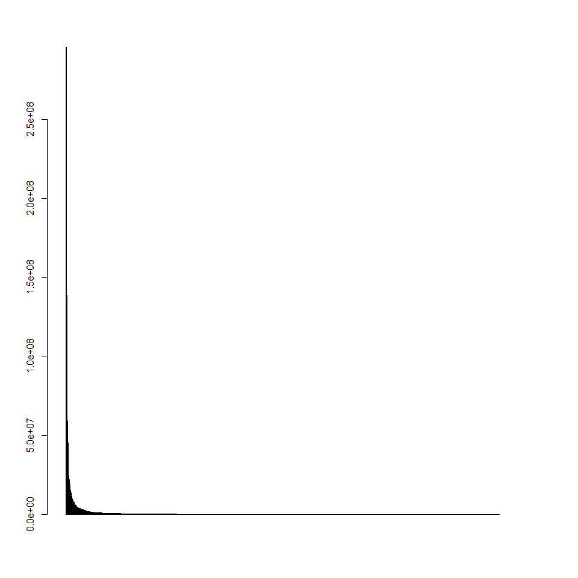
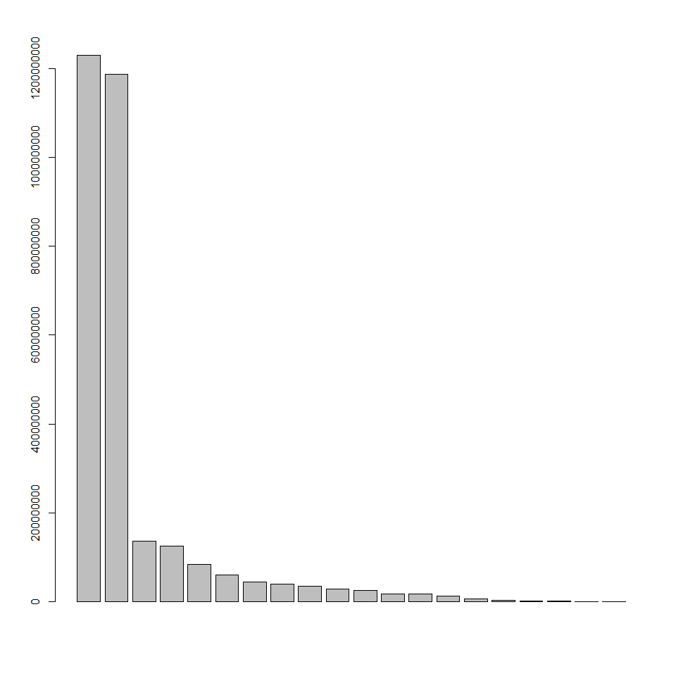

Data exploration
================

Relevant Variables
==================

Those in **bold** seem the most useful...

-   **dollarsobligated** : num 336828 645347 72898 648209 34164 ...
-   baseandexercisedoptionsvalue : num 336828 645347 72898 648209 34164 ...
-   baseandalloptionsvalue
-   **maj\_agency\_cat** : chr "3600: Department of Veterans Affairs"
-   maj\_fund\_agency\_cat : chr "3600: Department of Veterans Affairs"
-   contractingofficeagencyid : chr "3600: VETERANS AFFAIRS, DEPARTMENT OF"
-   contractingofficeid : chr "36C242: 242-NETWORK CONTRACT OFC 02(00242)"
-   fundingrequestingagencyid : chr "3600: VETERANS AFFAIRS, DEPARTMENT OF"
-   fundingrequestingofficeid : chr "36C242: 242-NETWORK CONTRACT OFC 02(00242)"
-   signeddate : chr "10/1/2016" "10/1/2016" "10/1/2016" "10/1/2016" ...
-   effectivedate : chr "10/1/2016" "10/1/2016" "10/1/2016" "10/1/2016" ...
-   currentcompletiondate : chr "9/30/2017" "9/30/2017" "9/30/2017" "9/30/2017" ...
-   ultimatecompletiondate : chr "9/30/2020" "9/30/2020" "9/30/2018" "9/30/2018" ...
-   **contractactiontype** : chr "C: DELIVERY ORDER"
-   **descriptionofcontractrequirement** : chr "IGF::CT::IGF--THIS CONTRACT PROVIDES HVAC SERVICE FOR HUDSON VALLEY HEALTHCARE SYSTEM (MONTROSE CAMPUS)."
-   progsourceagency : int 36 36 36 36 36 36 36 28 36 36 ...
-   progsourceaccount : int 162 152 160 162 162 160
-   **vendorname** : chr "EASTCO BUILDING SERVICES, INC."
-   streetaddress : chr "130 BROOK AVE STE A"
-   **city** : chr "DEER PARK" "NEW YORK"
-   **state** : chr "NY" "NY" "NY" "NY" ...
-   **zipcode** : int 117297241 100012320
-   vendorcountrycode : chr "USA: UNITED STATES OF AMERICA"
-   vendor\_state\_code : chr "NY" "NY" "NY" "NY" ...
-   vendor\_cd : int 2 10 25 14 12 10 16 12 12 15 ...
-   congressionaldistrict : int 2 10 25 14 12 10 16 12 12 15
-   **dunsnumber** : int 605119932 18836440 793169512 830335969 79084053
-   parentdunsnumber : int 605119932 18836440
-   **placeofperformancecity** : chr "MONTROSE" "NEW YORK" "NORTHPORT" "JAMAICA" ...
-   pop\_state\_code : chr "NY: New York"
-   placeofperformancecountrycode : chr "USA: UNITED STATES OF AMERICA"
-   **placeofperformancezipcode** : int 105480001
-   pop\_cd : chr "NY17" "NY12" "NY03" "NY05" ...
-   placeofperformancecongressionaldistrict : chr "NY17"
-   **psc\_cat** : chr "J" "R" "J" "V" ...
-   **productorservicecode** : chr "J041: MAINT/REPAIR/REBUILD OF EQUIPMENT- REFRIGERATION, AIR CONDITIONING, AND AIR CIRCULATING EQUIPMENT"
-   **principalnaicscode** : int 541611 561421
-   fiscal\_year : int 2017 2017

Useful links
============

-   **List of other databases** <https://www.fpds.gov/wiki/index.php/PSC,_NAICS_and_more>

-   **Sam** System for Award Management Allows to look at contractors by name, DUNS or CAGE (look at search records) <https://www.sam.gov/portal/SAM>

Glosary of some useful codes
============================

-   **NAICS** The North American Industry Classification System <https://www.naics.com/search/> <https://www.naics.com/naics-drilldown-table/>

NAICS is one of the tools used by government agencies to classify the acquisitions and procurements conducted for goods, services and solutions.

How NAICS are used. -agencies use NAICS Codes to classify how they will use goods and services they purchase. -companies use NAICS Codes to classify their offerings or the segment of an industry sector in which they do business. -agencies reference NAICS Codes in documents related to requirements such as forecasts, pre-solicitations and solicitations, and subsequent contracts and agreements. -companies reference NAICS Codes in their SAM profiles, Dynamic Small Business Search profiles (for small business concerns) and often on their marketing materials such as websites, business cards and capability statements.

-   **PSC** Product or Service Code <https://www.fpds.gov/downloads/psc_data_Oct012015.xls>

Product service codes (PSC) are used by the United States government to describe the products, services, and research and development purchased by the government. They differ from NAICS Codes in that PSC Codes describe “WHAT” was bought for each contract action reported in the Federal Procurement Data System (FPDS),” whereas NAICS Codes describe “HOW” purchased products and services will be used. NAICS and PSC Codes look different, too. NAICS Codes are six position numeric values and PSC Codes are four position numeric or alphanumeric values.

When compared to NAICS Codes, PSC Codes are much more granular. NAICS Codes are segregated into industry sectors represented by the first two digits of a NAICS Code such as ‘54 – Professional Scientific and Technical Services.’ The current NAICS Code system consists of twenty industry sectors. Product and Service Codes start with three categories, R&D, Services and Products, that are then broken down into 102 classes indicated by the first one or two digits of a PSC Code.

-   **DUNS** Data Universal Numbering System <http://fedgov.dnb.com/webform/displayHomePage.do;jsessionid=E1E507FBF0B6F36823D2519B2F4E5981>

D-U-N-S is a code used for identifying business entities on a location-specific basis. Assigned and maintained solely by D&B, this unique nine-digit identification number has been assigned to over 100 million businesses worldwide. A D-U-N-S Number remains with the company location to which it has been assigned even if it closes or goes out-of-business. The D-U-N-S Number also "unlocks" a wealth of value-added data associated with that entity, including the business name, physical and mailing addresses, tradestyles ("doing business as"), principal names, financial, payment experiences,industry classifications (SICs and NAICS), socio-economic status,government data and more. The D-U-N-S® Number also links members of corporate family trees worldwide.

The D-U-N-S® Number is widely used by both commercial and federal entities and was adopted as the standard business identifier for federal electronic commerce in October 1994.

-   **CAGE** The Commercial and Government Entity Code It is a unique identifier assigned to suppliers to various government or defense agencies, as well as to government agencies themselves and also various organizations. CAGE codes provide a standardized method of identifying a given facility at a specific location.

Peeking into some variables
===========================

### maj\_agency\_cat

``` r
cat(head(unique(cnt$maj_agency_cat)), sep="\n") #to print a list.
```

    ## 3600: Department of Veterans Affairs
    ## 2800: Social Security Administration
    ## 7500: Department of Health and Human Services
    ## 1200: Department of Agriculture
    ## 1500: Department of Justice
    ## 4700: General Services Administration

### productorservicecode PSC

``` r
cat(head(unique(cnt$productorservicecode)), sep="\n") #to print a list.
```

    ## J041: MAINT/REPAIR/REBUILD OF EQUIPMENT- REFRIGERATION, AIR CONDITIONING, AND AIR CIRCULATING EQUIPMENT
    ## R426: SUPPORT- PROFESSIONAL: COMMUNICATIONS
    ## J065: MAINT/REPAIR/REBUILD OF EQUIPMENT- MEDICAL, DENTAL, AND VETERINARY EQUIPMENT AND SUPPLIES
    ## V999: TRANSPORTATION/TRAVEL/RELOCATION- OTHER: OTHER
    ## J045: MAINT/REPAIR/REBUILD OF EQUIPMENT- PLUMBING, HEATING, AND WASTE DISPOSAL EQUIPMENT
    ## G099: SOCIAL- OTHER

### principalnaicscode NAICS

``` r
cat(head(unique(cnt$principalnaicscode)), sep="\n") #to print a list.
```

    ## 541611
    ## 561421
    ## 811310
    ## 484110
    ## 238220
    ## 624229

\*This code will bereplaced by the name of the category of the NAICS

### dunsnumber DUNS

``` r
cat(head(unique(cnt$dunsnumber)), sep="\n") #to print a list.
```

    ## 605119932
    ## 18836440
    ## 793169512
    ## 830335969
    ## 79084053
    ## 361157287

### vendorname

``` r
cat(head(unique(cnt$vendorname)), sep="\n") #to print a list.
```

    ## EASTCO BUILDING SERVICES, INC.
    ## CORPORATE SOURCE, INC., THE
    ## CARESTREAM HEALTH, INC.
    ## MAINTENANCE MANAGEMENT SERVICES, LLC
    ## DIVISION CONSTRUCTION INC
    ## VOLUNTEERS OF AMERICA - GREATER NEW YORK, INC.

### contractactiontype

``` r
cat(unique(cnt$contractactiontype), sep="\n") #to print a list.
```

    ## C: DELIVERY ORDER
    ## D: DEFINITIVE CONTRACT
    ## B: PURCHASE ORDER
    ## A: BPA CALL
    ## G: GRANT FOR RESEARCH
    ## F: COOPERATIVE AGREEMENT
    ## T: TRAINING GRANT

Exploring some Descriptives of the data
=======================================

``` r
dat <- cnt[,c("dollarsobligated", "maj_agency_cat", "contractactiontype", "vendorname", "productorservicecode", "principalnaicscode")]
```

Main Vendors
------------

``` r
#aggregating by main Vendors
ven <- group_by(dat, vendorname)
ven <- summarize(ven, Monies = sum(dollarsobligated))

x <- ven$Monies < 0 
ven$Monies[x] <- NA
ven <- arrange(ven, desc(Monies))

ven
```

    ## # A tibble: 3,255 × 2
    ##                                             vendorname    Monies
    ##                                                  <chr>     <dbl>
    ## 1                                          PFIZER INC. 295600779
    ## 2                   BROOKHAVEN SCIENCE ASSOCIATES, LLC 290494086
    ## 3                          LOCKHEED MARTIN CORPORATION 223505026
    ## 4                            SYSTEMS MADE SIMPLE, INC. 139968271
    ## 5                               MCCANN WORLD GROUP INC 138791456
    ## 6                       TRUE NORTH COMMUNICATIONS INC. 124969987
    ## 7                                   HARRIS CORPORATION 110480721
    ## 8                        TRUE NORTH COMMUNICATIONS INC  93474350
    ## 9               CONTINENTAL SERVICE GROUP INCORPORATED  64600000
    ## 10 SAINT VINCENTS CATHOLIC MEDICAL CENTERS OF NEW YORK  58948433
    ## # ... with 3,245 more rows

``` r
barplot(ven$Monies)
```



Main PSC
--------

``` r
#aggregating by main PSC

psc <- group_by(dat, productorservicecode)
psc <- summarize(psc, Monies = sum(dollarsobligated))

x <- psc$Monies < 0 
psc$Monies[x] <- NA
psc <- arrange(psc, desc(Monies))

psc
```

    ## # A tibble: 1,017 × 2
    ##                                                           productorservicecode
    ##                                                                          <chr>
    ## 1                                                  6505: DRUGS AND BIOLOGICALS
    ## 2  M1HA: OPERATION OF GOVERNMENT-OWNED CONTRACTOR-OPERATED (GOCO) R&amp;D FACI
    ## 3                                  R426: SUPPORT- PROFESSIONAL: COMMUNICATIONS
    ## 4                                       R701: SUPPORT- MANAGEMENT: ADVERTISING
    ## 5                                           Q201: MEDICAL- GENERAL HEALTH CARE
    ## 6                                   R705: SUPPORT- MANAGEMENT: DEBT COLLECTION
    ## 7                                              5841: RADAR EQUIPMENT, AIRBORNE
    ## 8                                  5895: MISCELLANEOUS COMMUNICATION EQUIPMENT
    ## 9  D318: IT AND TELECOM- INTEGRATED HARDWARE/SOFTWARE/SERVICES SOLUTIONS, PRED
    ## 10                5821: RADIO AND TELEVISION COMMUNICATION EQUIPMENT, AIRBORNE
    ## # ... with 1,007 more rows, and 1 more variables: Monies <dbl>

``` r
barplot(psc$Monies)
```


Main NAICS
----------

``` r
#making naics code two digit
nai <- dat
nai$NAICS.code <- as.integer(substring(nai$principalnaicscode, 1,2))

#adding the name variable
naics <- read.csv("NAICS_cat.csv")
x <- match(nai$NAICS.code, naics$X2017.NAICS.Code)
nai$NAICS.name <- naics$X2017.NAICS.Title[x]

#aggregating by main NAICS
nai <- group_by(nai, NAICS.name)
nai <- summarize(nai, Monies = sum(dollarsobligated))
options(scipen=999)

#eliminating negative sums
x <- nai$Monies < 0 
nai$Monies[x] <- NA
nai <- arrange(nai, desc(Monies))

nai
```

    ## # A tibble: 20 × 2
    ##                                                                  NAICS.name
    ##                                                                      <fctr>
    ## 1                                                             Manufacturing
    ## 2                          Professional, Scientific, and Technical Services
    ## 3  Administrative and Support and Waste Management and Remediation Services
    ## 4                                                     Finance and Insurance
    ## 5                                         Health Care and Social Assistance
    ## 6                                                              Construction
    ## 7                                                               Information
    ## 8                                                      Educational Services
    ## 9                                                                 Utilities
    ## 10                                                          Wholesale Trade
    ## 11                                                             Retail Trade
    ## 12                                                                       NA
    ## 13                            Other Services (except Public Administration)
    ## 14                                           Transportation and Warehousing
    ## 15                                          Accommodation and Food Services
    ## 16                                           Real Estate Rental and Leasing
    ## 17                                                    Public Administration
    ## 18                                      Arts, Entertainment, and Recreation
    ## 19                               Agriculture, Forestry, Fishing and Hunting
    ## 20                                                                   Mining
    ## # ... with 1 more variables: Monies <dbl>

``` r
barplot(nai$Monies)
```


